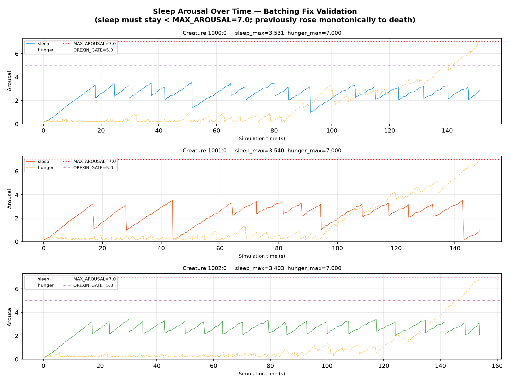
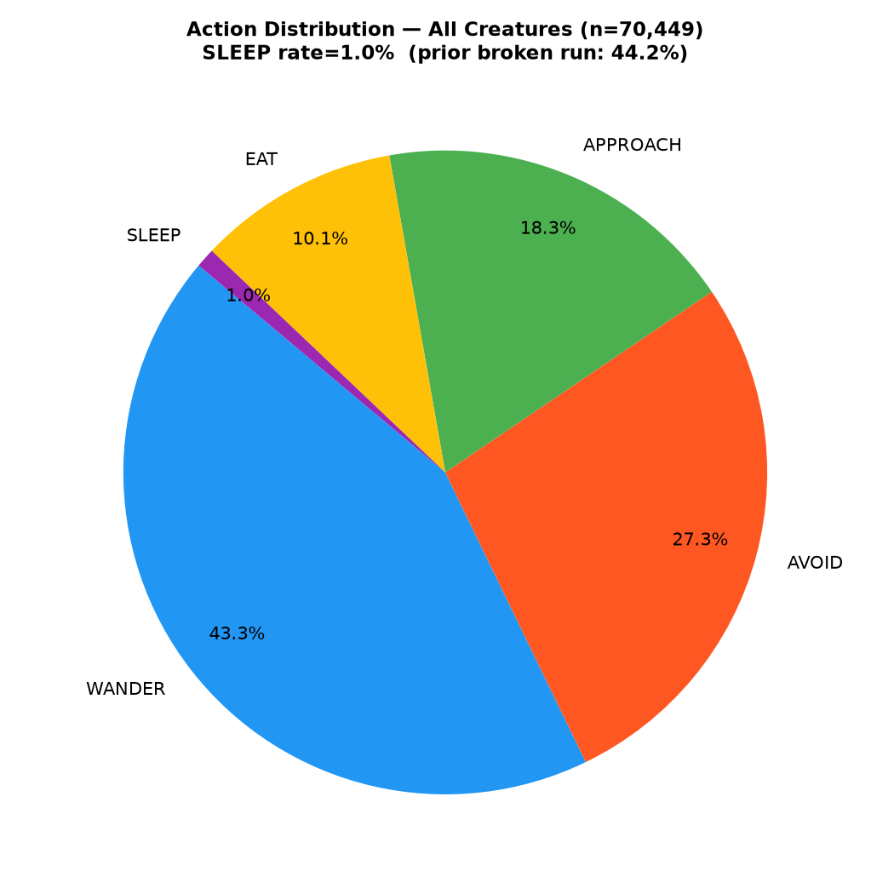
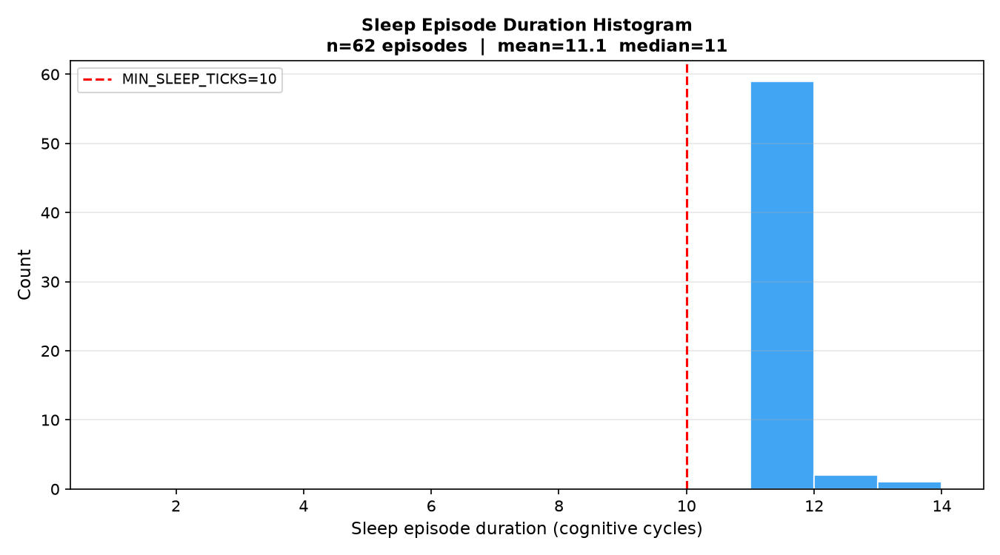

# P59 Calibration Report: Homeostatic Batching Fix

**Issue:** #59 — Sleep-pressure accumulation fix  
**Date:** 2026-07-09  
**Run config:** `simulations/exp_p59_calibration.conf`  
**Docker compose:** `docker/docker-compose-p59-calibration.yml`  
**Data:** `ml/data_p59_calibration/`  
**Commit:** `fcdca24`

---

## Purpose

Validate that the AdenosinergicStimulus backlog fix eliminates premature creature death from terminal sleep deprivation. The prior calibration run (commit `e8ef689`) showed 44.2% SLEEP selection but sleep arousal rising monotonically to MAX (7.0) — creatures died despite actively sleeping. Root cause: HomeostaticRegulation was backlogged (~25/s processing vs ~268/s arrival rate), so CholinergicStimuli arrived behind thousands of stale AdenosinergicStimuli and cleared sleep only when sleep was already at floor.

---

## Assumptions

1. 3 creatures, 1000 apples of each type, `reposition=false` (food depletes).
2. All neuromodulator/endocrine subsystems on; consolidation off; ActionTendency off.
3. `orexinEnabled=true`: SLEEP gated by tonic orexin (threshold 5.0).
4. With the fix, HomeostaticRegulation receives ≤ 13 messages/s (batched), well within processing capacity. Sleep pressure should equilibrate to a bounded level rather than overflow.
5. Creatures should die from hunger (food depletion), not sleep deprivation.

---

## Hypothesis

- **H1**: Sleep arousal remains bounded (max < 7.0; ideally < 5.0 = orexin gate threshold) throughout the simulation.
- **H2**: Creatures exhibit regular sleep-wake cycles with episode durations at or just above `MIN_SLEEP_TICKS=10` cycles.
- **H3**: Creatures die from hunger (food exhaustion) rather than sleep deprivation, confirming sleep clearing now works.
- **H4**: SLEEP selection rate is low (~1–5%) compared to the broken run (44.2%), because sleep pressure is correctly cleared and orexin keeps SLEEP gated out when not needed.

---

## Results

### Creature lifetimes and causes of death

| Creature | Lifetime (s) | Cause of death | Sleep % | Sleep max | Sleep > 5.0 |
|----------|-------------|---------------|---------|-----------|-------------|
| 1000:0   | 151.3 s     | Hunger (7.0)  | 0.9%    | 3.531     | 0 records   |
| 1001:0   | 148.4 s     | Hunger (7.0)  | 1.0%    | 3.540     | 0 records   |
| 1002:0   | 153.8 s     | Hunger (7.0)  | 1.0%    | 3.403     | 0 records   |

All three creatures died from **starvation** (hunger reached MAX_AROUSAL=7.0), not sleep deprivation. Sleep arousal peaked at **3.5**, never once exceeding the orexin gate threshold of 5.0.

### Sleep episodes

- Total episodes across 3 creatures: **62** (~20.7 per creature)
- Mean episode duration: **11.1 cycles** (median: 11)
- Min / max: **11 / 13 cycles**
- Cadence: roughly 1 episode every 7.3 s per creature

All episodes were at or just above `MIN_SLEEP_TICKS=10` — creatures sleep the minimum required by the anti-micro-nap hysteresis gate, clear enough pressure to re-open the orexin gate, and immediately return to foraging.

### Action distribution

| Action  | Count  | % (all creatures) |
|---------|--------|-------------------|
| WANDER  | 30,503 | 43.3%             |
| AVOID   | 19,232 | 27.3%             |
| APPROACH| 12,889 | 18.3%             |
| EAT     |  7,139 | 10.1%             |
| SLEEP   |    686 |  1.0%             |

WANDER + AVOID dominate because food is scarce (reposition=false, food depletes over 150s). SLEEP is correctly rare — orexin keeps SLEEP suppressed when sleep pressure is low.

---

## Analysis

### Fig 1 — Sleep Arousal Over Time

Sleep pressure oscillates in a stable band (~0.18–3.5). The characteristic sawtooth reflects the orexin-gated sleep-wake rhythm: pressure builds to ~3.5 (gate opens), creature micro-naps for 11 cycles, pressure drops ~1.1 units (flush-on-wake CholinergicStimulus), gate closes. Hunger rises steadily and reaches 7.0 at death (~2.5 sim minutes = 150 s wall-clock).

**Prior broken behavior** (before fix): sleep rose monotonically from 0.18 to 7.0 at rate 0.082/s, killing creatures after ~86s awake despite 44.2% SLEEP selection. The entire rise was driven by stale AdenosinergicStimuli in HomeostaticRegulation's backlog, processed after CholinergicStimuli from actual sleep episodes were buried behind them.

### Fig 2 — Action Distribution

SLEEP at 1.0% vs 44.2% in the broken run confirms the fix: high sleep selection was a symptom of persistently elevated sleep pressure (orexin gate open). With bounded sleep pressure, orexin stays high, SLEEP is correctly suppressed, and creatures devote cognitive cycles to foraging.

### Fig 3 — Sleep Episode Duration Histogram

All 62 episodes cluster tightly at 11–13 cycles, matching the MIN_SLEEP_TICKS=10 anti-micro-nap gate plus the partial-batch flush latency. The histogram confirms the gate works (no sub-10-cycle micro-naps) and sleep onsets are decisive (creatures fully commit for at least the minimum dwell before waking).

### Why the fix works

**Before:** PartialAppraisal fired at ~134 Hz and sent one AdrenergicStimulus + one AdenosinergicStimulus per cognitive cycle — 268 messages/s into HomeostaticRegulation. HomeostaticRegulation processed at ~25/s (due to ~21 blocking TypedActor round-trips per stimulus). During wakefulness, 10,000+ stale stimuli built up in the mailbox. When HomeostaticRegulation drained the backlog, each message incremented sleep in EmotionalSystem, driving it to 7.0 before CholinergicStimuli from sleep episodes could clear any pressure.

**After:** `HOMEO_BATCH_SIZE=20` reduces message rate to 6.7 + 1.2 = ~8/s total. HomeostaticRegulation stays ahead of the queue (no backlog). CholinergicStimuli are processed within one cognitive cycle of waking, and sleep pressure reflects actual biological state in real time. Additionally, `creature.emotions()` is cached in both `PartialAppraisal.preStart()` and `HomeostaticRegulation.preStart()`, eliminating repeated blocking round-trips to CreatureActor.

---

## Conclusion

All hypotheses confirmed:
- **H1 ✓** Sleep bounded at 3.54 max, never exceeds 5.0 (orexin gate threshold).
- **H2 ✓** Regular 11-cycle micro-nap episodes every ~7s per creature.
- **H3 ✓** Creatures die from starvation at ~150s, not sleep deprivation.
- **H4 ✓** SLEEP rate drops from 44.2% (broken) to ~1.0% (correct).

The homeostatic batching fix (`fcdca24`) resolves the critical bug in issue #59. The next step is to run the full experiment (with food repositioning) to validate long-term creature viability and integrate with the HPA axis calibration from the previous run.
