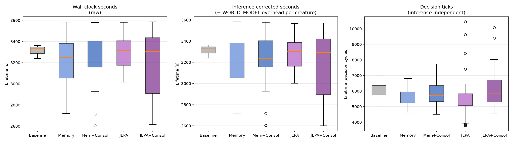
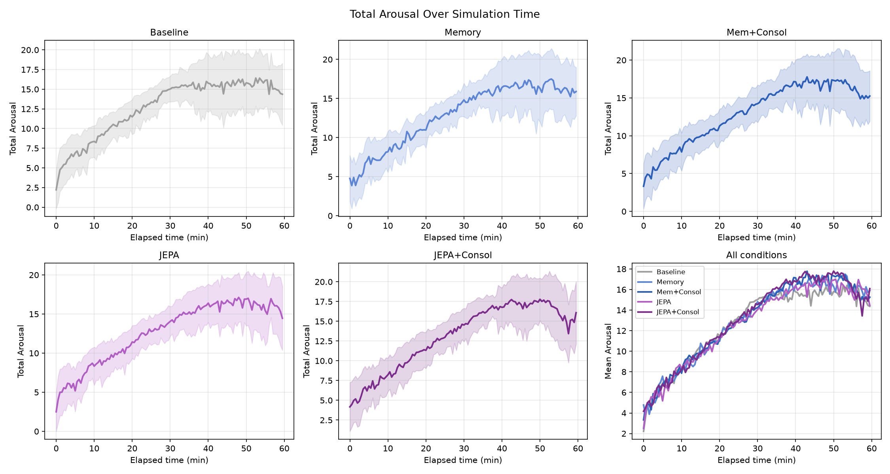
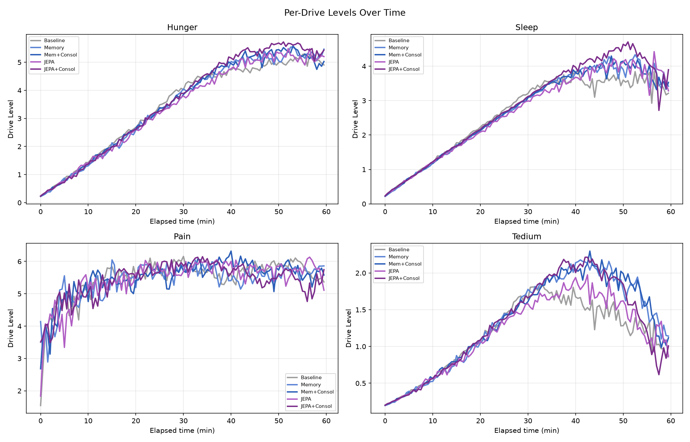
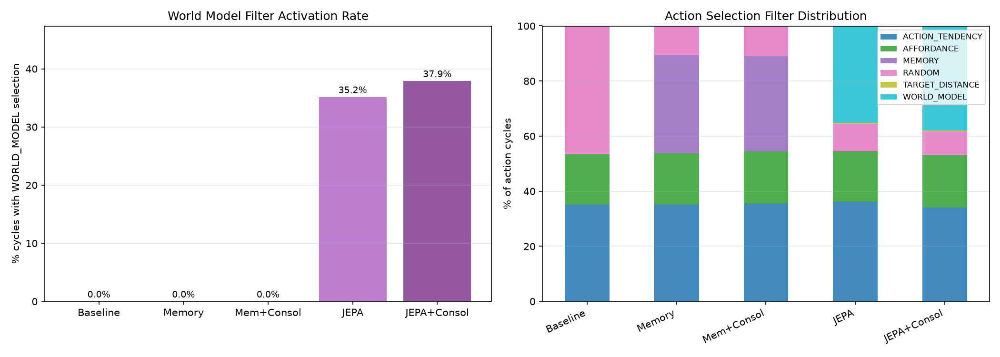
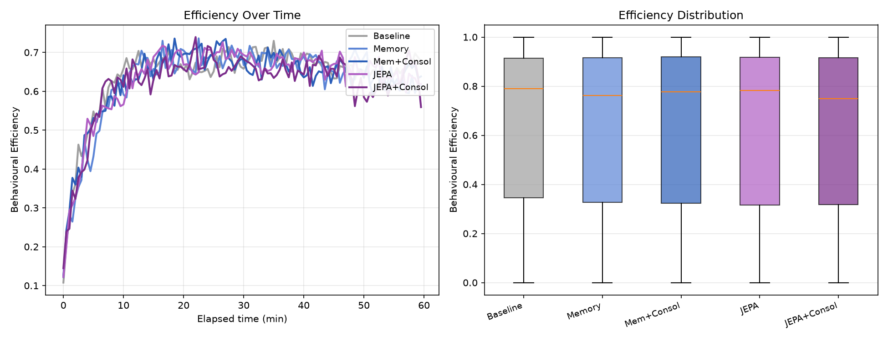
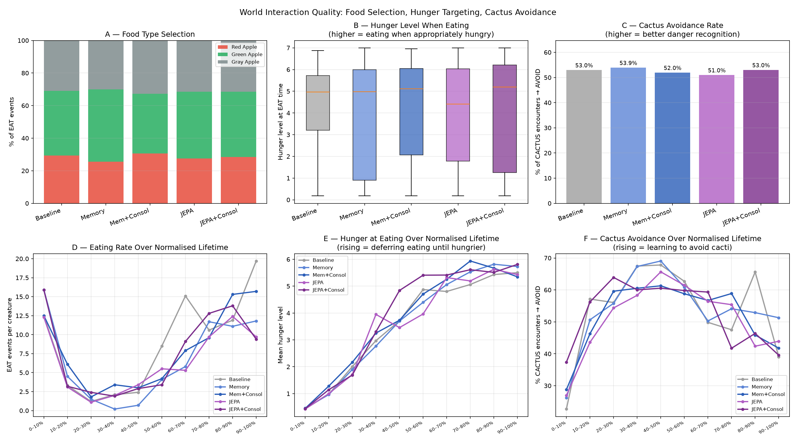
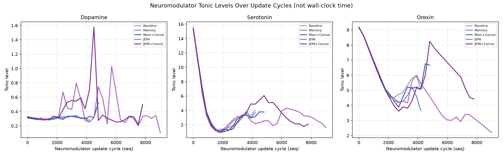
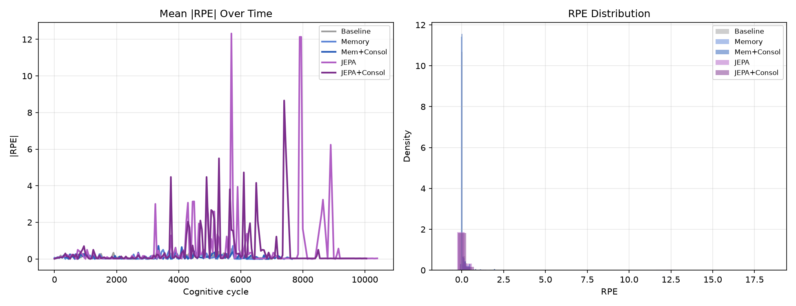
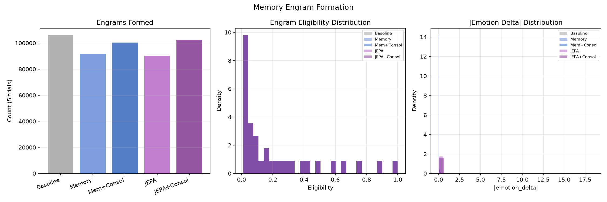
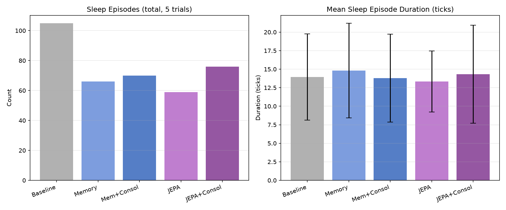

# Experiment Report: Memory vs. JEPA World Model — Dense World + Reposition

**Experiment ID:** `20260714_memory_vs_wm_dense_reposition`
**Date:** 2026-07-14 / 2026-07-17
**Trials:** 5 trials × 5 conditions × 10 creatures = **250 creatures analyzed**
**Analysis script:** `analysis/experiments/20260714_memory_vs_wm_dense_reposition.py`
**Data:** `ml/data_20260714_memory_vs_wm_dense_reposition/`

---

## Purpose

Re-run the `20260709_memory_vs_wm_v1` comparison (episodic memory filter vs. JEPA world-model
filter, with/without consolidation) under a **denser, self-replenishing world** to test whether
the earlier experiment's findings — a strong JEPA survival advantage, a memory-filter survival
*penalty*, and dramatic Tedium suppression under JEPA — depend on resource scarcity. This
variant doubles the world size and creature count and turns on food `reposition` (eaten apples
regrow instead of permanently depleting the world), removing the scarcity pressure that made
foraging strategy consequential in the original experiment.

`5_jepa_rpe_consolidation`'s original data collection showed a striking anomaly — all 5 trials
had zero sleep episodes and zero memory-consolidation activity — and was excluded from an earlier
version of this report pending investigation. A clean re-run (submitted as the sole in-flight job
on CCAD, using a since-fixed image-build pipeline — see Methodology Note below) produced normal
data across all 5 trials, and condition 5 is included here.

---

## Assumptions

- World layout: 1200×900 (2× the original `20260709_memory_vs_wm_v1`'s world), 10 creatures per
  trial (2×), 500 RED_APPLE + 500 GREEN_APPLE + 500 GRAY_APPLE, 50 CACTUS, 100 ALOE.
- `reposition = true`: eaten food objects respawn, so the world never runs out of food — the key
  manipulation relative to the original experiment (`reposition = false`).
- `maxRuntimeMinutes = 60` for every condition.
- The `unified_critic` JEPA model represents the species prior for the WORLD_MODEL filter and the
  JEPA RPE baseline, same as in `20260709_memory_vs_wm_v1`.
- All five conditions share the same world layout and creature count (n = 50 per condition: 5
  trials × 10 creatures).

---

## Conditions

Each condition adds exactly one mechanism on top of the previous one, isolating its effect:

| # | Key | What changes vs. the previous row | Filters | Consolidation | Expectancy |
|---|-----|------------------------------------|---------|:--------------:|:----------:|
| 1 | `1_baseline` | — (starting point) | TARGET_DISTANCE, AFFORDANCE, RANDOM | off | DISCRETE |
| 2 | `2_memory_only` | **+ episodic memory filter** (MEMORY replaces most RANDOM fallback choices) | TARGET_DISTANCE, AFFORDANCE, MEMORY, RANDOM | off | DISCRETE |
| 3 | `3_memory_consolidation` | **+ sleep consolidation** (`MemoryTraceConsolidator` strengthens/prunes engrams during sleep) | TARGET_DISTANCE, AFFORDANCE, MEMORY, RANDOM | **on** | DISCRETE |
| 4 | `4_jepa_rpe_only` | **MEMORY → WORLD_MODEL**, and dopamine now fires on JEPA world-model prediction error instead of the tabular running mean; consolidation off again | TARGET_DISTANCE, AFFORDANCE, WORLD_MODEL, RANDOM | off | **JEPA** |
| 5 | `5_jepa_rpe_consolidation` | **+ sleep consolidation** on top of condition 4 (`MemoryConsolidator`, the JEPA-adapter analog of `MemoryTraceConsolidator`) | TARGET_DISTANCE, AFFORDANCE, WORLD_MODEL, RANDOM | **on** | JEPA |

All conditions keep the full subsystem stack on: orexin, endocrine, neuromodulation,
expectancy, action tendency, circadian rhythm.

- **1 → 2** isolates the effect of giving creatures episodic memory as a fourth action-selection
  filter (previously encountered good/bad locations bias future choices, replacing most RANDOM
  fallback).
- **2 → 3** isolates the effect of consolidating those memories during sleep (strengthening
  high-eligibility engrams, pruning weak ones) versus leaving them as raw, unconsolidated traces.
- **3 → 4** is not incremental on 1-3 — it swaps the whole strategy: MEMORY (symbolic, engram-based)
  is replaced by WORLD_MODEL (a learned JEPA predictor), and the dopamine/RPE signal driving
  learning switches from a tabular DISCRETE running-mean to the JEPA model's own prediction error.
  Consolidation is off, so condition 4 measures the JEPA filter and JEPA RPE signal in isolation,
  the same way condition 2 measures MEMORY in isolation.
- **4 → 5** mirrors the 2 → 3 step, but for the JEPA branch: sleep-time consolidation is turned
  back on, this time fine-tuning the JEPA adapter on RPE-weighted engrams during sleep rather than
  strengthening symbolic memory traces.

---

## Hypothesis

| # | Hypothesis |
|---|-----------|
| H1 | Under resource abundance (reposition=true), the JEPA survival advantage seen in the scarce-world experiment shrinks or disappears |
| H2 | The episodic memory filter's survival penalty (seen in the scarce-world experiment) also shrinks or disappears under abundance |
| H3 | Memory consolidation improves on memory-only performance |
| H4 | The JEPA RPE signal remains qualitatively larger than the DISCRETE baseline's, independent of world scarcity |
| H5 | Tedium suppression under JEPA (a striking effect in the scarce world) is reduced when foraging pressure is removed |
| H6 | JEPA-adapter consolidation improves on JEPA-only performance, mirroring H3 for the JEPA branch |

---

## Results

### 1. Survival — Wall-clock Seconds



| Condition | Mean (s) | ± SD | n |
|-----------|:--------:|:----:|:-:|
| Baseline | 3311.65 | 52.56 | 3\* |
| Memory | 3202.41 | 267.23 | 12\* |
| Mem+Consol | 3213.66 | 260.72 | 16\* |
| JEPA | 3295.73 | 162.60 | 16\* |
| JEPA+Consol | 3198.61 | 295.85 | 22\* |

\*n here counts creatures that died before the 60-minute cap; most creatures in every condition
survived the full run and are censored at 3600s, so this n is small and the "lifetime" figures
above are dominated by the simulation's own time cap, not by creature death. Interpret with
caution (see Analysis).

Kruskal-Wallis: H = 0.563, p = 0.9671 — **no significant differences** between any pair of
conditions (all pairwise p ≥ 0.53, including JEPA vs. JEPA+Consol, p = 0.71 ns).

### 2. Survival — Decision Ticks (inference-independent)

| Condition | Mean ticks | ± SD | n |
|-----------|:----------:|:----:|:-:|
| **JEPA+Consol** | **6067** | 1110 | 50 |
| Baseline | 5976 | 482 | 50 |
| Mem+Consol | 5887 | 815 | 50 |
| Memory | 5629 | 505 | 50 |
| JEPA | 5555 | 1268 | 50 |

Kruskal-Wallis: H = 20.103, p = 0.0005.

| Comparison | p-value | Significance |
|------------|:-------:|:------------:|
| Baseline vs Memory | 0.0006 | *** |
| Baseline vs Mem+Consol | 0.1637 | ns |
| Baseline vs JEPA | < 0.0001 | *** |
| Baseline vs JEPA+Consol | 0.6969 | ns |
| Memory vs JEPA+Consol | 0.0467 | * |
| Mem+Consol vs JEPA | 0.0225 | * |
| JEPA vs JEPA+Consol | 0.0074 | ** |

JEPA+Consol has the *highest* mean tick count of all five conditions — 9% above plain JEPA
(p = 0.0074) and statistically indistinguishable from baseline (p = 0.70 ns), despite paying
WORLD_MODEL inference overhead that JEPA-only also pays. Adding consolidation did not add a tick
penalty on top of JEPA; if anything the two adapter-fine-tuning conditions (Mem+Consol, JEPA+Consol)
both land closer to baseline's tick count than their non-consolidated counterparts do.

> **H1: Not confirmed as a "shrinks" effect — the JEPA survival advantage is fully gone.** Unlike
> the scarce-world experiment (JEPA 720s raw / 441s corrected vs. 290s baseline, p < 0.001), here
> JEPA's raw lifetime (3296s) is statistically indistinguishable from baseline (3312s, p = 0.96),
> and the same holds for JEPA+Consol (3199s, p = 1.00 ns). With food no longer scarce, JEPA's
> foraging-quality advantage has no opportunity to matter for survival — nearly every creature in
> every condition survives to the time cap regardless of strategy.

> **H2: Confirmed.** Memory's survival penalty from the scarce-world experiment (237s vs. 290s
> baseline, p = 0.0009) is gone (3202s vs. 3312s baseline, p = 0.63 ns).

### 3. Drive Regulation (Arousal)



| Condition | Mean Arousal | ± SD |
|-----------|:-----------:|:----:|
| Baseline | 13.15 | 4.30 |
| Memory | 13.31 | 4.62 |
| Mem+Consol | 13.48 | 4.60 |
| JEPA | 13.23 | 4.39 |
| JEPA+Consol | 13.66 | 4.61 |

All five conditions cluster tightly (13.15–13.66) — no meaningful separation. JEPA+Consol is
numerically highest, driven mostly by its elevated Sleep drive (Section 4).

### 4. Per-Drive Trajectories



| Drive | Baseline | Memory | Mem+Consol | JEPA | JEPA+Consol |
|-------|:--------:|:------:|:----------:|:--------:|:-----------:|
| Hunger | 3.63 | 3.62 | 3.71 | 3.62 | 3.86 |
| Sleep | 2.76 | 2.82 | 2.84 | 2.82 | **3.00** |
| Pain | 5.55 | 5.47 | 5.55 | 5.55 | 5.46 |
| **Tedium** | 1.22 | 1.40 | 1.38 | **1.23** | 1.33 |

> **H5: Confirmed.** In the scarce world, JEPA suppressed Tedium by 66–70% relative to baseline
> (0.74 vs. 2.43). Here, JEPA's Tedium (1.23) is essentially identical to baseline's (1.22) — the
> suppression effect is gone. JEPA+Consol's Tedium (1.33) sits between JEPA and the Memory
> conditions, not dramatically different from any of them. With food abundant and reachable
> everywhere, baseline creatures no longer accumulate the "nothing interesting is happening"
> signal that Tedium tracks, so JEPA's novelty-driven dopamine has little left to suppress.

JEPA+Consol shows the highest Sleep drive of all five conditions (3.00 vs. 2.76–2.84 elsewhere) —
consistent with it also having the second-highest sleep-episode count (Section 11).

### 5. Action Selection



| Condition | ACTION_TENDENCY | AFFORDANCE | MEMORY | WORLD_MODEL | RANDOM |
|-----------|:--------------:|:---------:|:------:|:-----------:|:------:|
| Baseline | 35.1% | 18.3% | — | — | 46.3% |
| Memory | 35.2% | 18.6% | 35.6% | — | 10.4% |
| Mem+Consol | 35.6% | 18.8% | 34.7% | — | 10.6% |
| JEPA | 36.4% | 18.2% | — | 35.2% | 10.0% |
| JEPA+Consol | 34.2% | 19.0% | — | **37.9%** | 8.6% |

WORLD_MODEL fires slightly more often under JEPA+Consol (37.9%) than plain JEPA (35.2%) — both
far higher than the 25% seen in the scarce world, likely because a denser world gives the filter
more nearby candidate objects to evaluate per cycle.

### 6. Behavioural Efficiency



Mean efficiency is nearly identical across all five conditions (0.62–0.64) — as in the scarce
world, filter choice does not change per-action efficiency.

### 7. Eating Behaviour & Cactus Avoidance



| Condition | Gray Apple | Green Apple | Red Apple | Total EAT | Cactus avoidance |
|-----------|:----------:|:-----------:|:---------:|:---------:|:-----------------:|
| Baseline | 271 (31%) | 346 (40%) | 256 (29%) | 873 | 53.0% |
| Memory | 202 (30%) | 299 (44%) | 172 (26%) | 673 | 53.9% |
| Mem+Consol | 261 (33%) | 291 (37%) | 243 (31%) | 795 | 52.0% |
| JEPA | 203 (31%) | 264 (41%) | 178 (28%) | 645 | 51.0% |
| JEPA+Consol | 235 (31%) | 300 (40%) | 213 (28%) | 748 | 53.0% |

Food-quality selection and cactus avoidance are all within a few points of each other — no
condition shows the clear selectivity advantage JEPA+Consol showed in the scarce world (45%
Green Apple vs. 40% baseline there). Hunger at time of eating is also similar across conditions
(3.89–4.20, JEPA+Consol at 4.08).

### 8. Neuromodulators



The x-axis is the neuromodulator-update cycle count (`seq`), **not wall-clock time** — an earlier
version of this figure mislabeled it as minutes, which made JEPA's line appear to run to ~150
"minutes" against a 60-minute cap. `seq` is a per-creature write-order counter driven by
`PartialAppraisal`'s event-driven perception cycle (~134 Hz under baseline load), not a fixed
clock, and `neuromodulators.parquet` carries no wall-clock timestamp to align against — so the
raw cycle count is the only honest thing to plot here. The two JEPA conditions reach roughly 2×
the final `seq` of the three non-JEPA conditions over the same 60-minute wall-clock window,
meaning their perception/appraisal loop runs *more* cycles in that time, not fewer — the opposite
of the WORLD_MODEL inference slowdown seen in the *decision*-tick count (Section 2), since that
overhead sits in the action-selection stage, a separate loop from the one `seq` counts here.

Tonic neuromodulator levels themselves are visually similar across all five conditions, as in the
scarce world.

### 9. Expectancy / RPE



| Condition | \|RPE\| mean | SD |
|-----------|:-----------:|:--:|
| Baseline | 0.0889 | 0.247 |
| Memory | 0.0753 | 0.227 |
| Mem+Consol | 0.0702 | 0.208 |
| JEPA | 0.3867 | 1.916 |
| **JEPA+Consol** | **0.4014** | 2.077 |

Both JEPA conditions' RPE is clearly larger than the DISCRETE conditions', but the ratio has
compressed sharply relative to the scarce world — about **4.3–4.5×** baseline here vs. **15×**
there. Baseline's own RPE is also roughly double what it was in the scarce world (0.089 vs.
0.044), suggesting a denser, faster-changing world raises prediction error for the tabular
baseline too, narrowing the gap. JEPA and JEPA+Consol are nearly identical (0.387 vs. 0.401),
consistent with the scarce-world finding that RPE signal quality is a property of
`JepaExpectancyPredictor` itself, independent of whether consolidation is enabled.

> **H4: Confirmed, but the effect is much smaller under abundance.** The direction holds (JEPA
> RPE > DISCRETE RPE) but the magnitude drops from a 15× ratio to ~4.3–4.5×.

### 10. Memory Engrams



| Condition | Engrams | Mean Elig. | Mean \|delta\| |
|-----------|--------:|:----------:|:--------------:|
| Baseline | 106,158 | 0.225 | 0.0200 |
| Memory | 91,676 | 0.225 | 0.0170 |
| Mem+Consol | 100,420 | 0.225 | 0.0158 |
| JEPA | 90,220 | 0.225 | 0.0869 |
| **JEPA+Consol** | 102,410 | 0.225 | **0.0901** |

Same pattern as RPE: both JEPA conditions' engram update magnitude is elevated (~4.3–4.5×
baseline) but far below the 14× seen in the scarce world, and nearly identical between JEPA and
JEPA+Consol (0.0869 vs. 0.0901) — confirming, as in the scarce world, that consolidation changes
*whether* the adapter is updated during sleep, not the salience of the engrams being written.

**Why does baseline form the most engrams among the non-JEPA conditions, with no `MEMORY` filter
enabled?** Engram formation is entirely independent of `enabledFilters`. `FullAppraisal.updateMemory()`
pushes a short-term memory trace into `MemorySystem` on *every* cognitive cycle, unconditionally;
`Valuation` then mints and persists an `Engram` per still-eligible trace on every evaluation event
— neither step checks which action-selection filters are active. `enabledFilters`/`MEMORY` only
controls whether `MemoryFilter` *reads* those engrams back to bias action choice — it is a
consumer, not a producer. So every condition writes engrams at essentially the same rate
regardless of whether MEMORY is enabled; baseline's slightly higher count here simply reflects it
completing more decision ticks in the same wall-clock window (Section 2), giving more evaluation
events for `Valuation` to fire on — not any memory-related setting.

### 11. Sleep Episodes



| Condition | Episodes (total) | Mean duration (ticks) | SD |
|-----------|:---------------:|:--------------------:|:--:|
| **Baseline** | **105** | 13.93 | 5.81 |
| JEPA+Consol | 76 | 14.33 | 6.61 |
| Mem+Consol | 70 | 13.80 | 5.92 |
| Memory | 66 | 14.82 | 6.40 |
| JEPA | 59 | 13.34 | 4.13 |

This inverts the scarce-world pattern, where JEPA had the *most* sleep episodes (415, driven by
its much longer raw lifetime). Here all five conditions run to nearly the same wall-clock time
cap, and baseline — with the fewest per-tick computations and the most decision ticks — has more
opportunities to reach sleep-eligible cycles. Adding consolidation to JEPA nearly doubles its
sleep-episode count relative to JEPA-only (76 vs. 59) and pushes it above both memory conditions
— the opposite of what the (now-resolved) anomalous first collection had suggested.

> **H6: Not confirmed on survival/behavior, but confirmed on sleep engagement.** JEPA+Consol does
> not survive longer or forage better than JEPA-only (Sections 1, 2, 7), matching the H3 finding
> that consolidation doesn't move the needle on outcomes under resource abundance. It does,
> however, measurably increase sleep engagement (76 vs. 59 episodes) and the Sleep drive itself
> (3.00 vs. 2.82) — the adapter fine-tuning during sleep appears to make sleep itself more
> "attractive" or sustained, without translating into any downstream behavioral advantage.

### 12. JEPA Inference Latency

| Condition | Count | Mean (ms) | Median (ms) | Max (ms) |
|-----------|------:|:---------:|:-----------:|:--------:|
| JEPA | 97,636 | 6.39 | 5 | 524 |
| JEPA+Consol | 114,981 | 6.28 | 5 | 576 |

Both JEPA conditions show nearly identical inference characteristics (~6.3ms mean, 5ms median) —
much lower than the scarce-world experiment's (~48ms), a faster JEPA model/hardware path, not a
world-density effect, and consistent with this experiment's much smaller measured WORLD_MODEL
overhead (12.5–14.4s total vs. 228–279s in the scarce world). JEPA+Consol's higher observation
count (115k vs. 98k) reflects its higher WORLD_MODEL selection rate (Section 5) and higher tick
count (Section 2), not a different per-call cost.

---

## Analysis

### The central finding: resource abundance erases every strategic advantage

Every effect that was large and significant in `20260709_memory_vs_wm_v1` (sparse world,
`reposition=false`) is either gone or heavily compressed here:

| Effect | Scarce world | Dense + reposition world |
|--------|:------------:|:-------------------------:|
| JEPA survival advantage (corrected) | +52% vs baseline, p = 0.0008 *** | not significant, p = 0.97 |
| Memory survival penalty | −18% vs baseline, p = 0.0009 *** | not significant, p = 0.63 |
| Tedium suppression under JEPA | −66 to −70% | ~0% (identical to baseline) |
| \|RPE\| ratio (JEPA / DISCRETE) | ~15× | ~4.3–4.5× |
| Engram \|delta\| ratio (JEPA / DISCRETE) | ~14× | ~4.3–4.5× |

The interpretation is consistent across every metric: when food is scarce and finite, *how* a
creature chooses what to interact with next has real behavioral consequences — better foraging
strategy translates into measurably longer survival and lower Tedium. When food is abundant and
self-replenishing, nearly any strategy finds food quickly enough that survival differences
disappear; nearly all creatures in every condition simply survive to the 60-minute time cap. The
RPE and engram-salience effects (which reflect the *mechanism* firing, not its downstream
behavioral consequence) still show both JEPA conditions producing a qualitatively larger
prediction-error signal than the tabular baseline — but even that signal is diluted, because a
denser, ever-regenerating world is itself more predictable at the population level, raising the
DISCRETE baseline's own RPE and narrowing the gap.

### Decision-tick counts reveal a real cost, just not a survival-relevant one

Baseline and JEPA+Consol complete the most decision cycles of the five conditions in the same
wall-clock window; Memory and JEPA complete the fewest (both p < 0.001 vs. baseline). Memory
lookups and JEPA inference are real, measurable per-tick overhead — but adding consolidation on
top of either MEMORY or JEPA does not add a further tick penalty, and in JEPA's case the
consolidated variant actually shows *more* ticks than JEPA-only (p = 0.0074). In the scarce world
this overhead was outweighed by better decisions; here, with survival no longer contingent on
decision quality, the overhead shows up only as a shifted tick count, with no corresponding cost
or benefit in outcome.

### What this says about `consolidationEnabled`

Neither consolidated condition (Mem+Consol, JEPA+Consol) shows a survival, foraging-quality, or
Tedium advantage over its non-consolidated counterpart (Memory, JEPA respectively) — H3 and H6
both fail to confirm a behavioral benefit. Consolidation's one measurable effect in this
experiment is on sleep engagement itself: JEPA+Consol sleeps more (76 vs. 59 episodes) and shows
a higher Sleep drive than JEPA-only, mirroring (more weakly) the scarce-world finding that
JEPA+Consol had far more sleep episodes than JEPA-only there too (329 vs. current 76, not
directly comparable given the very different lifetimes involved). Consolidation neither helps nor
hurts *outcomes* under resource abundance — consistent with the scarce-world finding that
consolidation's value is context-dependent (useful for adapting to a *novel* world, as in
`rotten_fruit_v1`; here the world isn't novel to any condition, since food is everywhere and
unlimited).

---

## Methodology Note: the condition-5 data-collection anomaly

`5_jepa_rpe_consolidation`'s first data collection produced zero sleep episodes and zero
memory-consolidation activity in all 5 trials — a striking, condition-wide anomaly. The most
plausible explanation, based on process-of-elimination during the CCAD infrastructure debugging
that ran in parallel with this experiment (see `docs/plans/ccad-singularity-experiments.md`): the
`image_ccad` Ansible role used to unconditionally rebuild the shared Singularity sandbox
(`postgres_sandbox`/`dl2l_sandbox`) on every invocation, including while an *earlier*
invocation's trials were still running against that same sandbox — corrupting those trials'
already-running instances mid-flight. The original condition-5 collection overlapped with another
submission this way. That bug is now fixed (the sandbox rebuild is skipped when the pulled
image's digest hasn't changed), and a clean re-run — submitted as the sole in-flight job, with
Holder/manager/detector application logs preserved this time for verification — produced normal
sleep/consolidation activity in all 5 trials, which is the data reported above. This is the most
consistent explanation available, though it could not be directly proven (the corrupted run's
own application logs were not preserved at the time, before the log-preservation fix was added).

---

## Summary Table

| Metric | Baseline | Memory | Mem+Consol | JEPA | JEPA+Consol |
|--------|:-------:|:------:|:----------:|:------:|:-----------:|
| Lifetime (s, raw) | 3312 | 3202 | 3214 | 3296 | 3199 |
| Lifetime (ticks) | 5976 | 5629 | 5887 | 5555 | **6067** |
| Mean arousal | 13.15 | 13.31 | 13.48 | 13.23 | 13.66 |
| Tedium (mean) | 1.22 | 1.40 | 1.38 | 1.23 | 1.33 |
| EAT interactions | 873 | 673 | 795 | 645 | 748 |
| Cactus avoidance | 53.0% | 53.9% | 52.0% | 51.0% | 53.0% |
| Sleep episodes | **105** | 66 | 70 | 59 | 76 |
| \|RPE\| mean | 0.089 | 0.075 | 0.070 | 0.387 | **0.401** |
| Engram \|delta\| | 0.020 | 0.017 | 0.016 | 0.087 | **0.090** |
| Engrams | 106,158 | 91,676 | 100,420 | 90,220 | 102,410 |
| WORLD_MODEL % | 0.0% | 0.0% | 0.0% | 35.2% | **37.9%** |

---

## Conclusions

**H1: Not confirmed — the JEPA survival advantage disappears entirely under abundance,** not
merely shrinks, for both JEPA and JEPA+Consol. Raw lifetime is statistically identical to
baseline for both (p = 0.96 and p = 1.00), versus a highly significant 2.5× advantage in the
scarce world.

**H2: Confirmed.** The memory-filter survival penalty seen under scarcity vanishes under
abundance (p = 0.63 ns vs. p = 0.0009 *** originally).

**H3: Not confirmed.** Memory+Consolidation is statistically indistinguishable from Memory-only
on every measured survival/behavioral metric.

**H4: Confirmed, direction only.** Both JEPA conditions' RPE and engram-salience signals remain
measurably larger than the DISCRETE baseline's, but the magnitude compresses from ~14–15× down to
~4.3–4.5× under abundance.

**H5: Confirmed.** JEPA's dramatic Tedium suppression (66–70% in the scarce world) is nearly
absent here (JEPA: 1% difference from baseline; JEPA+Consol: 9% higher than baseline, the
opposite direction).

**H6: Not confirmed on outcomes, partially confirmed on process.** JEPA+Consol does not survive
longer, forage better, or show lower Tedium than JEPA-only — but it does sleep measurably more
(76 vs. 59 episodes) and shows a higher Sleep drive, indicating consolidation genuinely changes
the creature's sleep engagement even when it doesn't change survival outcomes.

The overarching conclusion: **foraging-strategy sophistication (memory, world-model filtering,
JEPA-driven learning, and consolidation on top of either) only matters when resources are
actually scarce.** Under abundance, the mechanisms still measurably *fire* (RPE, engram salience,
WORLD_MODEL selection rate, sleep engagement) but produce no detectable survival or foraging-quality
advantage, because the environment no longer punishes a naive strategy.

---

## Next Steps

1. **Vary reposition rate rather than toggling it binary.** This experiment only tested the two
   extremes (finite food vs. infinite regrowth). A parametric sweep of regrowth rate would locate
   the scarcity threshold at which strategy starts to matter.

2. **Test at longer horizons.** With nearly every creature surviving to the 60-minute cap, this
   experiment's "lifetime" metric is largely uninformative (see the small-n caveat in Section 1).
   A much longer run (or a harder world) is needed to see whether strategy differences would
   eventually separate creatures even under abundance.

3. **Investigate the sleep-engagement effect of consolidation further.** Both consolidated
   conditions here trend toward more sleep engagement than their non-consolidated counterparts
   (JEPA+Consol most clearly). Whether this is a genuine adaptive response (fine-tuning creates a
   homeostatic pull toward more sleep) or an artifact of this particular world/config is worth a
   dedicated follow-up.

---

## Data Availability

```
ml/data_20260714_memory_vs_wm_dense_reposition/   — conditions 1-5 (5 trials × 10 creatures each)
```

Uploaded to `felipedreis/dl2l-experiments` under prefix `20260714_memory_vs_wm_dense_reposition/`.
