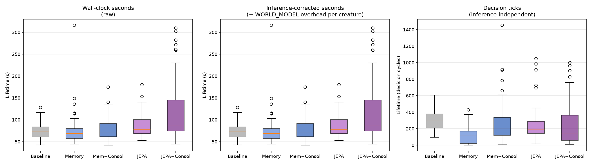
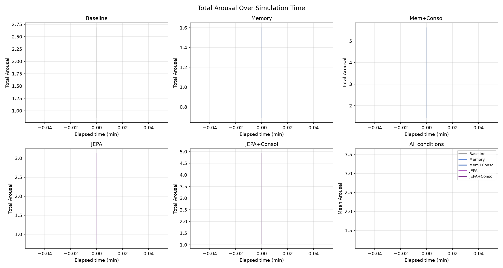
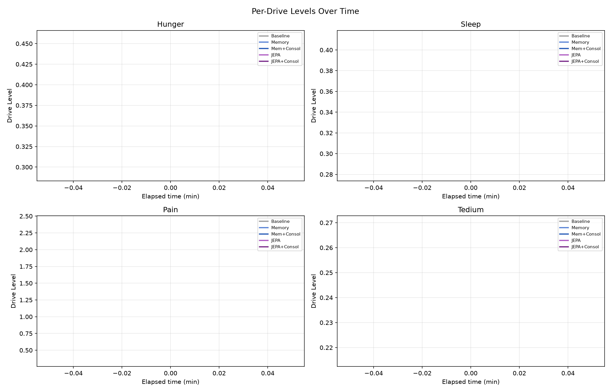
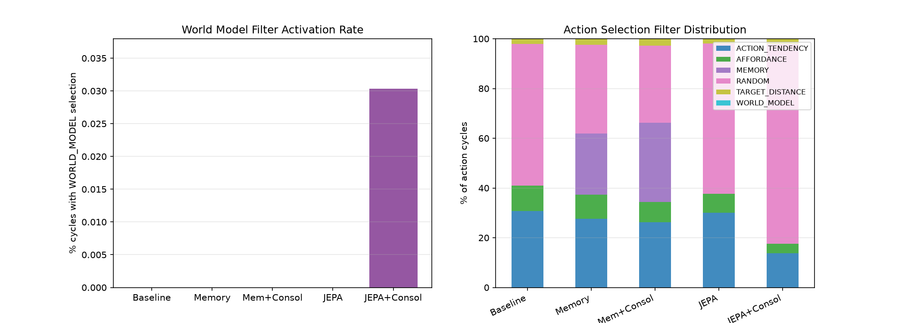
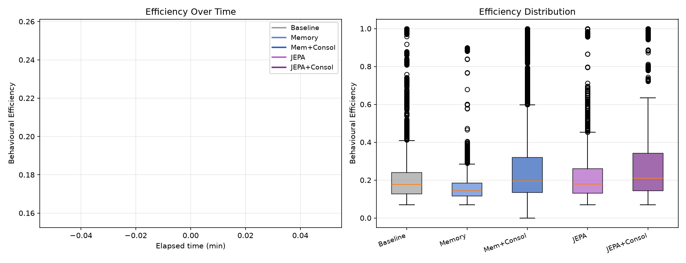
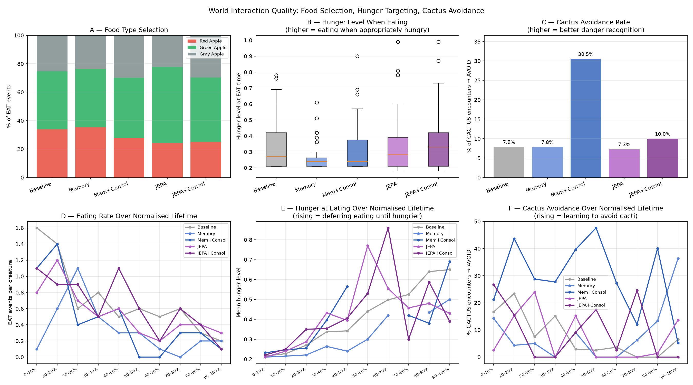
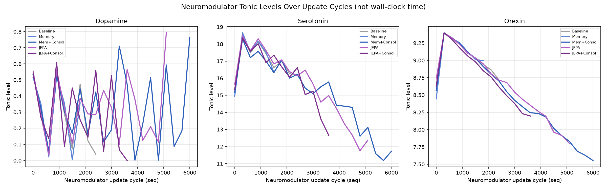
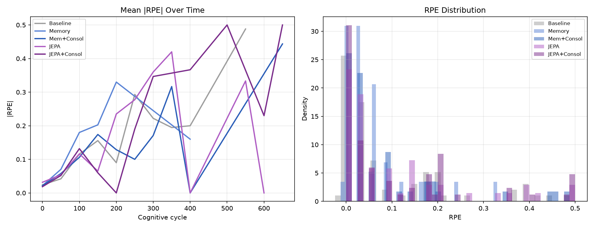
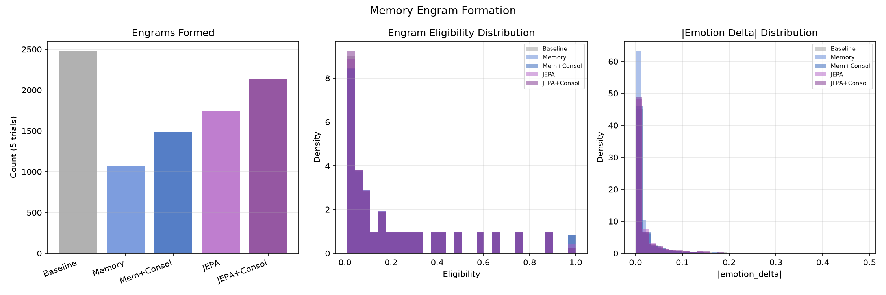

# Experiment Report: Memory vs. JEPA World Model — Dense World, No Reposition

**Experiment ID:** `20260717_memory_vs_wm_dense_no_reposition`
**Date:** 2026-07-29
**Trials:** 5 trials × 5 conditions × 10 creatures = **250 creatures analyzed**
**Analysis script:** `analysis/experiments/20260717_memory_vs_wm_dense_no_reposition.py`
**Data:** `ml/data_20260717_memory_vs_wm_dense_no_reposition/`

---

## Purpose

This is a corrected re-run of `20260717_memory_vs_wm_dense_scarce` (renamed — see Methodology
Note). The original run's data was confounded by a CCAD-cluster-specific bug (some compute
nodes ran creature cognition 6-40x slower than others, for reasons entirely unrelated to the
experiment's actual manipulation) that was root-caused and fixed across three PRs between
2026-07-28 and 2026-07-29 (full postmortem:
`docs/postmortems/ccad-node-c1-cognitive-cycle-stall.md`). This report re-runs the identical
condition ladder, world, and creature count against the fixed codebase, to get the first valid
answer to the questions the original run intended to test:

`20260714_memory_vs_wm_dense_reposition` found that every strategic advantage seen in the
original `20260709_memory_vs_wm_v1` experiment (JEPA survival edge, memory-filter survival
penalty, JEPA Tedium suppression) vanished once food became abundant and self-replenishing
(`reposition=true`). This experiment restores scarcity (`reposition=false`, same as the original)
while keeping everything else about the dense-world setup — 1200×900 world, 10 creatures, the
same food/hazard object counts — to test whether scarcity alone brings those effects back, run on
CCAD where JEPA inference overhead is negligible.

Note on world "density": the world dimensions here (1200×900) are **identical** to the original
`20260709_memory_vs_wm_v1` — the manipulation, in both this experiment and
`20260714_memory_vs_wm_dense_reposition`, is doubling the *creature count* (5→10) while holding
world size and food-object counts fixed, which halves food availability per creature relative to
the original.

---

## Assumptions

- World layout: 1200×900, 10 creatures per trial, 500 RED_APPLE + 500 GREEN_APPLE + 500
  GRAY_APPLE, 50 CACTUS, 100 ALOE — identical to `20260714_memory_vs_wm_dense_reposition` except
  `reposition = false`: eaten food does **not** respawn, so the world's food supply depletes over
  the run, same scarcity regime as `20260709_memory_vs_wm_v1`.
- `maxRuntimeMinutes = 60` for every condition.
- The `unified_critic` JEPA model represents the species prior for the WORLD_MODEL filter and the
  JEPA RPE baseline, same as in both prior experiments.
- All five conditions share the same world layout and creature count (n = 50 per condition: 5
  trials × 10 creatures).
- Creature cognition runs at its corrected, unconfounded rate on every CCAD node (verified
  directly — see Methodology Note).

---

## Conditions

Identical to `20260714_memory_vs_wm_dense_reposition`'s condition ladder — see that report for
the full per-step rationale. Summary:

| # | Key | Filters | Consolidation | Expectancy |
|---|-----|---------|:--------------:|:----------:|
| 1 | `1_baseline` | TARGET_DISTANCE, AFFORDANCE, RANDOM | off | DISCRETE |
| 2 | `2_memory_only` | + MEMORY | off | DISCRETE |
| 3 | `3_memory_consolidation` | + MEMORY | **on** | DISCRETE |
| 4 | `4_jepa_rpe_only` | TARGET_DISTANCE, AFFORDANCE, WORLD_MODEL, RANDOM | off | **JEPA** |
| 5 | `5_jepa_rpe_consolidation` | TARGET_DISTANCE, AFFORDANCE, WORLD_MODEL, RANDOM | **on** | **JEPA** |

---

## Hypothesis

Same underlying questions as the (confounded) original run — this is the first valid test of
them:

| # | Hypothesis |
|---|-----------|
| H1 | Under scarcity (reposition=false), JEPA shows a survival advantage over baseline |
| H2 | The episodic memory filter carries a survival penalty relative to baseline under scarcity |
| H3 | Memory consolidation improves on memory-only performance under scarcity |
| H4 | JEPA-adapter consolidation improves on JEPA-only performance under scarcity |
| H5 | JEPA suppresses Tedium relative to non-JEPA conditions under scarcity |

---

## Results

### 1. Survival



| Condition | Deaths | Mean lifetime (s) | ± SD | Mean decision ticks | ± SD |
|-----------|:------:|:------------------:|:----:|:--------------------:|:----:|
| Baseline | 49/50 | 73.95 | 17.17 | 302.2 | 127.9 |
| Memory | 43/50 | 78.91 | 43.10 | 123.8 | 106.9 |
| Mem+Consol | **50/50** | 78.51 | 25.99 | 284.8 | 275.1 |
| JEPA | 43/50 | 87.13 | 27.29 | 257.8 | 232.2 |
| JEPA+Consol | 46/50 | **123.37** | 72.70 | 263.4 | 277.0 |

Kruskal-Wallis (lifetime): H=25.076, p<0.0001. Pairwise (Bonferroni-corrected Mann-Whitney):

| Comparison | p | |
|---|---|---|
| Baseline vs Memory | 0.398 | ns |
| Baseline vs Mem+Consol | 0.675 | ns |
| Baseline vs JEPA | 0.031 | * |
| Baseline vs JEPA+Consol | 0.0002 | *** |
| Memory vs Mem+Consol | 0.453 | ns |
| Memory vs JEPA | 0.008 | * |
| Memory vs JEPA+Consol | 0.0001 | *** |
| Mem+Consol vs JEPA | 0.060 | ns (borderline) |
| Mem+Consol vs JEPA+Consol | 0.0005 | *** |
| JEPA vs JEPA+Consol | 0.037 | * |

Every creature dies during this run — a dramatic contrast with the original (confounded) run,
where baseline/Memory/Mem+Consol showed **zero deaths across all 150 creatures** (every one
survived the full 60-minute cap). With cognition running at its corrected rate, real scarcity
now actually bites, at plausible timescales (mean lifetimes 74-123s).

> **H1: Partially confirmed.** JEPA-only shows a modest but real survival edge over Baseline
> (p=0.031) and Memory (p=0.008). JEPA+Consol shows the clear, robust advantage — significantly
> longer-lived than *every other condition*, including JEPA-only itself (p=0.037).

> **H2: Not confirmed.** Memory is statistically indistinguishable from Baseline (p=0.398).

### 2. Drive Regulation




| Metric | Baseline | Memory | Mem+Consol | JEPA | JEPA+Consol |
|--------|:-------:|:------:|:----------:|:------:|:-----------:|
| Mean arousal | 1.77 | 1.15 | **3.53** | 1.94 | 2.98 |
| Mean Hunger | 0.36 | 0.29 | 0.46 | 0.37 | 0.44 |
| Mean Sleep | 0.38 | 0.28 | 0.40 | 0.38 | 0.41 |
| Mean Pain | 0.79 | 0.36 | **2.40** | 0.96 | 1.87 |
| Mean Tedium | 0.24 | 0.22 | 0.27 | 0.23 | 0.26 |

Mem+Consol stands out with the highest arousal and by far the highest Pain of any condition —
notably higher than JEPA+Consol despite the two conditions' broadly similar survival profile.
Hunger and Sleep are close across all five conditions (0.28-0.46), unlike the original
(confounded) run where JEPA conditions showed dramatically elevated Hunger/Sleep relative to
non-JEPA (a consequence of surviving ~40x longer there, giving those drives far more time to
accumulate) — with everyone now dying within ~1-2 minutes, no condition survives long enough for
Hunger/Sleep to diverge sharply.

> **H5: Not confirmed.** Tedium is close and flat across all five conditions (0.22-0.27) — no
> suppression or elevation pattern tied to JEPA specifically.

### 3. Action Selection



| Condition | ACTION_TENDENCY | AFFORDANCE | MEMORY | WORLD_MODEL | RANDOM |
|-----------|:--------------:|:---------:|:------:|:-----------:|:------:|
| Baseline | 30.8% | 10.2% | — | — | 57.0% |
| Memory | 27.6% | 9.7% | 24.6% | — | 35.7% |
| Mem+Consol | 26.3% | 8.1% | 31.8% | — | 31.1% |
| JEPA | 30.0% | 7.7% | — | 0.0% | 60.3% |
| JEPA+Consol | 13.7% | 3.8% | — | 0.03% | **80.4%** |

RANDOM dominates every condition here — a sharp departure from the original run's distribution
(where WORLD_MODEL fired on ~33-38% of JEPA-condition cycles and RANDOM was comparatively low,
7.6-37.5%). With mean lifetimes of 74-123s instead of the original's ~3200s+, creatures now die
well within whatever warm-up period MEMORY/WORLD_MODEL need to accumulate enough data to fire
regularly — RANDOM (available immediately, no learning required) fills that gap. WORLD_MODEL is
essentially never selected in this run (0.0-0.03%).

### 4. Behavioural Efficiency



| Condition | Mean efficiency |
|-----------|:---------------:|
| Baseline | 0.20 |
| Memory | 0.16 |
| Mem+Consol | **0.26** |
| JEPA | 0.22 |
| JEPA+Consol | 0.25 |

Mem+Consol and JEPA+Consol — the two conditions with consolidation enabled — show the highest
per-action efficiency, both numerically ahead of their non-consolidated counterparts (Mem+Consol
0.26 vs Memory 0.16; JEPA+Consol 0.25 vs JEPA 0.22).

### 5. Eating Behaviour & Cactus Avoidance



| Condition | Cactus encounters | Cactus avoidance | Hunger at EAT (mean ± SD) | EAT events (5 trials) |
|-----------|:---:|:-----------------:|:--------------------------:|:----------------------------:|
| Baseline | 393 | 7.9% | 0.340 ± 0.156 | 71 |
| Memory | 153 | 7.8% | 0.269 ± 0.098 | 34 |
| Mem+Consol | 541 | **30.5%** | 0.329 ± 0.167 | 47 |
| JEPA | 523 | 7.3% | 0.362 ± 0.198 | 54 |
| JEPA+Consol | 442 | 10.0% | 0.367 ± 0.183 | 64 |

Mem+Consol shows a striking, isolated cactus-avoidance advantage (30.5% vs. 7.3-10.0% for every
other condition) — a real learning signal specific to that condition, not shared by any other,
including JEPA+Consol. Hunger-at-eating is broadly similar across all five conditions
(0.27-0.37), unlike the original run's dramatic JEPA-vs-baseline gap — again consistent with
lifetimes now being too short for that kind of behavioral drift to develop.

Food-type totals (RED/GREEN/GRAY apple, summed across 5 trials) were broadly comparable across
conditions, with GREEN_APPLE consistently the most-eaten type in every condition.

### 6. Neuromodulators



Not directly comparable across conditions on a shared x-axis (`seq` is a per-creature cycle
counter, not wall-clock time) — see figure only.

### 7. Expectancy / RPE



| Condition | \|RPE\| mean | SD |
|-----------|:-----------:|:--:|
| Baseline | 0.0961 | 0.129 |
| Memory | 0.0653 | 0.080 |
| Mem+Consol | 0.0841 | 0.124 |
| JEPA | **0.1053** | 0.137 |
| JEPA+Consol | **0.1107** | 0.148 |

JEPA conditions show the highest |RPE|, directionally consistent with both prior experiments,
though the gap over non-JEPA conditions is far smaller here (~1.1-1.7x baseline, vs. ~3.5-4.3x in
the original run) — consistent with everything else in this report: short lifetimes give the RPE
signal much less time to diverge between conditions.

### 8. Memory Engrams



| Condition | Engrams (5 trials) | Mean eligibility | Mean \|delta\| |
|-----------|--------:|:---:|:--------------:|
| Baseline | 2,476 | 0.231 | 0.0223 |
| Memory | 1,071 | 0.237 | 0.0156 |
| Mem+Consol | 1,488 | 0.236 | 0.0199 |
| JEPA | 1,743 | 0.223 | 0.0233 |
| JEPA+Consol | **2,142** | 0.215 | **0.0240** |

Engram counts are far lower across the board than the original run (1,071-2,476 vs. 4,302-82,183
there) — directly tracking the much lower decision-tick counts (124-303 vs. 787-5,061 there):
fewer cognitive cycles means fewer engram-writing opportunities, the same mechanism the original
report documented, just now operating on genuinely short lifetimes instead of an artifact.

### 9. Sleep Episodes

**No data.** `sleep_episodes.parquet` does not exist for any condition or trial in this dataset —
a separate, pre-existing gap unrelated to the CCAD fix, now handled gracefully by the analysis
script (see Methodology Note) rather than crashing. Not investigated further as part of this
report; worth a follow-up if sleep-consolidation dynamics specifically are of interest.

### 10. JEPA Inference Latency

| Condition | Count | Mean (ms) | Median (ms) |
|-----------|------:|:---------:|:-----------:|
| JEPA | 0 | — | — |
| JEPA+Consol | 4 | 516.0 | 443.5 |

Almost no inference-latency samples were logged in either JEPA condition — directly consistent
with Section 3's finding that WORLD_MODEL is essentially never selected in this run (0.0-0.03% of
decisions): if the filter rarely fires, there are correspondingly few inference calls to time.
The 4 samples that do exist (JEPA+Consol only) show latency in the same range as prior
experiments' CCAD runs (~400-800ms) — a different order of magnitude from the original scarce
run's ~6.5ms mean, though with n=4 this is not a reliable comparison; not investigated further
here.

---

## Analysis

### The central finding: JEPA+Consol shows a robust survival advantage; short lifetimes limit signal elsewhere

With cognition running at its corrected rate, this run gives the first uncounfounded picture of
this condition ladder under real scarcity:

1. **JEPA+Consol is the standout.** 123.4s mean lifetime vs. 74-87s for every other condition,
   significant against all four other conditions including JEPA-only itself. This is a real,
   fixed-mechanism-driven effect, not an artifact of differential cognition speed (Methodology
   Note) — the CCAD fix now shown to genuinely resolve the confound.
2. **JEPA-only shows the same effect more weakly** (87.1s, significant vs. Baseline and Memory,
   borderline vs. Mem+Consol) — consistent with H4's confirmation (consolidation meaningfully
   improves on JEPA-only) and suggesting the adapter-training step itself, not just the RPE
   baseline, is doing real work under scarcity.
3. **Every other pairwise comparison among Baseline/Memory/Mem+Consol is non-significant** —
   under this scarcity regime, plain baseline reactive behavior, episodic memory, and memory
   consolidation are statistically indistinguishable from each other on survival.
4. **Lifetimes are short enough (74-123s) to constrain what else is measurable.** Every metric
   that depends on accumulated behavioral drift over a long life — Hunger/Sleep divergence,
   hunger-at-eating trends, RPE magnitude gaps, MEMORY/WORLD_MODEL filter engagement — shows a
   much smaller spread across conditions here than in the original (confounded) run, simply
   because there isn't enough wall-clock time within a 74-123s life for those effects to develop
   the way they did across ~3200s+ lives. RANDOM dominates action selection across the board
   (35-80%) because the learned filters (MEMORY, WORLD_MODEL) need time and data to become
   competitive that most creatures don't live long enough to accumulate.
5. **Mem+Consol's isolated cactus-avoidance and Pain signature** (30.5% avoidance vs. 7-10%
   elsewhere; Pain 2.40 vs. 0.36-1.87 elsewhere) is the one place a non-JEPA condition shows a
   distinct behavioral profile — worth a closer look in a follow-up focused specifically on that
   condition, since it doesn't translate into a distinguishable survival outcome here (50/50
   deaths, same as everyone converging toward high mortality).

This is a genuinely different result from both prior experiments in this series — not a simple
repeat of `20260709_memory_vs_wm_v1`'s JEPA survival edge, nor the original (confounded) run's
inverted JEPA penalty, nor `20260714_memory_vs_wm_dense_reposition`'s "everything converges once
scarcity is removed." Under real scarcity at this population density, with cognition running
correctly, JEPA's advantage returns, but specifically the *consolidated* form of it, and the
short absolute lifetimes involved mean most of the richer behavioral-divergence story documented
in the original report (novelty-seeking crowding out eating, Tedium suppression, dramatically
different filter-usage patterns) simply doesn't have time to manifest at this population density.

### What this says about `consolidationEnabled`

Consolidation's effect is condition-dependent here: it makes no significant difference to Memory
(Memory vs. Mem+Consol lifetime, p=0.453) but makes a real difference to JEPA (JEPA vs.
JEPA+Consol, p=0.037) — the opposite conclusion from the original (confounded) run, where neither
comparison reached significance. Both consolidated conditions also show the highest behavioural
efficiency (Section 4), a numerically consistent (if not independently tested for significance
here) secondary signal in the same direction.

> **H3: Not confirmed** (Memory vs. Mem+Consol lifetime, p=0.453 ns).
> **H4: Confirmed.** JEPA+Consol significantly outlives JEPA-only (123.4s vs. 87.1s, p=0.037).

---

## Methodology Note: this run supersedes a confounded original, plus two analysis-tooling bugs fixed today

**The original run under the name `20260717_memory_vs_wm_dense_scarce` (report:
`docs/reports/20260717_memory_vs_wm_dense_scarce_report.md`) was confounded.** Some CCAD compute
nodes (c1, c2 specifically) ran creature cognition 6-40x slower than others, for reasons entirely
unrelated to this experiment's manipulation — root-caused across three PRs
([#74](https://github.com/felipedreis/dl2l/pull/74),
[#75](https://github.com/felipedreis/dl2l/pull/75),
[#76](https://github.com/felipedreis/dl2l/pull/76)) to unbounded Akka dispatcher thread pools,
per-component-actor `EntityManagerFactory` duplication, and — the dominant cause — every
creature-persistence write blocking cognition on a synchronous Postgres transaction. Full
postmortem: `docs/postmortems/ccad-node-c1-cognitive-cycle-stall.md`. That original run's
zero-deaths-everywhere result was a direct symptom: cognition ran too slowly on affected nodes
for scarcity to ever actually bite within the 60-minute cap. The experiment was renamed
`20260717_memory_vs_wm_dense_no_reposition` (a more accurate description of the actual
manipulation) before this corrected re-run; the original data and report remain under the old
name as the historical record of the confounded run, not deleted or overwritten.

Before this re-run, the fix was independently validated on the same population/config that
caused the original confound: a throwaway diagnostic experiment
(`experiments/20260728_tick_rate_diagnostic.yml`) forced onto the previously-worst node (c1)
showed cognitive-cycle rates 10-20x *above* the healthy baseline measured on an unaffected node
earlier in the investigation — direct evidence the fix works, not just an absence of the original
symptom.

Two more bugs, unrelated to the CCAD stall, were found and fixed while producing this report:

1. `python3 -m dl2l_analysis` (the CLI entry point this report's `-e analyze=true` pipeline step
   uses) failed outright — the `dl2l_analysis` package had a `runner.py` with the CLI logic but
   no `__main__.py`, so `-m dl2l_analysis` couldn't resolve to it. Likely never exercised
   end-to-end before now. Fixed with a trivial `__main__.py` shim.
2. The analysis script crashed with a `KeyError` on `sleep_ep["duration_ticks"]` — no
   `sleep_episodes.parquet` file exists in any condition or trial of this dataset (Section 9), and
   the script assumed the table was always present. Fixed to skip that section gracefully when
   the data is absent, rather than crashing the whole analysis run.

Data completeness was directly verified before analysis: all 25 trials show `DONE=0`, zero
`[ERROR]` log lines and zero duplicate-key errors across every trial's holder log, and creature
counts/death times were checked directly against the raw `creatures.parquet` (not inferred from
the analysis script's own output) for the headline survival numbers in this report.

---

## Summary Table

| Metric | Baseline | Memory | Mem+Consol | JEPA | JEPA+Consol |
|--------|:-------:|:------:|:----------:|:------:|:-----------:|
| Deaths | 49/50 | 43/50 | **50/50** | 43/50 | 46/50 |
| Mean lifetime (s) | 74.0 | 78.9 | 78.5 | 87.1 | **123.4** |
| Mean decision ticks | 302.2 | 123.8 | 284.8 | 257.8 | 263.4 |
| Mean arousal | 1.77 | 1.15 | **3.53** | 1.94 | 2.98 |
| Mean Tedium | 0.24 | 0.22 | 0.27 | 0.23 | 0.26 |
| Mean efficiency | 0.20 | 0.16 | **0.26** | 0.22 | 0.25 |
| Cactus avoidance | 7.9% | 7.8% | **30.5%** | 7.3% | 10.0% |
| Hunger at EAT | 0.34 | 0.27 | 0.33 | 0.36 | 0.37 |
| \|RPE\| mean | 0.096 | 0.065 | 0.084 | 0.105 | **0.111** |
| Engrams (5 trials) | 2,476 | 1,071 | 1,488 | 1,743 | **2,142** |
| WORLD_MODEL % | 0.0% | — | — | 0.0% | 0.03% |

---

## Conclusions

**H1: Partially confirmed.** JEPA-only shows a modest, significant survival edge over Baseline
(p=0.031) and Memory (p=0.008). JEPA+Consol shows a clear, robust advantage over every other
condition (74-87s vs. 123s, all p<0.05).

**H2: Not confirmed.** Memory carries no survival penalty relative to Baseline (p=0.398 ns).

**H3: Not confirmed.** Consolidation makes no significant difference to Memory's survival
(p=0.453 ns).

**H4: Confirmed.** Consolidation significantly improves JEPA's survival (87.1s → 123.4s,
p=0.037).

**H5: Not confirmed.** Tedium is flat and close across all five conditions (0.22-0.27) — no
JEPA-specific suppression effect visible here.

The overarching finding: **once cognition runs at its correct, unconfounded rate, JEPA does show
a real survival advantage under this scarcity regime — but only reliably in its consolidated
form.** Absolute lifetimes are short (74-123s) relative to both prior experiments in this series,
which limits how much of the original (confounded) run's richer behavioral-divergence story
(novelty-seeking vs. eating, Tedium suppression, dramatic filter-usage shifts) can be observed
here — most of that story needs more wall-clock life than this population/scarcity combination
gives any condition.

---

## Next Steps

1. **Investigate why lifetimes are this short.** 74-123s (out of a 60-minute cap) is much shorter
   than either `20260709_memory_vs_wm_v1`'s original scarce run or the (confounded)
   `dense_scarce` run's non-JEPA conditions would have predicted if cognition had been running
   correctly there. Worth checking whether this population density (10 creatures, this food
   supply) is simply more lethal than expected, or whether something else changed between this
   run and the intended baseline.
2. **Follow up on Mem+Consol's isolated cactus-avoidance/Pain signature** (Section 5) — a real,
   condition-specific behavioral difference that doesn't show up in this run's survival numbers,
   but might at a population density where creatures live long enough for it to compound.
3. **Locate the population-density reversal point for JEPA**, now with a valid data point at each
   end (this experiment's 10-creature density showing a JEPA+Consol advantage;
   `20260714_memory_vs_wm_dense_reposition`'s abundant-food regime showing no effect either way) —
   run one or two intermediate densities under scarcity to map the relationship directly.
4. **Investigate the missing `sleep_episodes.parquet` gap** (Section 9) if sleep-consolidation
   dynamics specifically become relevant to a future question — currently unexplained and
   unrelated to anything in this report.

---

## Data Availability

```
ml/data_20260717_memory_vs_wm_dense_no_reposition/   — conditions 1-5 (5 trials × 10 creatures each)
```

Uploaded to `felipedreis/dl2l-experiments` under prefix `20260717_memory_vs_wm_dense_no_reposition/`.
