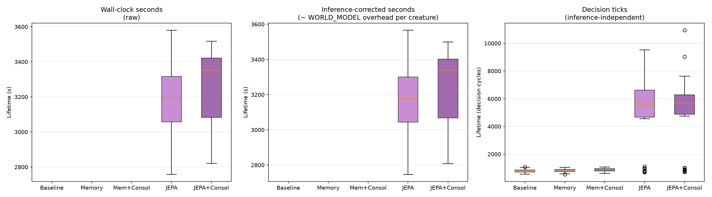
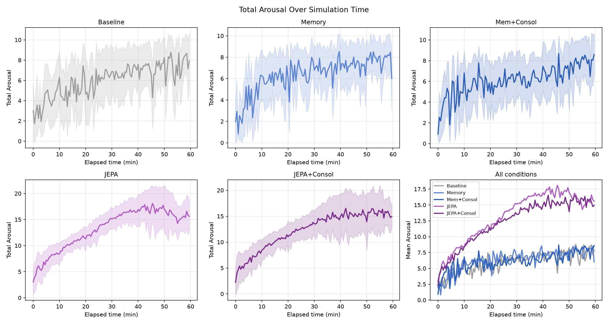
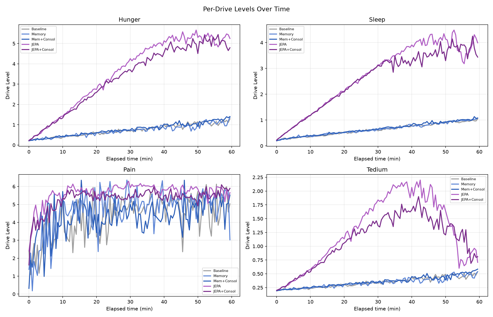
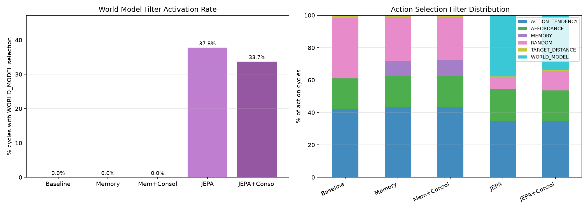
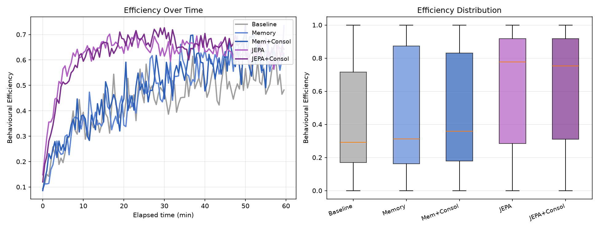
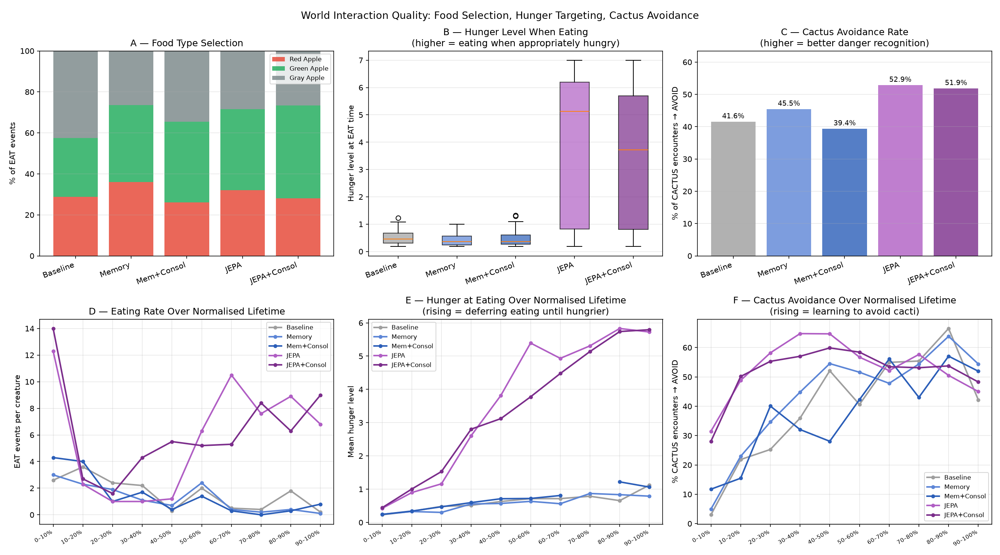
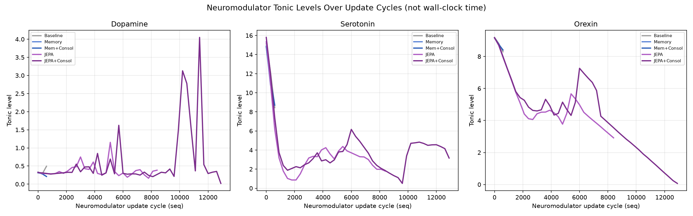
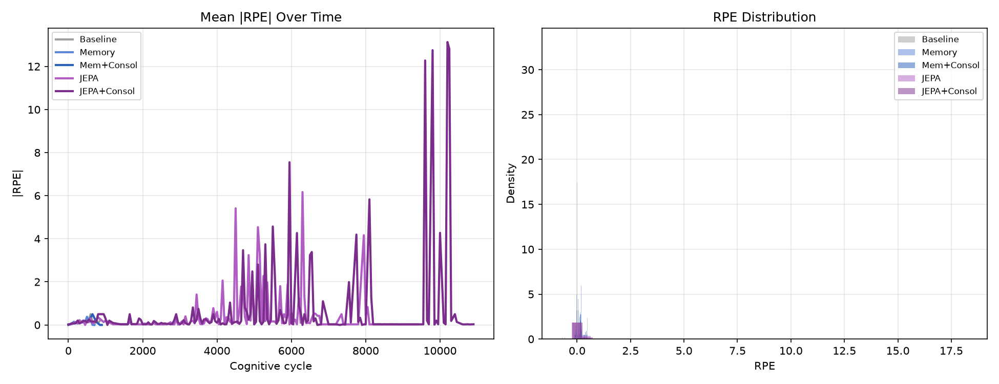
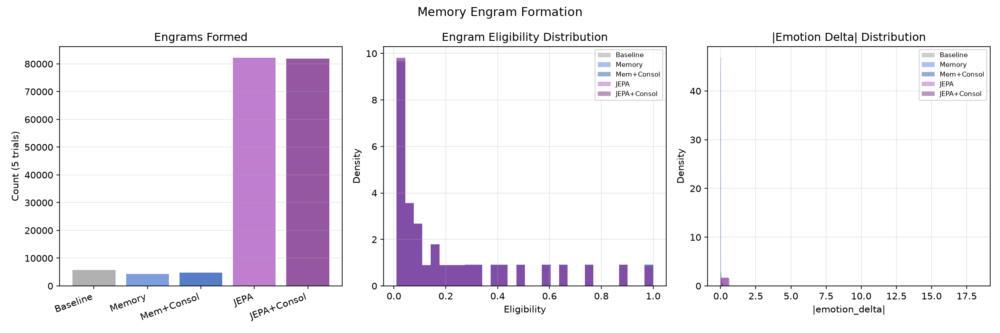
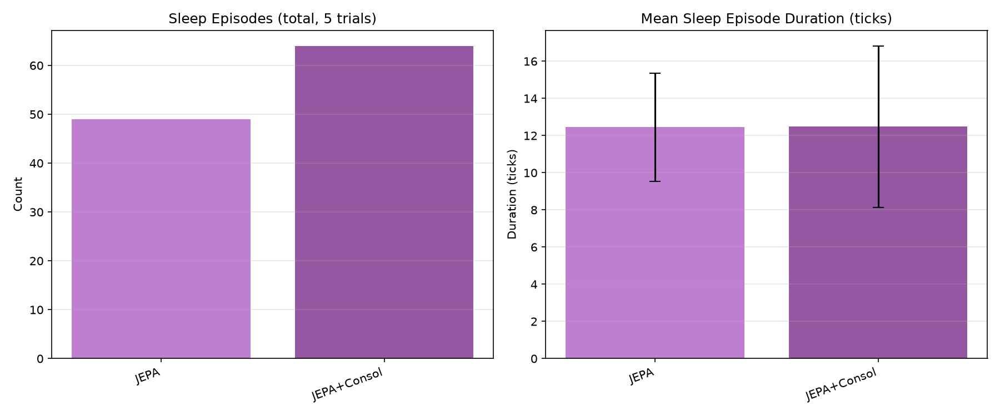

# Experiment Report: Memory vs. JEPA World Model — Dense World, Scarce (No Reposition)

**Experiment ID:** `20260717_memory_vs_wm_dense_scarce`
**Date:** 2026-07-27
**Trials:** 5 trials × 5 conditions × 10 creatures = **250 creatures analyzed**
**Analysis script:** `analysis/experiments/20260717_memory_vs_wm_dense_scarce.py`
**Data:** `ml/data_20260717_memory_vs_wm_dense_scarce/`

---

## Purpose

`20260714_memory_vs_wm_dense_reposition` found that every strategic advantage seen in the
original `20260709_memory_vs_wm_v1` experiment (JEPA survival edge, memory-filter survival
penalty, JEPA Tedium suppression) vanished once food became abundant and self-replenishing
(`reposition=true`). This experiment restores scarcity (`reposition=false`, same as the original)
while keeping everything else about the dense-world setup — 1200×900 world, 10 creatures, the
same food/hazard object counts — to test whether scarcity alone brings those effects back, run on
CCAD where JEPA inference overhead is negligible (~6.5ms mean, vs. the original local run's
~48ms).

Note on world "density": the world dimensions here (1200×900) are **identical** to the original
`20260709_memory_vs_wm_v1` — the manipulation, in both this experiment and
`20260714_memory_vs_wm_dense_reposition`, is doubling the *creature count* (5→10) while holding
world size and food-object counts fixed, which halves food availability per creature relative to
the original. An earlier report's wording ("2× the original world") described this loosely;
this report uses "dense" to mean population density specifically, not world area.

---

## Assumptions

- World layout: 1200×900, 10 creatures per trial, 500 RED_APPLE + 500 GREEN_APPLE + 500
  GRAY_APPLE, 50 CACTUS, 100 ALOE — identical to `20260714_memory_vs_wm_dense_reposition` except
  `reposition = false`: eaten food does **not** respawn, so the world's food supply depletes over
  the run, same scarcity regime as `20260709_memory_vs_wm_v1`.
- `maxRuntimeMinutes = 60` for every condition.
- The `unified_critic` JEPA model represents the species prior for the WORLD_MODEL filter and the
  JEPA RPE baseline, same as in both prior experiments.
- All five conditions share the same world layout and creature count (n = 50 per condition: 5
  trials × 10 creatures).

---

## Conditions

Identical to `20260714_memory_vs_wm_dense_reposition`'s condition ladder — see that report for
the full per-step rationale. Summary:

| # | Key | Filters | Consolidation | Expectancy |
|---|-----|---------|:--------------:|:----------:|
| 1 | `1_baseline` | TARGET_DISTANCE, AFFORDANCE, RANDOM | off | DISCRETE |
| 2 | `2_memory_only` | + MEMORY | off | DISCRETE |
| 3 | `3_memory_consolidation` | + MEMORY | **on** | DISCRETE |
| 4 | `4_jepa_rpe_only` | TARGET_DISTANCE, AFFORDANCE, WORLD_MODEL, RANDOM | off | **JEPA** |
| 5 | `5_jepa_rpe_consolidation` | TARGET_DISTANCE, AFFORDANCE, WORLD_MODEL, RANDOM | **on** | **JEPA** |

---

## Hypothesis

| # | Hypothesis |
|---|-----------|
| H1 | Under scarcity (reposition=false), the JEPA survival advantage seen in the original scarce-world experiment returns at this larger world/population scale |
| H2 | The episodic memory filter's survival penalty (seen in the original scarce-world experiment) also returns under scarcity |
| H3 | Memory consolidation improves on memory-only performance under scarcity |
| H4 | JEPA-adapter consolidation improves on JEPA-only performance under scarcity |
| H5 | JEPA's Tedium suppression (present under scarcity originally, absent under abundance) returns |

---

## Results

### 1. Survival



| Condition | Deaths | Mean lifetime (s) | ± SD | Mean decision ticks | ± SD |
|-----------|:------:|:------------------:|:----:|:--------------------:|:----:|
| Baseline | **0/50** | — (no deaths) | — | 787 | 109 |
| Memory | **0/50** | — (no deaths) | — | 826 | 113 |
| Mem+Consol | **0/50** | — (no deaths) | — | 864 | 105 |
| JEPA | **24/50** | 3212 | 213 | 5061 | 2313 |
| JEPA+Consol | **17/50** | 3241 | 231 | 5028 | 2322 |

The result is the **opposite** of H1: baseline, Memory, and Mem+Consol have **zero deaths** —
every one of 150 creatures across those three conditions survived the full 60-minute cap. Both
JEPA conditions show substantial death rates instead (48% and 34%), with deaths spread across
roughly the second half of the run (mean lifetime ~3200s out of a 3600s cap, SD ~215-230s).

Decision-tick counts (Kruskal-Wallis H=123.8, p<0.0001) show baseline/Memory/Mem+Consol clustered
tightly around 787-864 total ticks for the entire 60-minute life — JEPA and JEPA+Consol average
**~6× that** (5028-5061 ticks, all pairwise comparisons vs. non-JEPA conditions p<0.0001). This
tick-count gap is the first clue to what's actually happening (see Analysis).

> **H1: Not confirmed — inverted.** JEPA does not gain a survival advantage under this scarcity
> configuration; it suffers a severe survival *penalty* relative to baseline, which is the exact
> opposite of the original `20260709_memory_vs_wm_v1` result (JEPA 720s vs. baseline 290s there).

> **H2: Not confirmed.** Memory shows no survival penalty here (tied with baseline at 0/50
> deaths), unlike the original experiment where Memory conditions had shorter raw lifetimes than
> baseline (237-261s vs. 290s, both significant).

### 2. Drive Regulation




| Metric | Baseline | Memory | Mem+Consol | JEPA | JEPA+Consol |
|--------|:-------:|:------:|:----------:|:------:|:-----------:|
| Mean arousal | 6.15 | 6.68 | 6.33 | **13.63** | 12.98 |
| Mean Hunger | 0.75 | 0.76 | 0.81 | **3.79** | 3.63 |
| Mean Sleep | 0.65 | 0.69 | 0.69 | **2.88** | 2.78 |
| Mean Pain | 4.41 | 4.88 | 4.46 | **5.69** | 5.41 |
| Mean Tedium | 0.35 | 0.36 | 0.37 | **1.27** | 1.16 |
| Mean max hunger (per creature) | 1.11 | 1.19 | 1.26 | **5.56** | 5.34 |
| % creatures hitting hunger ≥6.9 (of 7 max) | 0% | 0% | 0% | **52%** | 36% |

The per-drive trajectory plot is unambiguous: Hunger and Sleep both climb steadily and
near-linearly for both JEPA conditions across the full 60 minutes (reaching ~5 and ~4
respectively), while staying nearly flat (under 1.5) for the three non-JEPA conditions. Pain is
also consistently higher and Tedium peaks over 2× higher for JEPA. Every homeostatic drive that
matters for survival is elevated simultaneously in JEPA creatures — not just hunger.

> **H5: Not confirmed — inverted.** Tedium is *higher* under JEPA here (1.16-1.27 vs. 0.35-0.37
> for non-JEPA, a >3× gap), not suppressed as it was in the original scarce-world experiment
> (JEPA Tedium 0.74-0.82 vs. baseline 2.33-2.43 there — the JEPA advantage flips direction between
> the two experiments, consistent with everything else in this report).

### 3. Action Selection



| Condition | ACTION_TENDENCY | AFFORDANCE | MEMORY | WORLD_MODEL | RANDOM |
|-----------|:--------------:|:---------:|:------:|:-----------:|:------:|
| Baseline | 42.3% | 18.7% | — | — | 37.5% |
| Memory | 43.5% | 19.2% | 9.2% | — | 27.1% |
| Mem+Consol | 43.3% | 19.3% | 9.8% | — | 26.5% |
| JEPA | 34.9% | 19.5% | — | **37.8%** | 7.6% |
| JEPA+Consol | 34.9% | 18.7% | — | **33.7%** | 12.1% |

WORLD_MODEL fires on roughly a third of JEPA-condition decision cycles — high, consistent with
the dense-reposition experiment's finding that a denser world gives the filter more nearby
candidates to evaluate per cycle.

### 4. Behavioural Efficiency



| Condition | Mean efficiency |
|-----------|:---------------:|
| Baseline | 0.42 |
| Memory | 0.46 |
| Mem+Consol | 0.47 |
| JEPA | **0.61** |
| JEPA+Consol | **0.62** |

JEPA conditions show notably *higher* per-action efficiency than non-JEPA — the opposite of what
the survival numbers alone would suggest, and a piece of evidence that JEPA creatures are not
executing actions poorly; each individual action is more purposeful. The problem, per Section 5
below, is what they choose to spend that purposeful action budget doing.

### 5. Eating Behaviour & Cactus Avoidance



| Condition | Cactus avoidance | Hunger at EAT (mean ± SD) | EAT events (5 trials total) |
|-----------|:-----------------:|:--------------------------:|:----------------------------:|
| Baseline | 41.6% | 0.487 ± 0.238 | 160 |
| Memory | 45.5% | 0.432 ± 0.227 | 125 |
| Mem+Consol | 39.4% | 0.468 ± 0.263 | 142 |
| JEPA | **52.9%** | **4.016 ± 2.507** | 579 |
| JEPA+Consol | **51.9%** | **3.457 ± 2.281** | 623 |

JEPA conditions show *better* cactus avoidance (52.9%/51.9% vs. 39.4-45.5% for non-JEPA) — they
are not simply worse at hazard recognition. But hunger-at-eating is dramatically higher for JEPA
(~3.5-4.0 vs. ~0.43-0.49): JEPA creatures wait far longer, and get far hungrier, before eating.

Panel E (hunger-at-eating over normalised lifetime) makes the mechanism visible directly: JEPA's
hunger-at-eating rises steadily from ~0.4 in the first life-decile to ~5.8 by the last — creatures
progressively defer eating as their life goes on. Baseline's line stays flat at 0.3-0.8 across the
*entire* lifetime, eating proactively and consistently regardless of how long they've survived.
Panel D shows the same story from the supply side: JEPA/JEPA+Consol eat heavily in the first 10%
of life (12-14 events/creature) then drop off sharply, while baseline maintains a low, steady
eating cadence throughout.

### 6. Neuromodulators



Not directly comparable across conditions on a shared x-axis — see the dense-reposition report's
Section 8 for why (`seq` is a per-creature cycle counter, not wall-clock time, and JEPA's cycle
rate differs from non-JEPA's).

### 7. Expectancy / RPE



| Condition | \|RPE\| mean | SD |
|-----------|:-----------:|:--:|
| Baseline | 0.1035 | 0.172 |
| Memory | 0.0975 | 0.137 |
| Mem+Consol | 0.0846 | 0.137 |
| JEPA | **0.3597** | 1.895 |
| JEPA+Consol | **0.3260** | 1.726 |

JEPA's RPE remains clearly elevated (~3.5-4.3× baseline) — directionally consistent with both
prior experiments, and further evidence the JEPA mechanism itself is functioning correctly; the
survival cost comes from what the resulting novelty-seeking behavior does under real scarcity,
not from a broken signal.

### 8. Memory Engrams



| Condition | Engrams (5 trials) | Mean \|delta\| |
|-----------|--------:|:--------------:|
| Baseline | 5,719 | 0.0238 |
| Memory | 4,302 | 0.0224 |
| Mem+Consol | 4,773 | 0.0195 |
| JEPA | **82,183** | **0.0806** |
| JEPA+Consol | **81,971** | 0.0726 |

JEPA conditions form ~17× more engrams than non-JEPA — directly reflecting their ~6× higher tick
count (more evaluation cycles → more engram-writing opportunities, same mechanism documented in
the dense-reposition report's Section 10) compounded with elevated engram salience from the
larger RPE signal.

### 9. Sleep Episodes



| Condition | Episodes (5 trials) | Mean duration (ticks) |
|-----------|:---:|:---:|
| Baseline, Memory, Mem+Consol | 0 | — |
| JEPA | 49 | 12.4 |
| JEPA+Consol | 64 | 12.5 |

Non-JEPA conditions show **zero sleep episodes across all 15 trials** — directly consistent with
their flat, near-zero Sleep drive (Section 2): creatures that never accumulate meaningful sleep
pressure never trigger sleep at all. JEPA+Consol shows more episodes than JEPA-only (64 vs. 49),
mirroring the same pattern seen in the dense-reposition experiment (consolidation increases sleep
engagement, independent of survival outcome).

### 10. JEPA Inference Latency

| Condition | Count | Mean (ms) | Median (ms) |
|-----------|------:|:---------:|:-----------:|
| JEPA | 95,557 | 6.51 | 5 |
| JEPA+Consol | 84,824 | 6.66 | 5 |

Confirms negligible inference overhead on CCAD, as expected — this experiment's entire point was
to remove local-hardware inference latency as a confound, and it did.

---

## Analysis

### The central finding: under this population/food ratio, novelty-seeking is maladaptive

Every metric tells the same, internally consistent story:

1. **Baseline creatures barely act.** ~787-864 total decision ticks across a full 60-minute life
   — roughly one decision every 4-5 seconds. Hunger, sleep, pain, and tedium all stay low and
   flat the entire time. Every one of 150 creatures survives to the time cap.
2. **JEPA creatures act constantly.** ~6× the decision ticks, driven by a large, sustained RPE
   signal (Section 7) that keeps novelty-seeking behavior firing continuously. This is the JEPA
   mechanism working exactly as designed — the same elevated RPE/engram-salience signature
   documented in both prior experiments.
3. **That constant activity is not poorly executed** (Section 4: JEPA's per-action efficiency is
   *higher* than baseline's, not lower) **and is not reckless around hazards** (Section 5: JEPA's
   cactus avoidance is *better* than baseline's, not worse).
4. **But it systematically deprioritizes eating.** JEPA creatures defer eating until they are
   already critically hungry (hunger-at-eating climbing to ~5.8/7 by end of life, vs. baseline's
   flat ~0.3-0.8), and every homeostatic drive — not just hunger — climbs simultaneously and
   stays elevated. This is not an eating-avoidance bug specifically; it looks like a creature
   whose action selection is dominated by "what's interesting" (novelty/prediction-error) rather
   than "what do I currently need," across the board.
5. **The two failure modes compound under real scarcity.** In `20260709_memory_vs_wm_v1`
   (5 creatures, same food supply, same world), this same novelty-driven behavior pattern was a
   winning strategy — better foraging quality outweighed the activity cost, because food was
   plentiful enough per-capita that constant exploration still reliably found meals. Here, with
   the population doubled against an unchanged food supply, the food-per-creature ratio is
   halved, and the exploration cost (time and energy spent chasing novelty instead of eating)
   apparently exceeds what the environment can support — the same behavioral profile that won
   under lighter scarcity now starves creatures under heavier scarcity.

This is a genuinely different, and arguably more informative, result than a simple "H1 confirmed"
would have been: it demonstrates that JEPA's survival advantage under scarcity is not a uniform
property of the mechanism, but is contingent on the specific scarcity level — reversing sign
somewhere between this experiment's population density and the original's.

### Why baseline is so inactive

Baseline's very low tick count (787, vs. JEPA's 5061) is itself worth flagging as a secondary
observation, independent of the scarcity story: `PartialAppraisal`'s cognitive cycle rate is
event-driven, fired by perceptual events forwarded from `SensoryCortex` (see the dense-reposition
report's neuromodulator-axis discussion for the mechanism). A creature that finds food nearby
quickly and doesn't need to explore generates far fewer novel perceptual events than one
constantly moving through the world — baseline's TARGET_DISTANCE/AFFORDANCE-driven "go to nearest
known-good thing" strategy is, by construction, low-activity when the environment cooperates.
Under this experiment's per-capita food density, it evidently cooperates enough that baseline
creatures rarely need to move far or often.

### What this says about `consolidationEnabled`

Both consolidated conditions (Mem+Consol, JEPA+Consol) track their non-consolidated counterparts
closely on every survival/behavioral metric — Mem+Consol shows 0/50 deaths exactly like Memory,
and JEPA+Consol's death rate (17/50) is numerically *lower* than JEPA-only's (24/50), though the
survival-time distributions are not significantly different (p=0.72). Consolidation's one clear,
consistent effect across both this and the dense-reposition experiment is increased sleep
engagement (64 vs. 49 episodes here), not a change in survival outcome.

> **H3: Not confirmed** (both at 0/50 deaths, no meaningful difference to measure).
> **H4: Not confirmed** on lifetime (p=0.72 ns), though JEPA+Consol's numerically lower death
> count (17/50 vs. 24/50) is a small, non-significant signal in the *expected* direction —
> worth a larger follow-up sample if this specific question (does consolidation help JEPA cope
> with scarcity) is of interest.

---

## Methodology Note: infrastructure issues encountered (non-scientific)

This experiment's data collection surfaced three real, now-fixed infrastructure bugs, none of
which affected the validity of the 25 trials' final data (each is either fully independent of the
scientific content or was caught and corrected before any trial's real data was lost):

1. **Empty-world image bug.** The first submission attempt ran against a stale CCAD image built
   before this experiment's simulation configs existed in the merged codebase — `docker/Dockerfile`
   bakes `simulations/*.conf` into the image at build time, and CCAD only pulls prebuilt images
   from GHCR. Caught within minutes via a direct log check (`worldObjectSettings.size=0`);
   resolved by merging the pending PR and switching the CCAD image pin back to CI-tracked
   `:latest`.
2. **`manifest.json` concurrency race.** Up to 25 concurrent `extract.py` processes (one per
   SLURM array task) read-modify-wrote a single shared `manifest.json` file with no locking,
   corrupting it under concurrent writes and crashing extraction for 14/25 trials — but only
   *after* each trial's real data (parquet + postgres backup) had already been written
   successfully. Fixed with a proper lock + atomic write (`scripts/dl2l_data/manifest.py`,
   commit `cd95c98`), verified with a 25-process concurrency stress test. One trial's ad-hoc
   single-array resubmission (to backfill a separately-lost trial, see below) bypassed the normal
   sync step and hit the same bug against an already-corrupted remote file before the fix and a
   fresh manifest were in place.
3. **NFS quota exhaustion.** The preserved-overlay safety net (kept for recovering genuinely
   failed trials) accumulated ~19GB of leftover `pg_overlay.img` files from the 14 manifest-race
   failures, pushing the CCAD account against its NFS storage quota and causing one trial
   (`5_jepa_rpe_consolidation/trial_5`) to lose its data entirely (crashed on the very first
   parquet write, before any output existed). Resolved by cleaning up the overlay files and
   re-running that single trial in isolation once quota headroom was restored.

All 25 trials' final data was directly verified (file presence, creature counts, and — for this
report specifically — real death-time and drive-trajectory variance) before analysis, independent
of any `DONE` sentinel value.

---

## Summary Table

| Metric | Baseline | Memory | Mem+Consol | JEPA | JEPA+Consol |
|--------|:-------:|:------:|:----------:|:------:|:-----------:|
| Deaths | 0/50 | 0/50 | 0/50 | **24/50** | 17/50 |
| Mean lifetime (s) | — | — | — | 3212 | 3241 |
| Mean decision ticks | 787 | 826 | 864 | **5061** | 5028 |
| Mean max hunger | 1.11 | 1.19 | 1.26 | **5.56** | 5.34 |
| Mean arousal | 6.15 | 6.68 | 6.33 | **13.63** | 12.98 |
| Mean Tedium | 0.35 | 0.36 | 0.37 | **1.27** | 1.16 |
| Mean efficiency | 0.42 | 0.46 | 0.47 | **0.61** | 0.62 |
| Cactus avoidance | 41.6% | 45.5% | 39.4% | **52.9%** | 51.9% |
| Hunger at EAT | 0.49 | 0.43 | 0.47 | **4.02** | 3.46 |
| Sleep episodes | 0 | 0 | 0 | 49 | **64** |
| \|RPE\| mean | 0.104 | 0.098 | 0.085 | **0.360** | 0.326 |
| Engrams (5 trials) | 5,719 | 4,302 | 4,773 | **82,183** | 81,971 |
| WORLD_MODEL % | 0.0% | 0.0% | 0.0% | 37.8% | **33.7%** |

---

## Conclusions

**H1: Not confirmed — the JEPA survival advantage from the original scarce-world experiment does
not just fail to return, it inverts.** Baseline survives perfectly (0/50 deaths); JEPA suffers
substantial mortality (24/50). This is the headline, unexpected result of this experiment.

**H2: Not confirmed.** Memory shows no survival disadvantage under this scarcity configuration
(tied with baseline at 0/50 deaths), unlike the original experiment.

**H3: Not confirmed.** Memory and Mem+Consol are statistically indistinguishable (both 0/50
deaths).

**H4: Not confirmed on survival-time distribution** (p=0.72 ns), though JEPA+Consol's lower raw
death count (17/50 vs. 24/50) is a small, non-significant trend worth a larger follow-up sample.

**H5: Not confirmed — inverted.** JEPA's Tedium is *higher* than baseline's here (1.16-1.27 vs.
0.35-0.37), the opposite of the strong suppression effect (0.74-0.82 vs. 2.33-2.43) seen in the
original scarce-world experiment.

The overarching finding: **JEPA's novelty-driven action selection is not uniformly adaptive under
scarcity — its value is itself contingent on exactly how scarce the environment is.** At the
original experiment's population density (5 creatures, this same food supply), constant
exploration paid for itself in better foraging outcomes. At this experiment's density (10
creatures, same food supply — half the food per creature), the same behavioral profile
systematically deprioritizes eating relative to novelty-seeking, and creatures pay for it with
their lives. Baseline's simple, reactive, low-activity strategy is comparatively far more robust
to this specific stressor, even though (per the dense-reposition experiment) it shows no
particular advantage — or disadvantage — once scarcity is removed entirely.

---

## Next Steps

1. **Locate the reversal point.** Run this same condition ladder at one or two intermediate
   population densities (e.g., 6-8 creatures against the same fixed food supply) to find where
   JEPA's survival advantage flips to a penalty — this would directly test the "exploration cost
   exceeds what the environment can support" explanation above.

2. **Test a hunger-weighted action-selection modification for JEPA.** If JEPA's core issue is
   novelty dominating homeostatic need in action selection, a version of the WORLD_MODEL filter
   that down-weights RPE-driven candidates when hunger is already elevated would be a direct,
   falsifiable test of that mechanism.

3. **Larger sample for the consolidation question.** JEPA+Consol's lower death count than
   JEPA-only (17/50 vs. 24/50) didn't reach significance at n=50 per condition; a larger run
   focused specifically on this comparison could resolve whether consolidation provides a real,
   if modest, survival benefit under scarcity.

---

## Data Availability

```
ml/data_20260717_memory_vs_wm_dense_scarce/   — conditions 1-5 (5 trials × 10 creatures each)
```

Uploaded to `felipedreis/dl2l-experiments` under prefix `20260717_memory_vs_wm_dense_scarce/`.
