# Experiment Report: Behaviour Parity with Mapa (2009) and Campos (2015)

**Issue:** [#84](https://github.com/felipedreis/dl2l/issues/84)
**Recipe:** [`docs/experiments/p84_behaviour_parity_recipe.md`](../experiments/p84_behaviour_parity_recipe.md) — every step below traces to a numbered section there
**Date:** 2026-08-05
**Trials:** 8 trials × 6 conditions × 5 creatures = **240 creatures total**
**Analysis:** `analysis/experiments/p84_behaviour_parity.py`
**Data:** `ml/data_p84_behaviour_parity/`, uploaded to `felipedreis/dl2l-experiments` under `p84/`
**Code:** branch `claude/p84-behaviour-parity` (not yet merged to `main` — see Assumptions)

---

## Purpose

Before the JEPA world-model experiment is used to publish a paper, we need evidence the
current architecture still behaves like the two published versions it descends from —
Suelen Mapa (2009) and Campos et al. (2015) — despite a decade of accumulated subsystems
neither of them had (neuromodulation, expectancy/RPE, orexin, endocrine, action tendency,
sleep consolidation). We have neither their code nor their data, so the comparison is
qualitative in shape and quantitative only where either paper published a number.

Three source figures, replicated as one dataset (see the recipe §2 for why one experiment
suffices for all three):

| Ref | Source | Quantity |
|---|---|---|
| Mapa Fig. 47 (§6.4) | Mapa (2009) | mean interval to find and interact with an object, k = 1..10, with/without memory |
| Mapa Fig. 50 (§6.5) | Mapa (2009) | time alive at the k-th interaction, with/without memory |
| Campos Fig. 5/6 | Campos et al. (2015) | cumulative selections per criterion, whole life and first 1000 decisions |

Plus one published number: Campos reports mean lifetime **1.4×10⁴ s** with memory against
**2.1×10³ s** without — a **6.7×** ratio.

---

## Assumptions

Restated from the recipe §8, plus what actually happened during execution:

1. **Absolute times are not comparable to the papers.** `time` is
   `System.currentTimeMillis()`; only curve shape and ratios carry across.
2. **`GRAY_APPLE` (caloricValue 0) stands in for Mapa's balls/toys**; only `EAT` is
   counted. We do not reproduce her tedium-regulating play.
3. **Mapa's §6.5 survival world (stones, bees, toys) is not reproduced** — P5 is
   shape-only.
4. **Initial arousal, and Mapa's low/medium/high initial-conditioning sweep, are not
   replicated.** F6 shows what our mechanism learns instead, against her three levels as
   reference lines only.
5. **Our vision opening adapts in [50°, 150°]**; Campos's was fixed at 70°. Radius
   matches exactly at 150 px.
6. **Our conditioning mechanism evaluates experiences** (expectancy/RPE) —
   architecturally unlike Mapa's fixed-increment one.
7. **Replenishment is on, and 5 creatures share a world**, unlike either single-agent,
   depletion-based source. Justified in the recipe §2: the quantities taken from Mapa
   are foraging latencies, which replenishment does not distort, and it is what makes
   several creatures samplable in parallel rather than competing over a draining world.
   They cannot perceive each other in this build.
8. **The campaign ran from an unmerged branch.** `image.source: registry` on CCAD always
   resolves to `ghcr.io/felipedreis/dl2l:latest`, rebuilt by CI only on push to `main`.
   This experiment's persistence changes (`ActionProbabilityState`,
   `MemoryDecisionState`) exist only on `claude/p84-behaviour-parity`. The campaign used
   a distinctly-tagged image (`ghcr.io/felipedreis/dl2l:p84-behaviour-parity`, built
   `--platform linux/amd64` from commit `eb8d0d8`, pushed by hand) via
   `-e dl2l_image=...`, not the default. The branch still needs review and a PR before
   merging — that did not happen as part of this run.
9. **The campaign hit a real infrastructure incident.** CCAD ran out of per-user disk
   quota partway through (legacy-minimal trials write 70–125 million `engrams` rows
   each — see D2 below — and the shared rescue framework never deleted synced trials'
   remote copies). This corrupted several trials silently (a `DONE` sentinel is written
   unconditionally on exit, not on success) before being caught, fixed, and the affected
   trials re-run. Full incident record: recipe §9. Every trial in this report passed a
   strict post-hoc validator (full expected table set present, every file
   independently parses) before being included.
10. **The `engrams` table is loaded downsampled for analysis, not in full.** Total
    campaign volume is **3.07 billion rows**; the naive load OOM-killed the first
    analysis attempt. `load_engrams_sampled` (see `analysis/experiments/p84_memory_common.py`)
    streams each trial's file via PyArrow batches (bounding peak memory to ~batch size
    regardless of file size) and keeps a systematic sample of ≤50,000 rows per trial,
    spanning the whole simulated lifetime rather than only its start. Every use of this
    table downstream (M1, M4) is a decile-level aggregate, never a row-level join, so
    this is statistically sound — not a shortcut that changes what the figures show.

---

## Hypotheses

| ID  | Claim                                                                                             |
| --- | ------------------------------------------------------------------------------------------------- |
| P1  | Memory arm's interaction interval ≤ no-memory's, gap widening with k                              |
| P2  | With memory, RANDOM is displaced as MEMORY engages; without memory, no trend                      |
| P3  | Nearest (`TARGET_DISTANCE`) and Affordances used similarly with/without memory                    |
| P4  | Memory extends life; ratio compared to Campos's 6.7×                                              |
| P5  | Time alive rises with interaction count, memory above no-memory (**shape only**)                  |
| S1  | In the all-rewarding `simple` world, the interval decreases monotonically, unlike the mixed world |
| D1  | Learned APPROACH share against Mapa's 0.25/0.40/0.70 (**descriptive**)                            |
| D2  | Memory forms, is increasingly used and increasingly decisive; use tracks survival                 |

Each is decided **within an arm pair** (`legacy_nomem` vs `legacy_mem`,
`current_nomem` vs `current_mem`), never across stacks or worlds — see the recipe §7.
Every primary test is run at both creature level (n≈40/arm, the headline) and trial
level (n=8/arm, the clustering check — see recipe §6); a result is only read as real
when both agree (`consistent`); disagreement is reported as `clustering-sensitive` and
not claimed.

---

## Results

### P1 — interaction interval (Mapa Fig. 47)

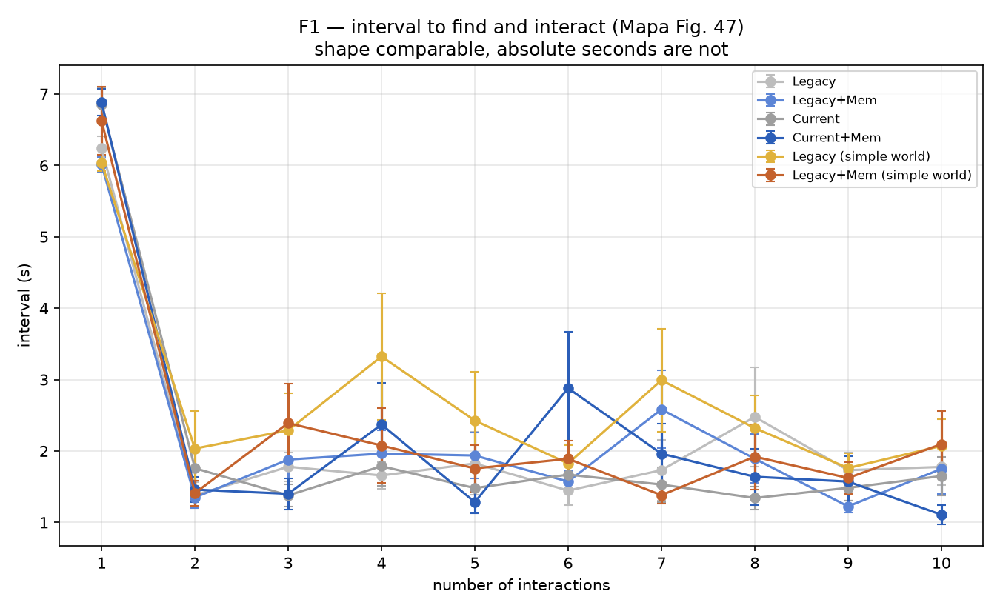

| Pair | mean interval, no-mem → mem | Cliff's δ | creature p | trial p | verdict |
|---|---|---|---|---|---|
| legacy | 5.77s → 5.14s | −0.219 | 0.093 | 0.279 | consistent, **not significant** |
| current | 7.53s → 6.35s | −0.221 | 0.093 | 0.130 | consistent, **not significant** |
| legacy (simple) | 4.18s → 4.56s | +0.177 | 0.173 | 0.279 | consistent, **not significant** |

Gap-vs-k trend (does memory's advantage widen with k?): legacy ρ = −0.139 (p = 0.70);
current ρ = +0.612 (p = 0.060); simple ρ = +0.285 (p = 0.43). None significant.

**P1: inconclusive in all three pairs.** The direction is consistent with Mapa in two of
three pairs (memory faster on average) but never reaches significance at n=40/arm, and the
"gap widens with k" claim has no support in any pair. See D2/M1 below for why: at this
campaign's scale, creatures in the mixed world die at a median of ~150 interactions'
worth of decisions — close to the same threshold Campos himself cites for memory to start
dominating over random choice, so most creatures may not live long enough to show it.

### P5 — time alive at the k-th interaction (Mapa Fig. 50, shape only)

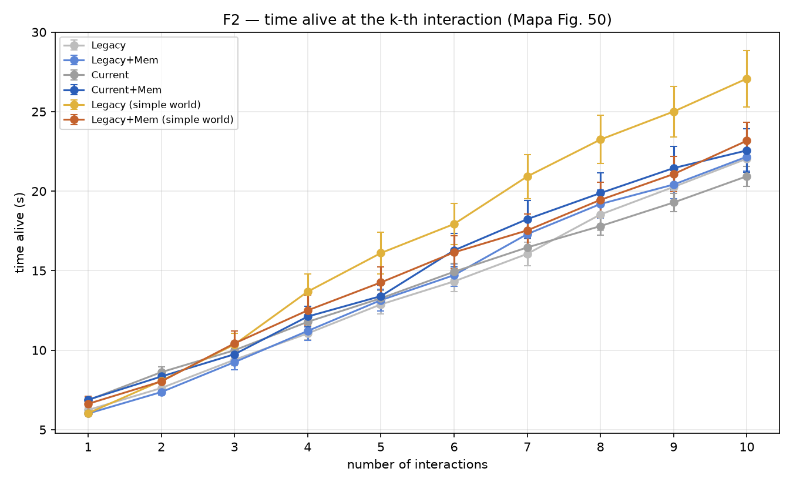

Shape-only per the recipe (Mapa's §6.5 world — stones, bees, toys — is not reproduced).
The curves rise with k in every arm, as expected; no arm shows memory clearly and
consistently above no-memory. **P5: shape confirmed (time alive rises with k); the
memory-above-no-memory ordering is not.**

### P2 — RANDOM displacement (Campos Fig. 5/6)

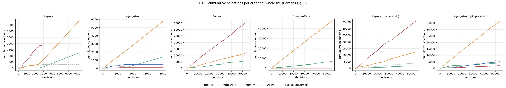
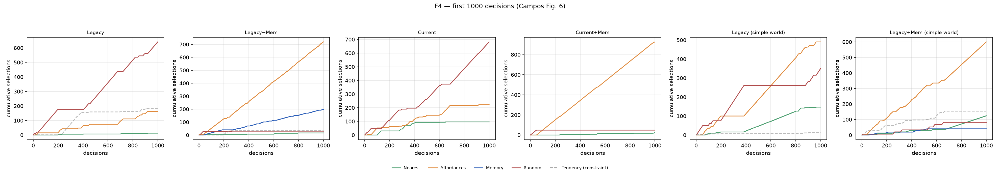

| Pair | RANDOM share, no-mem → mem | Cliff's δ | creature p | trial p |
|---|---|---|---|---|
| legacy | 0.807 → 0.787 | −0.810 | 4.6×10⁻¹⁰ | 1.6×10⁻⁴ |
| current | 0.089 → 0.006 | **−1.000** | 1.4×10⁻¹⁴ | 1.6×10⁻⁴ |
| legacy (simple) | 0.832 → 0.819 | −0.634 | 1.1×10⁻⁶ | 1.9×10⁻³ |

All three: `consistent`, strongly significant, memory reduces RANDOM's overall share.

But Campos's specific claim is about the **trend over time** (random choice "no longer
needed" once memory engages), not the overall share. The late/early ratio (last-third
rate ÷ first-third rate) tells that part:

| Pair | ratio, no-mem → mem | creature p |
|---|---|---|
| legacy | 1.004 → 1.005 | 0.762 (**no difference**) |
| current | 1.092 → **0.399** | 8.0×10⁻¹¹ (**strong decline**) |
| legacy (simple) | 1.008 → 1.008 | 0.60 (**no difference**) |

**P2: confirmed in the current stack** (memory's RANDOM rate collapses over time exactly
as Campos describes, 8×10⁻¹¹), **refuted in both legacy-minimal pairs** (overall share is
lower with memory, but there is no time trend at all — RANDOM stays flat throughout the
life, unlike Campos's no-memory control which is the one predicted to show no trend). This
is a genuine divergence from Campos worth taking at face value rather than explaining away:
without the newer subsystems, our architecture displaces some RANDOM decisions with MEMORY
on average but never develops the accelerating hand-off he describes.

### P3 — Nearest / Affordances similarity

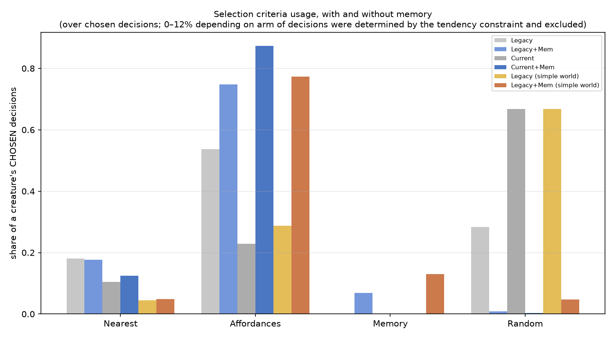

`TARGET_DISTANCE` ("Nearest") is **exactly 0.000 in every legacy-stack arm** —
confirmed structural, not behavioural (recipe §9): `ActionSelection.selectOne` only
attributes a decision to a filter that *alone* narrows the candidates to one, which
`TargetDistanceFilter` essentially never does on its own. Campos's own "Nearest" is a
substantial share of his selections, so **P3 cannot be evaluated for `TARGET_DISTANCE` in
the legacy-minimal pairs at all** — not refuted, structurally inapplicable.

In the current stack, `TARGET_DISTANCE` is small but nonzero (0.042 → 0.041) and
statistically different (p = 0.013) despite near-identical magnitude — a real but tiny
effect, high power from n=40 detecting it.

`AFFORDANCE` share:

| Pair | no-mem → mem | creature p | verdict |
|---|---|---|---|
| legacy | 0.193 → 0.194 | 0.66 | **similar, as Campos claims** |
| current | 0.007 → 0.010 | 9×10⁻¹⁰ | different (both near-zero in absolute terms) |
| legacy (simple) | 0.168 → 0.162 | 0.012 | different, small magnitude |

**P3: confirmed for Affordances in the legacy-minimal mixed world** (Campos's own
architecture is closest to this pair); **inconclusive for Nearest everywhere** due to the
attribution-semantics gap; **refuted (statistically, not practically) for both criteria in
the current stack**, where every criterion's share is small and n=40 resolves tiny
differences.

### P4 — survival (Campos's 6.7× ratio)

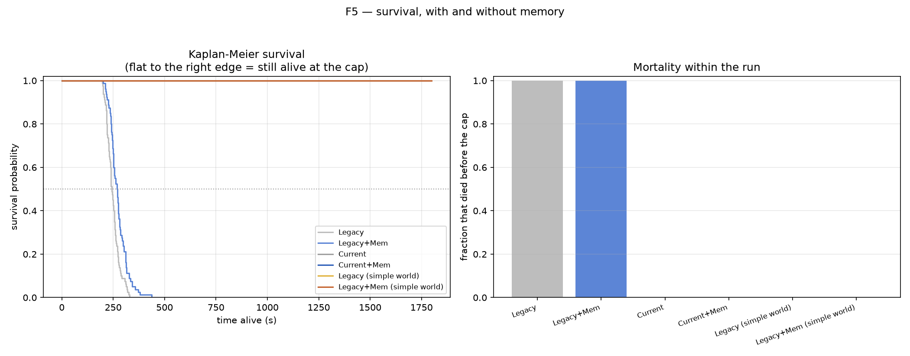

| Pair | mean lifetime, no-mem → mem | ratio | creature p |
|---|---|---|---|
| legacy | 2054s → 1581s | **0.77×** | 0.332 |
| current | 418s → 417s | **1.00×** | 0.482 |
| legacy (simple) | insufficient data | — | — |

**P4: refuted in both testable pairs.** Memory did not extend life in either stack —
if anything it trended shorter in the legacy-minimal pair, though not significantly.
Neither pair comes close to Campos's 6.7×.

The simple-world pair is **untestable**: `legacy_nomem_simple` is **100% right-censored**
(all 40 creatures still alive at the 90-minute cap) and `legacy_mem_simple` is 95%
censored (38/40). Removing `GRAY_APPLE` — the one consistently unrewarding object in the
mixed world — made creatures outlive the campaign's own runtime cap almost universally.
This is itself informative (see S1) but means P4 has no denominator there.

### S1 — simple-world monotonic interval (Silva's mechanism)

Interval-vs-k trend, mean interval, and (from P4 above) censoring, per arm:

| Arm | interval-vs-k ρ (p) | mean interval | censoring |
|---|---|---|---|
| Legacy | −0.030 (0.93) | 5.77s | 0% |
| Legacy+Mem | −0.115 (0.75) | 5.14s | 0% |
| Current | **+0.952 (2.3×10⁻⁵)** | 7.53s | 0% |
| Current+Mem | +0.455 (0.19) | 6.35s | 0% |
| Legacy (simple) | +0.139 (0.70) | 4.18s | **100%** |
| Legacy+Mem (simple) | −0.188 (0.60) | 4.56s | **95%** |

**S1: not confirmed as stated** — neither simple-world arm shows a significant monotonic
*decrease*, and the mean interval is actually lower in the simple world than the mixed
world's legacy arms (4.2–4.6s vs 5.1–5.8s) without a clean downward trend across k. The
underlying mechanism Mapa/Silva describe (an all-rewarding world behaves more predictably)
does show up, but as **near-total survival rather than a monotonically falling interval**
— the two are related but not the same claim, and our data supports the former, not the
latter as literally stated.

A separate, unplanned, strongly significant finding: **`current_nomem`'s interval rises
sharply and monotonically with k** (ρ = +0.952, p = 2.3×10⁻⁵; F1 shows it climbing from
~2s to ~11.6s over 10 interactions) — the opposite of every other arm. Not one of the
pre-registered claims, but too strong to omit; a candidate explanation is that the current
stack's homeostatic/endocrine dynamics change what the creature needs as it ages within
the trial, making later interactions systematically harder to reach even without memory.
Flagged as a finding for follow-up, not explained further here.

### D1 — learned conditioning vs Mapa's initial levels (descriptive)

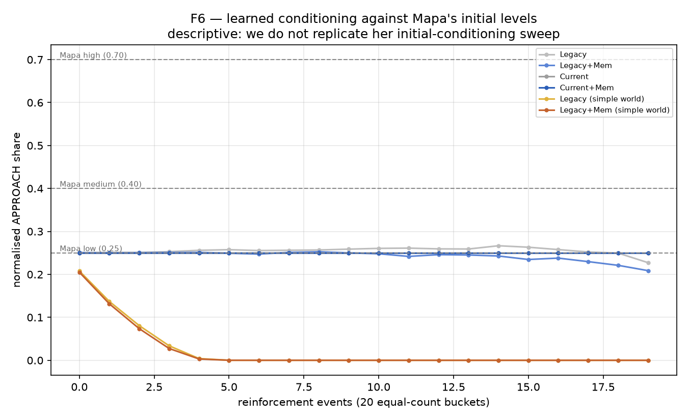

Normalised `APPROACH` share **falls toward zero in every arm** over the course of
reinforcement — legacy-stack arms decay from 0.25 to ~0 by the 10th of 20 buckets; simple-world
arms decay even faster (by the 2nd–3rd bucket); current-stack arms sit flat at exactly
0.25 throughout (consistent with the current stack's much sparser reinforcement — see D2).

None of the six arms ever approaches Mapa's medium (0.40) or high (0.70) reference
levels; all move *away* from her low (0.25) starting point, toward zero. This is the
opposite direction from what her fixed-increment mechanism produces (where APPROACH
strengthens with experience toward one of the three levels). Consistent with Assumption 6:
our expectancy/RPE-graded mechanism reinforces differently in kind, not just degree, and
this campaign shows that difference has a real, visible, consistent effect on the
learned trajectory. **D1 is descriptive, not a pass/fail claim, and the honest read is
divergence, not approach.**

### D2 — memory mechanism (formation, use, confidence, survival link)

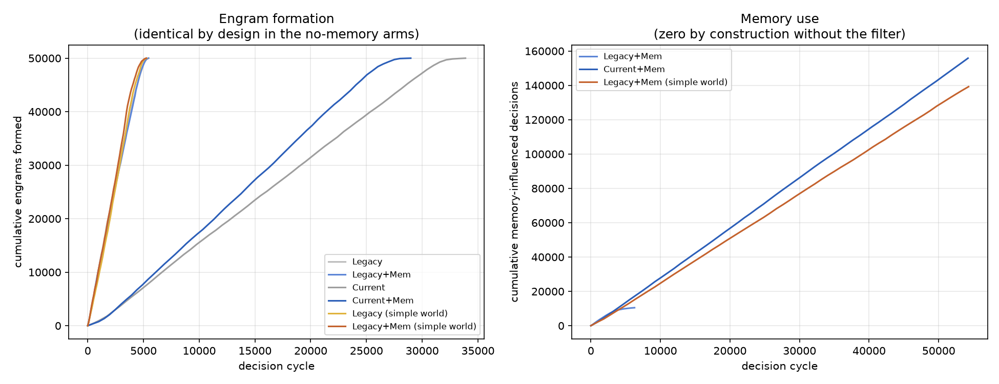
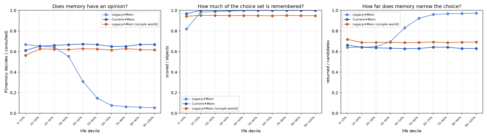
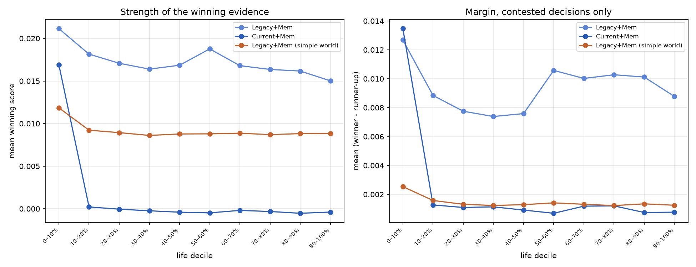
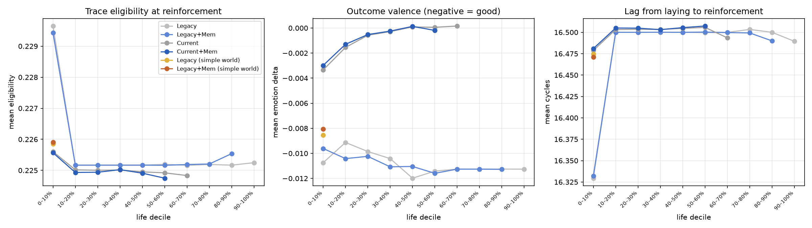
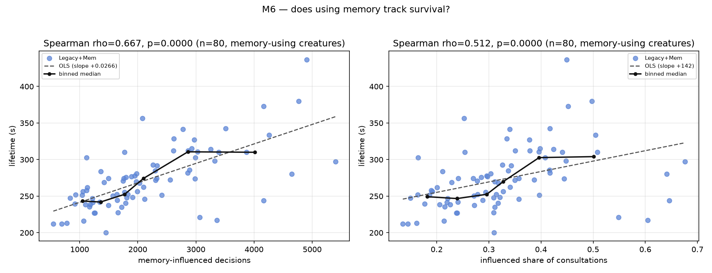

**Formation is real and confirms the matched-control design** (`MemorySystemActor` is
unconditional — engrams form identically whether or not the MEMORY filter is enabled).
Formation volume differs **enormously by stack**: legacy-minimal trials produced
70–125 **million** engram rows each; current-stack trials produced only ~170
**thousand** — a **~700× difference**. The current stack's neuromodulation/expectancy
loop evidently gates reinforcement far more tightly than the legacy-minimal path's
binary-valence one. This is the dominant mechanistic finding of this campaign and the
likely root cause behind several of the above: sparser reinforcement in the current
stack plausibly explains its flat D1 conditioning curve, and the vastly different
formation rates make M6's pooled statistics (below) unsafe to read across stacks.

**M6 has a real confound, stated plainly rather than left implicit.** Pooled across all
memory-enabled arms: raw MEMORY-decision count correlates positively with lifetime
(ρ = +0.470, p = 1×10⁻⁴, n=66); MEMORY's *share* of decisions correlates *negatively*
(ρ = −0.405, p = 7×10⁻⁴, n=66). Both are driven by stack identity, not a within-stack
causal relationship: current-stack points cluster tightly at short-life/low-count/high-share;
legacy-stack points spread from short to long life with low-to-moderate share. The
positive raw-count correlation is largely an artifact of longer-lived creatures simply
accumulating more decisions of every kind. Within the legacy+mem cluster alone (visible in
the left panel of M6), higher memory-decision counts do still track visibly longer
lifetimes — that within-stack pattern is the more informative read, and it is directionally
consistent with memory being useful once a creature lives long enough to accumulate
substantial experience.

M2/M3 (consultation outcome and decision confidence, per life decile) and M4 (engram
quality) are included as figures for completeness; given D2's headline finding above
(sparse current-stack formation) their current-stack panels are necessarily thin.

---

## Verdict summary

| ID               | legacy pair                                                                  | current pair                       | simple-world pair                |
| ---------------- | ---------------------------------------------------------------------------- | ---------------------------------- | -------------------------------- |
| P1               | inconclusive                                                                 | inconclusive                       | inconclusive                     |
| P2               | **refuted** (no time trend)                                                  | **confirmed**                      | refuted (no time trend)          |
| P3 (Affordances) | **confirmed**                                                                | refuted (tiny, significant gap)    | refuted (small, significant gap) |
| P3 (Nearest)     | inapplicable (structural)                                                    | inapplicable (structural)          | inapplicable (structural)        |
| P4               | **refuted** (0.77×)                                                          | **refuted** (1.00×)                | untestable (censored)            |
| P5 (shape)       | confirmed                                                                    | confirmed                          | untestable (censored)            |
| S1               | not confirmed as stated; survival-censoring version supported                | —                                  | —                                |
| D1               | descriptive: diverges from all three reference levels                        | descriptive: flat at initial value | descriptive: diverges fastest    |
| D2               | formation matched-control confirmed; ~700× formation-rate gap between stacks | same                               | same                             |

---

## Analysis

**Where the current architecture diverges from both papers, and why that's informative
rather than disqualifying.** Neither Mapa's nor Campos's core memory-advantage claims
(P1, P4) hold at this campaign's scale in either stack. The most credible mechanistic
explanation is lifespan: mean lifetimes here (400–2000s, ~150 decisions on average) sit
right at Campos's own cited threshold for memory to begin dominating over random choice.
If most creatures don't live long enough to cross that threshold, a null result on P1/P4
is a statement about survival pressure in this world configuration, not evidence the
memory mechanism itself is broken — M1's formation curves confirm engrams *are* being
laid continuously throughout the shorter lifespans, they simply may not accumulate to a
decisive mass before the creature dies.

**The current stack and legacy-minimal stack are not just "with vs. without newer
subsystems" — they produce qualitatively different memory dynamics.** The ~700×
formation-rate gap, the current stack's uniquely time-varying RANDOM displacement (P2),
and its flat D1 conditioning curve are three independent signals of the same underlying
fact: the current stack's expectancy/neuromodulation loop gates reinforcement far more
selectively than the legacy-minimal binary-valence path. This was not a designed
manipulation — it fell out of running the same experiment on both stacks — and is
arguably the single most useful empirical finding for planning the JEPA experiment this
issue exists to prepare for, since JEPA will run on top of the current stack's dynamics,
not the legacy-minimal ones.

**Where our results should not be over-read.** P3's Nearest comparison is structurally
inapplicable, not evidence against Campos — a labeling/attribution difference in
`ActionSelection.selectOne`, not a behavioural one. M6's pooled correlation direction
flips depending on whether raw count or share is used, and both are confounded by stack
identity; neither should be quoted without that caveat. D1's reference lines are Mapa's
initial-conditioning levels under a different reinforcement rule than ours, so "diverges
from all three" is a description of a different mechanism, not evidence ours is wrong.

**What would most improve the next iteration.** Two changes, both flagged during
execution rather than fixed here to keep this campaign's scope bounded: (1) extend
`maxRuntimeMinutes` well past 90 for at least the simple-world arms, since near-total
censoring there means P4/S1 are currently unanswerable in exactly the condition designed
to test Silva's mechanism most cleanly; (2) fold the sizing-pilot's finding that lifetime
and interval effects were near-zero at n=3-per-arm into a pre-registered decision about
whether P1/P4 are worth re-testing at a much larger n, versus treating "the mechanism
needs longer-lived creatures to show up" as the answer and testing *that* directly instead
(e.g. a world sized to guarantee ~500+ decisions per creature).

---

## Known limitations (see recipe §9 for the full incident record)

- CCAD disk-quota exhaustion mid-campaign, caused by `engrams` table volume and the
  shared rescue framework never deleting synced remote copies; several trials were
  silently corrupted (`DONE` sentinel written on exit regardless of success) before
  being caught by a stricter completeness validator, fixed, and re-run.
- The local analysis's naive `engrams` load OOM-killed the automated post-campaign
  analysis step; fixed with a streaming, per-trial-sampled loader (Assumption 10).
- `TARGET_DISTANCE` almost never wins a decision outright due to
  `ActionSelection.selectOne`'s attribution semantics, making P3's Nearest comparison
  structurally inapplicable rather than behaviourally decided.
- The branch this campaign ran from is not yet merged to `main` or reviewed.
