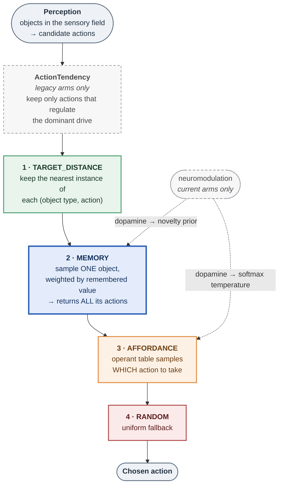
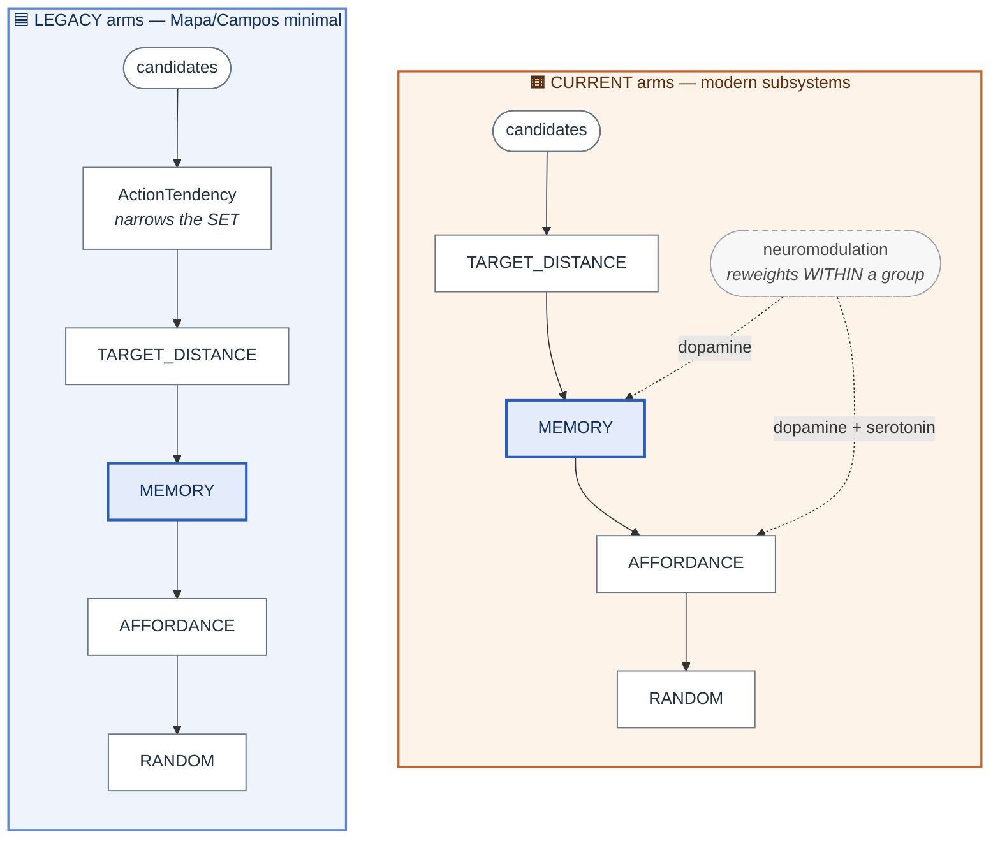
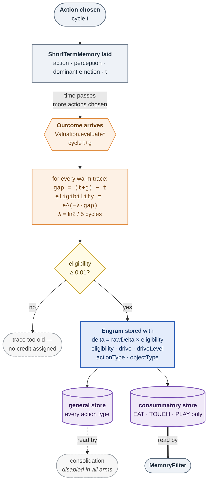

# Behaviour parity with Mapa (2009) and Campos (2015)

Issue: [#84](https://github.com/felipedreis/dl2l/issues/84)
Recipe: [`docs/experiments/p84_behaviour_parity_recipe.md`](../experiments/p84_behaviour_parity_recipe.md)
Data: `felipedreis/dl2l-experiments` prefix `p84/` · image `ghcr.io/felipedreis/dl2l:sha-da1763c`
Campaign: 6 arms × 16 trials × 5 creatures = **480 creatures**, collected 2026-08-11/12, all ten schema gates passing.

---

## Purpose

Establish whether the current architecture still behaves like the published versions it
descends from — Mapa (2009) and Campos et al. (2015) — before the JEPA results are written up.
We have neither their code nor their data, so the comparison is qualitative in shape and
quantitative only in ratios.

The campaign also became the test bed for a substantial rework of the memory subsystem, which
the first run of this experiment forced: memory as it stood made creatures **eat 3.5–45× less
and die sooner**, in every arm pair.

---

## Assumptions

Restated from the recipe because several of them determine what the results can mean:

1. **Absolute times are not comparable to the papers.** `time` is `System.currentTimeMillis()`
   and our ms-per-cycle moves with host load. Only shape and ratios carry across.
2. **`GRAY_APPLE` (caloricValue 0) stands in for Mapa's balls/toys**, and only EAT is counted —
   `MouthInteractionState` is written solely for `EnergeticStimulus`.
3. **Replenishment is on**, unlike Mapa. This is what makes several creatures per trial sound,
   and it is also why S1 cannot be tested (§ Analysis).
4. **Creatures share a world.** They cannot perceive each other, but the clustering is real and
   every test is run at both creature and trial level.
5. **Arms do not share an observation window.** The legacy pair runs to death (~250 s, 80/80);
   the other four never terminate on the reworked build and are capped at 30 minutes. Both
   members of every pair share a cap, so within-pair comparisons hold; **counts are not
   comparable across pairs, rates are.**
6. **The `current_*` arms are confounded** on chain arbitration and have no hunger pressure —
   [#90](https://github.com/felipedreis/dl2l/issues/90).

---

## Hypothesis

| ID     | Claim                                                                                   |
| ------ | --------------------------------------------------------------------------------------- |
| **P1** | Memory shortens the interaction interval, and the gap widens with k (Mapa Fig. 47)      |
| **P2** | With memory, RANDOM is displaced as memory engages (Campos Fig. 5/6)                    |
| **P3** | Nearest and Affordances are used similarly with and without memory                      |
| **P4** | Memory extends life; ratio compared against Campos's 6.7×                               |
| **P5** | Time alive rises with interaction count, memory above no-memory (shape only)            |
| **S1** | In the all-rewarding world the interval decreases monotonically, unlike the mixed world |
| **D1** | Learned APPROACH share against Mapa's 0.25/0.40/0.70                                    |
| **D2** | Memory forms, is increasingly used and increasingly decisive; use tracks survival       |

---

---

## How the memory system works

The results below are hard to read without knowing what a creature actually does with memory,
so this section describes the implemented mechanism. It is the same in both stacks except where
noted — the arms differ in which *other* filters are enabled, not in how memory itself works.

### The decision chain

Every cognitive cycle, `FullAppraisal` builds the set of actions the situation affords and runs
it through a fixed cascade. `ActionSelection.selectOne` stops at the first filter that narrows
the set to a single action, and credits that filter in `chosen_action_state`.



*Node colours match the criterion colours used in every figure below — green Nearest, blue
Memory, orange Affordances, red Random. Dashed boxes are enabled in only one stack.*


Two things about this order matter for the results:

- **MEMORY sits before AFFORDANCE.** Memory chooses *what to engage with*; the operant table
  chooses *what to do to it*. This is Mapa's division of labour, and the pair occupies the
  single "Memory" slot of Campos's Algorithm 1.
- **Memory rarely ends the chain**, because it returns *several* actions (all those targeting
  the object it picked). AFFORDANCE almost always makes the final narrowing. This is why the
  MEMORY share in F3 is a structural floor and not a measure of memory's influence.

The two stacks differ in *which* filters surround memory, never in how memory itself works:



**This is the confound behind [#90](https://github.com/felipedreis/dl2l/issues/90).** The two
mechanisms act at different points and are not substitutes. `ActionTendency` **narrows the
candidate set**, which is what leaves a single target group and lets AFFORDANCE narrow to one
action and take the decision. Neuromodulation only **reweights within** a group and returns one
action per group regardless, so it can never turn three groups into one. Measured: AFFORDANCE
decides **51.7%** of choices in `legacy_nomem` against **23.1%** in `current_nomem`, with RANDOM
taking 66.1% there.

**Arm differences.** The legacy arms enable `ActionTendency` (Campos 2006 innate tendencies)
and no neuromodulation. The current arms drop `ActionTendency` and enable
neuromodulation/expectancy/orexin/endocrine — dopamine raises the AFFORDANCE softmax
temperature and the MEMORY novelty prior. These are *not* substitutes (issue #90): tendency
narrows the candidate set, neuromodulation only reweights within it.

### How a memory is formed

Memory is written in two stages — a trace at decision time, and a value later, when the outcome
is known. `MemorySystemActor` is created *unconditionally*, so the no-memory arms form engrams
identically and simply never consult them. That is what makes formation a matched control.



*The double arrow is the path that drives behaviour: only the consummatory store feeds object
valuation. The general store exists for consolidation, which no arm enables.*


λ = ln2 / `TRACE_DECAY_HALF_LIFE` (5 cycles), so a trace five cycles old carries half the credit
and one older than ~33 cycles is dropped. **An engram's `emotionDelta` is measured against
whichever drive was dominant at decision time** — the cause of issue #91.

> **Eligibility is applied twice.** The stored `emotionDelta` is *already* `rawDelta ×
> eligibility`, and `MemoryFilter` then scores `-emotionDelta × eligibility` — so the effective
> weighting is **eligibility²**, not eligibility. Consummatory engrams have median eligibility
> 0.08–0.22 (median gap 11–18 cycles), so this is not a rounding effect: two engrams that should
> weigh 5:1 actually weigh 25:1, sharply over-favouring the most recent. It does not invalidate
> the results here — every comparison in this report is between objects scored the same way — but
> it is a real defect ([#93](https://github.com/felipedreis/dl2l/issues/93)), and the persisted
> `engrams.emotion_delta` column carries the pre-weighted value, which any future analysis must
> know.

Both stores bound retention **per (action, object) key** at `MAX_ENGRAMS_PER_KEY = 64` rather
than globally, so common experience expires against itself and a rare experience survives as
long as it stays rare.

### What MemoryFilter does when consulted

```
filter(candidate actions):
  # four gates, each passing everything through to the next filter
  1. fewer than 2 candidates                  -> pass through
  2. consummatory store empty                 -> pass through
  3. all candidates target the same object    -> pass through   (no object choice to make)

  score[obj] = mean( -emotionDelta x eligibility )      over CONSUMMATORY engrams for obj
                                                        (negative delta = aversive drive fell)

  base  = mean of positive candidate scores, else mean |score|, else 0
  prior = MEMORY_NOVELTY_OPTIMISM x base x (1 + DA_NOVELTY_GAIN x tanh(max(0, dopamine)))

  weight[obj] = prior                          if obj unknown        (optimistic initialisation)
              = score[obj]                     if score > 0          (Herrnstein matching)
              = MEMORY_NEGATIVE_FLOOR x prior  if score <= 0         (punished, not excluded)

  4. all weights zero                          -> pass through

  sample ONE object with probability proportional to weight
  return EVERY candidate action targeting it   -> AFFORDANCE picks the action
```

Four properties of this are load-bearing for the results:

1. **Consummatory engrams only.** EAT/TOUCH/PLAY, per Mapa. Approach traces are excluded because
   an approach's outcome depends on what happens next, so eligibility credits every recent
   approach indiscriminately — measured, they discriminate objects at **1.09×** against EAT's
   **6.3×**.
2. **Sampling, not argmax.** An argmax over a store written by its own choices has a fixed point:
   whatever wins gets reinforced and keeps winning. Both source papers are stochastic here.
3. **Unknown beats punished.** An unexplored object carries the optimistic prior; a
   remembered-harmful one keeps 1% of it. Campos excludes negative-valued options outright,
   which is an absorbing state that can never be revised.
4. **Memory returns a set, not an action.** This is what stopped it crowding out EAT, and what
   makes AFFORDANCE absorb the selection credit in F3.

### What gets recorded

| table | one row per | used for |
|---|---|---|
| `engrams` | reinforced trace | M1, M4; `drive`/`object_type` support #91 |
| `memory_decisions` | **consultation** | M2, M3, M6 — the honest influence rate |
| `conditioning` | reinforcement event (6 rows, one per action) | F6 |
| `actions` | decision, with the crediting filter | F3, F4, F3b |

`memory_decisions` exists because `selection_type` cannot answer "was memory used" once memory
stops ending the chain. `decided = returned < candidates` is the influence signal used
throughout this report.

---

## Results

### Memory raises the feeding rate in all three pairs

Rate, not count, because the arms terminate differently (assumption 5).

| pair    | no-memory | memory    | Cliff's δ | creature-level | trial-level |
| ------- | --------- | --------- | --------- | -------------- | ----------- |
| legacy  | 11.31     | **13.37** | +0.718    | p=4.4e-15      | p=1.5e-06 ✓ |
| current | 73.50     | **88.68** | —         | p<1e-15        | p=1.5e-06 ✓ |
| simple  | 39.07     | **41.01** | —         | p=0.001        | p=0.004 ✓   |

All `consistent` — creature-level and trial-level agree, so this is not within-trial
pseudo-replication.

### P2 — confirmed, and it is the strongest parity result

RANDOM collapses to near zero wherever memory is enabled, and the operant table absorbs it:

| pair    | RANDOM (no-mem → mem) | AFFORDANCE (no-mem → mem) |
| ------- | --------------------- | ------------------------- |
| legacy  | 0.283 → **0.008**     | 0.536 → 0.748             |
| current | 0.668 → **0.003**     | 0.228 → 0.873             |
| simple  | 0.668 → **0.048**     | 0.288 → 0.773             |

This is Campos's central claim — random choice stops being needed once memory engages — and it
reproduces in every pair, `consistent` at both levels.


*Campos Fig. 5 equivalent. Each panel is one arm; the RANDOM curve (red) rises steadily without
memory and flattens almost immediately with it, while AFFORDANCE (orange) takes the slope. The
MEMORY curve (blue) stays low **by construction** — memory narrows to an object and hands the
action choice on, so it rarely ends the filter chain and rarely takes the credit. Read memory's
influence from M2 below, not from this curve.*


*Campos Fig. 6 equivalent — the same curves zoomed to the first 1000 decisions, where the
displacement of RANDOM happens. Campos reports memory taking over around interaction 150.*

### P3 — confirmed

`TARGET_DISTANCE` share is essentially unchanged by memory: 0.180 → 0.176 (legacy, p=0.34),
0.104 → 0.124 (current). Nearest is used the same way with and without memory, as Campos reports.


*Each criterion's share of the decisions where a criterion actually chose (tendency-determined
decisions excluded — see recipe §6). The green Nearest bars are near-identical within each pair,
which is P3; the collapse of red RANDOM into orange AFFORDANCE is P2.*

### P4 — confirmed in the only pair that can test it

| pair    | mortality      | KM median                 | log-rank              |
| ------- | -------------- | ------------------------- | --------------------- |
| legacy  | 80/80 vs 80/80 | 243 s → **269 s** (1.11×) | χ²=15.8, **p=0.0001** |
| current | 0/80 vs 0/80   | beyond cap                | no events             |
| simple  | 0/80 vs 0/80   | beyond cap                | no events             |

Memory extends life, but at **1.11×** against Campos's published **6.7×** — we reproduce the
direction, not the magnitude. The other two pairs cannot test P4 at any cap: their creatures do
not die (#90).


*Left: survival curves. The legacy pair separates cleanly, memory above no-memory. The other four
arms are the flat lines at S=1 — every creature outlived the observation, which is what "beyond
cap" means in the table and why those pairs cannot test P4. Right: mortality per arm, 100% in the
legacy pair and 0% everywhere else.*

### Diet composition — memory helps where hunger binds, and harms where it does not

| arm | gray (0 cal) share | calories per EAT |
|---|---|---|
| `legacy_nomem` | 53.6% | 0.166 |
| `legacy_mem` | **41.1%** | **0.213** |
| `current_nomem` | 56.9% | 0.153 |
| `current_mem` | **64.0%** | **0.128** |

In the legacy stack memory cuts worthless-fruit intake and raises nutrition. In the current
stack it does the opposite — see Analysis.

### D1 — the learned conditioning trajectory


*Each action's **normalised** share of the operant table over reinforcement events, per target
type, with reference lines at Mapa's low/medium/high initial-conditioning levels
(0.25 / 0.40 / 0.70). Descriptive only: our conditioning mechanism evaluates experiences via
expectancy/RPE rather than her fixed step, so divergence here is a finding rather than a defect.
Normalised because `ActionProbability.varyProbability` clamps at 0 while the compensating
`-delta/(n-1)` is applied unconditionally, so raw values drift off 100 — `ActionProbabilityFilter`
normalises at selection time and this figure does the same.*

### P1, P5, S1 — not decidable in this design

Mean interaction interval is flat: 2.204 vs 2.217 s (legacy, p=0.64). The simple pair shows
2.708 vs 2.317 but reads **clustering-sensitive**, so it is not claimed.


*Mapa Fig. 47 equivalent — the average time to encounter and consume the k-th object. The only
real structure is k=1 (~6 s, birth to first food) against a flat ~1.8–2.4 s thereafter, in every
arm. Mapa's curve grows and oscillates across k because her world **depleted**; ours replenishes,
so the search difficulty never changes and the curve has nothing to trend with. This is the
figure that shows S1 is untestable here rather than refuted.*


*Mapa Fig. 50 equivalent, shape only. Cumulative time alive against interaction count. The
memory arm sits above its control in the legacy pair; the non-terminating arms cannot contribute
a lifetime axis.*

### D2 — memory forms, is used, and is decisive

Memory influences 27–41% of consultations in the legacy pair, 60–64% in the simple pair and
**65–67%** in the current pair, with >90% of consultations returning more than one action —
i.e. memory narrows to an object and leaves the action to the operant table, as designed.


*M1 — cumulative engrams laid (left) against cumulative memory-**influenced** decisions (right).
Formation is a matched control: `MemorySystemActor` is created unconditionally, so the no-memory
arms lay engrams at the same rate and simply never consult them. This is the direct test of
Campos's "memories form from the start but are not used until ~interaction 150".*


*M2 — the honest measure of memory's influence, and the one to read instead of the MEMORY curve
in F3. Left: how often a consultation ends in a decision rather than a pass-through. Middle:
`scored/objects` — how much of what is in view the creature has experience of. Right:
`returned/candidates` — how far memory narrows the choice, where 1.0 means it passed everything
through.*


*M3 — the winning object's value and its margin over the runner-up, per life decile. Separates
"decided confidently on broad evidence" from "decided on one weak engram".*


*M4 — eligibility, emotional delta and lay→reinforce gap of the engrams being laid, over life
deciles.*


*M6 — lifetime against how much the creature actually used memory. This is the plot that most
directly asks whether **using** memory, not merely having it, tracks survival:
**Spearman ρ=+0.667 (count) and +0.512 (share), both p<0.0001, n=80**.*

*Two trend lines, because they disagree in an informative way. The dashed OLS line is
descriptive only — the reported statistic is Spearman, a rank correlation chosen because
lifetime is right-skewed. The solid binned-median line shows the monotone trend Spearman
actually tests, and it **plateaus** at roughly 2,800 influenced decisions (~0.40 of
consultations) while OLS keeps climbing. So the benefit of using memory **saturates**: the first
increments of memory use buy most of the extra lifetime and further use adds little. An OLS line
alone would have implied a linear benefit that continues indefinitely.*

*Scope: only `legacy_mem` contributes. M6 needs a real lifetime, and the other two memory arms
have no deaths at all (0/80), so their `lifetime_s` is null by construction. This is the same
restriction that limits P4, for the same reason.*

M5 (consolidation) is absent: no arm enables `consolidationEnabled`, and the campaign spec has
no `*_consol` arm. Separately, `MEMORY_CONSOLIDATION_THRESHOLD = 0.1` is unreachable at the
current delta scale (largest observed group mean 0.031), so consolidation is dead code either
way — see Follow-ups.

---

## Analysis

### The memory rework is what made these results possible

The first run of this campaign found memory to be actively harmful. Reading both source papers
against the implementation identified three structural divergences, all now fixed:

1. **Both papers are stochastic where memory meets choice; we were a deterministic argmax.** An
   argmax over a store written by its own choices has a fixed point. Selection is now
   proportional to remembered value (Campos's rule).
2. **Mapa separates object-choice from action-choice; we had collapsed them.** `MemoryFilter`
   returned a single action and ended the filter chain before the filters that would have
   chosen EAT ever ran. It now picks an *object* and hands every action on it to the operant
   table — which is exactly what P2's AFFORDANCE absorption shows happening.
3. **Approach traces were drowning the consummatory signal.** EAT engrams discriminate fruit by
   caloric value at **6.3×**; APPROACH engrams manage **1.09×**, because an approach's outcome
   depends on what happens next and the trace credits every recent approach indiscriminately.
   Approaches outnumbered consummatory acts 114:1, collapsing 6.3× to 1.14×. Consummatory
   engrams now have their own store, and retention is bounded *per (action, object) key* so
   common experience expires against itself rather than against everything else.

### Why memory harms the current stack — issue #91

The current stack is the one case where memory makes the diet worse, and the cause is
measurable. An engram records `emotionDelta` against **whichever drive dominates at decision
time**. In the current stack that is sleep (mean 2.60) rather than hunger (0.31):

| drive the engram is measured against | count | share |
|---|---|---|
| sleep | 85,143 | **99.95%** |
| hunger | 37 | 0.043% |

And the value it records depends entirely on which:

| object | caloric value | under hunger (n=37) | under sleep (n=85,143) |
|---|---|---|---|
| GREEN_APPLE | 0.5 | **+0.219** | −0.0008 |
| RED_APPLE | 0.2 | **+0.112** | −0.0005 |
| GRAY_APPLE | **0.0** | +0.0002 | **+0.0003** |

Under hunger the discrimination is **1103× and correctly ordered by calories**. Under sleep —
99.95% of the evidence — it inverts, and the zero-calorie fruit becomes the only positively
valued food. The architecture *can* learn the right thing and almost never gets the chance.

The legacy stack works because hunger dominates there (~68% of engrams are hunger-tagged), so
the correct signal is what gets recorded. The fix is drive-specific valuation — scoring an
object from engrams matching the drive being regulated — which is what Campos actually
specifies (his LTM value is a *deprivation difference*).

### Three criteria are neutralised by design decisions, not by results

This is the most important caveat in the report, and each was found from the data:

| criterion | why undecidable | issue |
|---|---|---|
| **S1** (and P1's "widens with k") | **Replenishment.** Mapa ran a *depleting* world, where each consumed object makes the next harder to find — that growth *is* her Fig. 47 shape, and the unrewarding interactions she credits for its oscillation modulate a trend depletion creates. Our density is stationary, so the curve has nothing to trend with. Measured: no monotonic trend in any of four arms, all p>0.2. | recipe §7 |
| **P4** in `current_*`/`simple` | Creatures never die at any cap — max hunger 1.13 of a lethal 7.0 in the current stack. | [#90](https://github.com/felipedreis/dl2l/issues/90) |
| **P3/P2 across stacks** | The legacy/current pair is confounded on **chain arbitration**, not the emotion→action mechanism it was designed to isolate. `ActionTendencyFilter` narrows the candidate set; neuromodulation only reweights within it and cannot substitute. AFFORDANCE decides 51.7% of choices in legacy against 23.1% in current. | [#90](https://github.com/felipedreis/dl2l/issues/90) |

A null result on any of these is **not** evidence against the architecture.

### Verdict against the source figures

| ID | Verdict |
|---|---|
| **P1** | **Inconclusive** — interval flat; the "widens with k" clause needs a depleting world |
| **P2** | **Confirmed** in all three pairs, `consistent` |
| **P3** | **Confirmed** — Nearest unchanged by memory |
| **P4** | **Confirmed** in the legacy pair (p=0.0001) at 1.11× vs Campos's 6.7×; untestable elsewhere |
| **P5** | **Inconclusive** — shape only, and the non-terminating arms cannot contribute |
| **S1** | **Untestable** under replenishment |
| **D1** | Descriptive — see `f6_conditioning.png` |
| **D2** | **Confirmed** — memory forms, is consulted, and is decisive on 27–67% of consultations |

---

## Follow-ups

- [#90](https://github.com/felipedreis/dl2l/issues/90) — arms confounded on arbitration; current stack has no hunger pressure
- [#91](https://github.com/felipedreis/dl2l/issues/91) — engram value conditioned on the dominant drive
- **S1 needs a depleting single-creature arm** (`reposition = false`) to be testable at all
- `MEMORY_CONSOLIDATION_THRESHOLD = 0.1` is **unreachable** at the current delta scale (largest
  observed group mean 0.031), so consolidation is silently dead code
- [#93](https://github.com/felipedreis/dl2l/issues/93) — eligibility applied twice, so the
  effective trace half-life is 2.5 cycles rather than the declared 5
- `manifest.json` now records the image tag and commit; the ansible pipeline still does not
