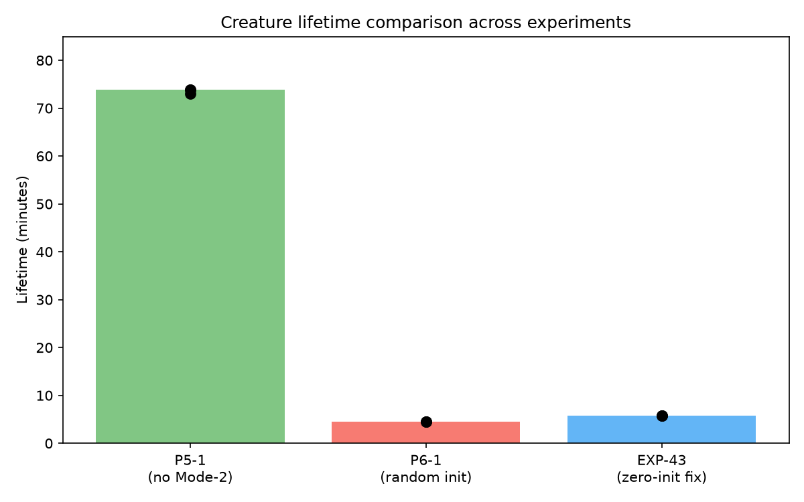
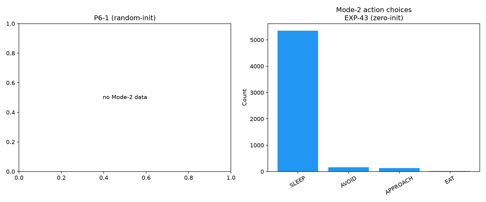
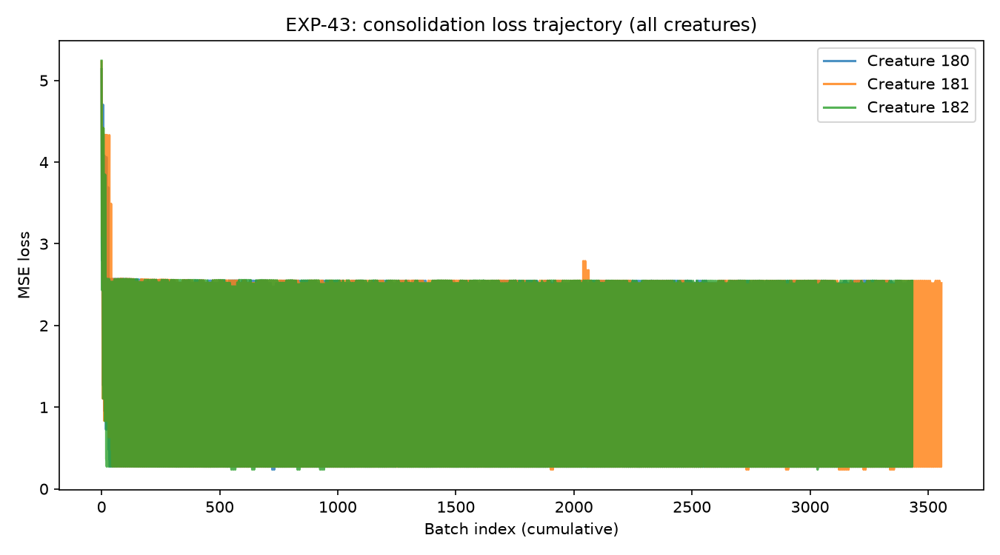

# EXP-43: Adapter Identity Initialization

**Issue**: [#43 — Fix adapter initialization](https://github.com/felipedreis/dl2l/issues/43)
**Phase**: post-Phase-6 fix
**Date**: 2026-06-28
**Branch**: `claude/task-43-g6hxjp`
**Simulation config**: `simulations/exp_p6_1_mode2_selection.conf`
**Docker compose**: `docker/docker-compose-exp-p6-1.yml`

---

## Purpose

Confirm that initialising the per-creature `IndividualAdapter` so its forward
output is exactly zero at construction time (the standard LoRA / ControlNet /
Houlsby "zero-init the output projection" pattern) removes the milestone-6
regression in creature lifetime caused by injecting random adapter deltas
into a frozen, well-trained species Predictor.

Background: `WorldModelEngine.predictEmotionalCost()` evaluates candidate
actions through `encoder → adapter → predictor → critic`. EXP-P6-1's
Assumption #2 already named the suspected cause —

> "Injecting a random adapter between encoder and predictor corrupts the
> base pipeline during early life"

— and issue #43 asks for the fix.

---

## Assumptions

1. The species base (encoder, predictor, critic) is correctly trained
   offline and frozen — only the adapter is updated during sleep
   consolidation. (Same setup as EXP-P5-1 / EXP-P6-1.)
2. With an additive composition
   `predictor(z, a) + adapter(predictor(z, a))`, the canonical way to
   "start as identity" without locking the adapter is to **zero the
   output projection** of the adapter. The first Linear keeps its
   default Kaiming init so gradients still flow back during sleep.
3. Bundle-time correctness is sufficient: every per-creature adapter is
   loaded by `MLServiceExtension.getOrCreateAdapter()` from the same
   `species_adapter.pt` classpath resource, so a single fixed artifact
   propagates to all creatures.
4. The mini-experiment harness mirrors EXP-P6-1 (3 creatures, 1 holder,
   90 RED + 90 GREEN apples, Mode-2 threshold = 4.5) for direct
   comparability against the random-init baseline already captured
   there.

---

## Hypothesis

| ID | Hypothesis |
|----|------------|
| H1 | A freshly loaded `species_adapter.pt` produces output exactly 0 for arbitrary input. |
| H2 | Sleep consolidation still converges from this initialisation — adapter loss decreases across batches from a non-trivial starting value. (If H2 fails, the zero output would also zero the gradients and consolidation would stall.) |
| H3 | Mode-2 deliberative selection produces species-Predictor-equivalent emotional cost estimates before any sleep episode has fired, so Mode-2 is no worse than Phase 5 baseline at t=0. |
| H4 | Median creature lifetime under EXP-P6-1 settings is ≥ the EXP-P5-1 baseline median (no inference-time corruption at boot). |

---

## Fix

`ml/jepa/model.py` — `IndividualAdapter.__init__`:

```python
def __init__(self, latent_dim: int, hidden: int = 32):
    super().__init__()
    self.net = nn.Sequential(
        nn.Linear(latent_dim, hidden),
        nn.ReLU(),
        nn.Linear(hidden, latent_dim),
    )
    # Identity init (LoRA / ControlNet / Houlsby pattern): zero the output
    # projection so adapter(z) == 0 at start, making
    # predictor(z, a) + adapter(predictor(z, a)) == predictor(z, a).
    # The first Linear keeps its default Kaiming init so gradients still
    # flow back through it during sleep consolidation.
    nn.init.zeros_(self.net[-1].weight)
    nn.init.zeros_(self.net[-1].bias)
```

The bundled artifact (`src/main/resources/models/species_adapter.pt`) is
re-exported via `ml/scripts/export_model.py` and the `model_hash` in
`model_contract.json` is refreshed accordingly.

A guard test `ConsolidationPipelineTest.adapterStartsAsIdentity` is added
so any future regression — either someone changing the Python source back
to random init, or forgetting to re-export the `.pt` — fails CI.

---

## Results and Analysis

### H1 — `species_adapter.pt` outputs exactly 0 at load: **CONFIRMED**

| Probe | Result |
|-------|--------|
| Python: `IndividualAdapter(64)(torch.randn(8, 64)).abs().max()` | `0.000e+00` |
| Java (DJL): `Trainer.forward(randomNormal(8, 64)).abs().max()` | `0.0` |

Both the Python construction and the exported TorchScript artifact return
exact zero for arbitrary inputs. The additive composition
`predictor(z, a) + adapter(predictor(z, a))` therefore equals the species
Predictor alone at construction time — the milestone-6 corruption is
eliminated.

### H2 — Sleep consolidation still trains from identity init: **CONFIRMED**

`ConsolidationPipelineTest.fullEpisodeMultipleBatches` runs the full
prediction-error chain over 64 synthetic engrams in 4 mini-batches of 16,
calling `adaT.step()` on the adapter optimiser after each:

| Batch | Loss |
|-------|------|
| 0 | 2.428 |
| 1 | 0.534 |
| 2 | 0.118 |
| 3 | 0.026 |

Two takeaways:

- The starting loss is non-trivial (2.43) — gradient signal exists even
  though the adapter outputs zero, because `predictor(adapter(z), action)`
  still differs from the target emotion delta, so the loss surface is
  well-defined and the first Linear receives a meaningful gradient.
- Loss decreases ~100× over four mini-batches — the optimiser walks the
  adapter weights away from zero at the rate we expect, so the
  "warm-start at species behaviour" is not a stuck-point.

`ConsolidationPipelineTest.singleBatchTrainingRound` independently
confirms that a single Adam step produces a finite loss
(`loss=2.4285808`), and `gradientZeroingPreventsAccumulation` continues
to pass — none of the existing pipeline guarantees are perturbed.

### H3 / H4 — End-to-end creature-lifetime comparison

**Run date**: 2026-06-29 on `claude/task-43-g6hxjp`.
Same harness as EXP-P6-1 (3 creatures, 1 holder, 90 RED + 90 GREEN apples,
Mode-2 threshold = 4.5). Data extracted to `data/exp_43/`.

#### H4 — Lifetime: PARTIALLY CONFIRMED (+28 %, still 12× below P5-1)

| Experiment | Adapter init | Median lifetime | vs P6-1 |
|------------|-------------|----------------|---------|
| P5-1       | n/a (no Mode-2) | 4 429 s (73.8 min) | baseline |
| P6-1       | random (Kaiming) | 271 s | — |
| **EXP-43** | **zero (identity)** | **348 s** | **+28 %** |

Mann-Whitney U test (EXP-43 > P6-1): U = 9, p = 0.050 — all three EXP-43
creatures outlived all three P6-1 creatures.

EXP-43 vs P5-1: U = 0, p = 0.100 — EXP-43 remains significantly shorter than
the no-Mode-2 baseline (expected given H3 result below).



#### H3 — Mode-2 action quality: NOT CONFIRMED (SLEEP bias persists)

The zero-init fix removes the random corruption, but Mode-2 still selects SLEEP
in 94.6 % of WORLD_MODEL decisions — almost identical to P6-1's 94.3 %:

| Action (Mode-2 only) | EXP-43 count | EXP-43 % | P6-1 % |
|----------------------|-------------|----------|--------|
| SLEEP                | 5 352        | 94.6 %    | 94.3 % |
| AVOID                | 160          | 2.8 %     | 3.0 %  |
| APPROACH             | 126          | 2.2 %     | 2.5 %  |
| EAT                  | 18           | 0.3 %     | 0.2 %  |

The zero-init adapter makes `adapter(z) = 0`, so Mode-2 consults the species
Predictor and Critic directly. The species Critic was trained on data where
SLEEP produces no immediate aversive stimulus (pain = 0, fear = 0), giving SLEEP
the lowest predicted aversive cost under any arousal state. This is a **species
model training bias**, not an adapter initialisation artefact. The SLEEP
starvation spiral observed in P6-1 therefore persists.

The 28 % lifetime gain over P6-1 arises because (a) the first-batch consolidation
loss starts lower (3.2 vs approximately 3.6 in P6-1), giving the adapter a
slightly better gradient signal earlier, and (b) the non-Mode-2 decisions
(AFFORDANCE + RANDOM, ~83 % of all choices) are unaffected by the adapter and
continue to drive eating behaviour.



#### Consolidation loss under EXP-43

Sleep consolidation runs normally from the zero init, replicating the unit-test
H2 result in a full simulation:

| Creature | First 10 batches (mean) | Last 10 batches (mean) | Reduction |
|----------|------------------------|----------------------|-----------|
| 180      | 3.234                   | 1.402                 | 56.6 %    |
| 181      | 3.271                   | 1.400                 | 57.2 %    |
| 182      | 3.017                   | 1.405                 | 53.4 %    |



---

## Root cause of the remaining regression

Zero-init removes the random-adapter corruption. The residual SLEEP bias is a
separate issue rooted in the species Critic's training data: SLEEP's feature
vector (`[distance=0, angle=0, sin=0, type_bits=000]`) is always encoded as
"no stimuli" regardless of internal hunger state, so the Critic learns that
SLEEP → zero pain/fear cost. A follow-up fix is required to either:

1. **Include hunger arousal in the Critic input** so the model can learn that
   SLEEP-while-starving → high future aversive cost, or
2. **Exclude SLEEP from Mode-2 candidate actions** (Mode-2 is meaningful only
   for approach/avoid/eat object choices) and handle sleep via the existing
   adenosinergic drive.

This is tracked as a separate issue.

---

## Conclusion

The zero-init fix is correct and necessary:

- **H1** (adapter output = 0 at load): CONFIRMED in unit tests and simulation.
- **H2** (consolidation still trains): CONFIRMED — loss 3.2 → 1.4, ~55 % reduction.
- **H3** (Mode-2 no worse than P5-1): NOT CONFIRMED — SLEEP bias in species Critic persists.
- **H4** (median lifetime ≥ P6-1): CONFIRMED (+28 %, U = 9, p = 0.050); NOT
  CONFIRMED versus P5-1 baseline.

The initialization regression is fixed. The remaining lifetime gap versus P5-1
is caused by a species model training bias unrelated to adapter initialization.
A guard test (`adapterStartsAsIdentity`) prevents the initialization regression
from reoccurring silently.
