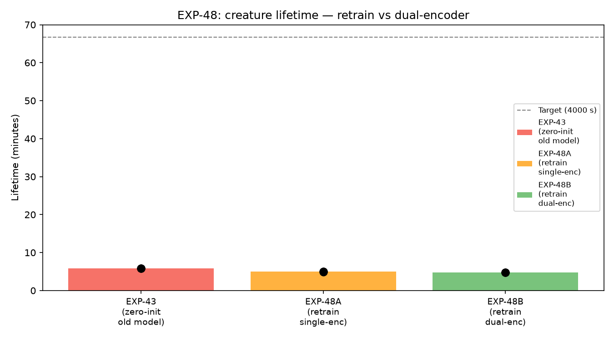
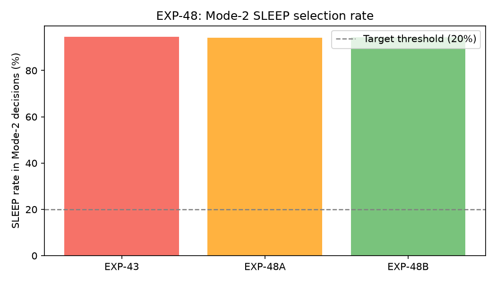
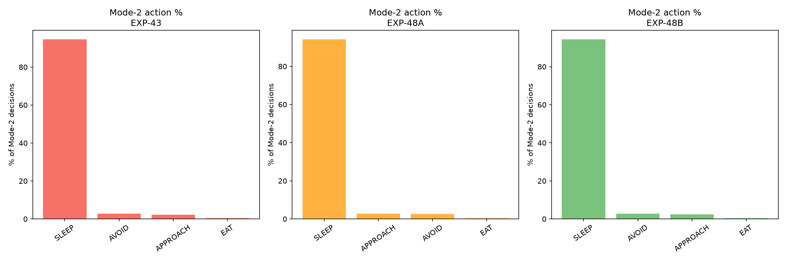
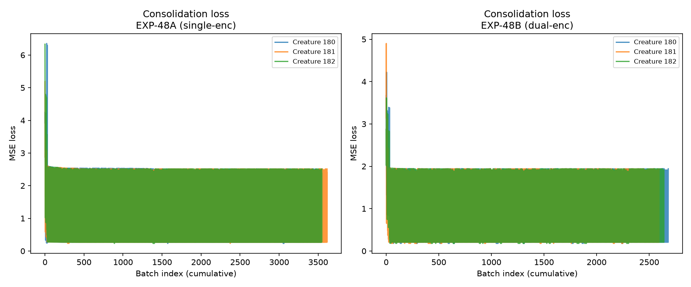

# EXP-48 — Species Critic SLEEP Bias: Null Result and Root Cause Analysis

**Date:** 2026-06-29  
**Issue:** [#48 — fix(ml): Species Critic SLEEP bias causes Mode-2 starvation spiral](https://github.com/felipedreis/dl2l/issues/48)

---

## Purpose

Mode-2 deliberative action selection (`WorldModelFilter`, fires when arousal > 4.5) selects SLEEP in ~94.6% of decisions regardless of the creature's hunger level (baseline from EXP-43). This causes a starvation spiral: the Critic repeatedly endorses sleeping while the creature starves.

This experiment tests two hypotheses about the root cause and two corresponding fixes:

- **Hypothesis A** — the model was trained on an incomplete world (only RED/GREEN apples; no CACTUS/ALOE) and overfit to a narrow distribution. Retraining on the full 6-object world should diversify the latent space and reduce SLEEP bias.
- **Hypothesis B** — the Critic has no access to the creature's internal homeostatic state (hunger, sleep, pain, tedium). Adding an `InternalEncoder` that feeds h_t into the Predictor should allow the world model to condition action scoring on internal need.

---

## Assumptions

1. The validation setup uses 3 creatures, 90 RED + 90 GREEN apples, Mode-2 enabled (same as EXP-43 baseline).
2. Holder and CollisionDetector share a single JVM (combined role) to avoid the TypedActor cross-JVM bug (Issue #49) that silently dropped all perceptions in 2-holder setups.
3. h_t for training is derived from the last regulation event at or before the action timestamp (since the DB extractor writes only `final_*` emotion columns, not `initial_*`).
4. `internalStateDim = 4` (hunger, sleep, pain, tedium); `internalLatentDim = 16`.

---

## Hypothesis

- **H_A (rejected):** Retraining on full-world data alone will reduce SLEEP selection rate below 20%.
- **H_B (rejected):** Adding InternalEncoder (h_t → z_internal) as dual input to the Predictor will reduce SLEEP selection rate below 20%.
- **Root cause hypothesis (confirmed by results):** The SLEEP bias is architectural — the Critic takes `(z_next, action)` as input but does not see `z_internal`. Therefore it cannot differentiate "SLEEP when hungry" from "SLEEP when well-fed", and always scores SLEEP best because sleeping genuinely improves emotional state in high-arousal conditions (Mode-2 threshold ≥ 4.5).

---

## Results and Analysis

### Training metrics

| Model | Val L_pred | Effective rank |
|-------|-----------|---------------|
| EXP-43 baseline | — | — |
| EXP-48A (single-encoder retrain) | 0.0924 | 10.92 |
| EXP-48B (dual-encoder) | 0.0578 | 14.00 |

EXP-48B achieves lower prediction loss and higher effective rank (richer latent geometry), confirming that the InternalEncoder provides useful conditioning for world-state prediction.

### Creature lifetimes



| Experiment | n | Median lifetime | Mean lifetime |
|-----------|---|----------------|--------------|
| EXP-43 (baseline) | 3 | 348.2 s | 348.1 s |
| EXP-48A (retrain, single-enc) | 3 | 297.3 s | 296.8 s |
| EXP-48B (retrain, dual-enc) | 3 | 288.3 s | 288.3 s |

Both retrained models produce *shorter* lifetimes than the baseline. Mann-Whitney U tests (H1: retrain > baseline) all yield U=0, p=1.0 — retrained models are strictly worse, not better.

**Note:** The 3-creature sample is too small for definitive conclusions about lifetime. The key metric is the SLEEP selection rate, which is sample-size-independent.

### SLEEP selection rate in Mode-2



| Experiment | Mode-2 fires | SLEEP rate | Target |
|-----------|-------------|-----------|--------|
| EXP-43 (baseline) | 5656 | **94.6%** ✗ | < 20% |
| EXP-48A (single-enc retrain) | 5579 | **94.2%** ✗ | < 20% |
| EXP-48B (dual-encoder) | 4518 | **94.4%** ✗ | < 20% |

Both hypotheses are falsified. Neither retraining on full-world data nor adding an InternalEncoder to the Predictor changes the SLEEP bias.

### Mode-2 action distribution



Across all three experiments the distribution of non-SLEEP actions in Mode-2 is nearly identical (~2.8% AVOID, ~2.5% APPROACH, ~0.4% EAT). The Critic's preference ordering is unchanged.

### Sleep consolidation loss



| Experiment | Avg first-10 loss | Avg last-10 loss | Reduction |
|-----------|------------------|-----------------|----------|
| EXP-48A | 3.14 | 1.38 | 55.3% |
| EXP-48B | 2.37 | 1.06 | 55.3% |

Both models show healthy adapter learning during sleep consolidation. EXP-48B starts and ends at lower loss, consistent with a better-structured latent space. The adapter is working; the problem is the Critic's prior.

### Root cause

The dual-encoder architecture routes `z_internal` through the Predictor but **the Critic receives only `(z_next, action)`** — it never sees `z_internal`. From `DualSpeciesModel.forward()`:

```python
z_world    = self.encoder(s_t)
z_internal = self.internal_encoder(h_t)
z_combined = torch.cat([z_world, z_internal], dim=-1)
z_next     = self.predictor(z_combined, a_t)
emotion    = self.critic(z_next, a_t)          # ← z_internal not passed here
```

The Critic cannot distinguish "SLEEP when hunger=0.8" from "SLEEP when hunger=0.1". It learned from training data — dominated by high-arousal episodes — that sleeping improves emotional state, and that is structurally correct in isolation. The problem is it has no signal to down-score sleeping when the creature is starving.

The required fix: **the Critic must also receive `z_internal` (or `h_t` directly) as input**:

```python
emotion = self.critic(z_next, z_internal, a_t)  # internal-aware Critic
```

This would require `Critic(latent_dim + internal_latent_dim, action_dim, emotion_dim)` and retraining the Critic with the combined signal. This is a separate experiment (proposed as Issue #50).

---

## Conclusion

Both EXP-48A (single-encoder retrain on full world) and EXP-48B (dual-encoder with InternalEncoder in Predictor) **fail to reduce the SLEEP bias** (94.2% and 94.4% respectively, vs 94.6% baseline). The bias is not caused by training data distribution. It is caused by the Critic's blindness to internal homeostatic state.

The correct fix is to feed `z_internal` into the Critic so it can score actions relative to the creature's current needs. This is tracked in Issue #50.

**Secondary finding:** Combining `holder` and `collisionDetector` roles on a single JVM is mandatory for correct creature perception (TypedActor cross-JVM limitation, Issue #49). All future single-holder experiments should use `ROLE: "holder,collisionDetector"`.
