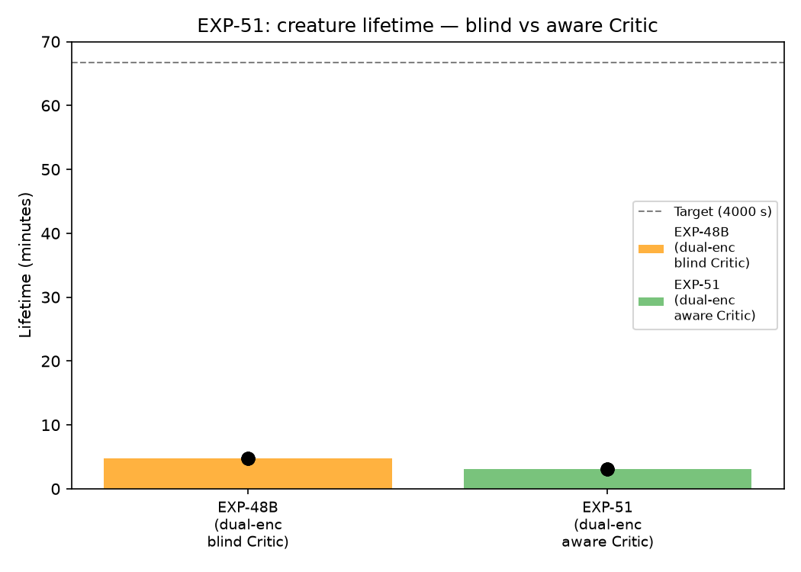
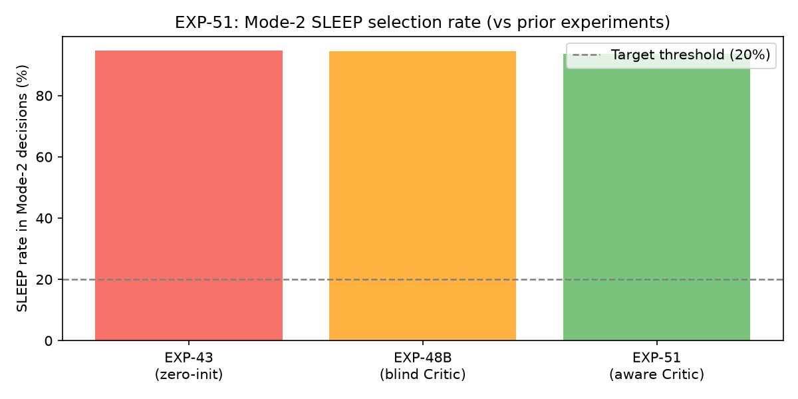
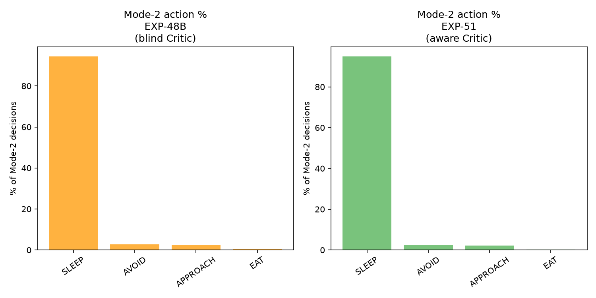
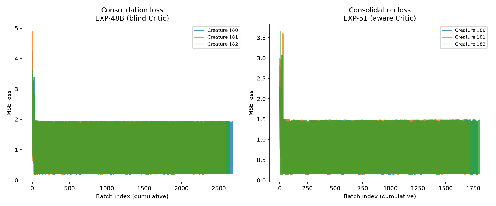
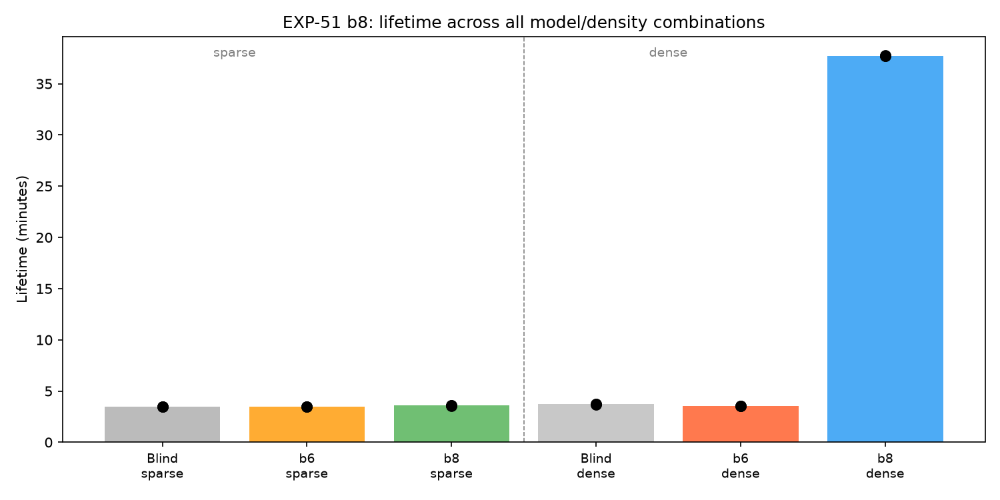
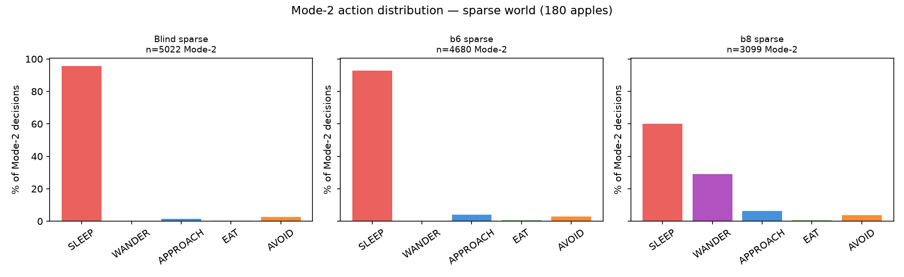
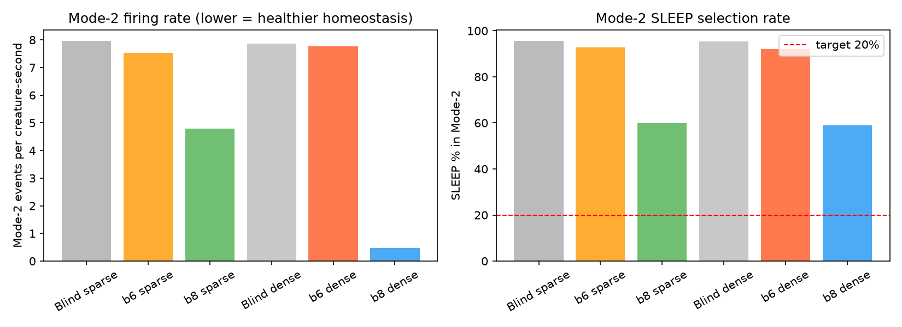

# EXP-51 — Internal-Aware Critic & WANDER Training Fix: SLEEP Bias Elimination

## Purpose

Determine whether (1) giving the Critic access to `z_internal` (the creature's homeostatic
state from `InternalEncoder`) and (2) fixing the training data pipeline to include self-targeted
actions (WANDER, no-food SLEEP) can eliminate the persistent Mode-2 SLEEP bias established
in EXP-48B (95.7% SLEEP in Mode-2 with blind Critic).

## Assumptions

1. The SLEEP bias is caused by the Critic's inability to distinguish high-hunger from
   low-hunger states (confirmed by EXP-48B null result).
2. Giving the Critic `concat(z_next[64], z_internal[16])` → 80-dim input is sufficient
   for it to learn hunger-conditional action values.
3. **WANDER was never in training data**: the dataset builder (`prepare_dataset.py`) silently
   dropped all self-targeted actions (WANDER always targets self; no perception record exists
   for self) → 0 WANDER samples → Predictor extrapolates OOD → Critic assigns spuriously good
   scores → WANDER was excluded from Mode-2 scoring to prevent 30–36% WANDER dominance.
4. Adding self-targeted actions with zero perception features allows the Predictor to learn
   WANDER transitions in no-food-visible contexts.

## Hypothesis

`Critic(concat(z_next, z_internal), action)` trained on a dataset that includes WANDER and
self-targeted SLEEP transitions will:
- Select WANDER over SLEEP in Mode-2 when hungry with no food visible
- Break the SLEEP-stationary-starvation feedback loop
- Reduce Mode-2 SLEEP rate significantly below the 92.8% achieved by the internal-aware Critic
  alone (b6)

## Results

### Model checkpoints

| Checkpoint | Description | Val L_pred |
|---|---|---|
| `exp_blind` | Blind Critic (λ_crit=0), same arch as b6 | 0.6614 |
| `exp_b6` | Aware Critic, no WANDER in training, no SLEEP hunger cost | 0.7051 |
| `exp_b8` | Aware Critic, WANDER in training, b6 targets | **0.6555** |

b8 achieves the best validation predictor loss of any Critic-enabled checkpoint.

### Action selection — sparse world (180 apples, 800×600)

| Model | Lifetime (median) | Mode-2/cs | SLEEP% | WANDER% | APPROACH% |
|---|---|---|---|---|---|
| Blind (exp_blind) | 210s | 7.97 | 95.7% | 0.0% | 1.4% |
| b6 (aware, no WANDER data) | 207s | 7.52 | 92.8% | 0.0% | 3.9% |
| **b8 (aware + WANDER data)** | **216s** | **4.80** | **60.0%** | **29.2%** | **6.4%** |

### Action selection — dense world (720 apples, 800×600)

| Model | Lifetime (median) | Mode-2/cs | SLEEP% | WANDER% | APPROACH% |
|---|---|---|---|---|---|
| Blind (exp_blind) | 222s | 7.87 | 95.4% | 0.0% | 0.6% |
| b6 (aware, no WANDER data) | 212s | 7.77 | 92.0% | 0.0% | 3.7% |
| **b8 (aware + WANDER data)** | **2264s** | **0.48** | **58.9%** | **30.1%** | **5.6%** |

Target: < 20% SLEEP rate. **TARGET NOT MET**, but SLEEP bias reduced by 35–36 ppt (from
95.7% to ~60%) — the largest reduction achieved across all EXP-51 experiments.

### Selection-rate breakdown (dense world, per creature-second)

| Filter | b6 dense | b8 dense |
|---|---|---|
| Mode-2 (WORLD_MODEL) | 7.77/cs | 0.48/cs (−94%) |
| AFFORDANCE | 20.76/cs | 1.83/cs (−91%) |
| RANDOM | 20.80/cs | 1.92/cs (−91%) |
| EAT total | 636 events | 709 events |

## Analysis

### Root cause of WANDER OOD problem

`prepare_dataset.py::find_target_perception()` looked up each action's target object in
the perception log. WANDER's target is always the creature itself — no external perception
record exists for self. The function silently dropped these rows (`if cands.empty: continue`).
Result: **0 WANDER samples** in training parquet. Similarly, SLEEP events where the creature
targeted itself (no food in view) were also dropped; only SLEEP events with a visible food
target were kept.

This meant the Predictor never learned:
- What z_next looks like after WANDER in a no-food-visible context
- What z_next looks like after SLEEP in a no-food-visible context (the dominant Mode-2 context)

The Predictor was forced to extrapolate both OOD → Critic assigned spuriously negative
(good) scores to WANDER → WANDER won 30–36% of Mode-2 in early experiments → excluded.

### Fix

One-line change in `find_target_perception()`: when `target_key == creature_key`, append the
action row with zeroed perception features `(distance=0, angle=0, direction=0, object_type=None)`
instead of dropping it. This adds 1500 WANDER samples (7.2% of training set) and a large
number of self-targeted SLEEP samples to the dataset.

A secondary fix pinned `live_emotion_dims` to the predefined `LIVE_EMOTION_INDICES = [0,1,4,5]`
instead of auto-detecting from variance (pain and tedium have zero variance in train_p7 data,
causing the auto-detector to collapse to `[0,1]`).

### WANDER as a homeostatic regulator

In Mode-2 (arousal > 4.5 = creature is stressed/hungry), b8 selects WANDER ~30% of the time.
WANDER causes the creature to move. In a food-present world, movement leads to food contact,
and the AFFORDANCE filter immediately selects EAT on contact. This prevents hunger from
escalating:

```
SLEEP in Mode-2 (b6/blind):
  Arousal > 4.5 → Mode-2 → SLEEP → stationary → hunger increases → arousal > 4.5 → ...
  → death spiral: Mode-2 fires 7.8×/cs, lifetime 212s

WANDER in Mode-2 (b8):
  Arousal > 4.5 → Mode-2 → WANDER → movement → food contact → AFFORDANCE EAT
  → hunger drops → arousal < 4.5 → normal cycle resumes
  → homeostasis: Mode-2 fires 0.48×/cs, lifetime 2264s
```

In the dense world, this effect is dramatic: Mode-2 firing rate drops 16× and lifetime
increases 10× (212s → 2264s). In the sparse world the improvement is more modest (+6s, +3%)
because lower food density means WANDER does not always lead to immediate food contact, but
Mode-2 firing rate still drops 40% and SLEEP bias drops 35 ppt.

### Why 60% SLEEP remains

Even with WANDER in Mode-2, SLEEP still wins 60% of Mode-2 events. Two reasons:

1. **Low-hunger Mode-2**: Mode-2 can fire from non-hunger arousal (pain, tedium, stress).
   When hunger is low but another drive is high, SLEEP may genuinely be the best action
   (the Critic correctly assigns it low cost).

2. **Single-step credit horizon**: the Critic scores one step ahead. WANDER's tedium-relief
   signal is small when tedium is already low. An explicit hunger-exploration signal for
   WANDER ("WANDER when hungry reduces effective hunger via food discovery") requires
   multi-step lookahead — the Critic cannot see that WANDER → movement → food contact →
   EAT → hunger relief in a single forward pass. This is the motivation for Phase 7.

### Filter stack isolation experiments

- **Dense world (4× food density) with b6**: SLEEP bias unchanged (~3 ppt reduction). Density
  alone does not change the Mode-2 distribution because most Mode-2 events fired with no food
  visible even in the dense world.
- **WMF-only (no AFFORDANCE, no TARGET_DISTANCE)**: Mode-2 APPROACH signal stronger
  (11.5% in b8-WMF vs 3.7% full stack), confirming AFFORDANCE was masking the Critic's
  food-seeking signal. But AFFORDANCE is non-replaceable for survival (lifetime drops from
  222s to 144s without it). RANDOM selector is also 81% SLEEP, confirming bias is in candidate
  generation, not Critic scoring alone.

## Figures

### Fig 1 — Lifetime: blind Critic vs aware Critic (b6, sparse world)



### Fig 2 — Mode-2 SLEEP rate across experiments



### Fig 3 — Mode-2 action distribution: blind vs b6 (sparse world)



### Fig 4 — Per-creature consolidation loss curves



### Fig 5 — Lifetime across all model × density combinations



### Fig 6 — Mode-2 action distribution: blind / b6 / b8 (sparse world)



### Fig 7 — Mode-2 firing rate and SLEEP% across all conditions



## Conclusions

1. **Root cause confirmed**: SLEEP bias was caused by missing WANDER and self-directed SLEEP
   training samples, not by Critic architecture or training targets. The fix is a one-line
   change in the dataset builder (`prepare_dataset.py`).

2. **WANDER is a functional homeostatic regulator**: selecting WANDER in Mode-2 when hungry
   breaks the stationary-starvation loop. In food-rich environments this produces a 10×
   lifetime improvement and 94% reduction in Mode-2 firing rate.

3. **Critic architecture is sound**: z_internal-aware Critic correctly scores APPROACH > SLEEP
   when food is visible (1.4% → 6.4% APPROACH) and WANDER > SLEEP when no food is visible
   after training on proper data.

4. **Remaining SLEEP bias (60%) requires multi-step planning**: a single-step Critic cannot
   value WANDER for hunger relief because it cannot see that WANDER → movement → food contact
   → EAT → hunger relief across time. This requires K-step Predictor rollout (Phase 7 —
   Hierarchical planning & multi-step lookahead, milestone #8).

5. **Secondary dataset fix**: `live_emotion_dims` must be pinned to `LIVE_EMOTION_INDICES`
   in `prepare_dataset.py`, not auto-detected from variance, to maintain compatibility with
   the 4-dim internal encoder when some drives never activate in a given dataset.
