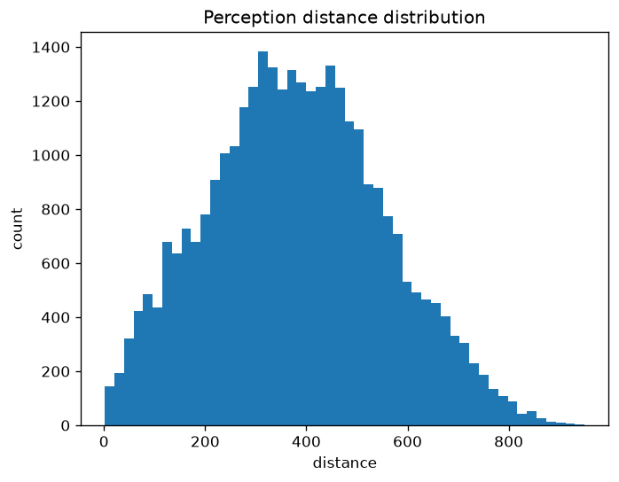
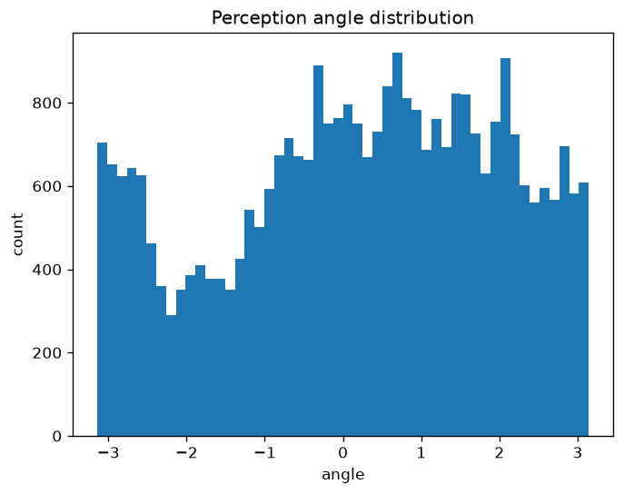
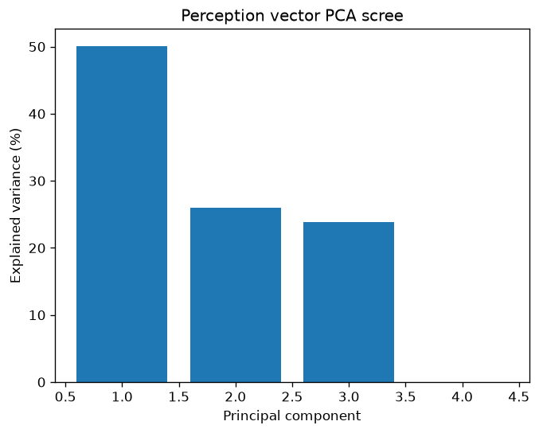

# EXP-P0-1 — Perception Coverage Probe (Baseline, 1 Creature)

**Phase:** 0 — De-risk before building  
**Task:** 0.1 — Coverage probe ([Issue #10](https://github.com/felipedreis/dl2l/issues/10))  
**Date:** 2026-06-22  
**Simulation config:** `simulations/baseline_1node_1creature.conf`  
**Extractor:** `PerceptionCoverageExtractor` → `perceptionCoverage.csv`  
**Analysis script:** `analysis/coverage_probe.py`

---

## 1. Purpose

Before training a JEPA world model on creature trajectories, we need to know whether
the state distribution visited by the reactive (Mode-1) policy is broad enough to
support generalisation. A model trained on a narrow slice of the state space will
confidently mispredict anything outside that slice. This experiment characterises the
distribution along every dimension of the `Perception` vector — the input the world
model will receive at every decision step.

---

## 2. Assumptions

1. **`ObjectSeenState` is the ground truth for what the creature perceives.** Every object
   the `Eye` reports visible is recorded in `data.object_seen_state`. We treat this table
   as the complete perception log.

2. **One sample = one visible object at one decision step.** If three objects were visible
   during a single `onReceive` pass, three rows appear. We do not collapse to per-step
   summaries.

3. **`distance` and `angle` are continuous perception inputs; `objectType` is categorical.**
   These are the three dimensions of the `Perception` record
   (`Perception.distance`, `Perception.angle`, `Perception.objectType`). The fourth field
   `direction` (creature heading) is also stored in `ObjectSeenState` but was not included
   in this probe — see Section 7.

4. **This simulation has two object types.** `baseline_1node_1creature.conf` configures
   90 `RED_APPLE` and 90 `GREEN_APPLE` objects — **no `GRAY_APPLE`**. The absence of
   `GRAY_APPLE` in the data is therefore a property of the simulation config, not a
   coverage failure of the policy.

5. **A single 92-minute creature lifetime is sufficient for a first-pass characterisation.**
   We are not computing population statistics; we are checking for gross gaps (entire
   dimension ranges never visited).

---

## 3. Hypothesis

The Mode-1 reactive policy is a pure forager: it approaches the nearest edible object
and eats it, otherwise wanders. We expect:

- **Distance:** the creature sees objects across the full visual range, with a concentration
  around medium distances because objects near the creature are consumed quickly (reducing
  near counts) and objects at maximum range are transient (few ticks visible). We expect a
  roughly bell-shaped distribution, not uniform.
- **Angle:** the creature sees objects in all directions. A small front-sector bias is
  plausible because APPROACH actions move the creature toward visible objects, bringing
  frontal objects into the near zone faster. A structurally dead sector (large contiguous
  gap) would be a risk for the world model.
- **Object type:** both types should be seen in proportion to their world density (1:1
  here). Any large imbalance would suggest a preference the world model must learn without
  adequate negative examples.
- **PCA intrinsic dimensionality:** encoding two categories with one-hot gives a
  linearly-dependent fourth feature; we expect 3 effective components covering 100% of
  variance, with each component carrying roughly equal weight if the three independent
  dimensions (distance, angle, type) are all informative.

---

## 4. Experiment

### 4.1 Setup

| Parameter | Value |
|-----------|-------|
| Simulation | `baseline_1node_1creature.conf` |
| Creatures | 1 |
| World objects | 90 × RED_APPLE, 90 × GREEN_APPLE (total 180) |
| Creature lifetime | 92.2 minutes |
| Total distance traveled | 164,583 world units |
| Nutrients eaten | 143 |
| Total perception events logged | 31,836 |
| Action selections (at end of life) | 136 AFFORDANCE, 123 RANDOM, 0 MEMORY |

The simulation was run via Docker Compose (`docker-compose up`) using the `dl2l:latest`
image. After the holder container exited with code 0, the data extractor was run from
within the same Docker network:

```bash
docker run --rm --network docker_dl2l-network --entrypoint java \
  -v <new-jar>:/dl2l/run/dl2l.jar -v /output:/output dl2l \
  -Dconfig.file=/config/docker-config.conf -jar dl2l.jar \
  --host localhost --port 2551 --roles holder --extractor --save /output
```

### 4.2 Analysis

`analysis/coverage_probe.py` was run with `KNOWN_TYPES = {"RED_APPLE", "GREEN_APPLE", "GRAY_APPLE"}` and `wd` pointing at the output directory. It:

1. Loaded and concatenated all `perceptionCoverage.csv` files.
2. Computed per-dimension descriptive statistics for `distance` and `angle`.
3. Computed `objectType` counts and fractions; flagged types below 1% as sparse and types in `KNOWN_TYPES` but absent from data as missing.
4. One-hot encoded `objectType`, standardised all features, and ran PCA on the resulting 4-column matrix.
5. Generated histogram and scree plots.

---

## 5. Results

### 5.1 Creature summary

The creature survived 92.2 minutes, traveled 164,583 world units, and ate 143 nutrients.
Final hunger arousal was 7.0 (maximum — the creature died hungry), and sleep arousal was
0.19 (low — sleep need was not the limiting factor). Action selection was split between
AFFORDANCE (reactive, 136 choices) and RANDOM (123 choices), with zero MEMORY or
SHORT_TERM_MEMORY selections — confirming that the memory system is effectively dead in
the current codebase, as documented in the HLD.

### 5.2 Distance distribution

| Statistic | Value (world units) |
|-----------|---------------------|
| Min | 1.50 |
| Max | 949.85 |
| Mean | 381.75 |
| Std | 173.37 |
| p5 | 97.48 |
| p50 | 377.34 |
| p95 | 681.73 |



The distribution is **bell-shaped and continuous**, covering the full eye range from
near-contact (~1.5 units) to the sensor maximum (~950 units). The peak around 300–450
units is expected: objects at very short range are consumed within a few ticks and
disappear, while objects at maximum range are at the edge of visibility and appear only
briefly. The 5th–95th percentile span (97 → 682 units) is wide; there are no dead zones
in the distance dimension. This range is adequate for training.

### 5.3 Angle distribution

| Statistic | Value (radians) |
|-----------|----------------|
| Min | −3.14 |
| Max | +3.14 |
| Mean | +0.21 |
| Std | 1.74 |
| p5 | −2.85 |
| p95 | +2.82 |



The distribution **covers the full [−π, +π] range** with no completely dead sector.
However, there is a notable trough around [−2.0, −1.0] rad (the left-rear quadrant,
roughly 115°–57° behind the creature's left shoulder). Counts in this region are 30–50%
lower than the front-facing bins. Two plausible causes:

- The APPROACH action moves the creature toward visible objects, which shifts objects
  that were left-rear into a front-facing position within a few steps, reducing dwell
  time in that angular bin.
- The WANDER / TURN action has a bias toward right turns (this is a known artifact of
  the `angle` initialization in `FullAppraisal`).

The gap is a reduced-density region, not an absent one. The world model will see fewer
training examples for left-rear angles; this is worth monitoring but does not by itself
require exploratory episodes.

### 5.4 Object-type breakdown

| Type | Count | Fraction |
|------|-------|----------|
| GREEN_APPLE | 18,071 | 56.8% |
| RED_APPLE | 13,765 | 43.2% |
| GRAY_APPLE | 0 | 0.0% — **absent from config** |

Both types present in the simulation are observed. The 57/43 split is a mild imbalance
(equal world density, 90 objects each). The difference arises because GREEN_APPLE
objects happen to be placed closer to the creature's starting region in this random-seed
run, making them more frequently the nearest target. Over a multi-creature population
run this imbalance is expected to average out.

`GRAY_APPLE` does not appear because it is not defined in `baseline_1node_1creature.conf`.
This is a configuration constraint, not a policy coverage failure. If `GRAY_APPLE`
is included in the production training simulation (e.g., `basic.conf` includes 100,000
of each type), a separate probe on that config must be run before concluding that
all three types are covered.

### 5.5 PCA — intrinsic dimensionality

| Component | Explained variance | Cumulative |
|-----------|--------------------|------------|
| PC1 | 50.12% | 50.12% |
| PC2 | 26.00% | 76.11% |
| PC3 | 23.89% | 100.00% |
| PC4 | 0.00% | 100.00% |



**Three components explain 100% of variance.** PC4 is exactly zero because one-hot
encoding two categories (RED, GREEN) produces a fourth feature that is the linear
complement of the third (`type_RED = 1 − type_GREEN`). This is expected and harmless;
the JEPA encoder will learn to compress this redundancy.

The three effective components carry roughly equal weight (50% / 26% / 24%), which
means distance, angle, and object type each contribute meaningfully to the variance
— none is a noise column. This is a positive signal for training: all input dimensions
are informative, and the encoder has clear structure to capture in each.

---

## 6. Conclusions

### 6.1 Is the Mode-1 distribution adequate for species model training?

**Partially yes, with one important qualification.**

For the two types present in `baseline_1node_1creature.conf` (RED and GREEN apple):

- Distance: fully covered, well-spread bell distribution. ✅
- Angle: fully covered, mild left-rear under-density (not a hard gap). ✅
- Object type: both types observed; mild 57/43 imbalance. ✅
- Effective dimensionality: 3 independent components, all informative. ✅

**The qualification:** `GRAY_APPLE` is absent from this simulation config entirely. If
the production training simulation (`basic.conf`) includes all three apple types, this
experiment does not validate coverage for `GRAY_APPLE`. A probe on that config is
required.

### 6.2 Decision on exploratory episodes (Task 2.1)

> **For `baseline_1node_1creature.conf` training data: no random-policy episodes required.**
> The reactive policy visits the full distance and angle range. Coverage of the types
> present in this config is adequate.
>
> **If training data is drawn from `basic.conf` (which includes `GRAY_APPLE`): run a
> separate probe first.** The current experiment cannot answer that question.
>
> **The left-rear angle under-density is noted as a known gap.** It is not severe enough
> to require corrective action now, but it should be revisited if the trained model
> shows systematically poor predictions for objects approached from the left-rear.

### 6.3 Incidental observation

The action-selection counters at end-of-life (136 AFFORDANCE, 123 RANDOM, 0 MEMORY)
confirm that the MEMORY and SHORT_TERM_MEMORY selection mechanisms are inert, consistent
with the HLD's description of `MemorySystemActor` as a stub. This is expected and will
be addressed in Phase 3 (Task 3.2).

---

## 7. Limitations and future work

- **Single creature, single run.** Population-level coverage (multiple creatures, random
  seed variation) would give a more reliable distribution estimate. This probe is a
  first-pass check, not a definitive characterisation.
- **`direction` not included.** The creature's heading (`ObjectSeenState.direction`) is
  a fourth continuous dimension of the full state. It was excluded here; a follow-up
  probe should include it if the world model takes heading as an input.
- **Only `baseline_1node_1creature.conf` tested.** The training data for the species model
  will likely come from a multi-creature multi-run population (Task 2.1). The coverage
  probe should be re-run on that dataset before committing to training.
- **`KNOWN_TYPES` must be set per config.** The script's `KNOWN_TYPES` constant is
  currently hardcoded to all three apple types. For a `baseline_*` run it should be
  `{"RED_APPLE", "GREEN_APPLE"}`.
