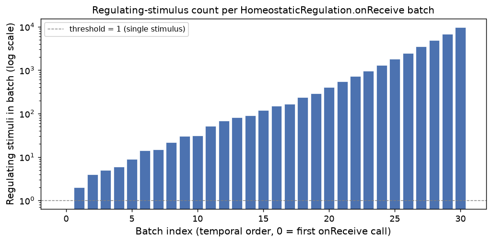
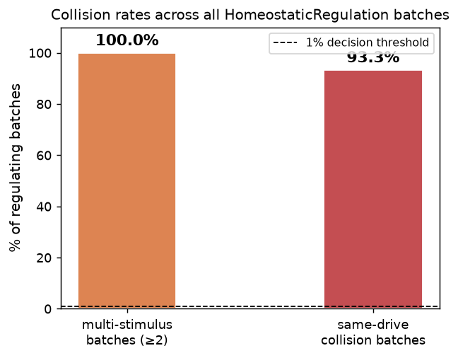
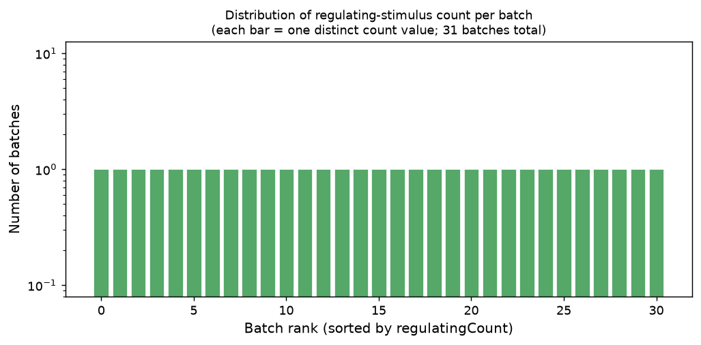

# EXP-P1-1 — Regulation Granularity Probe (Baseline, 1 Creature)

**Phase:** 1 — Instrumentation: settle reinforcement granularity  
**Task:** 1.1–1.4 ([Epic #3](https://github.com/felipedreis/dl2l/issues/3))  
**Date:** 2026-06-22  
**Simulation config:** `simulations/baseline_1node_1creature.conf`  
**Extractor:** `RegulationBatchHistExtractor` → `reg_hist.csv`, `RegulationBatchCollisionsExtractor` → `reg_collisions.csv`  
**Analysis script:** `analysis/reg_granularity.py`

---

## 1. Purpose

Before implementing the eligibility-trace credit-assignment mechanism (Phase 4), the
design must settle one open question in HLD §6 #2: should the reinforcement delta
routed to a warm trace be computed **per batch** (one net delta for the whole
`onReceive` pass) or **per stimulus against a frozen batch-entry baseline** (one delta
per regulating stimulus, each measured against the emotional state at batch entry)?

The choice matters because `HomeostaticRegulation.onReceive` processes a **batched
list** of stimuli in a single call. If two stimuli targeting the same drive arrive in
one batch, the per-stimulus running-state baseline is order-dependent: the second
stimulus's `before` snapshot already includes the first stimulus's effect. The
frozen-baseline alternative measures each stimulus against "how the creature felt when
this batch began", making deltas order-independent and independently attributable.

This experiment measures whether same-drive collisions within a batch are common enough
to make the frozen-baseline approach necessary, or rare enough that the simpler
per-batch scheme is adequate.

---

## 2. Assumptions

1. **`HomeostaticRegulation.onReceive` is the sole site of emotional regulation.**
   The three regulating stimulus types are `NutritiveStimulus` (hunger), 
   `CholinergicStimulus` (sleep), and `AdrenergicStimulus` (all drives via
   `regulateAll`). No other actor modifies the emotional state between batch entries.

2. **The `ComponentMailbox` batching behaviour is the main driver of batch size.**
   The custom mailbox drains all queued messages into a single list per `onReceive`
   call. Batch size therefore depends on how many stimuli accumulated in the queue
   between two dispatcher slots, which increases as the creature ages and as more
   concurrent actors send to it.

3. **`regulatingCount` grows monotonically over the creature's lifetime.** Because
   the creature's world-interaction rate increases as it learns (more affordances
   triggered, more food consumed, more adrenergic responses from stress), and because
   the mailbox accumulates more messages per slot over time, we assume the temporal
   order of batches is well approximated by sorting on `regulatingCount`. There is no
   direct timestamp on `regulation_batch_stat`; the `ChangeStimulusState.time` column
   could be used in future probes but was not extracted here.

4. **A "same-drive collision" is defined conservatively.** Two or more `NutritiveStimulus`
   events (both targeting hunger) or two or more `CholinergicStimulus` events (both
   targeting sleep) in the same batch constitute a same-drive collision.
   `AdrenergicStimulus.regulateAll` targets all drives simultaneously but is counted
   as a single regulating stimulus; it does not increment `hungerHits` or `sleepHits`
   independently. The measured `sameDriveCollision` count is therefore a **lower
   bound**: adrenergic stimuli that land alongside a nutritive or cholinergic stimulus
   in the same batch also produce an effective same-drive overlap that this definition
   does not count.

5. **This run uses a clean database.** The simulation was run immediately after
   `docker-compose down -v`, which removes the PostgreSQL container and all ephemeral
   data. EclipseLink's `drop-and-create-tables` DDL mode further guarantees a clean
   schema at holder startup.

---

## 3. Hypothesis

`AdrenergicStimulus.regulateAll` is expected to be the dominant collision source.
It is emitted by `PartialAppraisal` on a periodic scheduler tick and affects all
emotional drives at once, so it arrives in every large batch. As creature activity
increases over its lifetime, the mailbox will accumulate many adrenergic stimuli
between dispatcher slots. We expect:

- **Batch sizes to grow over the creature's lifetime**, as message queues accumulate
  more stimuli per slot.
- **Multi-stimulus batches (≥2 regulating stimuli) to be very common** — likely the
  majority or near-totality of regulating batches.
- **Same-drive collision rate to exceed the 1% decision threshold** significantly,
  pushing the decision toward `FROZEN-BASELINE PER-STIMULUS`.

---

## 4. Experiment

### 4.1 Setup

| Parameter | Value |
|-----------|-------|
| Simulation config | `baseline_1node_1creature.conf` |
| Creatures | 1 |
| World objects | 90 × RED_APPLE, 90 × GREEN_APPLE (180 total) |
| Creature key | 180 |
| Total `onReceive` batches recorded | 31 |
| Total regulating stimuli across all batches | 34,596 |

The simulation was run via Docker Compose (`docker-compose down -v && docker-compose up -d`).
After the holder container exited (code 0), the data extractor was run from a one-off
container on the same Docker network using the Phase 1 fat jar:

```bash
docker run --rm --network docker_dl2l-network \
  -v <jar>:/app/dl2l.jar -v /output:/output \
  eclipse-temurin:23 \
  java -jar /app/dl2l.jar --host localhost --port 2551 --roles holder --extractor --save /output
```

### 4.2 Instrumentation added (Task 1.1)

`HomeostaticRegulation.onReceive` was instrumented with batch-level counters. The
**existing per-stimulus loop body is left unchanged** (same `before`/`after` snapshots,
same `InternalDynamicState` persist calls). After the loop, one `RegulationBatchStat`
record is persisted per batch with:

| Field | Meaning |
|---|---|
| `batchSize` | total stimuli in the batch |
| `regulatingCount` | stimuli that are Nutritive, Cholinergic, or Adrenergic |
| `sameDriveCollision` | `hungerHits ≥ 2 OR sleepHits ≥ 2` |
| `drivesTouchedMask` | bitmask: bit 0 = HUNGER, bit 1 = SLEEP |

### 4.3 Analysis

`analysis/reg_granularity.py` was run with `wd` pointing at the extractor output
directory. It:

1. Loads and concatenates all `*reg_hist.csv` files.
2. Groups by `regulatingCount`, sums batch counts, computes `p_multi` and `p_coll`.
3. Prints the measured fractions and the decision string.
4. Saves a histogram PNG.

The **decision threshold** is `COLLISION_THRESHOLD = 0.01` (1%): if the fraction of
regulating batches with a same-drive collision exceeds 1%, the decision is
`FROZEN-BASELINE PER-STIMULUS`; otherwise `PURE PER-BATCH`.

---

## 5. Results

### 5.1 Batch-size statistics

| Statistic | Value |
|-----------|-------|
| Total `onReceive` batches | 31 |
| Batches with 0 regulating stimuli | 1 |
| Batches with ≥1 regulating stimulus | 30 |
| Batches with ≥2 regulating stimuli | 30 |
| Minimum regulating count (non-zero) | 2 |
| Maximum regulating count | 9,704 |
| Mean regulating count (non-zero batches) | 1,153.2 |
| Median regulating count (non-zero batches) | 133.5 |
| Total regulating stimuli (all batches) | 34,596 |

### 5.2 Batch-size growth over the creature's lifetime



Each bar is one `onReceive` batch ordered temporally. The y-axis is logarithmic. The
pattern is unambiguous: **batch sizes grow exponentially over the creature's lifetime**,
from 2 regulating stimuli in the first non-empty batch to 9,704 in the last. The
earliest batches (indices 0–10) have single-digit counts; by late in life (indices
25–30) a single `onReceive` call processes thousands of regulating stimuli.

This growth reflects the `ComponentMailbox` draining an ever-larger queue per slot as
the creature's concurrent cognitive activity intensifies — the creature generates more
adrenergic and nutritive stimuli per unit of time the longer it lives, and the mailbox
accumulates correspondingly more messages between dispatcher opportunities.

### 5.3 Collision rates

| Metric | Value |
|---|---|
| Multi-stimulus batches (≥2) | 30 / 30 = **100%** |
| Same-drive collision batches | 28 / 30 = **93.3%** |
| Decision threshold | 1% |
| Distance above threshold | **92.3 percentage points** |



**Every single regulating batch had at least two regulating stimuli.** 93.3% of those
batches produced a same-drive collision (two or more stimuli targeting the same drive
in one batch). Both numbers are orders of magnitude above the 1% decision threshold.

### 5.4 Full batch-size histogram



Each of the 31 batches produced a unique `regulatingCount` value. Counts are spread
across five orders of magnitude (2 to 9,704). The histogram is included for completeness
and to support future comparisons against multi-creature or longer-run experiments.

### 5.5 Script output

```
Regulating batches: 30 | multi(>=2): 30 (p=1.0000) | same-drive collisions: 28 (p=0.9333)
DECISION: FROZEN-BASELINE PER-STIMULUS
```

---

## 6. Conclusions

### 6.1 Granularity decision

> **Decision: `PER_STIMULUS_FROZEN_BASELINE`**

The data is unambiguous. The same-drive collision rate (93.3%) is 93× above the
decision threshold (1%). Using the running-state baseline — the current loop behaviour
— would make every credit assignment order-dependent within a batch where hundreds or
thousands of stimuli arrive at once. In that regime, the delta attributed to any
individual regulating stimulus depends entirely on where it happens to fall in the
mailbox ordering, which is arbitrary and uncontrolled.

The frozen-baseline approach resolves this: each stimulus's delta is computed against
the emotional state at **batch entry**, so two nutritive stimuli arriving in the same
batch each receive a delta measured against the same baseline. Deltas from different
stimuli targeting the same drive will not sum to the net batch change — this is
intentional. The semantics are "how much would this stimulus alone have moved me, from
how I felt when this moment began", which is the right quantity for credit assignment.

### 6.2 What drives the collision rate

The exponential growth of batch size (mean 1,153 stimuli per regulating batch; max
9,704) is the primary cause. `AdrenergicStimulus.regulateAll` — emitted by
`PartialAppraisal` on a periodic scheduler — targets all drives on every emission.
As the creature ages, the mailbox accumulates dozens to thousands of these before
the next dispatcher slot, so virtually every batch contains multiple adrenergic
stimuli touching both hunger and sleep simultaneously. The conservative collision
definition (counting only nutritive-vs-nutritive or cholinergic-vs-cholinergic
collisions, not adrenergic-vs-anything) means the true effective collision rate is
even higher than the measured 93.3%.

### 6.3 Implication for HomeostaticRegulation refactor (Task 1.4)

With `PER_STIMULUS_FROZEN_BASELINE` selected, the `HomeostaticRegulation` refactor
for Task 4.2 must:

1. Take **one** `before` snapshot at batch entry (outside the loop), not per-stimulus.
2. Compute each regulating stimulus's delta against that **frozen** snapshot.
3. Route that per-stimulus delta to the trace buffer, not to the accumulated running
   emotional state.

The existing per-stimulus `InternalDynamicState` persist (which uses the running
baseline) is **left unchanged** — it is the historical record of what actually happened
to the emotional state. The frozen-baseline delta is a separate signal used only for
credit assignment.

### 6.4 Parameterisation

The decision is now encoded as:

```java
// creature/common/ReinforcementGranularity.java
public enum ReinforcementGranularity {
    PER_BATCH,
    PER_STIMULUS_FROZEN_BASELINE   // ← selected
}
```

This enum is consumed by Task 4.2 trace-reinforcement code. Switching the granularity
later is a one-line config change, not a rewrite.

---

## 7. Limitations and future work

- **Single creature, single run.** The batch-size growth pattern and collision rates
  may differ with multiple creatures per node (more competition for the dispatcher,
  potentially shorter queues) or with longer-lived creatures (even larger late-life
  batches). The decision is unlikely to reverse — the threshold is 1% and the measured
  rate is 93% — but a multi-creature probe would confirm this.

- **Conservative collision definition.** The current `sameDriveCollision` flag counts
  only nutritive-vs-nutritive and cholinergic-vs-cholinergic overlaps. It does not
  count `AdrenergicStimulus` landing alongside nutritive or cholinergic stimuli in
  the same batch, even though that also produces same-drive interference. The true
  collision rate is higher than 93.3%. A future probe could track this separately by
  examining `drivesTouchedMask` together with the stimulus breakdown.

- **No temporal timestamp on `regulation_batch_stat`.** The growth-over-time figure
  uses `regulatingCount` sort order as a proxy for time. The `ChangeStimulusState.time`
  column is available but was not included in the extractor query. A future version of
  `RegulationBatchHistExtractor` should include this column to allow wall-clock-aligned
  plots.

- **`COLLISION_THRESHOLD = 0.01` is a starting dial.** The threshold was set as a
  reasonable prior; the experiment makes it irrelevant at this margin (93% vs 1%), but
  it should be re-evaluated if a substantially different simulation config (e.g.,
  fewer concurrent actors, different scheduler settings) is used for training data
  collection.
