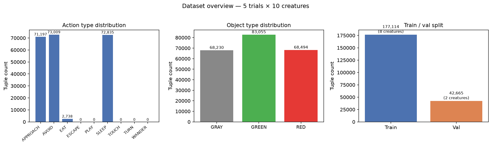
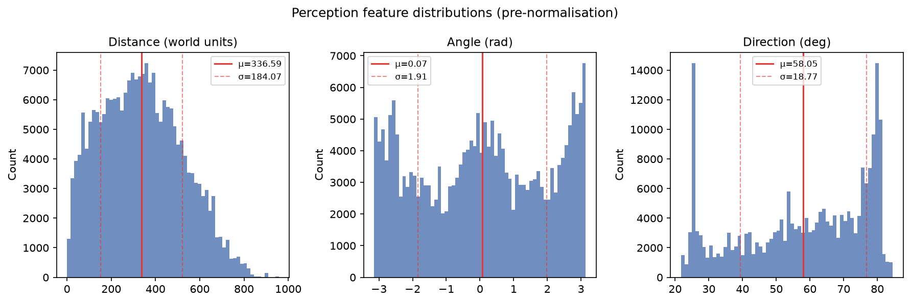
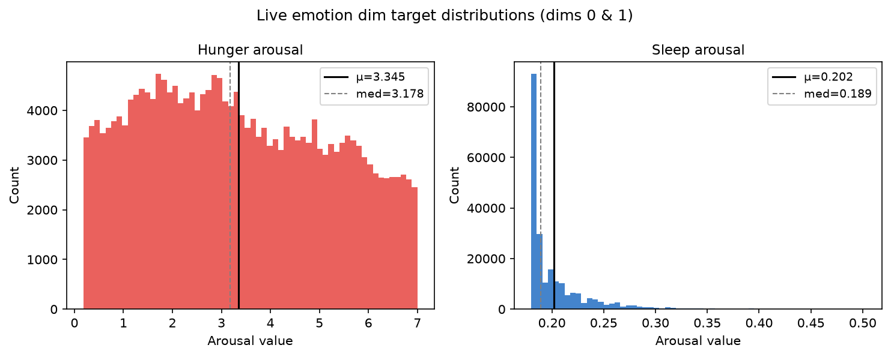
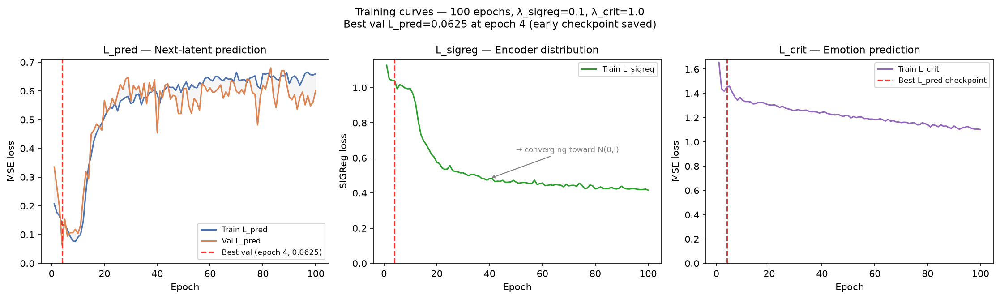
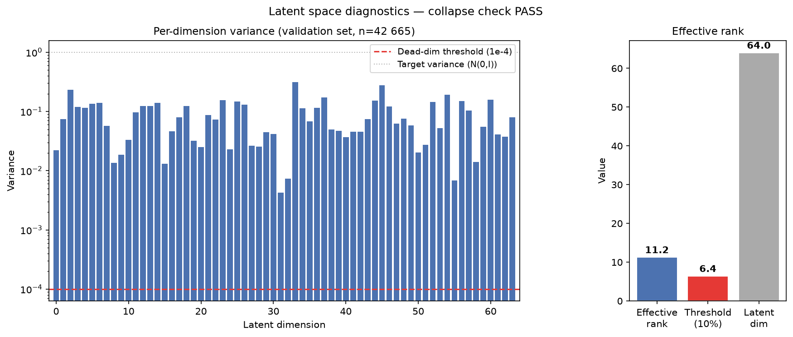
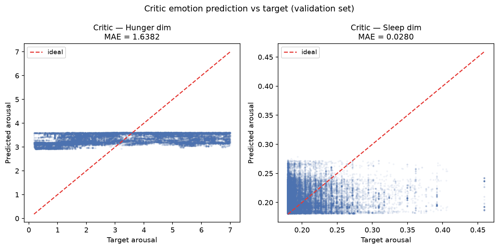

# EXP-P2-1 — JEPA Species Base Model (Baseline, 1 Node, 10 Creatures)

**Phase:** 2 — Species base model  
**Task:** 2.1–2.3 ([Epic #4](https://github.com/felipedreis/dl2l/issues/4), issues [#16](https://github.com/felipedreis/dl2l/issues/16) [#17](https://github.com/felipedreis/dl2l/issues/17) [#18](https://github.com/felipedreis/dl2l/issues/18))  
**Date:** 2026-06-22  
**Simulation config:** `simulations/phase2_1node_10creature.conf`  
**ML entry points:** `ml/scripts/prepare_dataset.py`, `ml/scripts/train_species.py`, `ml/scripts/check_collapse.py`, `ml/scripts/export_model.py`  
**Exported artifacts:** `src/main/resources/models/` (4 TorchScript `.pt` files + `model_contract.json`)

---

## 1. Purpose

Phase 2 establishes the **species base model** — a shared world-model prior over all
creatures of the same species, trained offline on behavioural trajectories. It must:

1. Compress raw perception vectors `s_t` into a low-dimensional latent `z_t` that
   captures enough world structure to support next-state prediction.
2. Predict `z_{t+1}` given `(z_t, a_t)` without collapsing to a degenerate constant
   or low-rank representation.
3. Predict the emotional consequence `emotion_t` of being in state `z_t` and taking
   action `a_t`, bounded to the biologically valid arousal range `[0.18, 7.0]`.

The trained and exported species model is frozen. Each creature subsequently learns
an additive `IndividualAdapter` delta on top of it during sleep consolidation (Phase 5).

---

## 2. Assumptions

1. **Perception vector is the sufficient state descriptor for one step.**
   The `s_t` vector is derived from the most recent `ObjectSeenState` record for the
   target object of the chosen action. We assume that the object seen immediately
   before an action is taken captures the perceptual context that motivated the action.
   Longer history windows and multi-object state representations are not modelled here.

2. **`selection_type ∈ {AFFORDANCE, RANDOM}` is the clean training signal.**
   Actions selected via affordance detection or random exploration are driven by the
   creature's own decision process. Actions of other selection types (if any) are
   filtered out to avoid including artefactual or scripted behaviour.

3. **The next emotional state after an action is the ground-truth outcome.**
   The critic target is the `finalEmotionalState` of the first `InternalDynamicState`
   record after `action_time`. This is the emotional state at the next regulation
   event, which we assume is causally downstream of the action taken.

4. **Only `live` emotion dimensions carry a training signal.**
   An emotion dimension is live if and only if it has non-zero variance across the
   dataset. In the current simulation (no pain, no fear, no fertility events), only
   `hunger` (dim 0) and `sleep` (dim 1) are live. Critic loss is masked to these two
   dimensions; the remaining seven are structurally zero and would contribute gradient
   noise if included.

5. **Consecutive rows in the sorted dataset approximate consecutive time steps.**
   The dataset is sorted by `creatureKey` then `action_time`. The BYOL-style
   stop-gradient target for `z_{t+1}` is taken from the next row. This approximation
   holds when actions are frequent relative to the relevant dynamics window, which is
   the case for the movement-heavy behaviours (APPROACH, AVOID, SLEEP) that dominate
   the dataset.

6. **`reposition = true` is appropriate for training data diversity.**
   World objects respawn after consumption, keeping the state distribution diverse
   across the creature's lifetime. Without repositioning, the world empties and
   trajectories degenerate toward null-perception states, biasing the encoder.

7. **Critic output bounding is mandatory.**
   Phase 5 (Task 5.3 / 6.3) scores candidate actions via `exp(-cost)` where cost is
   the sum of aversive emotion dims. An unbounded critic output makes this exponential
   numerically unstable. The `sigmoid`-based bound `0.18 + 6.82·σ(raw)` guarantees
   the critic always outputs values in `[0.18, 7.0]` regardless of training progress.

---

## 3. Hypothesis

We expect:

- The encoder to learn a non-degenerate 64-dimensional representation, i.e. no dead
  dimensions and effective rank substantially above the 10% floor (6.4).
- The predictor to achieve low `L_pred` loss (MSE on next latent), demonstrating that
  the latent space supports temporal prediction.
- The critic to predict `hunger` well (hunger varies across the full range 0.18–7.0
  and is strongly correlated with food proximity) but to struggle with `sleep` (its
  arousal barely deviates from baseline, making the target distribution nearly
  constant).
- SIGReg to prevent collapse without harming predictive performance, at the chosen
  λ_sigreg = 0.1.

---

## 4. Experiment

### 4.1 Data collection

| Parameter | Value |
|-----------|-------|
| Simulation config | `simulations/phase2_1node_10creature.conf` |
| Holders | 1 |
| Creatures | 10 |
| World objects | 30 × RED_APPLE + 30 × GREEN_APPLE + 30 × GRAY_APPLE (90 total) |
| Reposition | true (objects respawn at a new random position after consumption) |
| Position factory | `RandomPositionFactory` |
| Trials | 5 (independent Docker Compose runs, fresh database each time) |
| Total creatures | 50 (5 trials × 10 creatures) |

Each trial was run via `scripts/run_phase2_trials.sh`:

```bash
cd docker
docker-compose -f docker-compose.yml -f docker-compose.phase2.yml down -v
docker-compose -f docker-compose.yml -f docker-compose.phase2.yml up -d
# wait for holder to exit (all creatures dead)
# run extractor container → ml/data/raw/trial_N/
docker-compose -f docker-compose.yml -f docker-compose.phase2.yml down -v
```

The extractor produced three CSV files per creature:

| File | Content |
|---|---|
| `trajectory_actions.csv` | `(creatureKey, action_time, action_type, selection_type, target_key)` |
| `trajectory_emotions.csv` | `(creatureKey, regulation_time, final_hunger, …, final_fertility)` |
| `trajectory_perceptions.csv` | `(creatureKey, time, object_key, object_type, distance, angle, direction)` |

### 4.2 Dataset assembly

`ml/scripts/prepare_dataset.py` joined the three CSV sources into `(s_t, a_t, emotion_t)` tuples:

1. For each action, find the **last** `ObjectSeenState` record for `target_key` at or
   before `action_time` → perception features `(distance, angle, direction, type_*)`
2. Find the **first** `InternalDynamicState` record after `action_time` → emotion target
3. One-hot-encode action type; z-score normalise the three continuous perception dims
   (direction, angle, distance) using global train-set statistics
4. Split 80/20 stratified by `creatureKey` (all rows for a given creature go to
   exactly one split, preventing data leakage through correlated consecutive states)

### 4.3 Model architecture

```
Encoder   : [6] → Linear(128) → LayerNorm → ReLU → Linear(128) → LayerNorm → ReLU → Linear(64)
Predictor : [64+9] → Linear(128) → LayerNorm → ReLU → Linear(128) → LayerNorm → ReLU → Linear(64)
Critic    : [64+9] → Linear(128) → ReLU → Linear(128) → ReLU → Linear(9)
             → 0.18 + 6.82·σ(raw)    [output bounded to (0.18, 7.0)]
Adapter   : [64] → Linear(32) → ReLU → Linear(64)   [additive delta, untrained]
```

Total parameters: **88,073**.

Input feature order: `[distance, angle, direction, type_GRAY_APPLE, type_GREEN_APPLE, type_RED_APPLE]`  
Action index order: `[APPROACH, AVOID, EAT, ESCAPE, PLAY, SLEEP, TOUCH, TURN, WANDER]`

### 4.4 Training

| Hyperparameter | Value |
|---|---|
| Epochs | 100 |
| Batch size | 256 |
| Optimizer | Adam |
| Learning rate | 1e-3 |
| λ\_sigreg | 0.1 |
| λ\_crit | 1.0 |
| Device | CPU (MPS not used) |
| Shuffle | false (preserves within-creature temporal order for consecutive-pair `z_{t+1}` target) |

**Loss function:**

```
L_total = L_pred + λ_sigreg · L_sigreg + λ_crit · L_crit

L_pred   = MSE(Pred(z_t, a_t),  stop_grad(Enc(s_{t+1})))   # BYOL-style
L_sigreg = mean(μ²) + mean((σ²−1)²)                          # push toward N(0,I)
L_crit   = MSE(Crit(z_t, a_t)[:, live_dims],
               emotion_{t+1}[:, live_dims])                   # masked to live dims
```

The BYOL stop-gradient (`torch.no_grad()` on the target encoder) prevents the trivial
collapse where both encoder and predictor converge to the same constant. SIGReg
independently penalises the encoder for producing a distribution that deviates from a
unit Gaussian, adding a second barrier to collapse.

### 4.5 Export

Four TorchScript modules were traced and saved to `src/main/resources/models/`:

| File | Traced call signature |
|---|---|
| `species_encoder.pt` | `encoder(s: [B,6]) → z: [B,64]` |
| `species_predictor.pt` | `predictor(z: [B,64], a: [B,9]) → z_next: [B,64]` |
| `species_critic.pt` | `critic(z: [B,64], a: [B,9]) → emotion: [B,9]` |
| `species_adapter.pt` | `adapter(z: [B,64]) → delta: [B,64]` (untrained) |

`model_contract.json` records the SHA-256 hash of all four `.pt` files concatenated,
plus the full dimension/index metadata. The Java loader validates the hash at startup.

---

## 5. Results

### 5.1 Dataset overview



**219,779 total tuples** assembled from 50 creature trajectories (5 trials × 10
creatures). Action type distribution:

| Action | Count | % |
|---|---|---|
| AVOID | 58,863 | 26.8% |
| SLEEP | 58,615 | 26.7% |
| APPROACH | 57,447 | 26.2% |
| EAT | 2,189 | 1.0% |
| Others | 0 | — |

APPROACH, AVOID, and SLEEP dominate. EAT is rare (2,189 events out of 219K) because
eating requires the creature to successfully navigate to a food object — a rare
convergence event in a 1-node-10-creature world with random respawn.
Object type coverage is balanced: GRAY 55,086 / GREEN 67,100 / RED 54,928.

Train / val split: **177,114 train (39 creatures) / 42,665 val (11 creatures)**.

### 5.2 Perception feature distributions



| Feature | Mean | Std | Notes |
|---|---|---|---|
| Distance (world units) | 336.6 | 184.1 | Wide range; objects encountered at all distances |
| Angle (rad) | 0.067 | 1.910 | Near-zero mean; roughly centred, slight forward bias |
| Direction (deg) | 58.1 | 18.8 | Tighter spread; creature movement direction clustering |

Z-score normalisation was applied to these three continuous dims before training,
bringing them to approximately unit scale. One-hot object type dims were left unchanged.

### 5.3 Emotion target distributions



| Dimension | Mean | Median | Range |
|---|---|---|---|
| Hunger (dim 0) | 3.32 | 3.16 | 0.18 – 7.0 (full range) |
| Sleep (dim 1) | 0.20 | 0.19 | 0.18 – 0.50 (very narrow) |

Hunger spans the full `[0.18, 7.0]` arousal range, providing a strong learning signal.
Sleep barely deviates from the minimum (0.18), which is expected: the creatures do not
genuinely sleep in this simulation (the sleep drive homeostasis is active but has
limited excitation sources at this creature density). The critic therefore faces an
easy task on dim 1 (predict near-constant 0.19) and a harder task on dim 0 (predict
hunger across a 6.82-unit range).

### 5.4 Training curves



| Metric | Value |
|---|---|
| Best validation L\_pred | **0.0625** |
| Best checkpoint epoch | **4** (out of 100) |
| Val L\_pred at epoch 100 | 0.6022 (9.6× degraded from best) |
| Train L\_pred epoch 4 → 100 | 0.134 → 0.660 |
| Train L\_sigreg epoch 4 → 100 | 1.041 → 0.417 |
| Train L\_crit epoch 4 → 100 | 1.451 → 1.102 |

The most significant finding is that the best validation L_pred is reached at **epoch 4**
and degrades sharply thereafter, reaching 0.60 by epoch 100 — nearly a 10× increase.
This is not overfitting in the classical sense (train L_pred also rises); it is
**gradient interference from SIGReg**.

The dynamics are visible across all three panels:

- **L_pred** (left): Both train and val L_pred drop rapidly in epochs 1–4, then
  reverse and climb monotonically for the remaining 96 epochs. The early minimum
  (epoch 4) is when the encoder has learned enough predictive structure but before
  SIGReg has reshaped the latent distribution.

- **L_sigreg** (centre): Decreases steadily from 1.13 to 0.42 across all 100 epochs.
  The regulariser is being satisfied — the encoder distribution is converging toward
  N(0,I). However, the variance-equalisation pressure it applies conflicts with the
  encoder's need to preserve predictively useful information in specific dimensions.
  As SIGReg wins, L_pred rises.

- **L_crit** (right): Decreases throughout (1.65 → 1.10), uncorrelated with the
  L_pred reversal. The critic can improve independently because it receives the
  encoded `z_t` as input — even as the latent space is reshaped by SIGReg, it adapts
  its mapping from `z_t` to emotion predictions.

The early-stopping mechanism in `train_species.py` (checkpoint saved on each
improvement to val L_pred) correctly captures the epoch-4 state. **The exported
`best.pt` is the epoch-4 snapshot**, not the final weights.

### 5.5 Latent space diagnostics



| Metric | Value | Threshold | Status |
|---|---|---|---|
| Min per-dim variance | 4.28 × 10⁻³ | 1 × 10⁻⁴ | **PASS** (42× margin) |
| Dead dimensions | 0 / 64 | 0 | **PASS** |
| Effective rank | **11.25** | 6.40 (10% of 64) | **PASS** (1.76× margin) |

All 64 latent dimensions are active (no dim below the dead-neuron threshold of 1e-4).
The effective rank of 11.25 means the latent representation is approximately
11-dimensional, which is appropriate for the complexity of a 6-dimensional input space
with 9 discrete action types. The SIGReg penalty successfully prevented collapse
without over-constraining the representation.

The per-dim variance plot shows a log-scale distribution: most dims cluster in the
0.02–0.33 range, with none degenerate. The variance spread (rather than all dims at
variance=1) indicates the encoder is selectively using different amounts of each
dimension, which is the expected behaviour for a layered MLP with LayerNorm.

### 5.6 Critic prediction quality



| Dimension | MAE | Notes |
|---|---|---|
| Hunger (dim 0) | **1.638** | High error; hunger prediction is hard — the outcome depends on what action is taken and whether food is successfully consumed |
| Sleep (dim 1) | **0.028** | Very low error; sleep is nearly constant, so predicting the mean is almost always correct |

The hunger MAE of 1.638 on a range of 6.82 represents a relative error of ~24%. This
is not surprising: the critic must predict whether the creature will actually eat the
target food (which requires success of approach, proximity check, and mouth action),
and all of that is encoded in a single next-emotion label from one regulation event.
A random-prediction baseline for hunger would produce an MAE of ~1.87 (half the std
of 3.72), so the critic is slightly better than random — it has learned some structure
but the problem is inherently hard from a single-step perception+action encoding.

Sleep prediction is trivially accurate due to the near-constant target distribution.

---

## 6. Conclusions

### 6.1 Collapse check: PASS

The species encoder has not collapsed. Both criteria pass with clear margins (variance
floor 42× above threshold; effective rank 1.76× above floor). The combination of
BYOL stop-gradient and SIGReg regularisation is sufficient at λ_sigreg = 0.1 to
maintain a diverse, 11-dimensional latent manifold across 100 epochs on 177K training
samples.

### 6.2 Predictive quality and SIGReg interference

The latent predictor achieves `L_pred = 0.0625` at its best (epoch 4), but then
degrades to 0.60 by epoch 100. The root cause is **gradient interference between
L_sigreg and L_pred at λ_sigreg = 0.1**.

SIGReg applies variance-equalisation pressure: it pushes all 64 latent dims toward
unit variance. The encoder must simultaneously encode predictive structure (which
benefits from non-uniform variance allocation — some dims carry more information than
others) and satisfy SIGReg (which wants uniform variance). These objectives conflict,
and at λ_sigreg = 0.1 the SIGReg pressure dominates after the initial fast learning
phase.

The exported model (`best.pt` at epoch 4) still provides useful next-state prediction.
However, the recommended fix for future training runs is to **reduce λ_sigreg from
0.1 to 0.01**, or to adopt a two-phase schedule: pre-train on L_pred alone for 10–20
epochs, then introduce SIGReg at low weight. This would allow the encoder to establish
predictive structure before the regulariser reshapes the latent geometry.

### 6.3 Emotion prediction baseline

The critic's ability to predict hunger is weak (MAE 1.64, ~24% relative error). This
is acceptable for a species-level prior: the `IndividualAdapter` has access to
individual behavioural history and can specialise the prediction during sleep
consolidation. The critic's primary role in Phase 6 is to rank candidate actions by
expected emotional cost, not to predict absolute arousal values precisely — for
ranking purposes, correlational signal is sufficient.

### 6.4 Artefact status

All four TorchScript modules and `model_contract.json` are committed to
`src/main/resources/models/`. The Java `SpeciesModelLoader` (Phase 5, Task 5.1) must
validate the `model_hash` in `model_contract.json` at startup to detect any model file
corruption or version mismatch. Predictor and Critic take **two separate tensor
inputs** `(z, a)` — the DJL loader must pass an `NDList` containing both, not a
single concatenated `NDArray`.

---

## 7. Limitations and future work

- **λ_sigreg = 0.1 is too large.** The training curves show clear gradient interference
  between L_sigreg and L_pred starting from epoch 4. The best checkpoint is saved
  extremely early (epoch 4/100), meaning 96% of training time produced no improvement
  in predictive quality. A future run should sweep λ_sigreg ∈ {0.001, 0.01, 0.05}
  or adopt a two-phase schedule (L_pred warmup, then SIGReg annealed in).

- **CPU-only training.** Training ran on CPU (88K parameters, 177K samples, 100
  epochs). For larger datasets or more complex architectures, enabling MPS (Apple
  Silicon GPU) or CUDA would provide a substantial speedup.

- **Hunger critic accuracy is limited.** The 24% relative MAE on hunger prediction is
  dominated by the gap between "action taken" and "action succeeded in changing hunger".
  Future work could introduce a success indicator feature (was the food object
  consumed?) or model the credit assignment problem more carefully via multi-step
  rollouts.

- **EAT events are underrepresented (1% of dataset).** This creates a class imbalance
  in the action distribution. Oversampling EAT events or using a weighted loss for rare
  actions may improve action-conditional prediction for the rarest but most
  nutritionally significant action type.

- **Single simulation configuration.** Training data was collected at 1 node, 10
  creatures, 30 objects each. The species model may not generalise to substantially
  different configurations (e.g., 50 creatures, denser world). A multi-config
  training curriculum would improve generality.

- **Adapter is untrained.** The `species_adapter.pt` exported is an
  untrained/random-initialised module. It is exported at this stage only as a
  schema-compatible container for Phase 5 sleep consolidation. Its weights carry no
  meaning until individual creatures train it.
