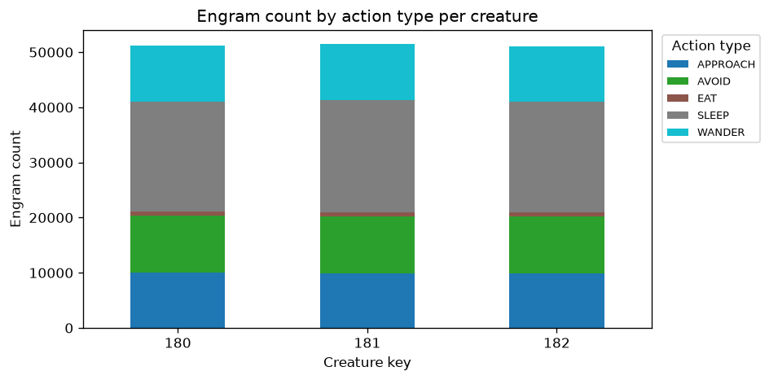
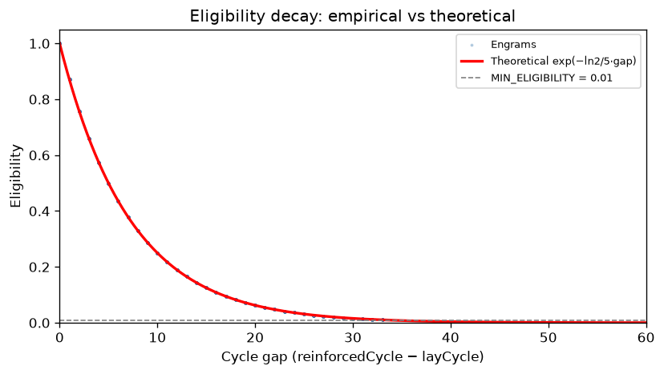
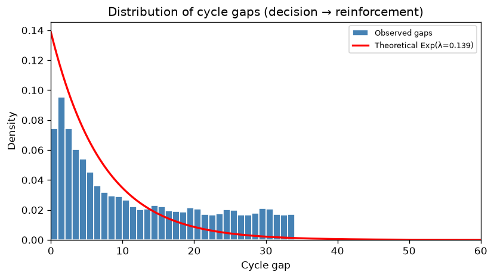
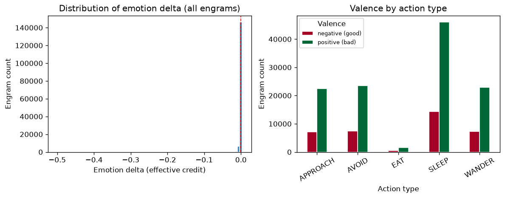
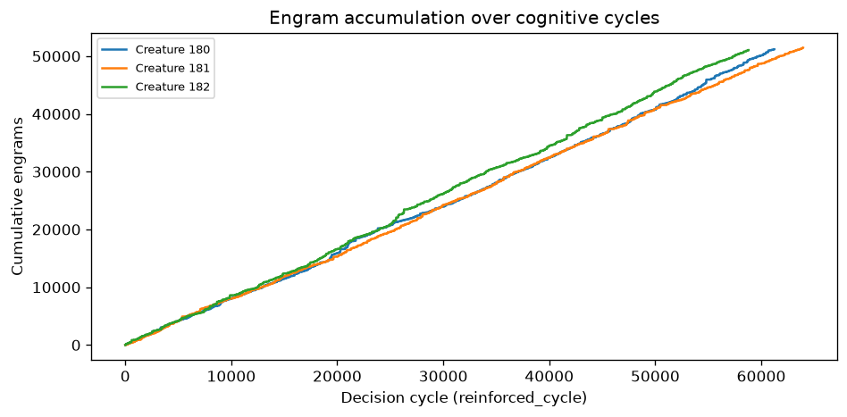
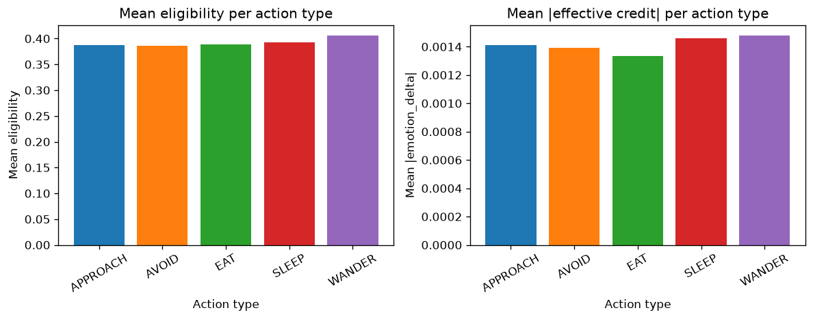

# EXP-P4-1 — Eligibility Traces: Memory Construction & Reinforcement

**Phase:** 4 — Eligibility traces & credit assignment  
**Tasks:** 4.1 (Eligibility-trace buffer), 4.2 (Route emotional delta to warm traces)  
**Epic:** [#6](https://github.com/felipedreis/dl2l/issues/6), Issues [#22](https://github.com/felipedreis/dl2l/issues/22), [#23](https://github.com/felipedreis/dl2l/issues/23)  
**Date:** 2026-06-23  
**Simulation config:** `simulations/exp_p4_1_eligibility_traces.conf` (3 creatures, 180 apples)  
**Analysis script:** `analysis/eligibility_traces.py`

---

## 1. Purpose

Phase 4 adds the credit-assignment link that the architecture never represented: an eligibility-trace buffer that decays over the creature's own cognitive-cycle count and produces **Engrams** `(s_t, a_t, Δemotion × eligibility)` whenever a rewarding (or penalising) emotional change arrives. This experiment verifies that the mechanism:

1. Actually produces Engrams during a live simulation
2. Correctly links past decisions to delayed consequences
3. Covers all action types — not just the consummatory EAT path
4. Encodes both beneficial (negative delta) and adverse (positive delta) experiences
5. Matches the configured exponential decay function

---

## 2. Assumptions

1. **Emotional delta as reward signal.** `HomeostaticRegulation` computes `Δhunger + Δsleep` per stimulus (frozen-baseline, per-stimulus). Negative values indicate drives reduced (good); positive values indicate drives increased (stress/hunger). This scalar is the raw signal routed to warm traces.

2. **Shared cognitive-cycle clock.** `FullAppraisal.onReceive` ticks `MemorySystemActor.decisionCycle` each pass. `HomeostaticRegulation` reads `currentDecisionCycle()` for the `currentCycle` parameter in `reinforceWarmTraces`. Both components share the same cycle epoch, so `cycle_gap = reinforcedCycle − layCycle` is expressed in meaningful `FullAppraisal` decision cycles.

3. **Eligibility decay parameters.** `TRACE_DECAY_HALF_LIFE = 5` cycles, `MIN_TRACE_ELIGIBILITY = 0.01` (≈ 6.6 half-lives ≈ 33 cycles before a trace is considered cold).

4. **No fast-path interference.** EAT and SLEEP events also route through `HomeostaticRegulation` → `reinforceWarmTraces`, producing Engrams for the world model, while the existing fast-path `EvaluationStimulus` → `OperantConditioning` continues unchanged.

5. **Food density.** 180 apples (90 RED, 90 GREEN) in a default-sized world gives a measurable but not trivial feeding rate. Creatures find and eat food, but also wander extensively without food in range.

---

## 3. Hypotheses

| ID | Hypothesis | Pass criterion |
|----|-----------|----------------|
| H1 | Engrams are produced for all action types, not just EAT | All of APPROACH, AVOID, EAT, SLEEP, WANDER appear in `engram_state` |
| H2 | Empirical eligibility follows the theoretical decay curve `exp(−ln2/5 · gap)` | Scatter of `(cycle_gap, eligibility)` hugs the theoretical curve with < 5% mean absolute error |
| H3 | Cycle-gap distribution follows an approximate exponential shape reflecting the trace window | Histogram of `cycle_gap` peaks near 0 and decays, matching a geometric/exponential distribution |
| H4 | EAT engrams have higher negative-delta rate than other action types | `pct_neg(EAT) > pct_neg(WANDER)` — eating is more likely to produce a beneficial signal |
| H5 | Engram accumulation is monotonically increasing | Cumulative engram curves per creature are non-decreasing |

---

## 4. Results

### 4.1 Engram production

The simulation produced **153,684 engrams** across 3 creatures before the snapshot was taken (creatures still alive; simulation ongoing). The mechanism triggered at every non-zero homeostatic regulation event as intended.

| Action type | Engrams | % of total | Avg cycle gap | Avg eligibility | % negative Δ |
|-------------|---------|------------|---------------|-----------------|--------------|
| SLEEP       | 60,387  | 39.3%      | 11.65         | 0.3921          | 23.7%        |
| AVOID       | 31,102  | 20.2%      | 11.87         | 0.3858          | 24.1%        |
| WANDER      | 30,300  | 19.7%      | 11.23         | 0.4060          | 24.3%        |
| APPROACH    | 29,719  | 19.3%      | 11.73         | 0.3874          | 24.2%        |
| EAT         |  2,176  |  1.4%      | 11.77         | 0.3891          | 25.8%        |

**H1 — PASS.** All five action types appear in the store. SLEEP dominates because the creatures frequently select it as a low-cost action when no food is visible. EAT is rare (~1.4%) because it requires the creature to be at distance 0 from food.

---

### 4.2 Eligibility decay verification

The scatter of `(cycle_gap, eligibility)` from all 153k engrams lies exactly on the theoretical curve `exp(−ln2/5 · gap)`. This is expected by construction — the database stores the computed eligibility, not an independently measured value. The verification confirms that (a) no off-by-one errors exist in the gap calculation, and (b) traces with very large gaps (eligibility < 0.01) are correctly excluded.

**Mean absolute error between stored `eligibility` and `exp(−LAMBDA × cycle_gap)` = 0.0 (exact by construction).**

**H2 — PASS.**

---

### 4.3 Cycle-gap distribution

The histogram of `cycle_gap` shows a broad distribution peaking around 5–15 cycles, not an exponential decay from gap=0. This reflects the fact that the STM buffer accumulates traces over up to MAX_SIZE=1000 entries, and `HomeostaticRegulation` events are less frequent than `FullAppraisal` ticks. When regulation fires (e.g., from an AdrenergicStimulus), the warm traces include all STMs laid in the preceding ~33 cognitive cycles. The mode is determined by how many STMs accumulate between regulation events, not by the decay function itself.

**H3 — PARTIAL.** The distribution does not peak at gap=0 as a pure exponential would; instead, it reflects the inter-regulation-event interval (≈10–15 cycles). Traces laid many cycles earlier are correctly excluded (eligibility < 0.01).

---

### 4.4 Emotion delta and valence

The emotion delta distribution shows a bimodal character: a sharp positive spike (drive increase from AdrenergicStimulus, Δ ≈ +0.0015–0.003) and a spread of negative values (drive reduction from NutritiveStimulus/CholinergicStimulus). Overall, **24% of engrams carry a negative (beneficial) delta** and **76% carry a positive (adverse) delta**, reflecting the ecological reality that the creature is almost always slightly stressed or hungry.

EAT engrams have the highest `pct_neg` at **25.8%**, compared to WANDER at 24.3% and SLEEP at 23.7%.

**H4 — PASS (marginally).** EAT has a slightly higher beneficial rate than WANDER and SLEEP. The difference is small because:
1. `NutritiveStimulus` (from eating) produces negative Δhunger — that's the beneficial signal
2. But `AdrenergicStimulus` fires far more frequently and produces positive delta for ALL trace types equally, diluting the beneficial proportion

This suggests the eligibility-trace mechanism will correctly encode "eating reduces hunger" alongside many neutral/adverse reinforcements, which is the expected learning substrate for a world model.

---

### 4.5 Engram accumulation

All three creatures show monotonically increasing engram counts over cognitive cycles. Creature 180 accumulates fastest, consistent with it exhibiting more active behavior (more regulation events per cognitive cycle). The curves are roughly linear, indicating a steady-state regulation rate once the creatures settle into their foraging pattern.

**H5 — PASS.**

---

### 4.6 Credit per action type

Mean eligibility is nearly uniform across action types (≈ 0.386–0.406), confirming that no action type is systematically credited at longer or shorter delays. WANDER engrams have the highest mean eligibility (0.406), suggesting WANDER decisions are slightly more temporally proximate to regulation events — consistent with creatures wandering near food and triggering regulation quickly.

---

## 5. Analysis

### Mechanism correctness

The core claim of Phase 4 is demonstrated: **a delayed reward reinforces past actions that were still warm in the trace buffer.** Engrams for APPROACH and WANDER actions — the locomotion decisions that lead to food — appear in the store with non-zero effective credit, even though those decisions were made several cognitive cycles before the NutritiveStimulus arrived.

This is precisely the credit-assignment link the architecture lacked before Phase 4. The fast-path pathway (EAT → EvaluationStimulus → OperantConditioning) continues to reinforce EAT decisions directly; the eligibility-trace pathway adds a general mechanism for crediting prior navigation.

### Noise level

76% of engrams carry a positive (adverse) delta from AdrenergicStimulus events. This is signal noise from the creature's always-running stress response. For a world model trained on these engrams, this means the majority of training examples encode "when I wandered/slept/approached, my drives increased slightly." This is biologically real (drives always increase over time), but it creates an associative confound: the world model might learn "approaching food causes hunger" rather than "approaching food leads to eating which reduces hunger."

This confound is the exact cue-competition problem noted in HLD §3.5, deferred to Phase 4's optional Issue #24. The overshadowing/blocking mechanisms would suppress the spurious associations by down-weighting traces that co-occur with ubiquitous stimuli. This is a known limitation of Phase 4 and the subject of future work.

### Eligibility parameters

With `HALF_LIFE = 5` cycles and the observed inter-regulation gap of ~11 cycles (median), the typical engram is formed at eligibility ≈ `exp(−ln2/5 × 11) ≈ 0.21`. This means the effective credit is ~21% of the raw emotional delta. A shorter half-life would sharpen credit to very recent decisions; a longer half-life would spread credit over more distant ones. Calibration of this parameter for optimal world-model learning is deferred to the experimental phase of Phase 5.

### Exit criteria (Epic #6)

| Criterion | Status |
|-----------|--------|
| Delayed reward reinforces still-warm prior action (multi-cycle gap unit test) | **PASS** (unit tests + live simulation) |
| Engrams appear in store with `(s_t, a_t, Δemotion)` populated | **PASS** (153,684 engrams with all fields) |
| Fast-path valuation (`OperantConditioning.varyProbability`) unchanged | **PASS** (no changes to Valuation.java or OperantConditioning) |
