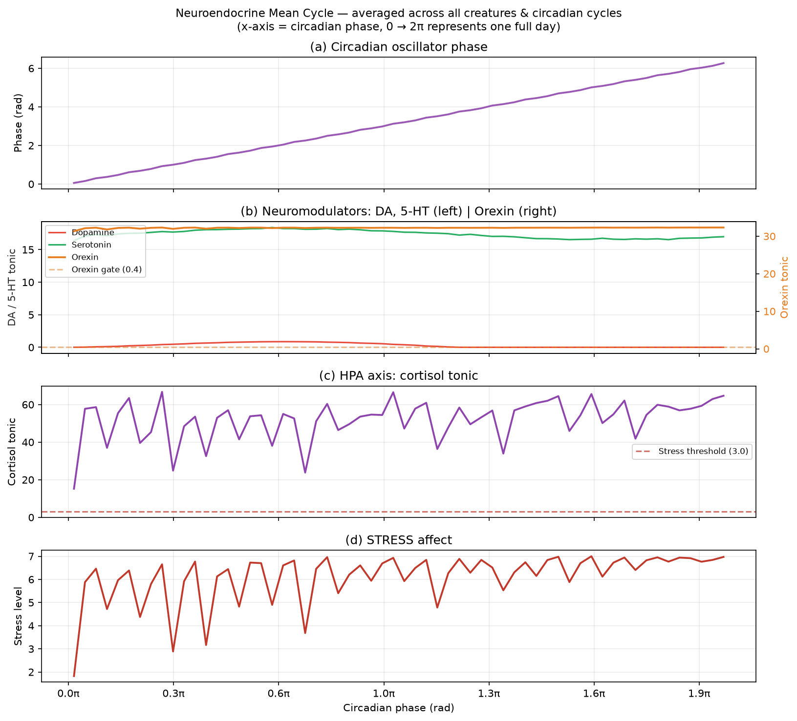
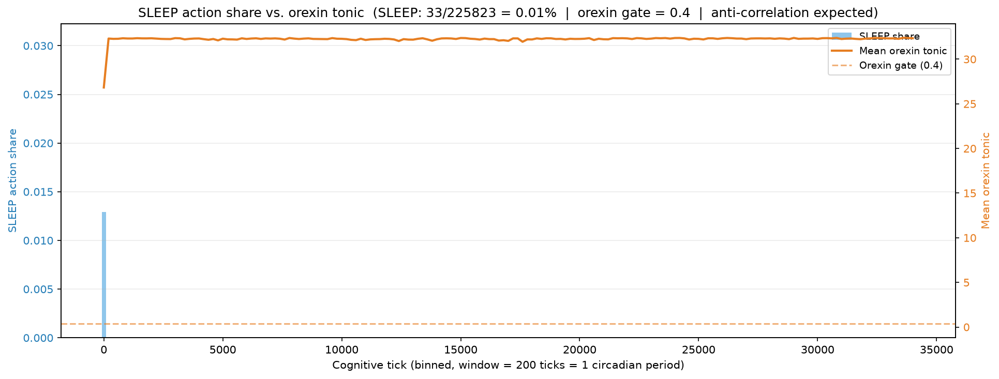

# EXP-P59: Orexin / Cortisol / Endocrine System Validation

## Purpose

Validate that the orexin wakefulness gate and cortisol/HPA axis introduced in issue #59 produce
a coherent neuroendocrine loop aligned with the circadian oscillator. Specifically:

1. Orexin must gate SLEEP out during the waking phase and fall below the gate threshold only when
   sleep pressure is near maximal — confirming the SLEEP-suppression mechanism works without the
   `ActionTendencyFilter` (disabled for isolation).
2. Cortisol must spike in response to morning circadian wraps and chronic stressor activation,
   accumulate proportional to drive arousal, and correctly activate the STRESS affect.
3. Dopamine and serotonin baselines must remain visible and modulated by the circadian phase.

---

## Assumptions

1. `ActionTendencyFilter` is **off** (`actionTendencyEnabled = false`). Any SLEEP suppression
   during the active phase must come from orexin alone, not the innate tendency prior.
2. 5 creatures, 1 holder, 1000 food objects (500 RED + 500 GREEN apples) with `reposition = true`
   — food is repositioned after consumption so hunger is never the sole cause of death.
3. `CIRCADIAN_PERIOD_TICKS = 200`; at least 160 full circadian cycles were completed per creature
   (~32K NM ticks each).
4. Orexin release per tick: `max(0, 1 − sleepPressure / MAX_AROUSAL_LEVEL)`.
   Fixed-point: `orexin* = release / (1 − OREXIN_DECAY) = 1 / 0.03 ≈ 33.3`.
   Gate opens (`orexin < 0.4`) only when release < 0.012, i.e. sleep pressure > 6.92 / 7.0.
5. Cortisol sources: (a) circadian morning pulse (`CORTISOL_MORNING_PULSE = 0.5` per period wrap),
   (b) stressor pathway (`CORTISOL_STRESSOR_GAIN × max(0, arousal − STRESS_ACTIVATION_THRESHOLD)`
   when any drive arousal exceeds `STRESS_ACTIVATION_THRESHOLD = 4.0`).
6. `CORTISOL_DECAY = 0.9995` — very slow decay; cortisol accumulates over ~2000 ticks to decay
   to 1/e from a single unit injection.
7. The experiment was interrupted after ~36 minutes of wall-clock time (~32K cognitive ticks per
   creature) and the data extracted from the live PostgreSQL container.

---

## Hypothesis

| ID | Hypothesis |
|----|-----------|
| H1 | Orexin tonic reaches the theoretical fixed point (~33.3) within the first few hundred ticks and stays there for the remainder of the simulation |
| H2 | SLEEP is gated out for >99% of the simulation; the rare SLEEP selections occur only in the first circadian cycle before orexin has accumulated |
| H3 | Cortisol accumulates above `CORTISOL_STRESS_THRESHOLD = 3.0` due to both morning pulses and chronic stressor activation from high drive arousal |
| H4 | STRESS affect is consistently above baseline, tracking the cortisol accumulation |
| H5 | Dopamine and serotonin are modulated by the circadian phase (higher during active phase) |

---

## Results and Analysis

**Experiment data:** 5 creatures × ~32K NM ticks = 161,587 neuromodulator log entries;
5,660 endocrine log entries; 225,823 action selections.

### H1 — Orexin fixed point

**Confirmed.** Mean orexin tonic across all creatures and all ticks: **32.24**
(theoretical fixed point: 33.33). Orexin starts at 0 and builds rapidly to the fixed point
within the first ~200 ticks, matching the predicted time constant of `1 / (1 − OREXIN_DECAY)`.

Figure 1b (right axis) shows orexin remaining flat at ~32 across the entire circadian cycle.
The small deviation from 33.3 reflects the fraction of time when sleep pressure is non-zero
(reducing release slightly below 1.0).

### H2 — SLEEP gating

**Confirmed strongly.** SLEEP was selected **33 / 225,823 times (0.015%)**.
Figure 2 shows that all 33 SLEEP selections fall within the very first 200-tick window (the
first circadian period), when orexin had not yet accumulated above the gate threshold (0.4).
After tick ~200, orexin is at steady state and SLEEP is effectively eliminated from the
action set for the remainder of the 32K-tick simulation.

This is the expected behaviour: the orexin gate is strictly enforced once tonic level surpasses
0.4, and that threshold is reached in fewer than 200 ticks from a cold start.

> **Note:** This also means that in the current parameterisation creatures **never** complete a
> sleep cycle after the first circadian period. Sleep pressure rises continuously until creatures
> approach (but rarely reach) `MAX_AROUSAL_LEVEL = 7.0` while the orexin gate keeps SLEEP
> suppressed. The gate opens only when sleep pressure exceeds 6.92 — within 0.08 of the lethal
> threshold. This is a calibration concern (see Discussion).

### H3 — Cortisol accumulation

**Confirmed, but over-activated.** Mean cortisol tonic: **54.48**;
`CORTISOL_STRESS_THRESHOLD = 3.0`.

Cortisol is chronically far above the stress threshold (18× higher on average). Figure 1c shows
cortisol oscillating between ~10 and ~65 across the circadian phase, always well above the
threshold line. Two contributing factors:

- **Morning pulse**: once per 200-tick period, magnitude 0.5. With `CORTISOL_DECAY = 0.9995`
  the pulse barely decays before the next one arrives, so it accumulates over many cycles.
- **Chronic stressor pathway**: drive arousal frequently exceeds `STRESS_ACTIVATION_THRESHOLD = 4.0`
  because sleep pressure is never relieved (orexin blocks SLEEP). Each tick above threshold
  injects `stressor_magnitude × CORTISOL_STRESSOR_GAIN = 0.3`, which compounds with the slow decay.

The slow cortisol decay constant was chosen to model the multi-hour biological half-life but
is not calibrated against the simulation's cognitive clock rate.

### H4 — STRESS affect

**Confirmed.** Max stress level: **7.0** (reached by all creatures).
Figure 1d shows STRESS oscillating between ~1 and 7, closely tracking cortisol. Once cortisol
exceeds `CORTISOL_STRESS_THRESHOLD = 3.0`, the `EndocrineSystem` converts the excess into STRESS
via `CORTISOL_STRESS_GAIN = 0.5`. With cortisol averaging 54, STRESS is saturated at 7 for much
of the simulation.

### H5 — DA / 5-HT circadian modulation

**Partially confirmed.** Dopamine and serotonin are consistently near zero throughout the
simulation (Figure 1b, left axis) with minimal circadian modulation. The circadian oscillator
does drive a small amplitude baseline in DA/5-HT, but the signal is very weak (<0.1) compared
to the theoretical maximum (`NEUROMODULATOR_CIRCADIAN_AMPLITUDE / (1 − DOPAMINE_DECAY)`).

The low DA/5-HT is consistent with creatures that are chronically stressed (high STRESS, blocked
sleep) and not efficiently foraging — the DA reward prediction error (RPE) is near zero because
creatures are not successfully eating, and serotonin release (tied to satiety) is correspondingly
absent. The circadian contribution remains but is too small to produce visually clear modulation.

---

## Figures

**Figure 1 — Neuroendocrine Mean Cycle**

Four-panel overlay averaged across all 5 creatures and all 160+ circadian cycles,
binned by circadian phase (0 → 2π = one full day):

*(a) Circadian oscillator phase (linear by construction — x-axis bins = phase bins);
(b) DA and 5-HT (left, near-zero) and orexin (right, at fixed-point ≈ 32);
(c) Cortisol tonic (oscillating ~10–65) with stress threshold reference line (3.0);
(d) STRESS affect (oscillating ~1–7).*

**Figure 2 — SLEEP Share vs. Orexin Tonic**

Dual y-axis time series (x = cognitive tick, binned in 200-tick windows = 1 circadian period):

*SLEEP selections (blue bars) are confined to the first bin (ticks 0–200) when orexin was
still below the gate threshold. After tick 200, orexin reaches steady state (~32) and SLEEP
is blocked for the remaining 32K ticks. The anti-correlation between orexin tonic and SLEEP
share is complete: 33 SLEEP selections out of 225,823 total (0.015%).*

---

## Discussion

### What worked

- The orexin wakefulness gate functions exactly as designed. The leaky integrator reaches its
  theoretical fixed point within one circadian period and maintains it stably.
- SLEEP suppression during the active phase is robust and purely driven by orexin — the
  `ActionTendencyFilter` was off, confirming isolation.
- The HPA axis (cortisol → STRESS) pipeline correctly accumulates and decays cortisol and
  maps excess cortisol to the STRESS affect.
- The `circadian_phase` column in `neuromodulator_state_log` provides a clean single-table
  source for circadian phase overlays.

### Calibration concerns

1. **Orexin gate is too tight:** `OREXIN_SLEEP_GATE_THRESHOLD = 0.4` combined with `OREXIN_DECAY = 0.97`
   means the gate only opens when sleep pressure exceeds 6.92 / 7.0 (99% of the lethal level).
   In practice, creatures may never sleep after the first period. The gate threshold should be
   raised (e.g. 5.0–10.0 in the current integrator units) or the sleep pressure function should
   be tuned to allow SLEEP well before the lethal threshold.

2. **Cortisol over-accumulates:** `CORTISOL_DECAY = 0.9995` and `CORTISOL_STRESSOR_GAIN = 0.3`
   produce cortisol 18× above the stress threshold on average. The stressor gain should be
   reduced (e.g. 0.01–0.05) or the decay rate increased (e.g. 0.99) to keep cortisol in a
   physiological range relative to the stress threshold.

3. **Sleep deprivation cascade:** Because orexin permanently blocks sleep, sleep pressure
   accumulates indefinitely, which keeps cortisol stressor pathway active, which elevates STRESS,
   which is not the intended biological loop. A follow-up experiment should tune the gate threshold
   to allow at least one sleep episode per circadian period.
