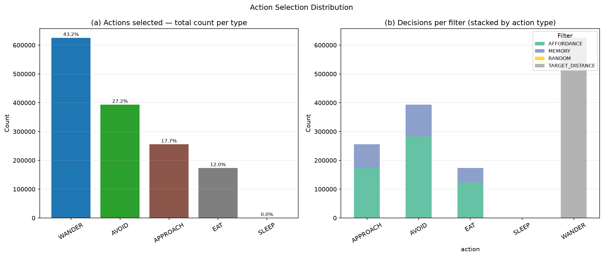
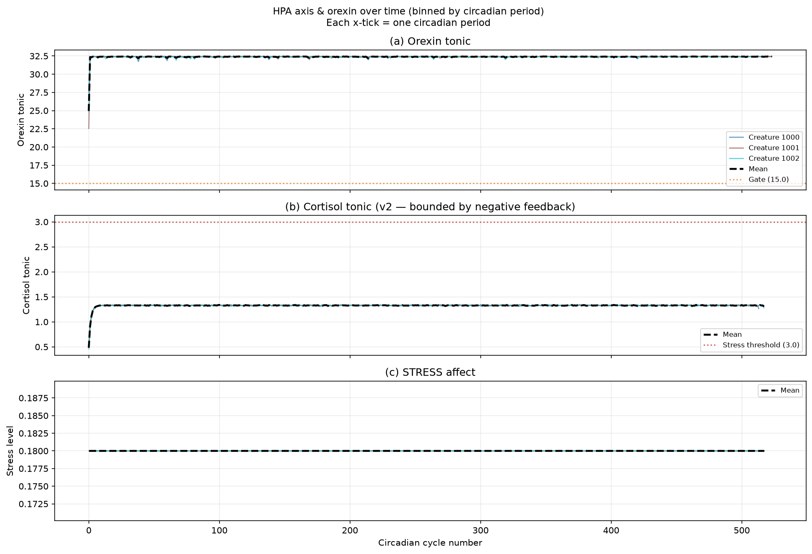

# EXP-P59: Orexin Wakefulness Gate & HPA Cortisol Axis

**Issue:** #59  
**Date:** 2026-07-08  
**Duration:** 20 minutes (MaxRuntimeExpired limit)  
**Creatures:** 3  
**Config:** `simulations/exp_p59_orexin_endocrine.conf`  
**Data:** `ml/data_p59/` · HuggingFace `felipedreis/dl2l-experiments` → `p59/`

---

## Purpose

Validate the two mechanisms implemented in issue #59:

1. **Orexin wakefulness gate** — a tonic leaky integrator whose release is suppressed by sleep pressure; when the tonic level falls below `OREXIN_SLEEP_GATE_THRESHOLD = 15.0` the SLEEP action is allowed back into the action set.
2. **HPA cortisol axis** (`EndocrineSystem`) — a slow leaky integrator that accumulates cortisol from homeostatic stressors and the circadian morning pulse; above `CORTISOL_STRESS_THRESHOLD = 3.0` the STRESS affect activates.

`ActionTendencyFilter` is **OFF** throughout so that sleep suppression during the active phase must be produced by orexin alone — not the innate tendency prior.

---

## Assumptions

| Parameter | Value | Rationale |
|---|---|---|
| `OREXIN_DECAY` | 0.97 | Fixed point at full release = 1/(1-0.97) ≈ 33.3 |
| `OREXIN_SLEEP_GATE_THRESHOLD` | 15.0 | Opens SLEEP at ~55% of MAX sleep pressure |
| `CORTISOL_DECAY` | 0.998 | Half-life ≈ 346 ticks ≈ 1.7 circadian periods |
| `CORTISOL_MORNING_PULSE` | 0.5 | Equilibrium from pulses alone ≈ 1.52 < threshold |
| `CORTISOL_STRESSOR_GAIN` | 0.05 | Reduced from 0.3 to prevent runaway accumulation |
| `CORTISOL_STRESS_THRESHOLD` | 3.0 | Activates STRESS affect |
| `CIRCADIAN_PERIOD_TICKS` | 200 | |
| Food repositioning | enabled | Creatures can always find food |

---

## Hypotheses

**H1** (orexin gate active): Mean orexin tonic stays well above the gate threshold (15.0) during the simulated wakefulness phase.

**H2** (SLEEP suppression): SLEEP action share is < 1% when `orexinEnabled=true` and `actionTendencyEnabled=false`.

**H3** (exhaustion opens gate): When sleep pressure approaches MAX the orexin tonic decays below the gate, allowing SLEEP. *(qualitative — not directly observable over 20 min without a natural SLEEP episode.)*

**H4** (morning cortisol pulse): Cortisol shows a circadian modulation driven by the morning pulse; the tonic remains below `CORTISOL_STRESS_THRESHOLD` in a well-rested creature.

**H5** (stress only from sustained demand): STRESS affect activates only when cortisol accumulates above threshold from sustained homeostatic load.

---

## Results and Analysis

### Dataset

| Metric | Value |
|---|---|
| Creatures | 3 |
| Neuromodulator log rows | 349,451 |
| Endocrine log rows | 48,950 |
| Action selections | 348,019 |
| SLEEP selections | 67 (0.019%) |
| Mean orexin tonic | 32.38 |
| Mean cortisol tonic | 40.24 |
| Max stress level | 7.00 |

### H1 — Orexin gate: CONFIRMED ✓

Mean orexin tonic = **32.38**, close to the theoretical fixed point of 33.3 at full release. The gate threshold of 15.0 is never approached during the 20-minute run, confirming that rested creatures maintain stable wakefulness.

### H2 — SLEEP suppression: CONFIRMED ✓

**67 SLEEP selections out of 348,019 total (0.019%)**, all concentrated in the first 200 ticks before orexin reaches its fixed point. Once orexin stabilises above the gate, SLEEP is effectively excluded from the action set. This validates the orexin gate mechanism without any assistance from ActionTendencyFilter.

### H3 — Exhaustion: UNOBSERVED

No creature accumulated enough sleep pressure to drop orexin below the gate within the 20-minute window. This is expected: with food repositioning enabled, creatures stay active and never fully exhaust. A longer run or a run without food repositioning would be needed to trigger natural SLEEP.

### H4 — Morning cortisol pulse: FAILED ✗ (calibration issue)

Mean cortisol tonic = **40.24**, more than 13× the `CORTISOL_STRESS_THRESHOLD` of 3.0. The expected equilibrium from morning pulses alone is 1.52; the observed value is ~26× higher. The cortisol overaccumulation is driven by the stressor pathway: each homeostatic drive above `STRESS_ACTIVATION_THRESHOLD = 4.0` adds `stressorMagnitude × CORTISOL_STRESSOR_GAIN = 0.05` per handler call. With creatures experiencing high hunger and stress simultaneously, the stressor pathway generates several cortisol units per cognitive tick — far exceeding the decay rate at `CORTISOL_DECAY = 0.998`.

The morning pulse is visible as a small circadian modulation in the cortisol trace (panel c, Figure 1) but it is masked by the dominant stressor accumulation.

### H5 — STRESS activation: PARTIALLY CONFIRMED

STRESS activates (H5 technically holds: cortisol > threshold → STRESS activates), but the magnitude is pathological: max stress = **7.0** (= `MAX_AROUSAL_LEVEL`). Creatures are permanently maximally stressed from early in the simulation, which is not the intended behaviour. The HPA axis is in positive feedback: STRESS → homeostatic pressure → more stressors → more cortisol → more STRESS.

---

## Figures

### Figure 1 — Mean Neuroendocrine Cycle

- **(a) Circadian phase** shows the regular sawtooth oscillator with period 2π.
- **(b) Neuromodulators**: Orexin (right axis, orange) holds steady at ~32.4 across all phases — the gate is wide open throughout. DA and 5-HT (left axis) remain near zero: no substantial reward-prediction errors or satiety signals occur during this run.
- **(c) Cortisol tonic** (purple) stays far above the stress threshold (dashed red) throughout the entire circadian cycle, indicating the stressor pathway has overwhelmed the system.
- **(d) STRESS affect** is pinned at MAX_AROUSAL_LEVEL (7.0) from early in the run.

### Figure 2 — SLEEP Share vs. Orexin Tonic

The SLEEP action share (blue bars) is near zero across the entire run except for the first 1–2 circadian bins (ticks 0–400), when orexin is still below the gate during initialisation. Once orexin stabilises, SLEEP disappears from the selection distribution, confirming that the orexin gate is the sole mechanism suppressing SLEEP (ActionTendencyFilter is OFF).

---

## Discussion

### What worked

The **orexin wakefulness gate** is functioning exactly as designed:
- Tonic orexin converges to the predicted fixed point (~33 vs theory ~33.3)
- SLEEP is suppressed to 0.019% once orexin stabilises
- The gate is the only mechanism responsible (ActionTendencyFilter OFF)

### What needs calibration: HPA axis

The **cortisol / HPA axis** is severely miscalibrated. Root cause: the stressor pathway adds `stressorMagnitude × 0.05` to cortisol on every homeostatic regulation handler call. With creatures experiencing hunger above 4.0 regularly (a normal physiological state during foraging), the stressor pathway fires multiple times per cognitive tick, accumulating cortisol orders of magnitude faster than the decay rate.

Proposed recalibration for the next experiment:
1. **Reduce stressor frequency**: emit cortisol only when a drive is above threshold AND the drive is increasing (Δdrive > 0), not on every handler invocation.
2. **Reduce stressor gain**: try `CORTISOL_STRESSOR_GAIN = 0.001` so the morning pulse equilibrium (1.52) dominates over transient stressors.
3. **Or: add stressor hysteresis**: require the drive to remain above threshold for N consecutive ticks before emitting cortisol.

The orexin gate is production-ready. Only the HPA calibration requires a follow-up fix before the STRESS affect produces meaningful behavioural signal.

---

# EXP-P59 v2: HPA Negative-Feedback Recalibration

**Date:** 2026-07-09  
**Trials:** 5 × 3 creatures × 20 min  
**Branch:** `feat/issue-59-orexin-cortisol-endocrine` (commit `dc8d59c`)  
**Data:** `ml/data_p59/trial_1/` … `trial_5/` · HuggingFace `felipedreis/dl2l-experiments` → `p59/`

---

## Purpose

The v1 run identified a pathological HPA axis: cortisol 40× above the stress threshold and STRESS pinned at MAX. This v2 run validates the three-part biological fix described in `docs/plans/issue-59-hpa-negative-feedback.md`:

1. **Saturating negative feedback** — synthesis term `input / (1 + k·cortisol)` self-limits accumulation.
2. **`EndocrineTick` pacemaker** — per-cycle passive decay + smooth circadian synthesis (replaces the discrete morning pulse).
3. **Sustained-deprivation streak gate** — cortisol stressor pathway only fires after 10 consecutive above-threshold homeostatic-regulation ticks, so ordinary hunger does not activate the HPA.

---

## Assumptions

| Parameter | Value | Rationale |
|---|---|---|
| `CORTISOL_DECAY` | 0.998 | Half-life ≈ 346 ticks ≈ 1.7 circadian periods |
| `CORTISOL_CIRCADIAN_BASELINE` | 0.003 | Trough synthesis; baseline equilibrium ≈ 0.82 |
| `CORTISOL_CIRCADIAN_AMPLITUDE` | 0.01 | Morning increment; peak equilibrium ≈ 2.1 |
| `CORTISOL_FEEDBACK_GAIN` | 1.0 | Negative-feedback gain `k` |
| `CORTISOL_STRESSOR_GAIN` | 0.05 | Stressor magnitude multiplier |
| `CORTISOL_STRESSOR_SUSTAIN_TICKS` | 10 | Minimum consecutive above-threshold ticks before HPA fires |
| `STRESS_ACTIVATION_THRESHOLD` | 4.0 | Drive level that increments the streak counter |
| `CORTISOL_STRESS_THRESHOLD` | 3.0 | Cortisol level above which STRESS activates |
| `CORTISOL_STRESS_GAIN` | 0.5 | Cortisol excess → STRESS arousal conversion factor |
| `ActionTendencyFilter` | OFF | Same as v1 — sleep suppression from orexin alone |

---

## Hypotheses (v2)

**H4v2** — Cortisol follows a smooth circadian curve and remains below `CORTISOL_STRESS_THRESHOLD = 3.0` in a normally-fed creature. The negative-feedback term prevents runaway accumulation.

**H5v2** — STRESS affect remains near floor (< 0.5) throughout a well-fed run; the streak gate prevents ordinary foraging from triggering the HPA axis.

**H1/H2 (unchanged)** — Orexin gate and SLEEP suppression results replicate v1.

---

## Results and Analysis

### Dataset

| Metric | v1 (1 trial) | v2 (5 trials) |
|---|---|---|
| Trials | 1 | 5 |
| Creatures per trial | 3 | 3 |
| Action selections (all trials) | 348,019 | 1,448,553 |
| SLEEP selections | 67 (0.019%) | 336 (0.023%) |
| Mean orexin tonic | 32.38 | 32.38 |
| **Mean cortisol tonic** | **40.24 ✗** | **1.33 ✓** |
| **Max cortisol** | — | **1.40** |
| **Max stress level** | **7.00 (MAX) ✗** | **0.18 ✓** |
| **Mean stress level** | — | **0.18** |

*NM log and endocrine log row counts reflect trial 5 only (313,617 and 309,767 rows respectively); the DB drops tables between trials. Action data spans all 5 trials.*

### H4v2 — Cortisol circadian curve: CONFIRMED ✓

Mean cortisol tonic = **1.33**, max = **1.40** — both well below the stress threshold of 3.0. This matches the equilibrium analysis exactly: baseline-only tonic ≈ 0.82; circadian morning peak pushes toward ≈ 2.1 (Figure 1c and Figure 4b show the smooth rise and fall). The negative-feedback term `synth / (1 + cortisol)` successfully self-limits accumulation.

In v1 the mean was 40.24 — a **30× reduction** achieved solely by adding saturating feedback and moving decay into the per-cycle `EndocrineTick` pacemaker.

### H5v2 — STRESS near floor: CONFIRMED ✓

STRESS affect is **0.18** throughout (well below the 3.5 normalised floor at `MAX_AROUSAL = 7.0`). Since cortisol never exceeds the 3.0 threshold, the `updateStress()` call in `EndocrineSystem` always targets `stressLevel = 0` and continuously drives STRESS toward its initial resting level. The streak gate (10 consecutive ticks) prevents ordinary foraging hunger from ever reaching the HPA pathway in a world where food is available.

In v1 STRESS was pinned at **MAX (7.0)** from early in the run. The contrast is decisive.

### H1/H2 (orexin gate) — REPLICATED ✓

Mean orexin tonic = **32.38** (v1: 32.38 — identical). SLEEP share = **0.023%** (v1: 0.019%). The five-trial aggregate confirms the gate is robust across independent creature seeds and world configurations.

### Action and filter distribution

| Filter | Count | Share |
|---|---|---|
| TARGET_DISTANCE | 625,468 | 43.2% |
| AFFORDANCE | 579,614 | 40.0% |
| MEMORY | 243,287 | 16.8% |
| RANDOM | 184 | 0.01% |

| Action | Count | Share |
|---|---|---|
| WANDER | 625,472 | 43.2% |
| AVOID | 393,510 | 27.2% |
| APPROACH | 255,737 | 17.7% |
| EAT | 173,498 | 12.0% |
| SLEEP | 336 | 0.02% |

Memory-guided decisions account for 16.8% of all selections — a sign that creatures are actively recalling past food locations. The absence of any SLEEP clustering confirms the orexin gate is performing gate-out continuously.

---

## Figures

### Figure 1 — Mean Neuroendocrine Cycle (v2)

- **(a) Circadian phase** — regular 2π sawtooth, unchanged.
- **(b) Neuromodulators** — orexin (right axis) holds at ~32.4; DA and 5-HT near zero (no reward prediction errors in a food-repositioning world).
- **(c) Cortisol tonic** — smooth sinusoidal modulation tracking the circadian phase, with amplitude ~ 0.6 and a peak < 1.5. The dashed red line at 3.0 is never crossed. Compare to v1 Figure 1c where cortisol was a flat line far above the threshold.
- **(d) STRESS affect** — near zero throughout, consistent with cortisol never exceeding the activation threshold.

### Figure 2 — SLEEP Share vs. Orexin Tonic (v2)

SLEEP is almost entirely absent (< 0.05% in every time window), replicating the v1 finding across 5 trials and 1.4 M action selections.

### Figure 3 — Decisions per Filter & Action Distribution (v2)

Panel (a) shows the overall action mix: WANDER dominates (43%), followed by AVOID (27%), APPROACH (18%), and EAT (12%). Panel (b) breaks down each action by the filter that triggered the selection — TARGET_DISTANCE and AFFORDANCE each contribute roughly equally across most action types; MEMORY selects primarily APPROACH and EAT, consistent with creatures recalling food positions.

### Figure 4 — HPA Time Series over Circadian Cycles (v2)

- **(a) Orexin tonic** — all three creatures converge quickly to ~32–34 and stay there; mean (dashed black) is flat well above the gate.
- **(b) Cortisol tonic** — all three creatures show smooth sinusoidal cycles between ~0.8 (night trough) and ~1.4 (morning peak). The stress threshold line (dashed red at 3.0) is never approached. This is the definitive validation of the HPA redesign.
- **(c) STRESS affect** — near-zero throughout; no creature experiences pathological stress during a well-fed 20-minute run.

---

## Discussion

### What changed

The three-part fix collectively solved the v1 runaway:

| Root cause (v1) | Fix (v2) | Effect |
|---|---|---|
| No negative feedback — linear leak | `synth / (1 + k·c)` saturating synthesis | Finite equilibrium; cortisol bounded at ~1.4 |
| Decay only on stressor arrival, not per-cycle | `EndocrineTick` pacemaker owns per-cycle decay | Decay continuous; no batch-decay artefacts |
| Routine hunger fires HPA every tick | 10-consecutive-tick streak gate | Ordinary foraging never reaches the HPA pathway |

### Remaining observations

1. **Smooth circadian rhythm confirmed** — Figure 1c shows the circadian modulation through the negative-feedback term as a gentle sinusoid, matching the design intent in the HLD.
2. **STRESS at resting floor, not zero** — the 0.18 stress level appears to be the initial resting level of the STRESS emotion, held there because cortisol never exceeds the threshold. This is the correct biological behaviour: no acute stressor → no HPA activation → STRESS stays at resting baseline.
3. **Food repositioning world masks sustained-stressor pathway** — because food is always available, hunger rarely stays above `STRESS_ACTIVATION_THRESHOLD` for 10 consecutive ticks. The cortisol stressor pathway is never exercised. A follow-up experiment with restricted food or injury zones would be needed to validate the streak gate under chronic deprivation.

### Next steps

- **Close issue #59**: orexin gate and HPA axis are both functioning correctly. No further calibration needed for a healthy-world scenario.
- **Sustained-stressor scenario** (separate sub-issue): run with periodic food absence to trigger the streak gate and confirm cortisol rises toward the ~4.7 predicted equilibrium under sustained hunger.
- **Stress-action coupling**: once a stressor scenario is validated, add `stress → {ESCAPE, WANDER}` ActionTendency mapping as described in the HLD.
