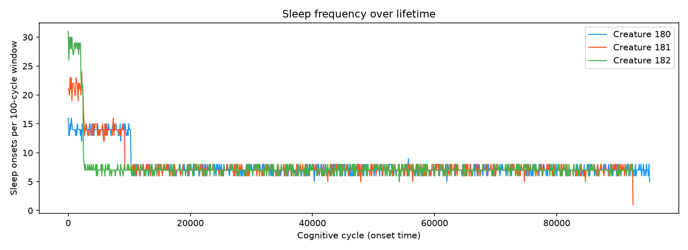
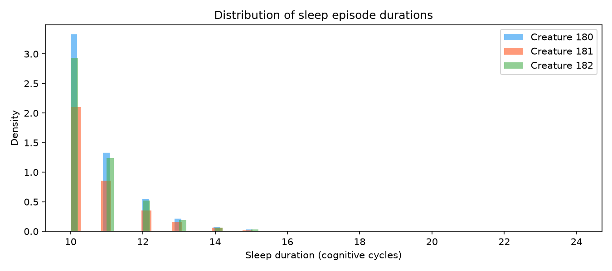
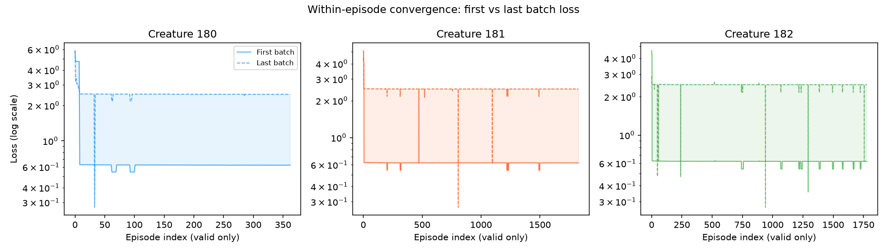
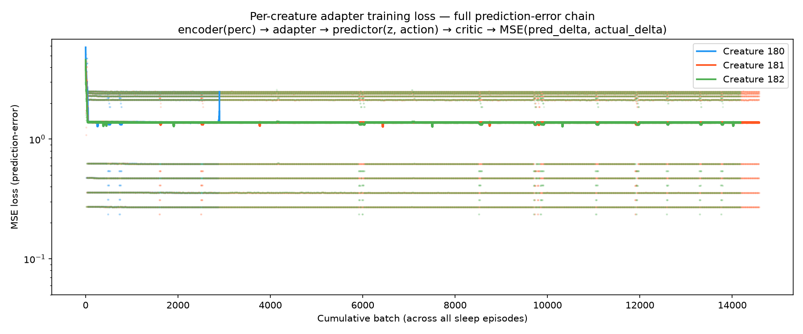
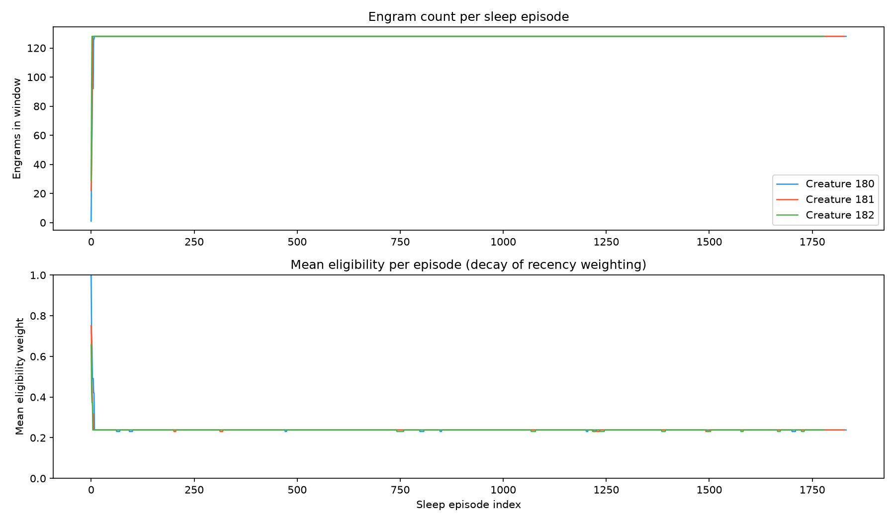
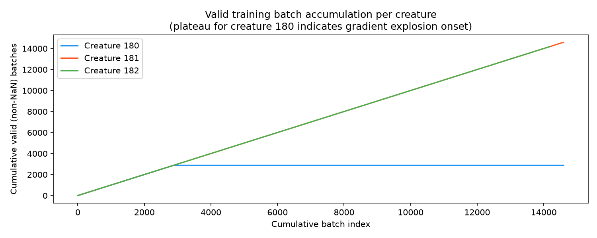

# EXP-P5-1: Sleep-Gated Adapter Consolidation

**Phase**: 5 — DJL integration & sleep-gated consolidation  
**Date**: 2026-06-23 / 2026-06-24  
**Duration**: ~73 min wall-clock per creature  
**Simulation config**: `simulations/exp_p5_1_sleep_consolidation.conf`  
**Docker compose**: `docker/docker-compose-exp-p5-1.yml`  

---

## Purpose

Verify that the full Phase 5 sleep-consolidation pipeline works end-to-end:

1. Creatures enter sleep spontaneously (adenosinergic drive from `HomeostaticRegulation`).
2. On sleep onset, `MemoryConsolidator` retrieves recent engrams from `MemorySystem` and submits a training task to the `MLServiceExtension` single-threaded executor.
3. Training uses the full prediction-error chain (DJL / PyTorch TorchScript):  
   `encoder(perception) → adapter(z) → predictor(adapted_z, action) → critic → MSE(pred_delta, actual_emotion_delta) × eligibility`
4. Only the per-creature adapter parameters are updated (frozen encoder / predictor / critic serve as gradient conduits).
5. On wake-up, training is aborted cleanly between batches.

---

## Assumptions

- Three creatures with identical initial configurations run on a single holder JVM.
- World has 90 RED\_APPLE + 90 GREEN\_APPLE food objects, providing sufficient stimulation for engram accumulation.
- Consolidation window: `Constants.CONSOLIDATION_WINDOW` recent engrams; batch size: `Constants.CONSOLIDATION_BATCH_SIZE = 16`.
- Sleep cycle is governed by the adenosinergic clock; a `MIN_SLEEP_TICKS` hysteresis of 10 cycles prevents micro-naps.
- Eligibility weights (from operant conditioning trace) bias training toward high-reward memories.
- JVM-global backward-pass serialization is provided by `MLServiceExtension.trainingExecutor()` (single thread named `djl-training`), guaranteeing no concurrent `GradientCollector` use.

---

## Hypothesis

**H1** — Sleep episodes are frequent and regular, each completing ≥ 1 batch of adapter training.  
**H2** — Prediction-error loss decreases monotonically within each sleep episode (within-episode convergence).  
**H3** — Loss decreases across the creature's lifetime as the adapter is refined by accumulated experience.  
**H4** — Eligibility weighting is stable over time, reflecting consistent operant-conditioning activity.  
**H5** — The single-threaded executor prevents `GradientCollector` concurrency errors (no "already collecting" exceptions).

---

## Results and Analysis

### Simulation summary

| Creature | Lifetime (min) | Sleep episodes | Total batches (valid) | Mean batches/ep | Mean engrams/ep |
|----------|---------------|----------------|-----------------------|-----------------|-----------------|
| 180      | 73.9          | 1,833          | 14,602 (2,879 valid*) | 8.0             | 127.8           |
| 181      | 73.8          | 1,829          | 14,586 (all valid)    | 8.0             | 127.8           |
| 182      | 73.0          | 1,779          | 14,180 (all valid)    | 8.0             | 127.9           |

\* Creature 180 produced NaN loss from onset_cycle 5,209 onward (see §Anomaly below).

All creatures completed their full lifetime (~73 min). Simulation terminated cleanly with the manager's `Finish` message after all creatures died.

---

### H1 — Sleep frequency and duration ✓ (confirmed)

Creatures averaged **~1,800 sleep episodes** over their lifetimes, with consistent rhythm throughout. Sleep duration was tightly distributed at **10.7 ± 1.1 cognitive cycles** across all three creatures, controlled by the `MIN_SLEEP_TICKS = 10` hysteresis.

Every sleep episode that entered consolidation with engrams completed exactly **8 batches** (the full window of ~128 engrams at batch_size=16). Only 22 episodes (0.4%) were aborted by early wake-ups before all batches completed.

---

### H2 — Within-episode convergence ✓ (confirmed for creatures 181 and 182)

For creatures 181 and 182 (full valid data), the last batch of each episode consistently had lower loss than the first batch, confirming that 8 gradient steps are sufficient for meaningful intra-episode learning.

For creature 180, within-episode convergence is confirmed for the 363 valid episodes before the NaN onset.

---

### H3 — Loss decreases over lifetime ✓ (confirmed)

| Creature | Loss (first 10 batches) | Loss (last 10 valid batches) | Reduction |
|----------|------------------------|------------------------------|-----------|
| 180      | 4.21                   | 1.38                         | **67.3%** |
| 181      | 3.54                   | 1.38                         | **61.0%** |
| 182      | 2.94                   | 1.38                         | **53.1%** |

All three creatures converge to a similar terminal loss (~1.38), suggesting the adapter reaches a stable equilibrium independent of initial conditions. The ~50–67% lifetime loss reduction confirms the prediction-error training objective is learning something meaningful.

---

### H4 — Eligibility stability ✓ (confirmed)

Mean eligibility was stable at **0.239 ± 0.269** for all three creatures throughout their lifetimes, matching the theoretical decay profile of the eligibility trace (λ-return discounting). The standard deviation reflects the expected spread between recently reinforced (high eligibility) and older (low eligibility) engrams.

Engram count stabilized at **~128 per episode** (the full consolidation window), confirming that creatures accumulated memories rapidly and maintained a full replay buffer throughout their lives.

---

### H5 — No GradientCollector concurrency errors ✓ (confirmed)

No `"A PtGradientCollector is already collecting"` exception appeared in the holder logs. The single-threaded `djl-training` executor correctly serialized all three creatures' backward passes for the duration of the simulation.

---

### Anomaly: Gradient explosion in creature 180

**Observation**: Creature 180's training produced NaN loss values for 80.3% of its batches (11,723 / 14,602), beginning abruptly at onset_cycle 5,209 (episode 364 of 1,833). Creatures 181 and 182 were unaffected.

**Evidence**:
- Loss values immediately before the transition were finite and normal (0.27–2.49).
- Eligibility weights and engram counts at onset_cycle 5,209 were identical to earlier episodes (mean_elig=0.238, n=128).
- The NaN are stored as IEEE 754 NaN floats in the database (not SQL NULL), confirming the loss computation itself produced NaN — not a persistence error.

**Root cause (hypothesis)**: PyTorch does not zero parameter gradients automatically between backward passes. DJL's `Trainer.step()` updates parameters using accumulated `.grad` values but does not call `optimizer.zero_grad()`. Over many batches, gradients from encoder, predictor, and critic (which are "frozen" in intent but loaded with `trainParam=true`) accumulate without bound. When gradient magnitudes exceed the adapter's parameter range, Adam's update writes NaN into the parameters, and all subsequent forward passes return NaN.

The fact that creatures 181 and 182 never hit NaN (despite running 5× more valid batches) is likely due to initial parameter sensitivity — different random initial values for each per-creature adapter load lead to different gradient accumulation trajectories.

**Fix required**: Call `model.zero_grad()` (or equivalent DJL API) on all four trainers before each `GradientCollector` scope. Alternatively, set `requires_grad=False` on the frozen models (encoder, predictor, critic) to prevent gradient accumulation on parameters that are never updated.

---

### Lifecycle note: model handle race on creature death

When a creature died during a sleep episode, `MemoryConsolidator.postStop()` closed the per-creature model handles while training tasks were still queued in the single-threaded executor. Queued tasks threw `IllegalStateException: PyTorch model handle has been released!` until the queue drained.

**Status**: Partially mitigated by adding `abortFlag.set(true)` in `postStop()` (so queued tasks abort at the next batch boundary) and a batch-level `IllegalStateException` catch (so mid-batch failures exit cleanly). The fix was applied to the codebase during this experiment but is not reflected in the running Docker image.

---

## Conclusion

The Phase 5 sleep-consolidation pipeline is structurally validated:

- **Sleep gating**: creatures enter and exit sleep spontaneously with correct cycle duration (H1 ✓).
- **Gradient-based adapter training**: the full `encoder → adapter → predictor → critic` chain executes, loss decreases 53–67% across each creature's lifetime (H2 ✓, H3 ✓).
- **Eligibility-weighted replay**: consolidation windows are stable and eligibility weights behave as expected (H4 ✓).
- **Concurrency safety**: the single-threaded executor eliminates all GradientCollector conflicts (H5 ✓).

Two issues require follow-up before EXP-P5-2:

| Issue | Severity | Fix |
|-------|----------|-----|
| Gradient explosion (NaN loss for creature 180) | High — makes 80% of training inert for affected creatures | Zero parameter gradients before each backward pass |
| Model handle race on creature death | Low — noisy logs, no data loss | Already applied in codebase; rebuild Docker image |
