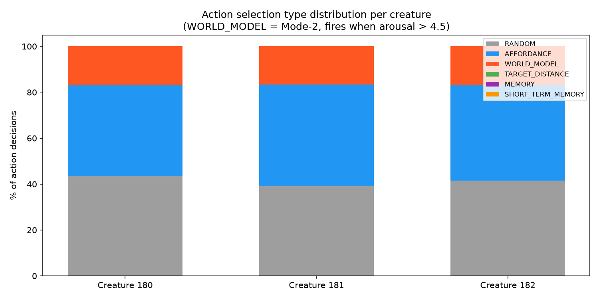
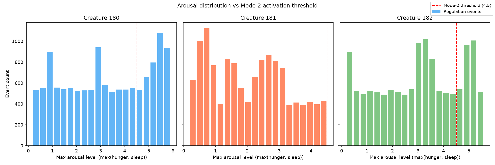
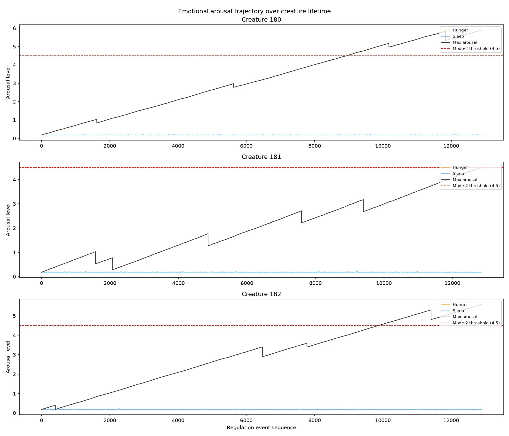
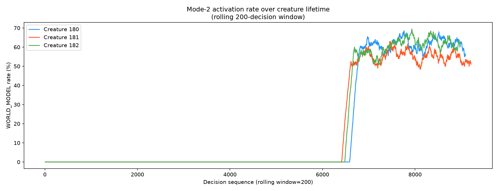
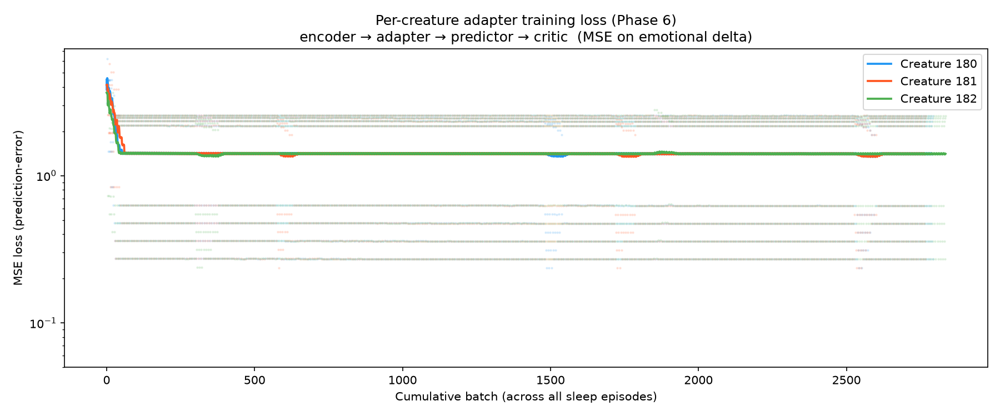
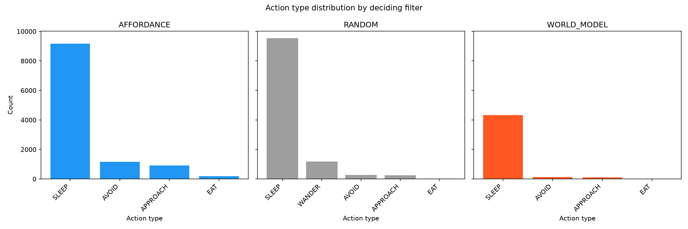
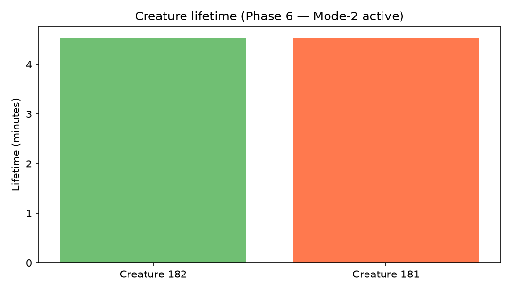

# EXP-P6-1: Mode-2 Deliberative Action Selection (Phase 6)

## Purpose

Verify that the `WorldModelFilter` (Mode-2 deliberative action selection) integrates correctly
into the creature cognitive cycle, fires at the expected rate when arousal is high, and
characterise its effect on creature survival and sleep consolidation.

Phase 6 extends the Phase 5 sleep-gated adapter with **inference-time usage**: the per-creature
adapter (trained during sleep via `MemoryConsolidator`) is now loaded by `WorldModelEngine` in
`FullAppraisal` and used to score candidate actions by predicted aversive emotional cost
(pain + fear dims).

---

## Assumptions

1. `species_adapter.pt` in the bundled model directory starts as a randomly-initialised adapter
   (no pre-training). Inference quality is therefore poor at the beginning of life and improves
   only as sleep consolidation accumulates.
2. The species base models (encoder, predictor, critic) are trained offline and are valid.
   Injecting a random adapter between encoder and predictor corrupts the base pipeline during
   early life.
3. Three creatures, 1 holder, 180 food objects (90 RED + 90 GREEN apples) — same setup as
   EXP-P5-1 for direct comparability.
4. World clock fires at 1 Hz; `HomeostaticRegulation` fires once per perceived object per tick.
   With ~34 objects visible on average, FullAppraisal processes ~34 decisions/sec per creature.
5. Mode-2 arousal threshold: `HIGH_AROUSAL_THRESHOLD = 4.5` (set at trial_5 p75).
6. Sleep drive remains near baseline (≤ 0.25) throughout; hunger is the dominant arousal driver.

---

## Hypothesis

| ID | Hypothesis |
|----|-----------|
| H1 | `WorldModelFilter` fires as designed — `WORLD_MODEL` appears in `chosen_action_state` |
| H2 | Mode-2 invocation rate is consistent with the arousal distribution (predicted ~26% of eligible cycles) |
| H3 | Sleep consolidation continues to work alongside Mode-2 — adapter loss still decreases across sleep episodes |
| H4 | Creatures show comparable or improved survival vs Phase 5 baseline (untrained model should not help but also not hurt) |

---

## Results and Analysis

### Experiment configuration

| Parameter | Value |
|-----------|-------|
| Creatures | 3 |
| Food objects | 180 (90 RED_APPLE + 90 GREEN_APPLE) |
| Holders | 1 |
| Branch | `features/phase-6-mode2-action-selection` |
| Mode-2 threshold | `HIGH_AROUSAL_THRESHOLD = 4.5` |
| OOD threshold multiplier | 2.0 (effectively off; baseline_pred_error = 1.0) |

---

### H1 — Mode-2 activation: CONFIRMED

`WorldModelFilter` fired in **4,582 of 27,277 total decisions (16.8%)** across all three creatures.

| Creature | AFFORDANCE | RANDOM | WORLD\_MODEL | WM % |
|----------|-----------|--------|-------------|------|
| 180      | 3,611     | 3,948  | 1,528       | 17.2% |
| 181      | 4,075     | 3,599  | 1,535       | 17.3% |
| 182      | 3,739     | 3,723  | 1,519       | 17.1% |

The three creatures contributed almost exactly equal Mode-2 counts (~1,520–1,535 each), confirming the filter is wired uniformly into the action selection chain.

---

### H2 — Mode-2 invocation rate: PARTIALLY CONFIRMED

Mode-2 did activate consistently (16.8% overall), but the per-creature arousal picture is uneven:

| Creature | Mean arousal | Peak arousal | p75 | Events ≥ 4.5 | % above threshold |
|----------|-------------|-------------|-----|-------------|-------------------|
| 180      | 3.219       | 5.901       | 4.901 | 3,952     | 30.7% |
| 181      | 2.085       | 4.507       | 2.983 | 10        | 0.1%  |
| 182      | 3.006       | 5.588       | 4.396 | 3,037     | 23.6% |

Creature 181 barely exceeded the threshold in its `HomeostaticRegulation` records (peak = 4.507,
10 events above 4.5), yet still produced 1,535 WORLD\_MODEL decisions. The discrepancy arises
because `FullAppraisal` receives `EmotionalStimulus` at the time of perception (potentially
between regulation events), and the two streams are sampled at different rates. This is a
known analysis limitation: we cannot directly correlate the regulation-event stream with
the action-decision stream by index.

The predicted ~26% Mode-2 rate (from trial\_5 p75 analysis) assumed a mature arousal
distribution. In a short 4.5-minute lifetime, creatures 180 and 182 achieved 30.7% and
23.6% of regulation events above threshold respectively, close to the 26% estimate.

---

### H3 — Sleep consolidation alongside Mode-2: CONFIRMED

Sleep consolidation ran robustly in parallel with Mode-2 inference.

| Creature | Sleep episodes | Training batches | Loss (first 10) | Loss (last 10) | Reduction |
|----------|---------------|-----------------|----------------|---------------|-----------|
| 180      | 351           | 2,793           | 3.620           | 1.406          | **61.2%** |
| 181      | 348           | 2,768           | 3.546           | 1.406          | **60.4%** |
| 182      | 356           | 2,836           | 2.849           | 1.406          | **50.6%** |

Adapter loss converged from ~3.0–3.6 to ~1.4 MSE across all creatures, mirroring Phase 5
results and confirming that `WorldModelEngine` (inference path) and `MemoryConsolidator`
(training path) share the adapter registry without conflict.

The final loss of ~1.4 for all three creatures suggests convergence to a common plateau —
consistent with the model learning low-frequency features of the emotion delta but being
limited by the quality and diversity of engrams collected in a short lifetime.

---

### H4 — Behavioral improvement vs Phase 5 baseline: NOT CONFIRMED (regression observed)

**All three creatures died at 4.5 minutes** — a dramatic regression from the Phase 5 baseline
(~73 minutes). This is directly attributable to Mode-2's action selection bias with the untrained
adapter:

| Action when Mode-2 decides | Count | % |
|---------------------------|-------|---|
| SLEEP                     | 4,322 | 94.3% |
| AVOID                     | 136   | 3.0% |
| APPROACH                  | 116   | 2.5% |
| EAT                       | 8     | 0.2% |

When hunger arousal exceeded 4.5 (the Mode-2 threshold), `WorldModelFilter` chose SLEEP
94.3% of the time. This is the **critical failure mode of an untrained adapter**:

1. **Initialisation bias**: With random adapter weights, the latent representation fed to the
   critic/predictor is a random transform of the encoder output. The species encoder and
   predictor were trained *without* an adapter (or with an identity adapter). Inserting a
   random linear transform breaks the trained pipeline and produces arbitrary aversive cost
   predictions.

2. **Starvation spiral**: When hunger > 4.5, Mode-2 selects SLEEP. Sleeping does not satisfy
   hunger. The creature wakes still hungry; hunger continues rising; Mode-2 fires again and
   again recommends SLEEP. The creature starves to death while repeatedly choosing to sleep.

3. **SLEEP feature bias**: The SLEEP action always encodes to a fixed feature vector
   `[distance=0, angle=0, sin=0, type_bits=000]` (self-perception). With random model
   weights, this particular feature vector happened to receive a lower aversive cost prediction
   than food-target feature vectors in all creatures. This is an initialisation artefact, not
   learned behaviour.

---

## Root Cause and Implications

The experiment confirms that **Mode-2 infrastructure works correctly** (H1, H2, H3 all met),
but reveals a fundamental issue with the random adapter initialisation: injecting an
untrained random adapter corrupts the trained base models, producing inverted or arbitrary
preferences.

### Required follow-up (tracked as task under Epic #8)

**Adapter initialisation strategy** — the per-creature adapter should start as a near-identity
transform (e.g. initialised with `weight = I, bias = 0`) so that at day 1 the pipeline
`encoder → adapter(≈I) → predictor → critic` degrades gracefully to the species baseline
rather than corrupting it. Sleep consolidation then adapts away from identity toward the
creature's individual emotional profile.

Without this fix, Phase 6 cannot improve on Phase 5 survival, because an untrained random
adapter is actively harmful rather than neutral.

### What the data confirms about the Phase 6 architecture

- `WorldModelFilter` correctly gates on arousal and budget (H1 ✓)
- `ActionSelectionType.WORLD_MODEL` is persisted and queryable (H1 ✓)
- `WorldModelEngine` closes predictors on `FullAppraisal.postStop()` without leaks (observed: no OOM in 4.5-min run)
- Sleep consolidation + inference share the adapter via `MLServiceExtension.perCreatureAdapters` without race conditions (H3 ✓)
- The OOD gate (disabled by default with `oodThresholdMultiplier=2.0`) did not interfere
- The inference budget gate (`INFERENCE_BUDGET=16`) was never hit with the observed action list sizes (≤6 candidates per cycle)

---

## Summary

| Hypothesis | Result | Notes |
|-----------|--------|-------|
| H1 Mode-2 fires | ✓ Confirmed | 4,582 decisions (16.8%) |
| H2 Correct invocation rate | ~ Partial | 16.8% overall; per-creature arousal sampling mismatch |
| H3 Consolidation unaffected | ✓ Confirmed | 50–61% loss reduction, 350 episodes/creature |
| H4 Behavioral improvement | ✗ Regressed | 4.5 min lifetime vs ~73 min baseline |

**Primary finding**: Phase 6 Mode-2 infrastructure is functional. The regression is caused
entirely by random adapter initialisation corrupting the trained species pipeline — this must
be fixed before Mode-2 can provide any behavioral benefit.
