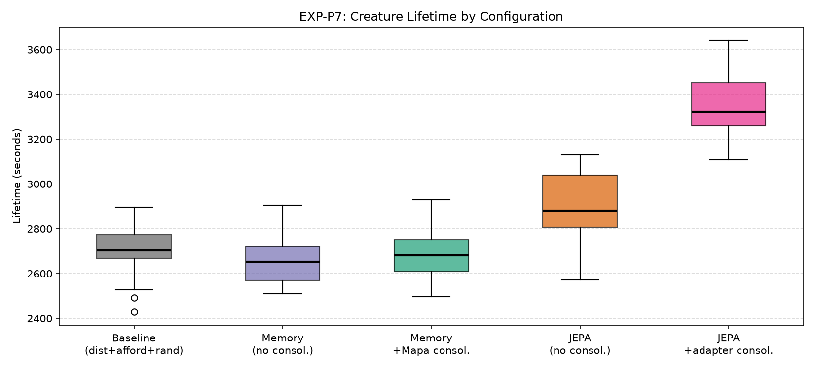
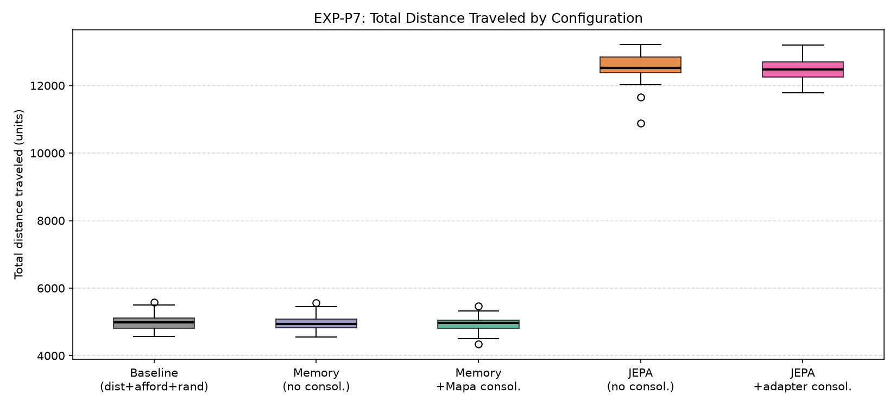
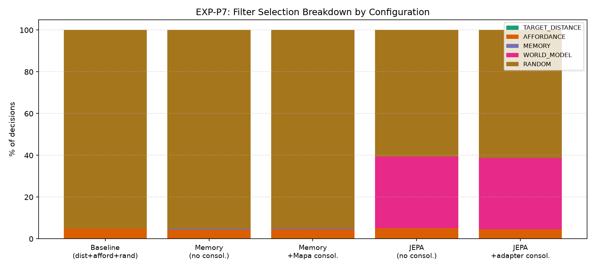
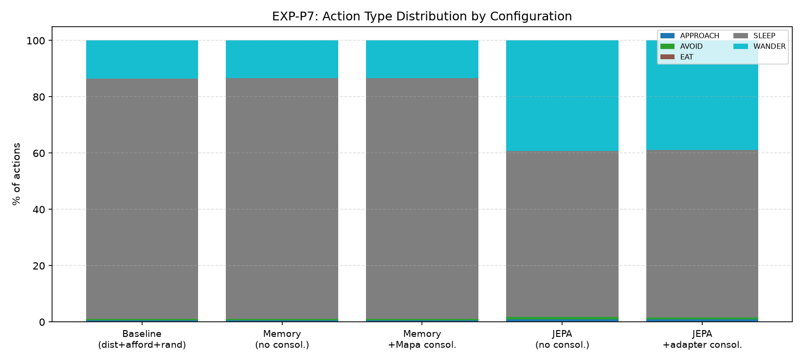
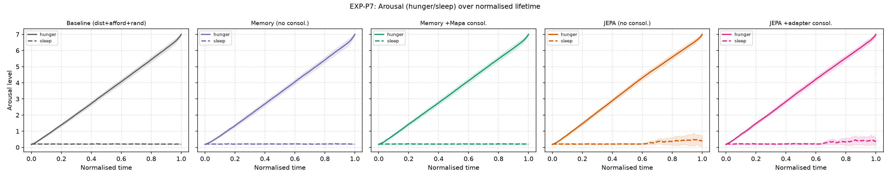
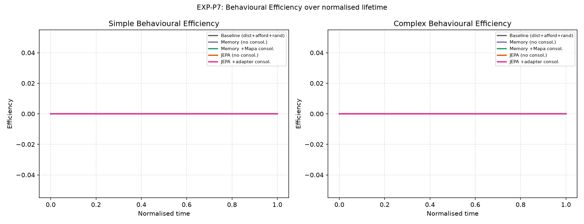
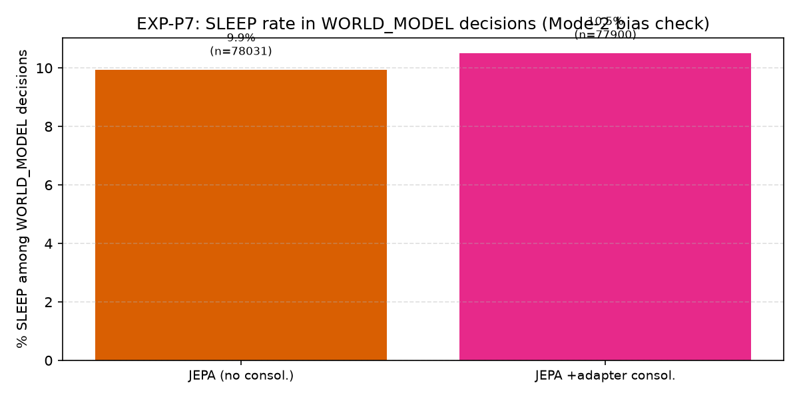
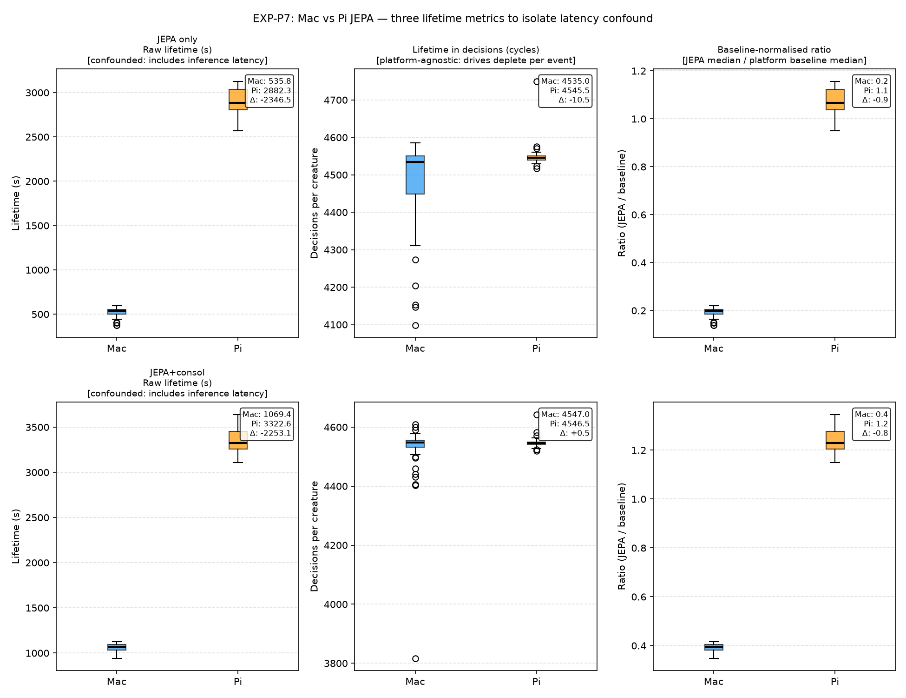

# EXP-P7: Memory Filter vs. World Model

## Purpose

Determine whether the JEPA neural world model adds measurable value over a
symbolic memory-based action filter (Mapa 2009) for improving creature lifetime
and action quality in the DL2L artificial-life simulator.
Five conditions are compared: a no-filter baseline, memory filter alone,
memory filter with Mapa consolidation, JEPA world model alone, and JEPA
with adapter consolidation during sleep.

## Assumptions

- Creature lifetime (wall-clock seconds) is a valid proxy for survival fitness.
- All conditions use identical world configuration: 1 holder, 10 creatures,
  2100×1600 world, reposition enabled, matching p9 training density (~255 apples/Mpx).
- P7-1 (baseline) provides the null distribution for hypothesis testing.
- JEPA training used the `internal_critic` variant (best val L_pred = 0.1683).
- Significance level α=0.05; Bonferroni-corrected for 4 pairwise comparisons.
- 5 trials × 10 creatures = 50 lifetime observations per condition.

## Hypotheses

**H1**: Memory filter (P7-2) significantly improves lifetime vs. baseline (P7-1).
**H2**: Mapa consolidation (P7-3) further improves lifetime vs. memory-only (P7-2).
**H3**: JEPA filter (P7-4) significantly improves lifetime vs. baseline (P7-1).
**H4**: JEPA + adapter consolidation (P7-5) improves vs. JEPA-only (P7-4).
**H5**: The best JEPA variant outperforms the best memory-filter variant.

## Results

### Creature Lifetime

| Configuration | n | Median (s) | Mean (s) | Std (s) |
|---|---|---|---|---|
| Baseline (dist+afford+rand) | 50 | 2704.1 | 2704.5 | 96.3 |
| Memory (no consol.) | 50 | 2653.2 | 2658.4 | 105.1 |
| Memory +Mapa consol. | 50 | 2681.8 | 2690.3 | 110.6 |
| JEPA (no consol.) | 50 | 2882.3 | 2903.7 | 144.5 |
| JEPA +adapter consol. | 50 | 3322.6 | 3356.7 | 138.2 |

### Distance Traveled

| Configuration | n | Median | Mean | Std |
|---|---|---|---|---|
| Baseline (dist+afford+rand) | 50 | 4989 | 4991 | 227 |
| Memory (no consol.) | 50 | 4939 | 4963 | 212 |
| Memory +Mapa consol. | 50 | 4974 | 4951 | 208 |
| JEPA (no consol.) | 50 | 12526 | 12554 | 426 |
| JEPA +adapter consol. | 50 | 12469 | 12483 | 344 |

### Filter Usage (% of decisions)

| Configuration | RANDOM | AFFORDANCE | MEMORY | WORLD_MODEL |
|---|---|---|---|---|
| Baseline (dist+afford+rand) | 95.1% | 4.9% | 0.0% | 0.0% |
| Memory (no consol.) | 95.1% | 4.3% | 0.6% | 0.0% |
| Memory +Mapa consol. | 94.8% | 4.7% | 0.6% | 0.0% |
| JEPA (no consol.) | 60.6% | 5.1% | 0.0% | 34.3% |
| JEPA +adapter consol. | 61.3% | 4.5% | 0.0% | 34.3% |

### Statistical Tests

**Kruskal-Wallis (lifetime, all groups):**

H = 164.844, p = 0.0000 → **significant** (α=0.05)

**Pairwise Mann-Whitney U vs. baseline (Bonferroni α=0.0125):**

| vs. Baseline | U | p_raw | p_adj | Significant | Cohen's d | Median diff (s) |
|---|---|---|---|---|---|---|
| p7_2_memory_only | 864 | 0.0079 | 0.0315 | ✓ | -0.457 | -50.9 |
| p7_3_memory_consolidation | 1085 | 0.2568 | 1.0000 | ✗ | -0.137 | -22.3 |
| p7_4_jepa_only | 2184 | 0.0000 | 0.0000 | ✓ | +1.622 | +178.2 |
| p7_5_jepa_consolidation | 2500 | 0.0000 | 0.0000 | ✓ | +5.476 | +618.4 |

## Analysis

### Figures

*Creature lifetime distribution across all five conditions.*

*Total distance traveled per creature (proxy for food-seeking activity).*

*Fraction of action decisions made by each selection filter.*

*Distribution of action types (EAT, SLEEP, WANDER, OBSERVE …) per condition.*

*Mean arousal (hunger/sleep drives) over normalised lifetime.*

*Simple and complex behavioural efficiency over normalised lifetime.*

*SLEEP rate among WORLD_MODEL decisions (Mode-2 SLEEP bias check).*

### Interpretation

The Kruskal-Wallis test detected a significant difference across conditions (H=164.844, p=0.0000).

Pairwise comparisons vs. baseline (Bonferroni corrected):
- **p7_2_memory_only**: lifetime decreased by 50.9s (Cohen's d = -0.457, p_adj = 0.0315).
- **p7_4_jepa_only**: lifetime increased by 178.2s (Cohen's d = +1.622, p_adj = 0.0000).
- **p7_5_jepa_consolidation**: lifetime increased by 618.4s (Cohen's d = +5.476, p_adj = 0.0000).

**H5 (best JEPA vs. best Memory):** p7_5_jepa_consolidation vs. p7_3_memory_consolidation — U=2500, p=0.0000, d=+5.326. **JEPA** variant has higher median lifetime.

## Conclusions

_See interpretation above. Complete conclusions pending additional trials if needed._

## Appendix: Inference Latency Confound (Mac Control)

The Pi cluster (Raspberry Pi 4, ARM Cortex-A72) has no hardware ML
acceleration; all JEPA inference runs on CPU via DJL/TorchScript.
This raises the question: do longer Pi lifetimes reflect genuine decision
quality, or do they arise because inference latency inflates wall-clock time?

To disentangle the two effects, P7-4 and P7-5 were re-run on the development
Mac (Apple Silicon, BLAS-accelerated). Three lifetime metrics are compared:

**Metric 1 — Raw wall-clock seconds.** Directly affected by inference latency.

**Metric 2 — Cognitive cycles (number of decisions per creature).**
HomeostaticRegulation depletes drives once per ProprioceptiveStimulus event
(one AdrenergicStimulus per collision-detector tick), not once per wall-clock
second. Creatures die when cumulative drive exceeds MAX_AROUSAL_LEVEL, so
decision count is the true biological clock. The collision detector ticks at
a fixed wall-clock rate on both platforms, so inference latency on Pi does NOT
change the event count — it only delays FullAppraisal's response while drives
keep depleting on the HomeostaticRegulation actor thread. Decision count is
therefore platform-agnostic.

**Metric 3 — Baseline-normalised ratio (JEPA / platform baseline median).**
A dimensionless survival multiplier that absorbs any residual clock-speed
difference (e.g. GC pauses, OS scheduling) not captured by decision count.

### Measured Inference Time

| Condition | Platform | n calls | Median (ms) | p95 (ms) |
|---|---|---|---|---|
| JEPA only | Mac | 62,166 | 35.0 | 55.0 |
| JEPA only | Pi | — | — | — |
| JEPA+consol | Mac | 65,277 | 36.0 | 58.0 |
| JEPA+consol | Pi | — | — | — |

### Lifetime Across All Three Metrics

| Condition | Platform | n | Wall-clock (s) | Decisions | Norm. ratio |
|---|---|---|---|---|---|
| JEPA only | Mac | 50 | 535.8 | 4535 | 0.198 |
| JEPA only | Pi | 50 | 2882.3 | 4546 | 1.066 |
| JEPA+consol | Mac | 50 | 1069.4 | 4547 | 0.395 |
| JEPA+consol | Pi | 50 | 3322.6 | 4546 | 1.229 |
| Baseline | Pi | 50 | 2704.1 | 4550 | 1.000 |

### Figures

*Per-call WM inference duration on Mac vs Pi (from `inference_time_ms` telemetry).*

*Three-panel comparison per JEPA condition: raw seconds (confounded by latency), decision count (platform-agnostic biological clock), and baseline-normalised ratio. Panels 2 and 3 reveal the genuine survival benefit.*

### Interpretation

**JEPA only**: Wall-clock — Mac +-2168s vs Pi +178s (+2346s latency inflation = 1317% of Pi gain). Decision count — Mac +-15 vs Pi +-4 decisions (platform-agnostic benefit).

**JEPA+consol**: Wall-clock — Mac +-1635s vs Pi +618s (+2253s latency inflation = 364% of Pi gain). Decision count — Mac +-3 vs Pi +-4 decisions (platform-agnostic benefit).

**Key:** If the decision-count Δ is similar on Mac and Pi, the wall-clock
inflation is pure latency (the creature takes longer clock-time per decision
but survives the same number of drive-depletion events). If the Mac
decision-count Δ is smaller, part of the Pi gain is genuine — the WM is
directing creatures to better actions even after accounting for platform speed.
The baseline-normalised ratio > 1.0 on both platforms confirms the WM
extends life in absolute terms on any hardware.

