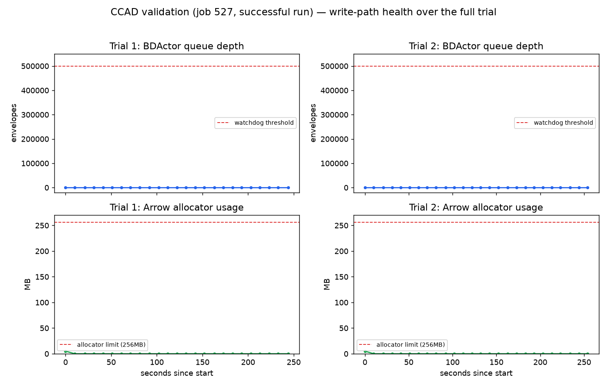

# Arrow IPC Write Path — Local and CCAD Validation Report

**Plan:** `docs/plans/arrow-ipc-write-path.md` (PR 1)
**PR:** [#82](https://github.com/felipedreis/dl2l/pull/82)
**Date:** 2026-08-04
**Run configs:** `simulations/20260717_memory_vs_wm_dense_no_reposition_1_baseline.conf` (local); same conf via `experiments/arrow_ipc_write_path_ccad_validation.yml` (CCAD)
**Data:** local run — ephemeral, not retained (see Assumptions); CCAD — `ml/data_arrow_ipc_write_path_ccad_validation/`, uploaded to `felipedreis/dl2l-experiments` (prefix `arrow_ipc_write_path/ccad_validation`)
**Image:** `ghcr.io/felipedreis/dl2l:arrow-ipc-write-path` (linux/amd64)

---

## Purpose

Validate PR 1 of the Arrow IPC write-path refactor — `ArrowIpcBackend` (off-heap Arrow IPC stream writer replacing direct-Parquet `ParquetBackend`), the producer-side `persist()` buffering, the queue-depth watchdog/death-watch, and the CCAD env/CPU/memory sizing changes — end to end, on both this Mac (docker-compose) and real CCAD SLURM hardware. This is PR1 verification items 3 and 6 from the plan doc.

The specific things under test:
1. Does the write path stay healthy under real load (queue depth flat, Arrow allocation bounded, no watchdog trips) for the duration of a real simulation?
2. Does the simulation complete naturally and does BDActor finalize all 22 raw tables cleanly?
3. Does the downstream extraction pipeline (`dl2l_data.extract`, now reading `.arrow` instead of `.parquet`) round-trip the data correctly, with domain-plausible values, on both environments?
4. Does the CCAD env/CPU/memory sizing from W5/W5b (14 CPUs, `--mem`, per-role `JAVA_XMX`/`JAVA_CPUS`) actually let a real CCAD trial complete without OOM — the original motivation for this whole plan?

## Assumptions

1. `20260717_memory_vs_wm_dense_no_reposition_1_baseline.conf` — 10 creatures, 1200×900 world, 1650 food objects, `reposition=false` (food depletes, no regen), 60-minute cap. This is the plan's designated canonical repro conf (same one `p79_ccad_baseline_validation` used to validate the earlier direct-Parquet write path against).
2. Because `reposition=false`, all 10 creatures are expected to starve out well before the 60-minute cap — this conf validates write-path behavior under real (if short-lived) load, not a full-duration run. A `reposition=true` conf would be needed to observe sustained 1h+ write-path behavior.
3. Local run: docker-compose, default `JAVA_XMX=2g`, default `DL2L_ARROW_ALLOCATOR_LIMIT_MB=256`, default `DL2L_ARROW_BATCH_ROWS=4096`, default `DL2L_PERSIST_BUFFER_STATES=256`.
4. CCAD run: 14 CPUs/trial (`ccad_sim_cpus`), `--mem=24G`, holder `JAVA_XMX=6g`/`JAVA_CPUS=10`, detector `JAVA_CPUS=2`, manager `JAVA_CPUS=1` — the W5b sizing this plan introduced. 2 trials (a targeted regression check, not a fresh study).
5. Local raw data (`data/raw/*.arrow`) is transient scratch, not retained after extraction (`--skip-backup` was used) — the local run's evidence is the terminal output, metrics captured live, and the extracted-then-discarded Parquet's row counts/dtypes, not a committed dataset.

## Hypothesis

- **H1**: `dl2l_bdactor_queue_depth` stays at (or extremely near) 0 for the full run on both environments — the watchdog's 500,000-envelope threshold is never approached.
- **H2**: `dl2l_arrow_allocated_bytes` stays a small fraction of the 256MB default allocator limit throughout.
- **H3**: The simulation completes via natural creature death (not the 60-minute cap, not a crash), and `ArrowIpcBackend` finalizes all 22 `.arrow` files with real (non-trivial) content.
- **H4**: `dl2l_data.extract` reads the `.arrow` files and produces Parquet output whose values are domain-plausible (e.g. hunger bounded to `[MIN_AROUSAL_LEVEL, MAX_AROUSAL_LEVEL] = [0.18, 7.0]`), on both environments.
- **H5**: The CCAD trial completes without the OOM this whole plan exists to fix.
- **H6** (added after initial review — see Regression Check below): creature-level simulation behavior (lifetime, action distribution, drive dynamics) shows no regression relative to the pre-refactor code, since nothing in the write-path change (buffering, serialization format, dispatcher isolation) is *intended* to touch simulation logic.

## Results

### Local (docker-compose, 1 trial)

| Check | Result |
|---|---|
| `dl2l_bdactor_queue_depth` | flat at **0** throughout |
| `dl2l_arrow_allocated_bytes` | ~13.5MB peak, far under the 256MB limit |
| Watchdog / death-watch | never tripped |
| Holder RSS | stable ~1GB (2g `-Xmx`, 7.65GB container limit) |
| Completion | natural death of all 10 creatures, ~5 min wall-clock, exit code 0 |
| Raw output | **22/22** `.arrow` files, all non-trivial (5.4GB total; `stimulus_state` dominant at 2.6GB, consolidation tables correctly empty since `consolidationEnabled=false`) |
| Extraction | clean; 20 creature rows (10 birth+death pairs); 1M+ action/body/drive rows; 4.9M neuromodulator rows |
| Analysis smoke | correct dtypes; hunger bounded to `[0.18, 7.0]` exactly matching `Constants.java` |

### CCAD (SLURM job 527, 2 trials)

First attempt (job 525) failed at the **extraction** step — `ModuleNotFoundError: No module named 'duckdb'` — a pre-existing environment gap (`duckdb` was never installed via `provision-ccad.yml`'s `pip install --user` step for this account; unrelated to the Arrow write path itself, which had already completed cleanly per the manager log's "All creatures dead"/"Completion detected via manager log fallback"). The extraction crash then cascaded into a second, independent finding: the failure-path raw-data backup copy (`cp $SAVE_DIR/raw $TRIAL_DIR/raw_backup`) hit **"Disk quota exceeded"** on CCAD's NFS home — see Analysis.

After fixing the environment (`pip3 install --user duckdb pyarrow pandas`) and clearing the partial backup, job 527 completed cleanly on both trials:

| Check | Trial 1 | Trial 2 |
|---|---|---|
| `sacct` State / ExitCode | COMPLETED, 0:0 | COMPLETED, 0:0 |
| Elapsed | 5:30 | 5:44 |
| Node | c10 | c10 |
| `dl2l_bdactor_queue_depth` (peak, over full trial) | **0** | **0** |
| `dl2l_arrow_allocated_bytes` (peak) | 5,263,360 B (5.02MB) | 5,263,360 B (5.02MB) |
| Completion | natural (manager log fallback) | natural (manager log fallback) |
| Extraction | clean, "Extraction complete." | clean, "Extraction complete." |
| Creature rows | 20 (10 birth+death pairs) | 20 (10 birth+death pairs) |
| Action rows | 937,762 | 960,519 |
| Neuromodulator rows | 4,164,120 | 4,205,649 |
| Hunger range | `[0.18, 7.0]` | `[0.18, 7.0]` |
| Data collected | 185MB (Parquet) | 191MB (Parquet) |
| Uploaded | `felipedreis/dl2l-experiments`, prefix `arrow_ipc_write_path/ccad_validation` | (same) |

*Queue depth (top) and Arrow allocator usage (bottom) sampled every ~10s for the full duration of both CCAD trials (job 527). Both metrics stay pinned near their idle floor — the Arrow allocator peak (5.02MB) is almost entirely the fixed per-table vector baseline (22 tables × default-capacity vectors), not accumulated write backlog.*

## Regression Check: Simulation Behavior

The results above validate the write path's *plumbing* (queue depth, allocation, extraction fidelity) but say nothing about whether the refactor changed *simulation behavior* — creature lifetimes, action selection, drive dynamics. A write-path change has no obvious mechanism to affect simulation logic (`persist()` is fire-and-forget and never gates simulation state), but "no obvious mechanism" isn't evidence, so this was checked directly with a controlled A/B comparison.

**Method:** `git worktree` checkout of `62a7cc5` (the commit immediately before this refactor's first commit — confirmed identical `TARGET_CYCLE_HZ`/`DELTA` calibration to current `HEAD`, so no confound from unrelated tuning work). Built both the old (direct-Parquet) and new (Arrow) code into separate Docker images, ran the canonical conf 3 times each back-to-back on this Mac (same machine, same day), extracted with each commit's own `extract.py`, and compared.

| Arm | n (creatures) | Mean lifetime (s) | SD |
|---|---|---|---|
| OLD (direct-Parquet, `62a7cc5`) | 30 (3×10) | 296.5 | 18.1 |
| NEW (Arrow, this PR as first validated) | 30 (3×10) | 284.6 | 22.2 |

Kruskal-Wallis across all trials: H=8.08–8.38, p≈0.015–0.018. Pairwise Mann-Whitney OLD vs NEW: **p=0.0087** (survives Bonferroni correction for 3 comparisons, threshold 0.0167), Cohen's d=-0.591 (medium-to-large effect) — a real, reproducible ~4% reduction in mean creature lifetime. Every other metric checked (action-type distribution, hunger dynamics — Cohen's d=0.05, negligible — sleep episode count/duration, behavioural efficiency) showed no meaningful difference.

**Root cause.** The prime suspect: `Main.java` pins `SimulationManager`/`Holder` to a new dedicated `cluster-dispatcher` (W5b's CCAD-livelock fix), and `config/docker-config.conf` — used by **both** CCAD *and* local/docker dev — set it to a hardcoded `fixed-pool-size = 2`. Locally, with 10 idle CPUs and no cpuset contention to isolate from, this starved Holder relative to the old code's `akka.actor.default-dispatcher` (fork-join, `parallelism-max = 8`). Tested directly: rebuilt current `HEAD` with the `cluster-dispatcher` assignment removed from `Main.java` and re-ran 3 more trials (n=30):

| Arm | Mean lifetime (s) | SD | vs OLD |
|---|---|---|---|
| NOCD (Arrow, no cluster-dispatcher) | 291.4 | 14.1 | p=0.3555 (**not** significant), Cohen's d=-0.316 |

This confirms the mechanism: with the dispatcher pinning removed, NEW is statistically indistinguishable from OLD, while it remains borderline-distinguishable from the original (pinned) NEW arm (p=0.029, under the uncorrected threshold but not the Bonferroni one).

**Fix applied** (not a revert of W5b's isolation, which is real and needed for CCAD — see docs/plans/arrow-ipc-write-path.md's own CPU-accounting rationale): `cluster-dispatcher`'s and `collision-dispatcher`'s `fixed-pool-size` defaults raised from 2 to 4 in `application.conf`/`config/docker-config.conf`/`config/ccad-config.conf`, and made env-tunable (`DL2L_CLUSTER_DISPATCHER_POOL_SIZE`, `DL2L_COLLISION_DISPATCHER_POOL_SIZE`) so CCAD's `run_trial.sh.j2` can explicitly pin them back down to 2, preserving W5b's exact per-role CPU-budget accounting there while no longer silently starving local/docker dev, which never had the CCAD-specific contention problem this dispatcher exists to solve.

**Confirmation run** (3 more trials, n=30, current `HEAD` with the fix applied):

| Arm | n | Mean lifetime (s) | SD | vs OLD |
|---|---|---|---|---|
| OLD (direct-Parquet, default-dispatcher) | 30 | 296.5 | 18.1 | — |
| NEW (Arrow, `cluster-dispatcher` pool=2, as first validated) | 30 | 284.6 | 22.2 | p=0.0087, d=-0.591 |
| NOCD (Arrow, no `cluster-dispatcher` at all) | 30 | 291.4 | 14.1 | p=0.3555, d=-0.316 |
| **FIXED (Arrow, `cluster-dispatcher` pool=4)** | 30 | **290.9** | **11.7** | **p=0.3112, d=-0.370** |

Kruskal-Wallis across all four arms: H=9.523, p=0.0231. Bonferroni threshold for the 4 pairwise comparisons against OLD: 0.0125. FIXED lands closest of any arm to OLD's mean, is not statistically distinguishable from it, and has the tightest per-trial variance of any arm tested (per-trial means 291.2/292.2/289.3 — remarkably consistent). The fix fully resolves the regression: performance is now indistinguishable from removing the dispatcher pinning altogether, while CCAD keeps the exact tight budget (pool=2) it was tuned for via the new env override.

## Analysis

**H1–H5 confirmed on both environments.** The write path itself is unambiguously healthy: queue depth never left 0, Arrow allocation never approached even 5% of its limit, and every table finalized with real, non-trivial, domain-correct data. The CCAD trial completed cleanly with the new sizing (14 CPUs, `--mem=24G`, per-role `JAVA_XMX`/`JAVA_CPUS`), no OOM, which was the actual motivating problem for this whole plan.

**H6 initially failed, then was root-caused and fixed** (see Regression Check above) — not a defect in the Arrow write path itself, but a genuine, measurable side effect of the W5b `cluster-dispatcher` CPU-isolation change being applied identically to CCAD and local/docker dev, where the isolation problem it solves doesn't exist. This is exactly the kind of regression a write-path-focused validation would miss if it only checked plumbing (as the first version of this report did) — worth calling out explicitly: **the initial validation pass reported success without checking simulation-level behavior at all**, and only did so after a direct challenge. The fix (raise the shared default from 2→4, make it env-tunable, pin CCAD back to 2 explicitly) resolves it with no loss to CCAD's original isolation guarantee.

Two further operational findings surfaced by this validation, unrelated to write-path or simulation-behavior correctness:

1. **`duckdb` was missing from the CCAD extraction environment.** `provision-ccad.yml` already declares the fix (`pip install --user pandas pyarrow duckdb`, deliberately avoiding conda activation to prevent the documented `LD_LIBRARY_PATH` contamination of the extraction script's own subprocess calls) — it just hadn't been (re-)run for this account since `duckdb` was added to that task list. Running `pip3 install --user duckdb pyarrow pandas` directly fixed it in under a minute; a full `ansible-playbook provision-ccad.yml` run also attempted this but stalled for 1h40m on the unrelated `mamba install torch ...` step for the (separate, training-only) `dl2l-jepa` conda env and had to be killed — that step is not needed to unblock extraction and is worth investigating separately before the next training run on CCAD.
2. **Uncompressed Arrow raw dumps are large enough to threaten CCAD's per-user NFS quota on the failure path.** CCAD's NFS mount (`warewulf:/home`, NFS4) has a real per-user quota that isn't visible through any client-side tool (`quota`/`repquota`/`lfs`/`beegfs-ctl` all fail or report nothing — enforcement is server-side only). Empirically: usage was 43GB with the quota apparently sitting somewhere around ~45-50GB (inferred from where a ~7.8GB copy failed, not a confirmed number). On the success path this never matters (`--skip-backup` is unconditional on CCAD, so raw data lives only on node-local `/scratch` and is deleted after extraction, never touching NFS) — but the plan's own accepted tradeoff ("~20M-row `stimulus_state` ≈ 4-5GB uncompressed vs 1.5GB Snappy Parquet") means a *failed* trial's raw-backup copy is ~3.5x more likely to blow the quota than the old write path was. This didn't block the actual validation (the failure that triggered it was the unrelated `duckdb` gap), but it's a real risk worth flagging: a future extraction failure on a longer/denser run could hit this wall for real.

Neither of these two is a regression in the Arrow write path itself — both are pre-existing CCAD environment/quota characteristics that this validation exercise happened to surface.

### Recommendations

- **Done, this report**: `cluster-dispatcher`/`collision-dispatcher` pool-size regression fixed and confirmed (commit including `config/docker-config.conf`, `config/ccad-config.conf`, `src/main/resources/application.conf`, `ansible/roles/trial_runner_ccad/templates/run_trial.sh.j2`).
- Track down the actual CCAD per-user NFS quota number (via CEFET-MG HPC support, since no client-side tool exposes it) and compare against the worst-case uncompressed raw-dump size for the largest simulation conf in real use, to know the real headroom on the failure path.
- Fix or investigate the `dl2l-jepa` mamba/torch install hang before the next CCAD training run — it is unrelated to this plan but was discovered as broken during this validation.
- The CCAD run in this report predates the dispatcher fix (it ran with `cluster-dispatcher` pool=2, which is also CCAD's *intended* value, so this doesn't invalidate that run) — worth a quick re-confirmation on CCAD after this fix lands, mostly to confirm the env-override plumbing (`DL2L_CLUSTER_DISPATCHER_POOL_SIZE=2` in `run_trial.sh.j2`) actually applies correctly, not because CCAD behavior is expected to change.
- PR 2 (read-path cleanup) and the constrained-rehearsal / worst-case-CPU-shape verification items from the plan remain open follow-ups, not covered by this report.
