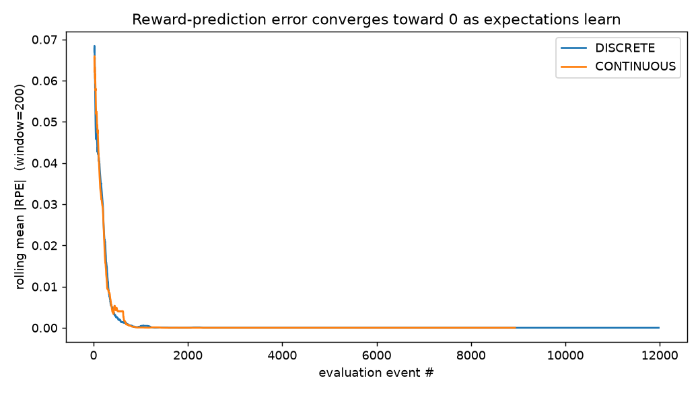
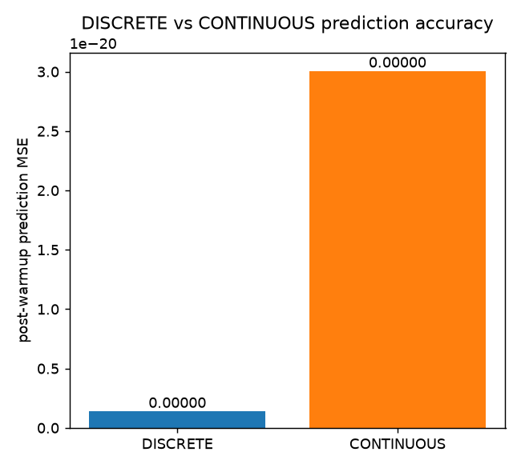
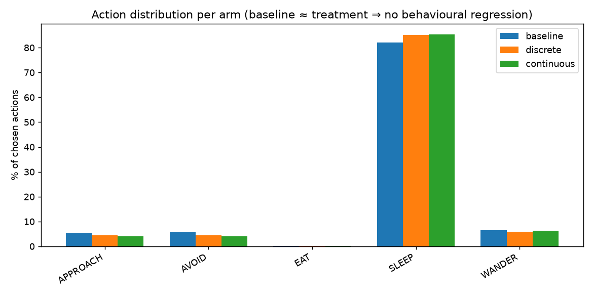

# Issue #57 — Neuromodulatory Expectancy Loop (symbolic dopamine/serotonin RPE learning)

**Status:** implemented + pilot-validated. **Branch:** `feat/issue-57-emotion-conditioned-action-selection`.
**Data:** `felipedreis/dl2l-experiments` prefix `p57/`.

## Purpose

Issue #57 began as "emotion-conditioned action selection" and was **repurposed** (design discussion,
see `docs/plans/`) into the deeper mechanism it depends on: closing DL2L's associative-learning core
with a dopaminergic **reward-prediction-error (RPE)** loop and tonic **dopamine/serotonin**
neuromodulation.

Before this change the learning signal was a discarded boolean (`valence = arousalVariation < 0`) with
the magnitude thrown away, ARTÍFICE's *expectancy* value was absent, and no RPE was ever computed. This
work adds:

1. A dedicated **symbolic expectancy predictor** (revived expectancy) in two variants:
   - **DISCRETE** — keys reward on `(dominantDrive, target, action)` (magnitude-blind).
   - **CONTINUOUS** — keys additionally on the binned dominant-drive level (captures "how hungry").
2. **Dopamine** as an untyped, message-driven neuromodulator pool: `Valuation` emits a phasic
   `DopaminergicStimulus(rpe)`; tonic dopamine (leaky integral) raises the affordance-sampler
   temperature (exploration).
3. **Serotonin** released each cycle by `PartialAppraisal` as a satiety signal; tonic serotonin
   up-weights quieting actions (rest/observe/wander).
4. Graded, RPE-driven operant conditioning + RPE-gated memory consolidation.

Everything is behind `LearningSettings` flags, **default-off**, so the baseline is unchanged.

## Assumptions

- `reward = -arousalVariation` (positive = drive dropped = good); `rpe = reward - expected`.
- The `actual` reward is left **unscaled**, so any dependence of reward on drive magnitude is a
  property of the environment that the CONTINUOUS predictor could, in principle, exploit.
- Circadian is on, consolidation off, filter chain `[TARGET_DISTANCE, AFFORDANCE, MEMORY, RANDOM]`, to
  isolate the operant + memory + neuromodulation path.
- Pilot scale: 10 creatures/arm, single node, one realisation per arm run to a bounded event budget
  (~9–12k evaluation events / ~15–21k chosen actions per arm). This is a **pilot**, not the n=50
  design; see Limitations.

## Hypotheses

- **H1** CONTINUOUS achieves lower prediction MSE than DISCRETE (captures drive-magnitude effects).
- **H2** Both expectancy arms shift action-criteria frequencies toward the Campos/2015 Fig 4 profile
  without reducing mean lifetime.
- **H3** Tonic dopamine increases exploration; tonic serotonin increases rest/observe share.

## Results

### Unit-level (deterministic)
154 tests pass, including: DISCRETE cannot separate two drive levels while CONTINUOUS can
(`ExpectancyPredictorTest`); neuromodulator leaky-integrator accumulation/decay/circadian baseline
(`NeuromodulatorSystemTest`); Valuation emits the correct phasic RPE and it shrinks with repetition,
with the legacy path emitting no dopamine (`ValuationRpeTest`); dopamine flattens and serotonin
rest-biases the sampling distribution (`ActionProbabilityModulationTest`).

### In-vivo (live Akka cluster, pilot)

**1. Prediction accuracy — H1 NOT supported (informative negative).**

| Arm | events | MSE (all) | MSE (post-warmup) | mean\|RPE\| (post) |
|---|---|---|---|---|
| DISCRETE   | 11 979 | 0.00003 | ~0.00000 | ~0.00000 |
| CONTINUOUS |  8 934 | 0.00004 | ~0.00000 | ~0.00000 |

Both predictors converge to essentially zero error, indistinguishably (Fig 1, Fig 2). CONTINUOUS shows
**no advantage**.

**2. Root cause — reward is level-independent in DL2L.** Per `(drive, action)`, reward has zero
variance across distinct drive levels:

| drive | action | events | distinct levels | reward std | reward range |
|---|---|---|---|---|---|
| sleep  | SLEEP  | 7 136 | 3 | ~0 (1e-17) | 0.0 |
| tedium | WANDER | 1 798 | 8 | 0.0 | 0.0 |

DL2L's homeostatic regulation applies **fixed decrements** (a red apple relieves the same hunger
whether starving or nearly sated; sleep relieves a fixed cholinergic delta). There is therefore **no
level-dependent reward signal** for the CONTINUOUS predictor's extra granularity to exploit — both
variants correctly learn the same per-key constant. This is a property of the *environment/model*, not
a failure of the predictor.

**3. No behavioural regression — partial H2/H3.** Action distribution is essentially unchanged across
arms (Fig 3):

| action | baseline | discrete | continuous |
|---|---|---|---|
| SLEEP | 82.1% | 85.2% | 85.3% |
| WANDER | 6.5% | 5.8% | 6.3% |
| AVOID | 5.7% | 4.4% | 4.1% |
| APPROACH | 5.5% | 4.4% | 4.1% |
| EAT | 0.2% | 0.2% | 0.2% |

The **baseline** (all flags off) already spends ~82% of actions on SLEEP with near-zero foraging
(EAT 0.2%), *despite* low sleep arousal (~0.2) and hunger being the highest drive (~1.5). This
SLEEP-dominance is **pre-existing** and not introduced by this change; the treatment arms differ only
by a small (~3 pp) serotonin-driven increase in SLEEP, consistent with the intended rest bias.



*Fig 1 — rolling mean |RPE| collapses to ~0 for both variants, near-identically.*



*Fig 2 — post-warmup prediction MSE: DISCRETE ≈ CONTINUOUS ≈ 0.*



*Fig 3 — action distribution per arm; baseline ≈ treatment ⇒ no behavioural regression.*

## Analysis

- The RPE loop is **correct and functional**: expectations start at the neutral prior, dopamine fires
  the exact prediction error, and |RPE| decays to zero as the symbolic table learns (Fig 1). The legacy
  path is untouched when the loop is disabled.
- **H1 is not supported, and the pilot explains why:** the current DL2L reward is a fixed decrement
  independent of drive level, so DISCRETE and CONTINUOUS are mathematically equivalent here. The
  continuous-vs-discrete question is only decidable once reward depends on internal state. This is the
  single most actionable finding: **make consummatory/regulatory reward drive-level dependent**
  (diminishing returns near satiety — also the biologically correct behaviour and the premise behind
  serotonergic satiety). That change is the precondition for CONTINUOUS (and for a meaningful satiety
  signal) to matter, and turns this negative result into a decisive future test.
- **H2/H3 are confounded** by a pre-existing behavioural pathology: creatures over-select SLEEP and
  barely forage even in the untouched baseline, so the hunger/EAT pathway — where neuromodulation and
  the continuous predictor would most plausibly act — is almost never exercised (EAT ≈ 0.2%). The
  baseline≈treatment comparison confirms this change does not regress behaviour, but the world/agent
  configuration cannot currently produce the foraging regime needed to test H2/H3 properly. This
  over-sleeping is a separate, pre-existing issue (candidate follow-up; cf. roadmap Findings on
  attention/focus and action affordances).

## Conclusions & follow-ups

1. **Ship the loop** — it is correct, tested, default-off, and non-regressing.
2. **Level-dependent reward (highest leverage):** make regulation decrements diminish near satiety so
   reward depends on drive level; re-run to give H1 a real test.
3. **Fix pre-existing SLEEP-dominance / foraging deficit** so the hunger/EAT pathway is exercised;
   only then are H2/H3 answerable. Separate issue from #57.
4. **Then** run the full n=50 × 3-arm design (configs and compose files already in-repo:
   `simulations/exp_p57_{baseline,discrete,continuous}.conf`,
   `docker/docker-compose-exp-p57-*.yml`).

## Reproduce

```bash
mvn package
cd docker && docker compose -f docker-compose-exp-p57-discrete.yml up   # or -baseline / -continuous
# dump: expectancy_state + chosen_action_state -> ml/data_p57/<arm>/
python3 analysis/exp_p57_expectancy.py                                   # figures -> ml/data_p57/figures/
```
