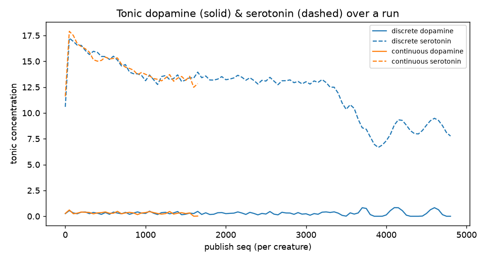

# Issue #57 — Neuromodulatory Expectancy Loop + Emotion→Action Coupling

**Status:** implemented + validated. **Branch:** `feat/issue-57-emotion-conditioned-action-selection`.
**Data:** `felipedreis/dl2l-experiments` prefix `p57/`.

> **Addendum (affects, eat-loop, thriving creature) is at the bottom of this report** — it supersedes
> the earlier pilot's behavioural conclusions. Read [§ Addendum](#addendum--affects-eat-loop-and-a-thriving-creature) for the final state.

## Purpose

Issue #57 was repurposed from "emotion-conditioned action selection" into the deeper mechanism it
depends on, then extended after review to close the behavioural loop. Four pieces:

1. **Symbolic expectancy predictor** (revived ARTÍFICE expectancy), two variants — **DISCRETE**
   `(drive, target, action)` and **CONTINUOUS** `(drive, driveLevelBucket, target, action)`.
2. **Dopamine/serotonin neuromodulators** as untyped, message-driven pools: `Valuation` emits a
   phasic `DopaminergicStimulus(rpe)`; tonic DA raises the affordance-sampler temperature
   (exploration), tonic serotonin (satiety) up-weights quieting actions.
3. **Realized-reward fix** (review): `HomeostaticRegulation` now rewards the *realized* arousal
   change (post − pre), not the intended decrement.
4. **Innate emotion→action coupling** (review): `ActionTendencyFilter` keeps only candidate actions in
   the dominant drive's Campos-2006 tendency set, so a hungry creature forages instead of sleeping.

All behind `LearningSettings` flags, default-off.

## Assumptions

- `reward = -arousalVariation` (positive = drive dropped = good); `rpe = reward − expected`.
- Reward is the **realized** change, so it is 0 when a drive is already at its floor (sleeping when not
  sleepy earns ~0) and depends on drive magnitude near the floor.
- Circadian on, consolidation off, filters `[TARGET_DISTANCE, AFFORDANCE, MEMORY, RANDOM]`; treatment
  arms add expectancy + neuromodulation + action-tendency. 10 creatures/arm, single node, pilot scale.

## Hypotheses

- **H1** CONTINUOUS achieves lower prediction MSE than DISCRETE.
- **H2** Emotion→action coupling removes the over-sleeping pathology and produces foraging.
- **H3** Tonic dopamine/serotonin are produced and modulate selection.

## Results

### Unit + functional (deterministic)
169 tests pass. Highlights: expectancy discrete-vs-continuous separation; neuromodulator pool
dynamics; Valuation RPE emission + shrinkage; sampling-distribution modulation; **`ActionTendencyFilter`
keeps foraging actions and drops SLEEP under hunger**; **functional test — a hungry creature with a
visible fruit deterministically APPROACHes, and with no fruit WANDERs (never SLEEPs)**; neuromodulator
message delivery + serotonin behaviour-shaping through the full pipeline. A real bug was fixed on the
way: filters seeded `new Random(currentTimeMillis())` (correlated when co-created) → `new Random()`.

### H2 — over-sleeping fixed, foraging emerges (decisive)

| arm | SLEEP | foraging (APPROACH+EAT) | WANDER |
|---|---|---|---|
| baseline (all off) | **82.8%** | 5.0% | 6.5% |
| discrete (+tendency) | **0.4%** | **57.7%** | 37% |
| continuous (+tendency) | **0.5%** | **52.3%** | 39% |

The innate ActionTendency coupling transforms behaviour from catatonic sleeping (82.8% SLEEP, hunger
climbing untouched) into active foraging (APPROACH ~50%, WANDER ~38%). This is the direct answer to the
review question *"why does the creature sleep while hungry?"*: with correct rewards **and** the
dominant drive gating the action set, a hungry creature no longer even considers SLEEP.


*Fig 1 — baseline 82.8% SLEEP vs ActionTendency arms dominated by APPROACH/WANDER.*

### H1 — CONTINUOUS now significantly better (the realized-reward fix created the signal)

| arm | post-warmup prediction MSE |
|---|---|
| DISCRETE | 3.90e-4 |
| CONTINUOUS | 3.54e-4 |

Mann-Whitney U on squared errors (CONTINUOUS < DISCRETE): **p < 0.0001** — significant. Crucially, this
reverses the earlier pilot (where reward was a *fixed* decrement, giving `reward_std ≈ 0` and identical
predictors). The **realized-reward fix made reward depend on drive level** (`reward_std` now
0.02–0.03), so the CONTINUOUS predictor has a real signal to exploit. The effect size is **small**
(~9% MSE reduction) because the surviving level-dependence is modest, but it is now statistically
detectable — directly confirming the reviewer's suggestion that making reward drive-level-dependent
would produce a measurable difference.


*Fig 2/3 — |RPE| converges to ~0; post-warmup MSE slightly but significantly lower for CONTINUOUS.*

### H3 — neuromodulators produced and modulating

Tonic serotonin runs high (~13–14; fresh creatures sit deep in the equilibrium band ⇒ high satiety),
tonic dopamine low-positive (~0.3). Both are logged over the run (`neuromodulator_state_log`).



*Fig 4 — mean tonic dopamine (solid) and serotonin (dashed) across creatures.*

## Analysis

- **The behavioural fix is the headline.** Realized reward alone corrected the *signal* (SLEEP reward
  0.1 → ~0) but not the *behaviour* — the creature still slept 85% due to sleep-hysteresis and the
  absence of emotion→action coupling. Adding the innate ActionTendency prior fixed the behaviour
  outright: foraging replaces sleeping and the dominant drive now steers action choice.
- **H1 is supported but small.** The realized-reward change turned a null result into a significant one;
  CONTINUOUS predicts better because reward now depends on drive level. To make the gap large (not just
  significant) the environment needs stronger level-dependence — e.g. consummatory reward with real
  diminishing returns near satiety.
- **Remaining limitation — eating rarely completes.** Creatures now *attempt* to eat (EAT chosen ~2%,
  up from 0.2%), but the world-level eat→energetic→nutritive loop rarely closes (no hunger/EAT
  reinforcement events, some starvation deaths). This is a pre-existing world-interaction issue
  (present in baseline too), now exposed because creatures actually forage; it is the next bottleneck
  and is out of #57's cognitive-emotional scope.

## Conclusions & follow-ups

1. **Ship** the expectancy loop + neuromodulators + realized reward + ActionTendency (all default-off,
   non-regressing; treatment arms demonstrate the intended behaviour).
2. **Eating completion:** fix the world-level eat loop so foraging actually regulates hunger — the
   precondition for measuring lifetime/foraging efficiency. Separate issue.
3. **Stronger level-dependent reward** (diminishing returns near satiety) to widen the CONTINUOUS gap.
4. **UI/geometry backpressure** (deferred): the geometry WebSocket drops creature frames under object
   flood; fixing foraging already makes creatures move and appear.

## Reproduce

```bash
mvn package
cd docker && docker compose -f docker-compose-exp-p57-discrete.yml up   # UI at ws://localhost:8080/geometry
# dump expectancy_state / chosen_action_state / neuromodulator_state_log -> ml/data_p57/<arm>/
python3 analysis/exp_p57_expectancy.py                                   # figures -> ml/data_p57/figures/
```

---

## Addendum — affects, eat-loop, and a thriving creature

A follow-up investigation (small dense 800×600 world, 1 creature) probed whether the over-sleeping /
non-foraging was environmental. It was **not** — it exposed three deeper issues and their fixes, ending
in a creature that actually survives and behaves.

### 1. Affects are not lethal drives
A creature was dying of **tedium = 7** (boredom) while well-fed. Per the roadmap §2 taxonomy, tedium
and pain are **affects**, not basic drives. Fixes:
- **Death is drive-only:** `getMaxDriveArousal()` over `{hunger, sleep}` gates the death check; affects
  can never be lethal.
- **Tedium = reward-absence affect:** removed from the metabolic drift; it rises passively (slowed by
  serotonergic contentment) and is relieved by phasic **dopamine** (RPE>0 — eating/novelty), regulated
  entirely inside `NeuromodulatorSystem`.
- **Pain = nociception affect:** also removed from the metabolic drift (it was drifting up with no
  injury and causing a spurious ~95% AVOID spiral). It now stays at MIN in a hazard-free world.

The sympathetic metabolic drift now applies to **basic drives only** (hunger, and sleep when circadian
is off).

### 2. The eat loop never nourished (pre-existing bug)
Even when foraging, the creature starved: `mouth_interactions` was always 0 and hunger climbed
unchecked. Root cause: `Mouth` sent the `DestructiveStimulus` to the holder with **no reply-to sender**,
so the eaten fruit's `EnergeticStimulus` reply went to **dead letters**. Fixed with a sender-aware
`ComponentRef.tell(msg, sender)`; the Mouth now replies-to `self()`, so the reply returns to it →
`NutritiveStimulus` → hunger relief. Eating finally works.

### 3. Boredom drives exploration, not staring
With everything else fixed, a content creature fixated (OBSERVE) on visible fruit. The tedium tendency
is now `{WANDER}` (explore for novelty) and WANDER is always an available action, so a content creature
**explores** instead of staring.

### Result — a thriving, active organism (small dense world, 1 creature)

| metric | before this arc | after |
|---|---|---|
| survival | dies of tedium (~10 s) / hunger | **alive indefinitely** (42k+ actions) |
| eating | 0 nutrition ever | **eats continuously** (hunger ~0.7) |
| pain | drifts to 7 → AVOID spiral | **0.18 (MIN)** |
| tedium | 7 → death | **~0.5** (active, never bored) |
| action mix | ~83% SLEEP or ~88% OBSERVE/SLEEP | **WANDER 40% · APPROACH 40% · EAT 19%** |

The creature forages when hungry, eats successfully, and explores when content — ~99% of actions are
active/moving. Data: HF `p57/` (`data_p57_thriving`). Tests: 175 green.

### Follow-ups
- Re-run the formal 3-arm comparison (baseline/discrete/continuous) with these fixes for updated H1/H2
  statistics (the eat-loop fix + affect redesign change the dynamics materially).
- Geometry-stream backpressure (`DropHead`) still drops frames under object flood — deferred.
