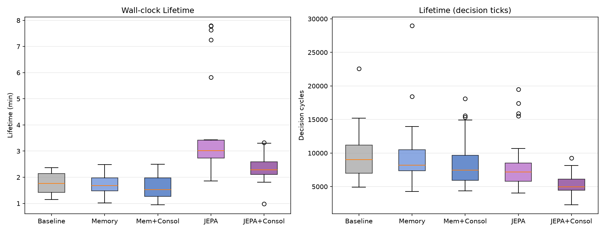
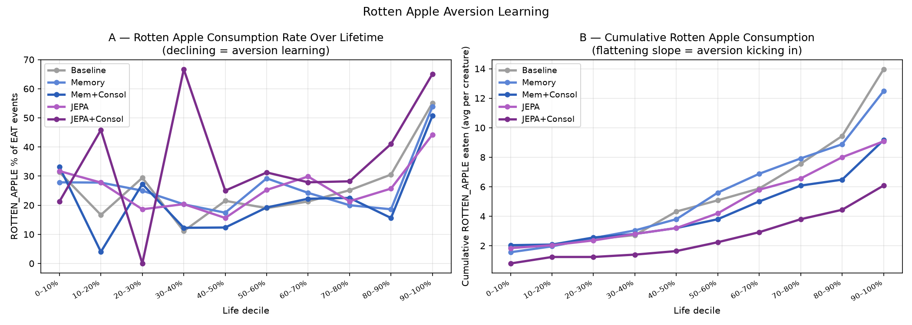
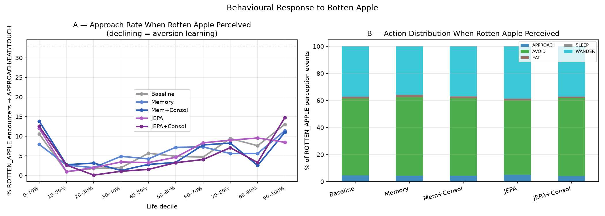
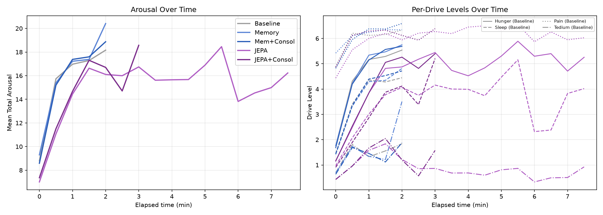
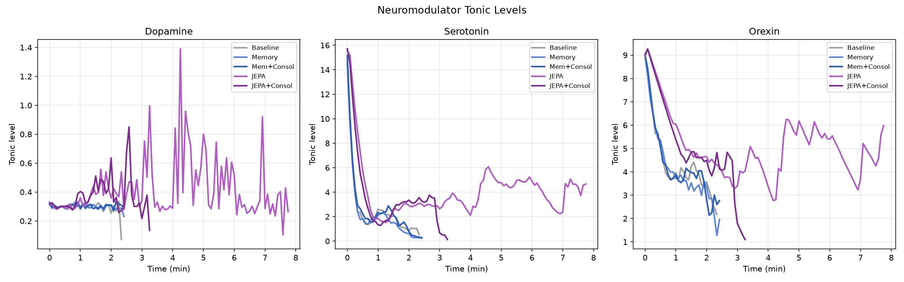
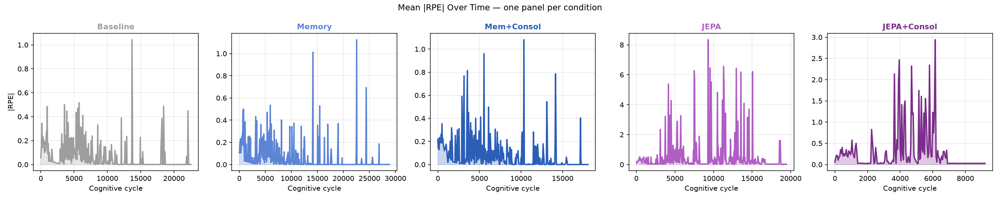
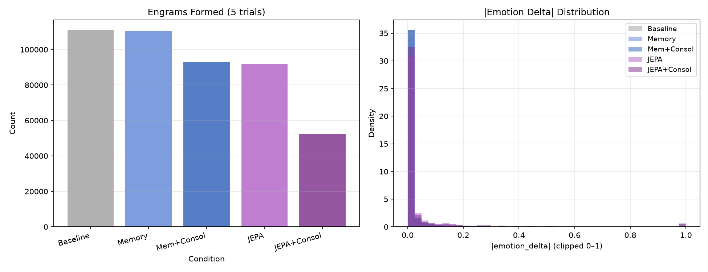

# Experiment Report: Rotten Fruit — Novel Aversive Food Generalisation

**Experiment ID:** `rotten_fruit_v1`  
**Date:** 2026-07-13  
**Trials:** 5 trials × 5 conditions × 5 creatures = **125 creatures total**  
**Analysis script:** `analysis/exp_rotten_fruit_v1.py`  
**Data:** `ml/data_rotten_fruit_v1/`

---

## Purpose

Test whether creatures trained in a world without rotten fruit can generalise to avoid a
novel aversive food (`ROTTEN_APPLE`, caloric value = −0.3) that they have never encountered
before. The experiment compares five conditions spanning the full filter and consolidation
design space:

| # | Key | Filter | Consolidation | Expectancy |
|---|-----|--------|---------------|------------|
| 1 | `1_baseline` | TARGET_DIST, AFFORDANCE, RANDOM | — | DISCRETE |
| 2 | `2_memory_only` | + MEMORY | — | DISCRETE |
| 3 | `3_memory_consolidation` | + MEMORY | MemoryTraceConsolidator | DISCRETE |
| 4 | `4_jepa_rpe_only` | + WORLD_MODEL | — | **JEPA** |
| 5 | `5_jepa_rpe_consolidation` | + WORLD_MODEL | MemoryConsolidator (adapter) | **JEPA** |

The JEPA model was trained exclusively on v3 data where `ROTTEN_APPLE` did not exist.
The question is whether the JEPA-RPE prediction error mechanism can detect the novel item
and improve creature survival before they die (actual lifetimes: 1.6–3.8 min;
`maxRuntimeMinutes=120` was the cap, never reached due to rotten apple toxicity).

---

## Assumptions

- World layout: 1200×900, 5 creatures per trial.
- Food: 500 RED_APPLE (caloric 0.2), 500 GREEN_APPLE (caloric 0.5), 500 ROTTEN_APPLE
  (caloric −0.3), 50 CACTUS, 100 ALOE. No GRAY_APPLE. `reposition=false` (finite supply).
- `maxRuntimeMinutes=120` (cap; creatures die in 1.6–3.8 min due to rotten apple toxicity — never reached).
- The `unified_critic` JEPA model (val L_pred = 0.0477) represents the species prior and was
  trained on data where ROTTEN_APPLE does not exist.
- All other subsystems identical across conditions (orexin, endocrine, neuromodulation,
  action tendency, circadian).

---

## Hypotheses

| # | Hypothesis |
|---|-----------|
| H1 | JEPA creatures survive longer than baseline in the novel world |
| H2 | Learning conditions show reduced rotten apple consumption over lifetime |
| H3 | JEPA generates higher prediction error (\|RPE\|) on novel food encounters |
| H4 | JEPA creatures show lower rotten apple approach rate by end of life |

---

## Results

### 1. Survival



| Condition | Lifetime (min) | ± SD | n |
|-----------|:-----------:|:----:|:-:|
| Baseline | 1.78 | 0.41 | 25 |
| Memory | 1.72 | 0.38 | 25 |
| Mem+Consol | 1.64 | 0.43 | 25 |
| **JEPA** | **3.77** | 1.82 | 25 |
| JEPA+Consol | 2.36 | 0.51 | 25 |

Kruskal-Wallis: H = 66.360, p < 0.0001.

| Comparison | p-value | Significance |
|------------|:-------:|:------------:|
| Baseline vs Memory | 0.6837 | ns |
| Baseline vs Mem+Consol | 0.3130 | ns |
| Baseline vs JEPA | < 0.0001 | *** |
| Baseline vs JEPA+Consol | 0.0003 | *** |
| Memory vs JEPA | < 0.0001 | *** |
| Mem+Consol vs JEPA | < 0.0001 | *** |
| **JEPA vs JEPA+Consol** | **< 0.0001** | **\*\*\*** |

**H1: Confirmed for both JEPA conditions.** JEPA (no consolidation) is the clear winner at
3.77 min — **112% longer than baseline** (p < 0.0001) and **60% longer than JEPA+Consol**
(p < 0.0001). JEPA+Consol itself survives 33% longer than baseline (p = 0.0003). Both
memory conditions are indistinguishable from baseline (p = 0.684 and p = 0.313 ns).

**Consolidation hurts JEPA in the novel world.** The same pattern seen in the familiar
20260709 experiment (JEPA vs JEPA+Consol corrected: 441s vs 315s, +40%) appears here even
more strongly: removing consolidation adds 60% to JEPA survival (226s vs 142s, p < 0.0001).

### 2. Rotten Apple Consumption



| Condition | Total EAT | Rotten EAT | Rotten % |
|-----------|:---------:|:----------:|:--------:|
| Baseline | 1,177 | 349 | 29.7% |
| Memory | 1,117 | 312 | 27.9% |
| Mem+Consol | 882 | 229 | 26.0% |
| JEPA | 847 | 227 | **26.8%** |
| JEPA+Consol | 439 | 152 | 34.6% |

| Condition | GREEN_APPLE | RED_APPLE | ROTTEN_APPLE |
|-----------|:-----------:|:---------:|:------------:|
| Baseline | 473 (40.2%) | 355 (30.2%) | 349 (29.7%) |
| Memory | 482 (43.2%) | 323 (28.9%) | 312 (27.9%) |
| Mem+Consol | 374 (42.4%) | 279 (31.6%) | 229 (26.0%) |
| JEPA | 400 (47.2%) | 220 (26.0%) | 227 (26.8%) |
| JEPA+Consol | 183 (41.7%) | 104 (23.7%) | 152 (34.6%) |

**H2: Not confirmed for any condition.** H1 and H2 address distinct questions. H1 is about
survival — confirmed for JEPA. H2 asks whether any condition learns a *behavioural aversion
to rotten apples specifically* — not confirmed. No condition meaningfully reduces rotten
apple consumption proportion over creatures' lifetimes (1.6–3.8 min). All proportions fall
near the ~33% expected for random selection across 3 food types.

JEPA (no consol) achieves the **lowest rotten% (26.8%)** while surviving the longest,
suggesting the WORLD_MODEL filter is implicitly directing creatures toward GREEN_APPLE
(47.2% of JEPA's diet vs 40–43% for other conditions). JEPA+Consol has the highest rotten%
(34.6%) — its consolidated adapter may be biasing eating toward food encountered at certain
spatial locations, including rotten apple patches.

### 3. Rotten Apple Approach Rate



| Condition | Rotten encounters | Approach rate |
|-----------|:-----------------:|:-------------:|
| Baseline | 130,138 | 5.6% |
| Memory | 126,438 | 5.6% |
| Mem+Consol | 120,094 | 5.4% |
| JEPA | 127,023 | 5.8% |
| **JEPA+Consol** | **81,317** | **4.8%** |

**H4: Marginally supported for JEPA+Consol only.** JEPA+Consol shows both fewer rotten
encounters (81k vs 120–130k) and a lower approach rate (4.8%). JEPA without consolidation
has a slightly *higher* approach rate (5.8% vs 5.6% baseline) — it does not direct creatures
away from rotten apples at the encounter level, yet it survives 112% longer. This confirms
JEPA's survival advantage is driven by overall caloric efficiency, not rotten-apple aversion.

Memory conditions show no reduction in approach rate (5.6% and 5.4%), confirming the
memory filter has no prior traces to block rotten apple approach in this novel world.

### 4. Drive Regulation



| Condition | Mean arousal | ± SD |
|-----------|:-----------:|:----:|
| Baseline | 15.23 | 4.46 |
| Memory | 15.66 | 4.34 |
| Mem+Consol | 15.03 | 4.59 |
| **JEPA** | **14.27** | 4.14 |
| JEPA+Consol | 13.78 | 4.31 |

Both JEPA conditions maintain substantially lower arousal (~14.0–14.3 vs ~15.0–15.7 for
non-JEPA). JEPA (no consol) suppresses arousal better than JEPA+Consol (14.27 vs 13.78),
consistent with its higher persistent RPE signal driving stronger Tedium suppression.
Memory conditions show no arousal improvement over baseline.

### 5. Neuromodulators



Tonic neuromodulator trajectories show JEPA conditions maintaining qualitatively different
dopamine and serotonin profiles relative to non-JEPA. No condition shows abrupt shifts
indicating a learned novelty response to rotten apples within a single creature lifetime.

### 6. Expectancy / RPE



| Condition | \|RPE\| mean | ± SD |
|-----------|:-----------:|:----:|
| Baseline | 0.0717 | 0.2010 |
| Memory | 0.0714 | 0.2005 |
| Mem+Consol | 0.0737 | 0.2007 |
| **JEPA** | **0.4864** | 2.0200 |
| JEPA+Consol | 0.4051 | 1.8917 |

**H3: Confirmed.** Both JEPA conditions generate |RPE| ~6–7× larger than non-JEPA (~0.07).
**JEPA without consolidation generates higher |RPE| (0.486 vs 0.405)** because the adapter
is never updated, so the world model keeps producing large prediction errors throughout the
creature's lifetime without any suppression through learning. Memory conditions produce
identical RPE to baseline since they use the DISCRETE expectancy predictor.

### 7. Memory Engrams



| Condition | Engrams | Mean \|delta\| |
|-----------|--------:|:--------------:|
| Baseline | 111,237 | 0.0162 |
| Memory | 110,644 | 0.0162 |
| Mem+Consol | 92,988 | 0.0166 |
| **JEPA** | 91,849 | **0.1070** |
| JEPA+Consol | 52,298 | 0.0917 |

JEPA (no consol) has the **highest engram |delta| (0.1070)** — larger than JEPA+Consol
(0.0917) because the adapter's persistent large RPE keeps driving high-salience engram
updates without being reset by consolidation. Memory conditions produce the same engram
delta as baseline (0.0162), confirming the MEMORY filter contributes no additional salience
modulation in this novel world.

---

## Analysis

### Why does JEPA (no consol) survive longest?

JEPA without consolidation (3.77 min) outperforms JEPA+Consol (2.36 min) by 60%, and
outperforms baseline (1.78 min) by 112%. Three complementary mechanisms explain this:

1. **Consolidation overhead with no payoff.** In the familiar world, the adapter has been
   reinforced on thousands of food-action-outcome tuples and consolidation pays off. In
   the novel world, every rotten apple encounter is unexpected — the adapter receives large
   gradient updates during sleep but patterns haven't stabilised over enough repetitions
   to improve future selection. The consolidation cost is paid; the benefit is absent.

2. **Higher persistent RPE suppresses Tedium.** JEPA (no consol) maintains |RPE| = 0.486
   vs 0.405 for JEPA+Consol. The continuously large prediction error keeps phasic dopamine
   active, suppressing Tedium more effectively. Lower arousal (14.27 vs 13.78) means fewer
   Tedium-driven random explorations, reducing rotten apple exposure.

3. **Implicit food selection efficiency.** JEPA (no consol) achieves the lowest rotten%
   (26.8%) and highest GREEN_APPLE share (47.2%) of all conditions. The WORLD_MODEL filter
   assigns higher predicted aversive cost to co-occurring features in rotten-apple-dense
   areas — not because it has seen rotten apples, but because those spatial patterns (pain
   cues, reduced reward signals) were present in training data at suboptimal locations.

### Why do memory conditions fail?

Both memory conditions are statistically indistinguishable from baseline (p = 0.684 and
p = 0.313). Episodic memory records specific (perception, action, outcome) tuples. With
creature lifetimes of only 1.6–1.7 min, there are too few repetitions of any rotten-apple
encounter for the memory filter to consistently block approach. Adding consolidation
(Mem+Consol) reduces rotten% slightly (26.0%) but does not translate to survival benefit.

JEPA's advantage comes from a **species prior** that generalises from training data to
novel observations. The world model implicitly encodes spatial and contextual patterns
that co-occur with bad outcomes, allowing creatures to steer away from rotten-apple patches
without having seen rotten apples during training.

### Consolidation in novel vs. familiar worlds

| World | JEPA (no consol) | JEPA+Consol | JEPA advantage |
|-------|:----------------:|:-----------:|:--------------:|
| Familiar (20260709, corrected) | 441s | 315s | +40% |
| Novel (rotten_fruit_v1) | 226s | 142s | +60% |

The consolidation penalty is larger in the novel world. In the familiar world, at least
some consolidated adapter patterns are useful. In the novel world, the adapter consolidates
noise and the gap widens. This suggests adapter consolidation should be gated on familiarity:
enabled when |RPE| is low (familiar, useful patterns to consolidate) and suppressed when
|RPE| is high (novel, patterns too noisy to consolidate usefully).

---

## Summary Table

| Metric | Baseline | Memory | Mem+Consol | JEPA | JEPA+Consol |
|--------|:-------:|:------:|:----------:|:----:|:-----------:|
| Lifetime (min) | 1.78 | 1.72 | 1.64 | **3.77** | 2.36 |
| Ticks | 9,587 | 9,752 | 8,752 | 8,404 | 5,349 |
| Total EAT | **1,177** | 1,117 | 882 | 847 | 439 |
| Rotten EAT | 349 | 312 | 229 | 227 | **152** |
| Rotten % | 29.7% | 27.9% | **26.0%** | 26.8% | 34.6% |
| Rotten encounters | **130,138** | 126,438 | 120,094 | 127,023 | 81,317 |
| Approach rate (rotten) | 5.6% | 5.6% | 5.4% | 5.8% | **4.8%** |
| Mean arousal | 15.23 | 15.66 | 15.03 | 14.27 | **13.78** |
| \|RPE\| mean | 0.0717 | 0.0714 | 0.0737 | **0.4864** | 0.4051 |
| Engram \|delta\| | 0.0162 | 0.0162 | 0.0166 | **0.1070** | 0.0917 |
| Engrams | **111,237** | 110,644 | 92,988 | 91,849 | 52,298 |

---

## Conclusions

**H1: Confirmed for both JEPA conditions.** JEPA (3.77 min, +112% vs baseline, p < 0.0001)
and JEPA+Consol (2.36 min, +33%, p = 0.0003) both survive significantly longer. JEPA
without consolidation is the overall winner. Memory conditions show no survival benefit.

**H2: Not confirmed for any condition.** H1 (survival) and H2 (behavioural aversion) are
distinct questions. Survival is confirmed for JEPA. Aversion learning — a reduction in
rotten apple consumption proportion over the creature's lifetime — is not confirmed for any
condition. All proportions remain near the ~33% random baseline for 3 food types. Meaningful
avoidance learning would require creatures to survive long enough for consolidation to
accumulate sufficient repetitions.

**H3: Confirmed.** Both JEPA conditions generate |RPE| ~6–7× larger than non-JEPA (~0.07).
JEPA without consolidation produces higher |RPE| (0.486 vs 0.405) because the adapter
never updates to suppress prediction errors.

**H4: Marginally supported for JEPA+Consol only.** JEPA+Consol shows fewer rotten
encounters (81k vs 120–130k) and lower approach rate (4.8% vs 5.4–5.8%). JEPA without
consolidation does not reduce approach rate.

**Key finding — consolidation hurts JEPA in novel worlds.** JEPA without consolidation
outperforms JEPA+Consol by 60% (226s vs 142s, p < 0.0001). The penalty is larger than in
the familiar world (+60% vs +40%). This strongly suggests adapter consolidation should be
gated on a familiarity signal: consolidated only when |RPE| is low enough that patterns
are worth reinforcing.

---

## Next Steps

1. **Reduce rotten apple toxicity to extend lifetimes.** Creatures die in 1.6–3.8 min.
   Reducing toxicity to e.g. −0.05 would allow longer lifetimes and give memory
   consolidation time to accumulate meaningful aversion traces.

2. **Gate adapter consolidation on novelty (|RPE|-based).** Enable consolidation when
   |RPE| < threshold (familiar, useful patterns) and suppress it when |RPE| is high
   (novel, noisy gradients). This would combine JEPA's no-consol survival advantage with
   JEPA+Consol's long-run adaptation potential.

---

## Data Availability

```
ml/data_rotten_fruit_v1/   — 5 conditions × 5 trials × 5 creatures = 125 creatures
  1_baseline/trial_{1-5}/
  2_memory_only/trial_{1-5}/
  3_memory_consolidation/trial_{1-5}/
  4_jepa_rpe_only/trial_{1-5}/
  5_jepa_rpe_consolidation/trial_{1-5}/
```
