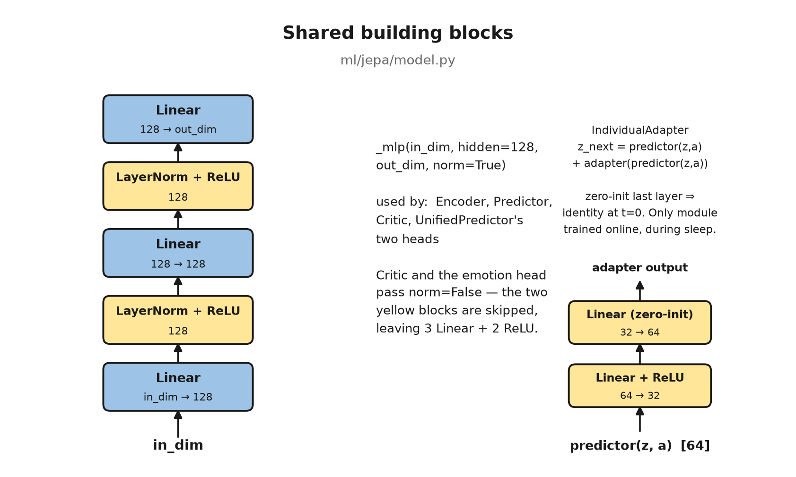
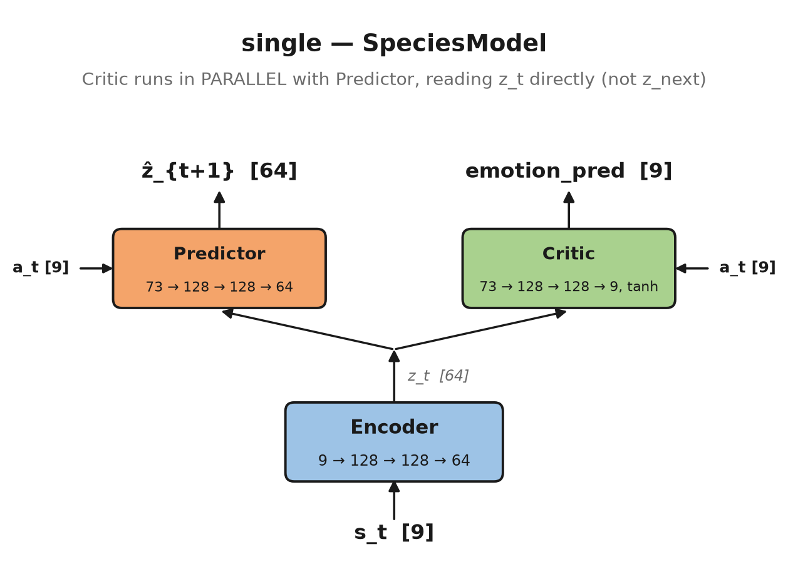
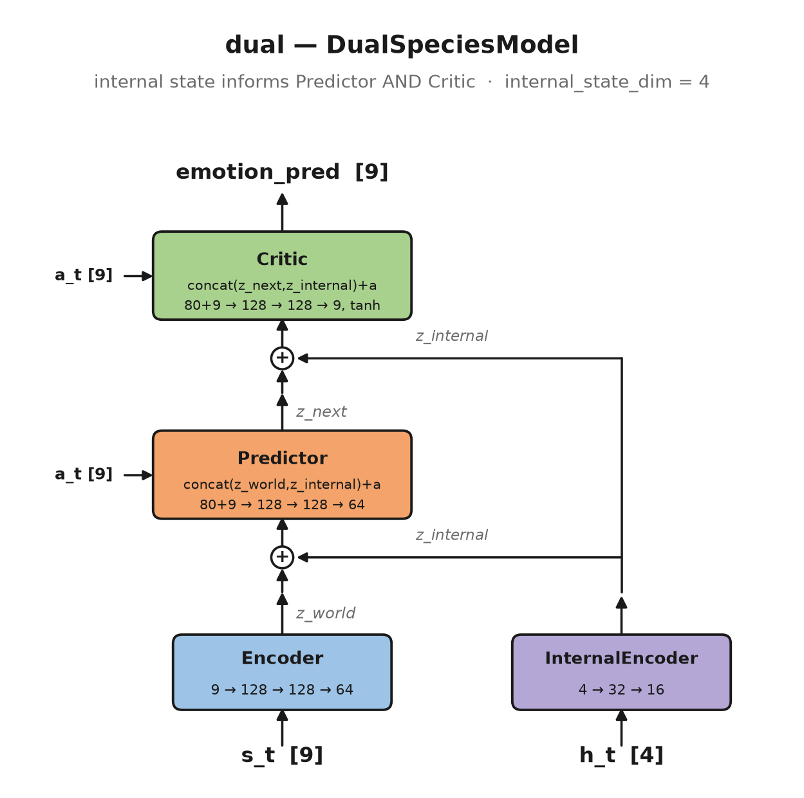
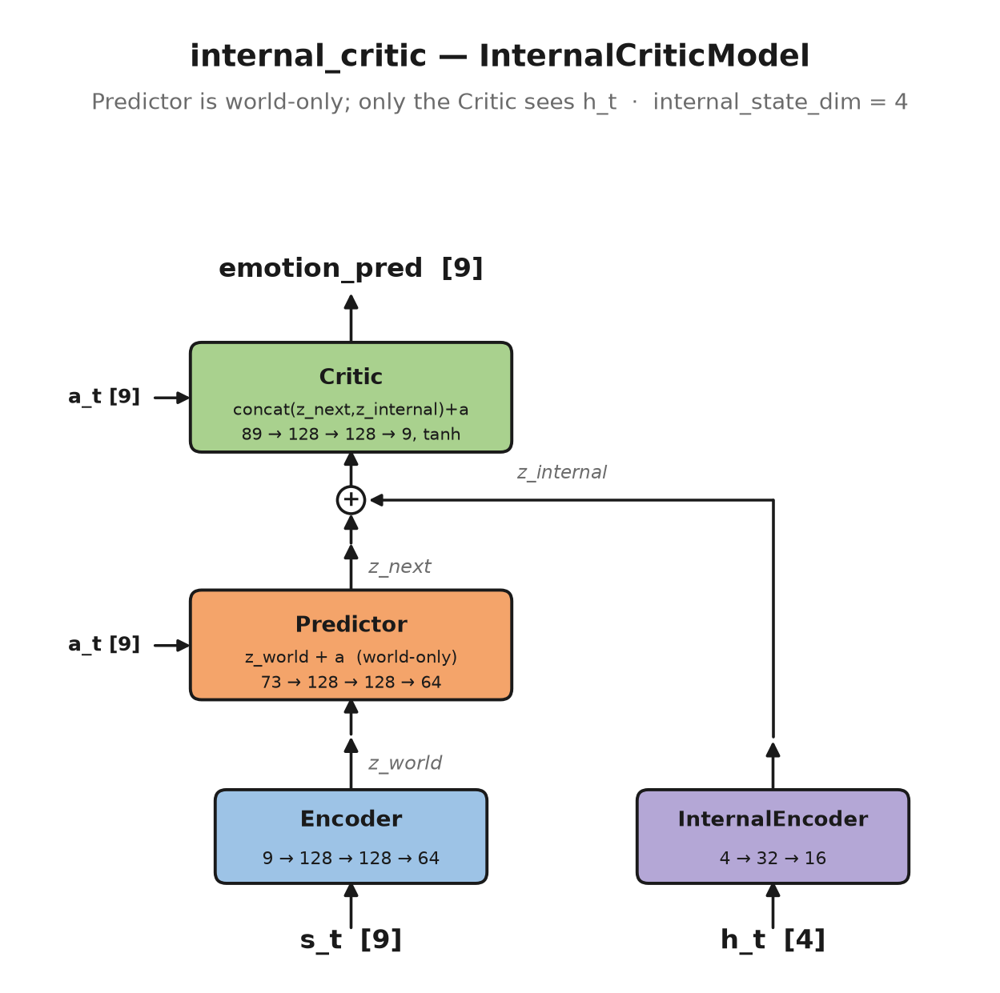
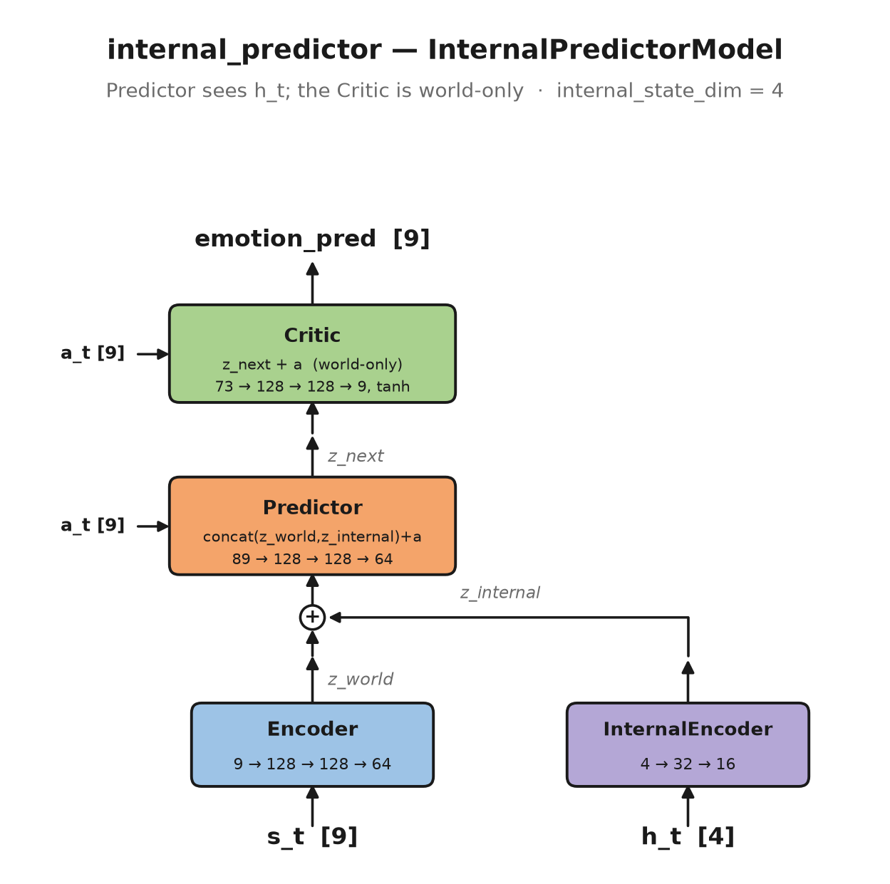
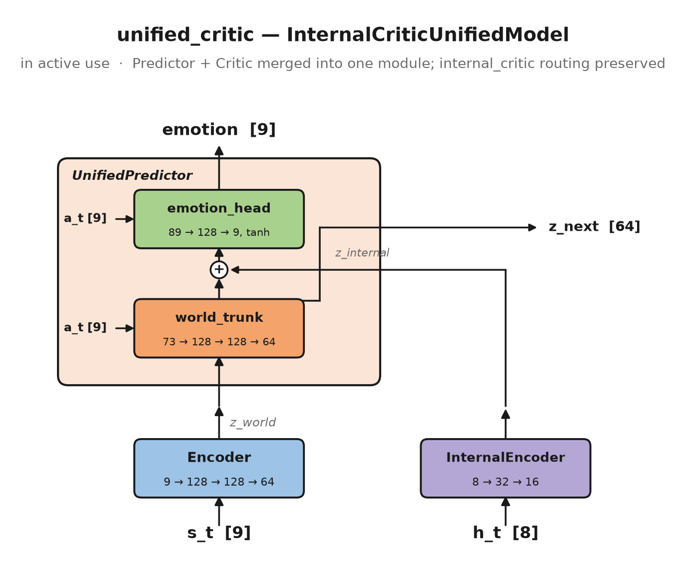
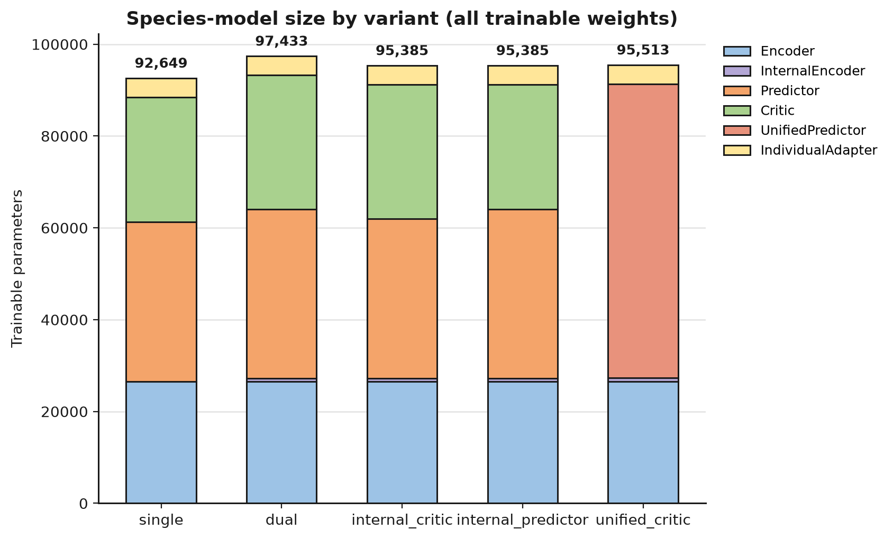
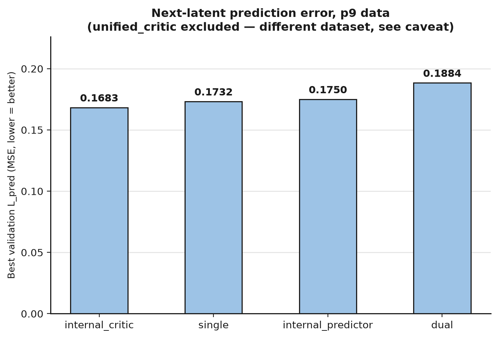
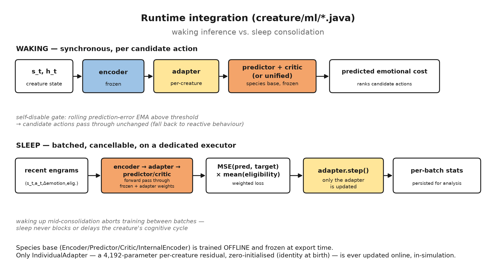

# DL2L JEPA World Model

This is the offline PyTorch training pipeline for DL2L's species-level JEPA
(Joint-Embedding Predictive Architecture) world model — the module that lets a
creature evaluate candidate actions by their predicted *emotional* consequences
(LeCun "Mode-2" deliberation on top of the existing reactive Mode-1 loop). The
design rationale — why a world model, why emotional consequences rather than
raw pixels, why a sleep-gated adapter instead of continuous online SGD — is in
[`docs/hld/JEPA_WM_Integration.md`](../docs/hld/JEPA_WM_Integration.md). This
document is the architecture reference: exact inputs/outputs, layer shapes,
parameter counts, training objective, and how the trained model is loaded and
adapted at runtime.

Five architectures were trained and compared (`ml/jepa/model.py`); all are
described below. `unified_critic` is the one bundled into the fat JAR and used
by the running simulation today.

## Contents

- [Shared building blocks](#shared-building-blocks)
- [The five architectures](#the-five-architectures)
  - [single — SpeciesModel](#single--speciesmodel)
  - [dual — DualSpeciesModel](#dual--dualspeciesmodel)
  - [internal_critic — InternalCriticModel](#internal_critic--internalcriticmodel)
  - [internal_predictor — InternalPredictorModel](#internal_predictor--internalpredictormodel)
  - [unified_critic — InternalCriticUnifiedModel](#unified_critic--internalcriticunifiedmodel-in-active-use)
- [Model size comparison](#model-size-comparison)
- [Dataset](#dataset)
- [Training objective](#training-objective)
- [Training infrastructure](#training-infrastructure)
- [Export and the model contract](#export-and-the-model-contract)
- [Runtime integration](#runtime-integration)
- [Which variant is deployed, and why the numbers don't all line up](#which-variant-is-deployed-and-why-the-numbers-dont-all-line-up)

## Shared building blocks

Every module in `ml/jepa/model.py` is built from the same 3-layer MLP
(`_mlp(in_dim, hidden=128, out_dim, norm)`), an `InternalEncoder` for the
creature's live homeostatic state, and an `IndividualAdapter` that is the only
piece ever trained online:



- **Encoder / Predictor / Critic / UnifiedPredictor's two heads** all use
  `_mlp` with `norm=True` (two `LayerNorm+ReLU` blocks between three `Linear`
  layers). The **Critic** and **UnifiedPredictor's `emotion_head`** pass
  `norm=False`, dropping to 3 `Linear` + 2 `ReLU` — LayerNorm on a tanh-bounded
  scalar-ish output head was found unnecessary.
- **InternalEncoder** has no `_mlp` reuse (no `LayerNorm`, since its input is
  already small and structured): `Linear → ReLU → Linear → ReLU`.
- **IndividualAdapter** is a small additive residual on the Predictor's output:
  `z_next = predictor(z, a) + adapter(predictor(z, a))`. Its last `Linear`
  layer is zero-initialised, so `adapter(z) ≡ 0` at construction — the
  creature starts with `z_next == predictor(z, a)` exactly, and only the
  adapter's weights move as the creature accumulates lifetime experience
  during sleep (see [Runtime integration](#runtime-integration)). At 4,192
  parameters it is deliberately not LoRA / low-rank — at this network scale
  low-rank buys nothing, per the HLD.

All five variants share the same `input_dim=9` perception encoding, `action_dim=9`,
`emotion_dim=9`, `latent_dim=64` and `internal_latent_dim=16`; they differ only
in whether the live homeostatic state reaches the Predictor, the Critic, both,
or neither, and (for `unified_critic`) whether Predictor and Critic are two
modules or one.

## The five architectures

### single — SpeciesModel



The baseline: perception only, no homeostatic state. The one architectural
detail worth calling out because it's easy to get wrong reading the diagram
top-down: **the Critic reads `z_t` directly, in parallel with the Predictor —
not the Predictor's output `z_next`.** `SpeciesModel.forward()`:

```python
z_t     = encoder(s_t)
z_next  = predictor(z_t, a_t)
emotion = critic(z_t, a_t)          # z_t, not z_next
```

| | shape |
|---|---|
| input `s_t` | `[9]` — 3 continuous perception features (distance, angle, sin(angle)) + 6-way one-hot object type |
| input `a_t` | `[9]` — one-hot action type |
| output `ẑ_{t+1}` | `[64]` |
| output `emotion_pred` | `[9]`, tanh-bounded to `[-1, 1]` |
| **parameters** | Encoder 26,560 + Predictor 34,752 + Critic 27,145 + Adapter 4,192 = **92,649** |

### dual — DualSpeciesModel



The creature's live drives (`h_t`) inform *both* the Predictor and the Critic.
Unlike `single`, the Critic here is sequential — it consumes the Predictor's
output `z_next`, not the raw encoder output:

```python
z_world    = encoder(s_t)
z_internal = internal_encoder(h_t)
z_next     = predictor(concat(z_world, z_internal), a_t)
emotion    = critic(concat(z_next, z_internal), a_t)
```

| | shape |
|---|---|
| input `h_t` | `[4]` on p9 data — `ht_hunger, ht_sleep, ht_pain, ht_tedium` |
| output `emotion_pred` | `[9]`, tanh-bounded |
| **parameters** | Encoder 26,560 + InternalEncoder 688 + Predictor 36,800 + Critic 29,193 + Adapter 4,192 = **97,433** |

### internal_critic — InternalCriticModel



The Predictor is a *pure world-dynamics model* — it never sees `h_t`. Only the
Critic is homeostasis-aware, conditioning predicted emotional cost on both the
predicted next world state and the creature's current internal urgency. This
is the routing later reused, unchanged, by `unified_critic`.

| | shape |
|---|---|
| **parameters** | Encoder 26,560 + InternalEncoder 688 + Predictor 34,752 + Critic 29,193 + Adapter 4,192 = **95,385** |

### internal_predictor — InternalPredictorModel



The mirror image: the Predictor conditions world dynamics on homeostatic
urgency, but the Critic evaluates the predicted next state in world-space only
(never sees `h_t`).

| | shape |
|---|---|
| **parameters** | Encoder 26,560 + InternalEncoder 688 + Predictor 36,800 + Critic 27,145 + Adapter 4,192 = **95,385** |

### unified_critic — InternalCriticUnifiedModel (in active use)



Same routing as `internal_critic` (world dynamics are world-only; only the
emotion head sees `z_internal`), but the Predictor and Critic are fused into a
single `UnifiedPredictor` module with two heads sharing one export artifact:

```python
z_next  = world_trunk(concat(z_world, a))
emotion = tanh(emotion_head(concat(z_next, z_internal, a)))
```

This halves the number of exported files (4 instead of 5 — no separate
`species_predictor`/`species_critic`) and replaces two DJL forward passes with
one at inference time. It is also the variant that was retrained on the
richer 8-dimensional internal state (see the caveat at the bottom of this
document) to fix a domain-shift failure the original `internal_critic` had.

| | shape |
|---|---|
| input `h_t` | `[8]` — `ht_hunger, ht_sleep, ht_pain, ht_tedium, nm_dopamine, nm_serotonin, nm_orexin, end_cortisol_tonic` |
| **parameters** | Encoder 26,560 + InternalEncoder 816 + UnifiedPredictor 63,945 + Adapter 4,192 = **95,513** |

## Model size comparison



Parameter counts above are computed directly from the `_mlp` layer shapes in
`ml/jepa/model.py` (`hidden=128` throughout) and cross-checked against the
`.pt` file-size ordering of the exported artifacts in
`src/main/resources/models/` — e.g. `internal_critic`'s Predictor (world-only,
34,752 params) and `single`'s Predictor are byte-identical in size, while
`dual`'s and `internal_predictor`'s (both concat-widened, 36,800 params)
match each other; same pattern for the Critic. All five variants sit in a
tight ~92.6K–97.4K parameter band — the architectural differences are about
*information routing*, not capacity.



Best validation `L_pred` (next-latent prediction MSE) on the four variants
trained on the original p9 dataset: `internal_critic` (0.1683) edges out
`single` (0.1732), `internal_predictor` (0.1750), and `dual` (0.1884) —
suggesting a homeostasis-aware Critic helps more than a homeostasis-aware
Predictor, and that overloading *both* modules with `h_t` (the `dual`
variant) is actually the weakest of the four. `unified_critic` is excluded
from this comparison because it was trained on a different, larger dataset —
see the caveat below.

## Dataset

`ml/scripts/prepare_dataset.py` assembles `(s_t, h_t, a_t, final_*)` tuples
from an experiment's Parquet output (`actions`, `drives`, `perceptions`,
`neuromodulators`, `endocrine` tables — see `dl2l_data.extract`), backward-
`merge_asof`-joined onto each action by `(creature_key, trial)`:

- **`s_t` (perception, 9-d)**: `distance`, `angle`, `direction` from the most
  recent `ObjectSeenState` before the action, plus a 6-way one-hot object type
  (`GRAY_APPLE, GREEN_APPLE, RED_APPLE, ROTTEN_APPLE, ALOE, CACTUS`). Only the
  3 continuous features are standardised (mean/std computed on the train
  split only); the one-hot columns are left as-is.
- **`a_t` (action, 9-d)**: one-hot over `APPROACH, AVOID, EAT, ESCAPE, PLAY,
  SLEEP, TOUCH, TURN, WANDER`, filtered to `selection_type ∈ {AFFORDANCE,
  RANDOM}` rows only (excludes scripted/artefactual actions).
- **`h_t` (internal state, 4-d on p9 / 8-d on v3)**: the creature's drive
  levels at decision time (`ht_hunger, ht_sleep, ht_pain, ht_tedium`), plus,
  on the v3 layout, live neuromodulator/endocrine tone
  (`nm_dopamine, nm_serotonin, nm_orexin, end_cortisol_tonic`) joined by
  normalised within-creature rank (`_t_frac`) since those are logged on a
  separate `seq` axis, not simulation time — sound because tonic
  neuromodulator values change slowly. Normalised per-feature using train-
  split mean/std (serotonin outliers clipped).
- **`emotion` target columns**: placeholder — the Critic is *not* trained
  against these directly (see [Training objective](#training-objective)
  below); the real target is synthesised from `h_t` and the action taken.

Rows are sorted by `(creature_key, trial, time)` so that `s_next = s_t[1:]`
in the training loop is genuinely the next perception of the *same* creature.
Trials 1–13 go to `train.parquet`/`train_dual.parquet`, trials 14–15 to
`val.parquet`/`val_dual.parquet` (configurable via `TRAIN_TRIALS`/`VAL_TRIALS`
constants), with all normalisation statistics (`feature_means/stds`,
`h_means/stds`) computed on train only and written to `stats.json` alongside
the Parquet files.

## Training objective

`ml/jepa/train.py` — `train_one_epoch` / `evaluate`:

```
L = L_pred + λ_sigreg · L_VICReg(z_world) + λ_crit · L_crit
```

- **`L_pred`** — MSE between the Predictor's output and a **stop-gradient**
  target: `sg(EMA-Encoder(s_{t+1}))`, i.e. the *next* perception passed
  through an EMA (decay 0.996 by default) copy of the online encoder, not the
  online encoder itself. This is the BYOL/JEPA anti-collapse trick — training
  against a slowly-moving target instead of the online network directly.
- **`L_VICReg`** — a VICReg-style regulariser (Bardes et al. 2022) on the
  world latent `z_world`: a variance term (hinge loss pushing per-dimension
  std above 1) plus a covariance term (penalising off-diagonal entries of the
  batch covariance matrix, forcing latent dimensions to encode different
  information). This replaced an earlier, simpler SIGReg term
  (`‖mean(z)‖² + ‖var(z)-1‖²`, still in `train.py` as `sigreg_loss` for
  reference) when the `unified_critic` retrain showed VICReg's covariance
  penalty gave better anti-collapse behaviour.
- **`L_crit`** — MSE between the Critic's output and a **synthetic
  need-satisfaction target**, not a real one-step emotion delta (regulation
  changes ~0.001/step — far too small a signal over a single timestep). For
  each action, the target on the drive(s) it addresses is
  `sign · tanh(h_drive / scale)` (`scale=2.0`): negative (relief) if the
  action addresses that drive (e.g. `EAT` relieves `hunger`), positive
  (opportunity cost) if the action trades it off (e.g. `SLEEP` while hungry
  costs `hunger`), zero for unrelated drive/action pairs. This produces a
  target that's strong when the drive is genuinely high and near zero when
  already satisfied — learnable even from an imbalanced action distribution.

Collapse is checked post-training (`ml/jepa/evaluate.py`,
`ml/scripts/check_collapse.py` — a **hard gate**, non-zero exit aborts the
run): any latent dimension with variance `< 1e-4` (dead neuron), or an
effective rank (`exp(entropy of normalised singular values)`, Roy & Vetterli
2007) below 10% of `latent_dim`.

Default hyperparameters (`ml/scripts/train_species.py`): 100 epochs, batch
256, Adam `lr=1e-3` with cosine annealing to `1e-2 × lr`, `λ_sigreg=0.1`,
`λ_crit=1.0`, EMA decay 0.996. `--freeze-encoder` supports a phase-2
fine-tuning mode (train predictor + internal encoder only against a fixed
target encoder) used when adapting an already-trained encoder to a new
variant.

## Training infrastructure

Training is declared as a `training/<name>.yml` spec and run via the same
Ansible pattern as data collection — locally, or submitted to CCAD's GPU
partition (4× NVIDIA L40S 48GB) for the actual gradient steps, since dataset
preparation is pandas-only and always runs locally regardless. See
[`training/README.md`](../training/README.md) for the full schema and the
CCAD submit/rescue workflow (the CEFET VPN drops on idle, so GPU training is
submit-and-collect, not submit-and-wait).

## Export and the model contract

`ml/scripts/export_model.py` traces each trained submodule to TorchScript and
writes `model_contract.json` alongside the `.pt` files — the single source of
truth the Java runtime (`creature/ml/ModelContract.java`) reads at load time:
input/output dimensions, feature/action/emotion ordering (must match exactly —
`WorldModelEngine` validates the action index order at construction and fails
fast on mismatch), `min_arousal`/`max_arousal` for de-normalising the Critic's
tanh output, and a **SHA-256 hash over the exported files** that the Java side
recomputes and checks before trusting the model directory. Exported artifacts
land in `src/main/resources/models/<variant>/` — which *is* "saved in the
repo," bundled straight into the fat JAR — and are additionally pushed to
[`felipedreis/dl2l-jepa`](https://huggingface.co/felipedreis/dl2l-jepa) on
HuggingFace.

## Runtime integration

The species base (Encoder/Predictor/Critic/InternalEncoder, or
Encoder/InternalEncoder/UnifiedPredictor for the unified variant) is trained
here, offline, and frozen at export time. The only thing that ever updates
online, inside the running simulation, is the per-creature `IndividualAdapter`
— during sleep, on a bounded, cancellable schedule, never blocking the
creature's cognitive cycle:



- **Waking** (`creature/ml/WorldModelEngine.java`): a synchronous
  encoder → adapter → predictor/critic (or unified) forward pass per candidate
  action, scoring it by summed predicted level over the trained "live" emotion
  dimensions. A rolling EMA of latent prediction error gates this off
  entirely (falls back to reactive Mode-1 behaviour) when the model is
  clearly out-of-distribution for the current state.
- **Sleep** (`creature/ml/MemoryConsolidator.java`): a per-creature actor
  loads its *own* trainable copies of the frozen modules (gradient must flow
  through them to reach the adapter, but only the adapter's optimizer ever
  calls `.step()`), replays the creature's recent engrams in bounded batches
  on a JVM-global single-threaded executor, and persists per-batch loss stats.
  A `WakeUp` message sets a cooperative abort flag checked between batches —
  training never runs past the moment the creature actually wakes.

## Which variant is deployed, and why the numbers don't all line up

**`unified_critic` is the variant bundled into the JAR and used by the running
simulation** (`model_contract.json`'s `model_variant` field is what
`WorldModelEngine` reads to pick its inference routing). It is *not*,
strictly, an apples-to-apples fifth entry in the comparison above:

- `single`, `dual`, `internal_critic`, and `internal_predictor` were all
  trained on the original **p9** dataset with a **4-dimensional** `h_t`
  (drive levels only).
- `unified_critic` was retrained on the newer **v3** dataset layout with an
  **8-dimensional** `h_t` (drive levels + live neuromodulator/endocrine tone)
  specifically to fix an AVOID-bias domain-shift failure the p9-trained
  `internal_critic` exhibited once deployed. Its `model_contract.json` is
  dated 2026-07-10, a week after the other four (2026-07-01).

Both facts are visible directly in the checked-in
`src/main/resources/models/*/model_contract.json` files (`internal_state_dim`
and `trained_on`) and are why the validation-loss comparison above
deliberately excludes it — its `L_pred` isn't comparable to the p9-trained
numbers, and no p9-vs-v3 apples-to-apples retrain of the other four variants
has been run.
